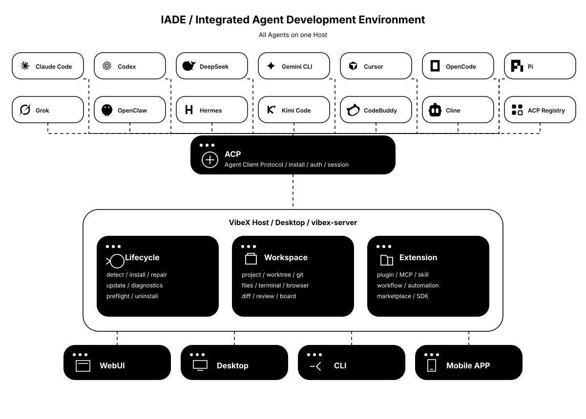

# VibeX

<p align="center">
  English · <a href="./README.zh-CN.md">简体中文</a>
</p>

<p align="center">
  <strong>IADE · Integrated Agent Development Environment</strong><br />
  An all-in-one VibeCoding platform for agents, workspaces, and collaboration.
</p>

<p align="center">
  <a href="https://vibex.com"></a>
  <a href="https://github.com/Xircth/VibeX/releases/latest"></a>
  
  
  <a href="./LICENSE"></a>
</p>

<p align="center">
  <a href="https://vibex.com">Website</a> ·
  <a href="https://vibex.com/docs">Docs</a> ·
  <a href="https://github.com/Xircth/VibeX/releases/latest">Download</a> ·
  <a href="https://github.com/Xircth/VibeX/issues">GitHub Issues</a>
</p>



Agents needed a new IDE, so VibeX exists.

VibeX is an IADE (Integrated Agent Development Environment). It connects multiple coding agents to one pipeline for install, authentication, conversation, and delivery, and keeps files, Git, the terminal, and the browser on the workspace bound to the current conversation. A person states the task. Agents edit files, run commands, and request permissions through the [Agent Client Protocol (ACP)](https://agentclientprotocol.com/). The file tree, terminal, diffs, and built-in browser follow that workspace.

Built-in agents include Claude Code, Codex, DeepSeek Harness, Google Antigravity, Cursor, OpenCode, Pi, Grok, OpenClaw, Hermes, Kimi Code, CodeBuddy, and Cline. Compatible agents from the official ACP Registry use the same pipeline.

> [!IMPORTANT]
> **Local operation and data ownership:** VibeX is a local-first Host. Projects, conversations, configuration, and diagnostics stay on the Host you control. VibeX does not operate cloud storage and does not automatically upload that data to a VibeX-operated service. When a remote client connects to a user-controlled desktop or `vibex-server`, the data required for the selected remote workflows is sent to that Host.
>
> **Testing-stage notice:** VibeX is still in testing. Use version control, keep backups of important projects, and review agent-generated changes before committing, syncing, or merging them.
>
> Enabled agents, model providers, MCP servers, plugins, messaging channels, and browser sessions may connect to third-party services according to your configuration. Those services handle data under their own policies.

## Capabilities

### All-in-one agent lifecycle

The Agents page in Settings covers detection, installation, authentication, native configuration, updates, preflight, repair, and uninstall. Built-in profiles and agents added from the ACP Registry have different identities and share one pipeline.

Compatible local CLIs are reused after validation. Missing components install at pinned versions. Agents that need npm use a Node.js runtime managed by VibeX. Authentication and official configuration remain in each agent's own directory, for example `~/.claude` for Claude Code. Model, mode, and reasoning controls follow the capabilities of that agent.

See the [user guide](https://vibex.com/docs) and [IADE](https://vibex.com/docs/reference/iade).

### Multi-workspace collaboration and Git lifecycle

A conversation is bound to a workspace. The workspace is either the project root or a Git worktree carved from the same repository. Parallel tasks keep uncommitted files on separate trees.

Worktree-bound conversations expose rebase and merge-back actions and share the tree with the Git panel. The Git panel covers changes, diffs, history, branches, stashes, issues, and pull requests. The file tree, previews, review comments, and integrated terminal use the same workspace as the current conversation. The session board lists parallel conversations by project and state.

See [Worktree](https://vibex.com/docs/worktree) and [Git and review](https://vibex.com/docs/git-review).

### Rust and Tauri architecture

The desktop shell is Tauri 2. Domain logic lives in Rust crates. The UI is React and TypeScript. Desktop commands, web routes, and remote adapters call the same Application Core.

The Host owns one data directory and serves the remote protocol. Agent processes, worktrees, plugin workers, the automation engine, and chat-channel adapters run on that Host. One data directory accepts one Host at a time. The Rust toolchain is pinned in `rust-toolchain.toml`.

See [platform architecture](https://vibex.com/docs/developers/platform-overview).

### A plugin ecosystem that can take any contribution

A VibeX plugin is an installable, toggleable, configurable product unit. One package can contribute to the UI, agents, the Host, and runtimes. Install, enable, configuration, diagnostics, rollback, and uninstall go through the plugin control plane.

Official bundled plugins cover session extras, multi-agent delegation, workflow authoring, Office previews, and plugin development. MCP servers and Skills are hosted by the Host. Authors can use the TypeScript, JavaScript, Python, and Rust SDKs, then publish through the [plugin marketplace](https://vibex.com/marketplace) or link a development directory.

See [Plugin](https://vibex.com/docs/reference/plugin) and [plugin architecture](https://vibex.com/docs/developers/plugin-overview).

### WebUI, Desktop, CLI, and Mobile APP

| Surface | Role |
| --- | --- |
| **Desktop** | Default entry. The desktop app includes the window and a full Host. |
| **Server + WebUI** | `vibex-server` is the headless Host. Open the packaged `web/` tree in a browser for WebUI. |
| **CLI** | `npx vibex` downloads the Host-family archive for this platform, verifies checksums, and starts the Server. |
| **Mobile APP** | The Android companion pairs to a Host and is used to read conversations, send input, and handle permissions. |

Desktop and Server share the data directory, agents, conversations, automations, and plugins. The same data directory cannot run Desktop and Server as Host at the same time. A workstation desktop can connect as a client to a Host that already occupies that directory.

See [One Host](https://vibex.com/docs/reference/one-host) and [Connect a Host](https://vibex.com/docs/connect-host).

### Multi-agent collaboration


Collaboration splits into delegation and Graph Workflow. Automation decides when to start.

- **Delegation:** A parent agent hands work to another enabled agent during a conversation. `&` in the input box is a structured mention. Child conversations have their own timeline and turns. This capability comes from the official Multi-agent collaboration plugin.
- **Graph Workflow:** Steps and dependencies are described as a JSON DAG, then executed. Source files can live in Git. A published definition version is immutable. This capability comes from the official Workflow creator plugin.
- **Automation:** A manual action or a schedule starts an ordinary turn, or a published Workflow version.

Use delegation for a one-off review chain. Write a Graph when the flow must be reused, versioned, and started on a schedule.

See [Delegation](https://vibex.com/docs/delegation) and [Graph Workflow](https://vibex.com/docs/graph-workflow).

## Download and installation

Desktop installers and Host-family archives come from [GitHub Releases](https://github.com/Xircth/VibeX/releases/latest). Signing and notarization status are stated on the Release.

### Desktop

The desktop app is the default entry. The installer includes the Server and the app UI.

| Platform | Baseline | Architecture | Package | Installation |
| --- | --- | --- | --- | --- |
| macOS | macOS 12 or later | Intel / Apple Silicon | `.dmg` | Open the image and drag `VibeX.app` into Applications. |
| Windows | Windows 10 / 11 | x64 / ARM64 | `.exe` / `.msi` | Run the installer and follow the setup wizard. |
| Linux | Ubuntu 22.04 equivalent | x64 / ARM64 | `.AppImage` / `.deb` | Run the AppImage, or install the deb with the system package manager. |

Windows installers include the offline WebView2 installer. The integrated Chromium / CEF child window on Linux requires X11 or XWayland. The `.deb` declares an `xwayland` dependency. Pure Wayland systems using the AppImage must install and enable XWayland first.

First launch runs onboarding, probes local agent runtimes, and asks for enabled agents, a default agent, and an external editor. Missing managed components install in the background. Account login, browser authorization, and API configuration stay in each agent's official flow. When a runtime or ACP adapter is unhealthy, Settings → Agents shows version, location, diagnostics, and the available repair action.

If macOS blocks the first launch, confirm the installer came from the [official Releases page](https://github.com/Xircth/VibeX/releases/latest), then allow only that download under System Settings → Privacy & Security.

Full steps: [Install the desktop app](https://vibex.com/docs/install-desktop).

### Server

`vibex-server` is the headless Host and the service base for WebUI, IM channels, and the mobile app. The desktop app already contains a full Server. Install Server on its own when you need a windowless process or browser access.

Download, verify, and start with the official helper:

```bash
npx vibex
```

`npx vibex` fetches `vibex-host-family-{linux-x64,linux-arm64,macos-x64,macos-arm64,windows-x64}.tar.gz` for this platform, checks the sidecar `.sha256` and the inner `SHA256SUMS`, starts `vibex-server`, and points `VIBEX_STATIC_ROOT` at the packaged `web/` tree. Host-family archives are also available on Releases.

The extracted tree contains `vibex-server`, `vibex-mcp`, `web/`, and `plugins/bundled/`.

| Platform | Baseline | Artifacts |
| --- | --- | --- |
| macOS | 12 or later | macos-x64 / macos-arm64 |
| Windows | 10 / 11 | windows-x64 |
| Linux | Ubuntu 22.04 equivalent | linux-x64 / linux-arm64; Docker is also available |

The default listen address is `127.0.0.1:17891`. Open that address in a local browser for WebUI. Chrome-family browsers are recommended. LAN access requires `VIBEX_SERVER_ALLOW_LAN=1` and a TLS reverse proxy in front. The access token is at least 32 bytes and is printed to stdout only once when first generated.

One data directory accepts one Host at a time. Desktop and Server must be the same version. The mobile app may be one minor version behind and negotiates capabilities.

Full steps: [Install Server and WebUI](https://vibex.com/docs/install-server).

## Development

Official developer docs:

- [Platform development](https://vibex.com/docs/developers/platform-overview)
- [Plugin development](https://vibex.com/docs/developers/plugin-overview)
- [Plugin development workflow](https://vibex.com/docs/developers/plugin-dev-flow)

### Platform development

This repository is a pnpm workspace plus a Cargo workspace. Use it to change Host capabilities, Application Core, the desktop shell, or the remote protocol.

Prerequisites:

- Node.js 22 and pnpm 10.x (the repo `packageManager` is `pnpm@10.13.1`)
- Rust nightly, pinned in `rust-toolchain.toml`
- The [Tauri system dependencies](https://v2.tauri.app/start/prerequisites/) for your platform
- At least one agent CLI for integration testing

```bash
pnpm install
pnpm run dev
pnpm run check
pnpm run lint
cd frontend && pnpm test
cargo test --workspace
pnpm run tauri:build
```

`pnpm run dev` starts the React / Vite frontend, the Tauri desktop shell, and the Rust services. That window is **VibeX Dev** (`com.vibex.app.dev`) and can run beside an installed VibeX app. Run `pnpm run generate-types` after changing shared Rust types. Platform-specific bundles: `pnpm run tauri:build:macos`, `pnpm run tauri:build:windows`, and `pnpm run tauri:build:linux`.

```text
frontend/        React + TypeScript + Vite user interface
src-tauri/       Tauri desktop shell, system integration, and IPC commands
crates/          Agents, conversations, Git, plugins, automations, and services
packages/        Plugin SDK and CLI
shared/          TypeScript types generated from Rust
```

See [build environment](https://vibex.com/docs/developers/platform-build) and [review and security](https://vibex.com/docs/developers/platform-pr-security).

### Plugin development

A plugin package is identified by Publisher and Plugin ID, and declares contributions to the UI, agents, Host, or runtimes. Host, protocol, and SDK versions for the current release are listed in the developer docs.

Locate the contract and initialize a template from the repository root:

```bash
python3 .agents/skills/vibex-plugin-development/scripts/locate_toolchain.py
node packages/plugin-cli/dist/cli.js toolchain
node packages/plugin-cli/dist/cli.js init my-notes --publisher you --template full
```

Implement the Worker or App, validate it, link it to a running Host, then pack a `.vxp`. The built CLI also supports `vibex plugin pack .`. Publish through the [plugin marketplace](https://vibex.com/marketplace).

Language guides: [TypeScript SDK](https://vibex.com/docs/developers/sdk-typescript), [JavaScript SDK](https://vibex.com/docs/developers/sdk-javascript), [Python SDK](https://vibex.com/docs/developers/sdk-python), and [Rust SDK](https://vibex.com/docs/developers/sdk-rust).

## Community

### WeChat

Scan the QR code to join the VibeX WeChat group.

<p align="center">
  
</p>

### QQ

Scan the QR code to join the VibeX QQ group.

<p align="center">
  
</p>

### GitHub Issues

Bug reports and feature requests go to [GitHub Issues](https://github.com/Xircth/VibeX/issues). Pull requests are welcome. Run the checks and tests that cover your changes before you submit code.

## Acknowledgements

### ACP

VibeX agent ingress is built on the [Agent Client Protocol](https://agentclientprotocol.com/). Built-in agents and Registry agents enter the same install, authentication, conversation, and delivery pipeline through ACP.

VibeX is licensed under the [Apache License 2.0](./LICENSE).
