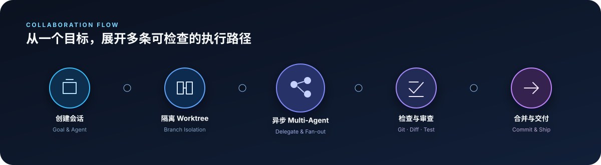

# VibeX

<p align="center">
  <strong>IAP · Integrated Agent Platform</strong><br />
  集成 Agent 平台，为 Vibe Coding 提供统一的 Agent、工具与协作入口。
</p>

<p align="center">
  <a href="https://github.com/Xircth/VibeX/releases/latest"></a>
  
  
  
  <a href="./LICENSE"></a>
</p>

<p align="center">
  <a href="https://github.com/Xircth/VibeX/releases/latest">下载</a> ·
  <a href="https://github.com/Xircth/VibeX/issues">反馈问题</a> ·
  <a href="#本地开发">本地开发</a>
</p>



VibeX 将 Claude Code、Codex、OpenCode、Pi 与 ACP Registry Agent 接入同一套桌面环境。每种 Agent 共用统一的检测、安装、认证、配置、更新和会话管线。

项目围绕三个核心目标构建：接入更多 Agent、隔离并行任务、集中完成开发交付。开发者可以在一个应用中组织会话、创建 worktree、委派子任务、检查代码，并使用浏览器、Git、终端和会话看板持续推进工作。

> [!IMPORTANT]
> **本地运行与隐私**：VibeX 是纯本地的 Agent 托管应用，不设置 VibeX 云端数据托管，也不会自动将项目、会话、配置或诊断数据上传到 VibeX 服务器。
>
> **测试阶段提示**：VibeX 正处于测试阶段。请谨慎管理个人项目资料，使用版本控制并做好备份，在提交、同步或合并前检查 Agent 产生的变更。
>
> 所启用的 Agent、模型服务、MCP、插件、消息渠道与浏览器访问可能按配置连接第三方服务；相关数据处理遵循对应服务提供方的隐私政策。

## IAP 核心能力

### 多种 Agent，统一接入

- **内置 Agent 档案**：优先支持 Claude Code、Codex、OpenCode 与 Pi。
- **ACP Registry**：从 ACP 官方 Registry 浏览并添加更多兼容 Agent。
- **统一生命周期**：集中展示 Runtime、ACP 适配器、版本、位置、认证、配置与诊断状态。
- **本地 Runtime 复用**：检测并验证本机已有 CLI，兼容时直接接入。
- **托管安装**：按版本安装缺失组件，记录安装锁，并提供更新、修复和卸载入口。
- **认证状态分离**：安装完成后，由用户在对应 Agent 中完成登录或 API 配置。

Agent 通过 [Agent Client Protocol（ACP）](https://agentclientprotocol.com/) 进入统一会话管线。Agent 的模型、模式与推理选项会根据其实际能力显示，VibeX 会保留各 Agent 的差异。

### Worktree 与 Multi-Agent 协作



- 为不同任务创建独立 Git worktree，让并行会话拥有清晰的文件边界。
- 同一项目可以同时运行多个 Agent 会话，分别承担实现、测试、审查与排错。
- 使用 `&Agent` 在消息中表达委派目标。父 Agent 具备对应 MCP 能力时，可以异步创建子会话并汇总结果。
- 子任务拥有独立状态、会话记录和终止控制，父会话可以继续工作或等待结果。
- 会话支持分叉、恢复、取消、重试、导入与导出，执行过程通过持久事件记录保留。

## Vibe Coding 配套组件

| 组件                       | 能力                                                                                                |
| -------------------------- | --------------------------------------------------------------------------------------------------- |
| **会话看板**               | 按项目和状态组织会话，集中查看并行任务、Agent 状态与资源用量。                                      |
| **内置浏览器**             | 基于独立 Chromium/CEF Runtime，支持多标签、导航、设备尺寸、DevTools、元素检查、Console 与 Network。 |
| **Git 面板**               | 查看变更、Diff、提交记录、分支、stash、Issue 与 Pull Request，完成暂存和提交操作。                  |
| **文件与 Diff**            | 浏览文件树、预览常见文件、查看统一或并排 Diff，并添加代码审查评论。                                 |
| **集成终端**               | 管理多个终端会话，运行开发服务器、测试和项目脚本。                                                  |
| **MCP、Skills 与 Plugins** | 管理 Agent 工具、技能和结构化工作流动作，扩展会话能力。                                             |
| **自动化**                 | 保存 Agent、工作区、分支和动作配置，按计划启动隔离任务并保留运行记录。                              |
| **消息渠道与远程设备**     | 将会话通知接入外部渠道，并通过授权设备查看或处理受支持的远程流程。                                  |
| **Office 产物预览**        | 通过托管的 OfficeCLI 能力预览 `.docx`、`.xlsx` 与 `.pptx` 产物。                                    |

## 下载与安装

从 [GitHub Releases](https://github.com/Xircth/VibeX/releases/latest) 下载对应平台的桌面安装包。

| 平台    | 架构          | 安装包               | 安装方式                                    |
| ------- | ------------- | -------------------- | ------------------------------------------- |
| macOS   | Apple Silicon | `.dmg`               | 打开镜像，将 `VibeX.app` 拖入“应用程序”。   |
| macOS   | Intel         | `.dmg`               | 打开镜像，将 `VibeX.app` 拖入“应用程序”。   |
| Windows | x64           | `.exe` / `.msi`      | 运行安装程序并按向导完成安装。              |
| Linux   | x64           | `.AppImage` / `.deb` | 运行 AppImage，或使用系统包管理器安装 deb。 |

首次启动时，VibeX 会检查本地 Agent Runtime 与 ACP Registry。选择需要启用的 Agent、默认 Agent 和外部编辑器后即可进入首页；缺失的托管组件会在后台安装。

兼容的本地 Runtime 会被复用。安装完成后的账号登录、浏览器授权和 API 配置需要在对应 Agent 的官方流程中完成。

### macOS 提示“App 已损坏”

当前发布包可能尚未完成 Apple 公证。Gatekeeper 有时会将从网络下载的 VibeX 标记为“已损坏”或“无法验证开发者”。

请先确认安装包来自 [VibeX 官方 Releases](https://github.com/Xircth/VibeX/releases/latest)，然后退出 VibeX，在终端执行：

```bash
xattr -dr com.apple.quarantine /Applications/VibeX.app
```

如果终端提示权限不足，执行：

```bash
sudo xattr -dr com.apple.quarantine /Applications/VibeX.app
```

命令只清除 `/Applications/VibeX.app` 的下载隔离属性。VibeX 安装在其他目录时，请将命令中的路径替换为实际位置。完成后重新打开应用。

仍被系统拦截时，可以前往“系统设置 → 隐私与安全性”，在安全提示区域确认打开 VibeX。无需全局关闭 Gatekeeper。

### 首次 Agent 配置

1. 在初始化页面选择需要启用的 Agent。
2. 从已启用的 Agent 中指定创建会话时使用的默认项。
3. 选择外部编辑器。
4. 等待后台安装通知，并在“设置 → Agent”查看预检查结果。
5. 按 Agent 的官方方式完成登录或 API 配置。

Runtime 或 ACP 适配器异常时，“设置 → Agent”会展示版本、位置、诊断信息和可用的安装或修复操作。

## 本地开发

### 环境要求

- [Node.js](https://nodejs.org/) 18 或更高版本
- [pnpm](https://pnpm.io/) 8 或更高版本
- [Rust](https://rustup.rs/)；仓库会通过 `rust-toolchain.toml` 选择所需工具链
- 当前平台所需的 [Tauri 系统依赖](https://v2.tauri.app/start/prerequisites/)
- 至少一个可供联调的 Agent CLI

### 启动桌面应用

```bash
pnpm install
pnpm run dev
```

开发命令会启动 React/Vite 前端、Tauri 桌面壳和 Rust 服务。

### 检查与测试

```bash
pnpm run check
pnpm run lint
cd frontend && pnpm test
cargo test --workspace
```

### 构建安装包

```bash
pnpm run tauri:build
```

也可以按平台选择打包命令：

```bash
pnpm run tauri:build:macos
pnpm run tauri:build:windows
pnpm run tauri:build:linux
```

## 技术架构

```text
frontend/        React + TypeScript + Vite 用户界面
src-tauri/       Tauri 桌面壳、系统集成与 IPC 命令
crates/agents/   Agent 档案、ACP、安装与会话运行时
crates/git/      Git 与 worktree 能力
crates/browser-* Chromium/CEF 浏览器运行时
crates/          会话、自动化、插件、产物与服务模块
shared/          从 Rust 生成的 TypeScript 类型
```

VibeX 使用 Tauri、Rust 和 React 构建。VibeX 管理的应用数据保存在本机，不会自动上传至 VibeX 服务器。所选 Agent、模型服务、MCP、插件、消息渠道与浏览器访问可能连接外部服务，其数据处理与账户策略由对应服务提供方决定。

`shared/types.ts` 属于生成文件。修改共享 Rust 类型后请运行 `pnpm run generate-types`。

## 参与贡献

欢迎通过 [Issues](https://github.com/Xircth/VibeX/issues) 提交缺陷与功能建议，也欢迎发起 Pull Request。提交代码前，请运行与改动范围对应的检查和测试。

项目采用 [Apache License 2.0](./LICENSE)。

## 致谢

VibeX 的桌面体验与 Agent 接入能力建立在 [Tauri](https://tauri.app/)、[React](https://react.dev/)、[Rust](https://www.rust-lang.org/) 和 [Agent Client Protocol](https://agentclientprotocol.com/) 之上。
