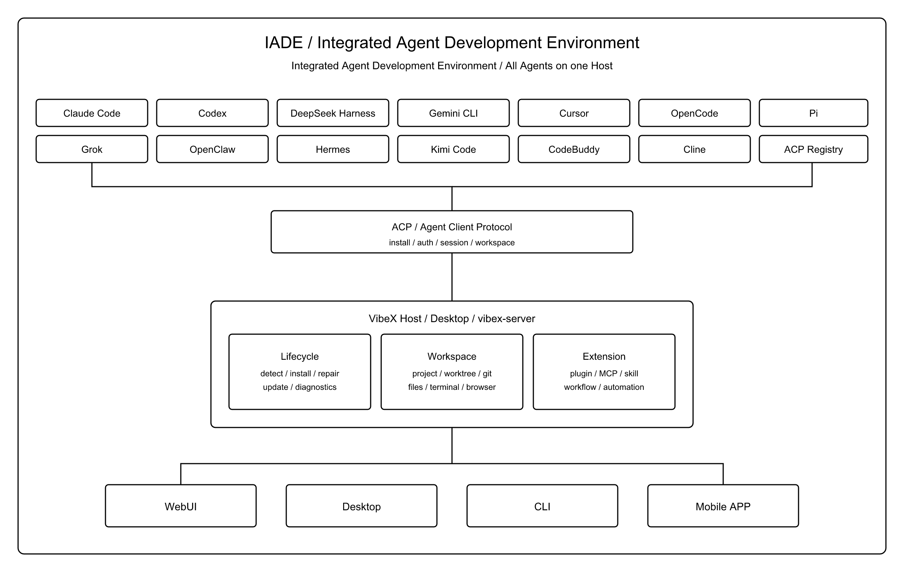
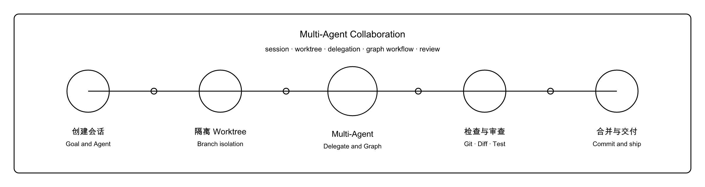
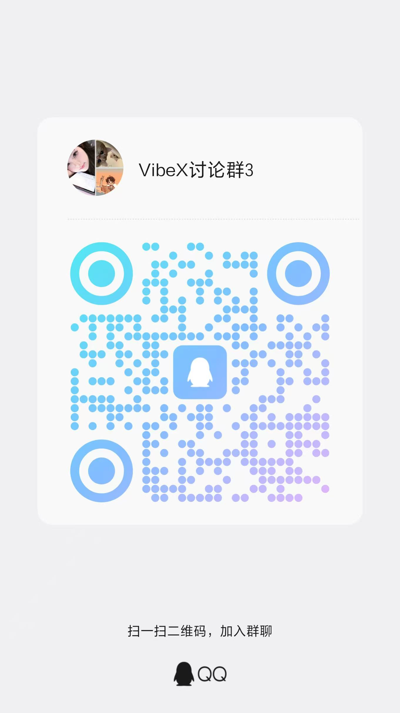

# VibeX

<p align="center">
  <a href="./README.md">English</a> · 简体中文
</p>

<p align="center">
  <strong>IADE · Integrated Agent Development Environment</strong><br />
  集成 Agent 开发平台，All in One 的综合 VibeCoding 平台。
</p>

<p align="center">
  <a href="https://vibex.com"></a>
  <a href="https://github.com/Xircth/VibeX/releases/latest"></a>
  
  
  <a href="./LICENSE"></a>
</p>

<p align="center">
  <a href="https://vibex.com">官网</a> ·
  <a href="https://vibex.com/docs">文档</a> ·
  <a href="https://github.com/Xircth/VibeX/releases/latest">下载</a> ·
  <a href="https://github.com/Xircth/VibeX/issues">GitHub Issue</a>
</p>



Agent 需要新的 IDE，于是有了 VibeX。

VibeX 是 IADE（Integrated Agent Development Environment）。它把多种 Coding Agent 接到同一条安装、认证、会话与落地管线上，并在同一套工作区里完成文件、Git、终端与浏览器上的工作。人提出任务；Agent 通过 [Agent Client Protocol（ACP）](https://agentclientprotocol.com/) 改文件、执行命令、申请权限。文件树、终端、Diff 和内置浏览器服务于当前会话绑定的工作区。

内置 Agent 包括 Claude Code、Codex、DeepSeek Harness、Gemini CLI、Cursor、OpenCode、Pi、Grok、OpenClaw、Hermes、Kimi Code、CodeBuddy 与 Cline。ACP 官方注册表中的兼容 Agent 走同一套管线。

> [!IMPORTANT]
> **本地运行与数据归属：** VibeX 是本地优先的 Host。项目、会话、配置与诊断数据保存在用户控制的 Host 上。VibeX 不运营云端数据托管，也不会自动将上述数据上传到 VibeX 运营的服务。远程客户端连接用户控制的桌面或 `vibex-server` 时，所选远程流程需要的数据会传输到该 Host。
>
> **测试阶段：** VibeX 仍处于测试阶段。请使用版本控制并备份重要项目，在提交、同步或合并前检查 Agent 产生的变更。
>
> 启用的 Agent、模型服务、MCP、插件、消息渠道与浏览器会话会按配置连接第三方服务，相关数据处理遵循对应服务提供方的政策。

## 核心能力

### All in One 的 Agents 全生命周期管理

设置中的 Agent 页集中处理检测、安装、认证、原生配置、更新、预检查、修复与卸载。内置档案与从 ACP Registry 添加的 Agent 身份不同，管线相同。

兼容的本机 CLI 会被复用并通过校验。缺失组件按锁定版本安装。需要 npm 的 Agent 使用 VibeX 管理的 Node.js 运行时。认证与官方配置仍由各 Agent 自己的目录持有，例如 Claude Code 使用 `~/.claude`。模型、模式与推理控件按该 Agent 的实际能力显示。

完整说明见[用户指南](https://vibex.com/docs)与 [IADE 概念](https://vibex.com/docs/reference/iade)。

### 多工作区协同工作与 Git 生命周期管理

会话与工作区强绑定。工作区可以是项目主目录，也可以是从同一仓库划出的 Git Worktree。并行任务各自使用独立工作树，未提交文件彼此隔离。

绑在 Worktree 上的会话提供变基与回基操作，并与 Git 面板共用同一棵树。Git 面板覆盖变更、Diff、提交记录、分支、stash、Issue 与 Pull Request。文件树、预览、审阅评论和集成终端的工作目录与当前会话工作区一致。会话看板按项目与状态排列并行会话。

操作说明见 [Worktree](https://vibex.com/docs/worktree) 与 [Git 与审阅](https://vibex.com/docs/git-review)。

### Rust + Tauri 高性能架构

桌面壳使用 Tauri 2。领域逻辑以 Rust crate 实现。界面使用 React 与 TypeScript。桌面 command、Web 路由与远程适配器调用同一套 Application Core。

Host 拥有一份数据目录，并对外提供远程协议。Agent 进程、Worktree、插件 Worker、自动化引擎与聊天通道适配器运行在这份 Host 上。同一数据目录同一时刻只能由一个 Host 占用。Rust 工具链由仓库内 `rust-toolchain.toml` 锁定。

架构说明见[平台架构](https://vibex.com/docs/developers/platform-overview)。

### 一切皆可接入的插件生态

VibeX 插件是可安装、可启停、可配置的产品功能单元。同一包可以向界面、Agent、Host 与 Runtime 贡献能力。安装、启用、配置、诊断、回滚与卸载由插件控制面统一管理。

官方捆绑插件覆盖会话增强、多智能体协同、工作流创建、Office 预览与插件开发。MCP 与 Skill 由 Host 托管。作者可使用 TypeScript、JavaScript、Python 与 Rust SDK，经[插件市场](https://vibex.com/marketplace)或链接开发目录接入。

插件说明见[插件概念](https://vibex.com/docs/reference/plugin)与[插件体系](https://vibex.com/docs/developers/plugin-overview)。

### WebUI、Desktop、CLI、Mobile APP 多种操作方式

| 入口 | 作用 |
| --- | --- |
| **Desktop** | 默认入口。桌面应用同时包含窗口与完整 Host。 |
| **Server + WebUI** | `vibex-server` 是无窗口 Host。浏览器打开发行包中的 `web/` 即可使用 WebUI。 |
| **CLI** | `npx vibex` 按平台拉取 Host 家族包、校验校验和并启动 Server。 |
| **Mobile APP** | Android 伴随端通过配对码连接 Host，用于查看会话、发送输入与处理权限。 |

桌面应用与 Server 共用数据目录、Agent、会话、自动化和插件。同一数据目录不能同时以 Host 身份启动 Desktop 与 Server。远程工作站桌面可以客户端身份连接已占用该目录的 Host。

连接模型见[一个 Host](https://vibex.com/docs/reference/one-host)与[连接 Host](https://vibex.com/docs/connect-host)。

### 高效 Multi-Agent 协作



多 Agent 协作分为委派与 Graph Workflow。Automation 负责触发。

- **委派：** 父 Agent 在对话中把工作交给其他已启用 Agent。输入框中的 `&` 是结构化提及。子会话拥有独立时间线与回合。该能力由官方插件「多智能体协同」提供。
- **Graph Workflow：** 以 JSON DAG 描述步骤依赖后再执行。源文件可纳入 Git；发布后的定义版本不可变。该能力由官方插件「工作流创建器」提供。
- **Automation：** 在手动操作或到达计划时间时，启动一次普通回合，或启动某个已发布的 Workflow 版本。

一次审查链可以使用委派。需要复用、版本化并按计划重复执行的流程写成 Graph，再由 Automation 启动。

说明见[智能体协同委派](https://vibex.com/docs/delegation)与 [Graph Workflow](https://vibex.com/docs/graph-workflow)。

## 下载与安装

安装包与 Host 家族包均从 [GitHub Releases](https://github.com/Xircth/VibeX/releases/latest) 获取。签名与公证状态以对应 Release 说明为准。

### 桌面版本

桌面应用是默认入口，安装后包含 Server 与 APP UI。

| 平台 | 系统基线 | 架构 | 安装包 | 安装方式 |
| --- | --- | --- | --- | --- |
| macOS | macOS 12 或更高版本 | Intel / Apple Silicon | `.dmg` | 打开镜像，将 `VibeX.app` 拖入「应用程序」。 |
| Windows | Windows 10 / 11 | x64 / ARM64 | `.exe` / `.msi` | 运行安装程序并按向导完成安装。 |
| Linux | Ubuntu 22.04 同等基线 | x64 / ARM64 | `.AppImage` / `.deb` | 运行 AppImage，或使用系统包管理器安装 deb。 |

Windows 安装包包含离线 WebView2 安装器。Linux 的内置 Chromium / CEF 子窗口需要 X11 或 XWayland；`.deb` 会声明 `xwayland` 依赖，使用 AppImage 的纯 Wayland 系统需要先安装并启用 XWayland。

首次启动会进入引导，探测本机已有 Agent Runtime，并要求选择启用项、默认 Agent 与外部编辑器。缺失的托管组件在后台安装。账号登录、浏览器授权和 API 配置在对应 Agent 的官方流程中完成。Runtime 或 ACP 适配器异常时，在「设置 → Agent」查看版本、位置、诊断与修复操作。

macOS 若拦截首次打开，先确认安装包来自[官方 Releases](https://github.com/Xircth/VibeX/releases/latest)，再在「系统设置 → 隐私与安全性」中仅对该下载选择「仍要打开」。

完整步骤见[安装桌面应用](https://vibex.com/docs/install-desktop)。

### Server 版本

`vibex-server` 是无界面 Host，也是 WebUI、IM 渠道和手机 APP 的服务底座。桌面应用已经内含一套完整 Server；只需要无窗口常驻或浏览器访问时，单独安装 Server。

使用官方助手下载、校验并启动：

```bash
npx vibex
```

`npx vibex` 按平台拉取 `vibex-host-family-{linux-x64,linux-arm64,macos-x64,macos-arm64,windows-x64}.tar.gz`，核对 sidecar 的 `.sha256` 与包内 `SHA256SUMS`，再启动 `vibex-server`，并把 `VIBEX_STATIC_ROOT` 指到包内 `web/`。也可以从 Releases 直接下载 Host 家族包。

解压后的目录包含 `vibex-server`、`vibex-mcp`、`web/` 与 `plugins/bundled/`。

| 平台 | 系统基线 | 发行物 |
| --- | --- | --- |
| macOS | 12 或更高版本 | macos-x64 / macos-arm64 |
| Windows | 10 / 11 | windows-x64 |
| Linux | Ubuntu 22.04 同等基线 | linux-x64 / linux-arm64，也可使用 Docker |

默认只监听本机 `127.0.0.1:17891`。本机浏览器打开该地址即可使用 WebUI，推荐 Chrome 系列浏览器。局域网访问需要设置 `VIBEX_SERVER_ALLOW_LAN=1`，并在前面加 TLS 反代。访问令牌至少 32 字节，首次生成时标准输出只出现一次。

同一数据目录同一时刻只能有一个 Host。Desktop 与 Server 必须使用同一版本。移动端可以低一个次版本，靠能力协商。

完整步骤见[安装 Server 与 WebUI](https://vibex.com/docs/install-server)。

## 快速开发

官方开发文档：

- [平台开发](https://vibex.com/docs/developers/platform-overview)
- [插件开发](https://vibex.com/docs/developers/plugin-overview)
- [插件开发工作流](https://vibex.com/docs/developers/plugin-dev-flow)

### 项目开发

本仓库是 pnpm workspace 加 Cargo workspace，用于修改 Host capability、Application Core、桌面壳或远程协议。

环境要求：

- Node.js 22，pnpm 10.x（仓库 `packageManager` 为 `pnpm@10.13.1`）
- Rust nightly，见 `rust-toolchain.toml`
- 当前平台所需的 [Tauri 系统依赖](https://v2.tauri.app/start/prerequisites/)
- 至少一个可供联调的 Agent CLI

```bash
pnpm install
pnpm run dev
pnpm run check
pnpm run lint
cd frontend && pnpm test
cargo test --workspace
pnpm run tauri:build
```

`pnpm run dev` 启动 React / Vite 前端、Tauri 桌面壳与 Rust 服务。修改共享 Rust 类型后运行 `pnpm run generate-types`。按平台打包可使用 `pnpm run tauri:build:macos`、`pnpm run tauri:build:windows` 与 `pnpm run tauri:build:linux`。

```text
frontend/        React + TypeScript + Vite 用户界面
src-tauri/       Tauri 桌面壳、系统集成与 IPC 命令
crates/          Agent、会话、Git、插件、自动化与服务
packages/        插件 SDK 与 CLI
shared/          从 Rust 生成的 TypeScript 类型
```

构建、测试与审查约定见[构建环境](https://vibex.com/docs/developers/platform-build)与[变更审查与安全](https://vibex.com/docs/developers/platform-pr-security)。

### 插件开发

插件包以稳定 Publisher 与 Plugin ID 作为身份，声明对界面、Agent、Host 或 Runtime 的贡献。当前发布对照见开发文档中的 Host、协议与 SDK 版本。

在仓库根目录定位契约并初始化模板：

```bash
python3 .agents/skills/vibex-plugin-development/scripts/locate_toolchain.py
node packages/plugin-cli/dist/cli.js toolchain
node packages/plugin-cli/dist/cli.js init my-notes --publisher you --template full
```

实现 Worker 或 App 后，校验、链接到运行中的 Host，再打包为 `.vxp`。已构建的 CLI 也可以执行 `vibex plugin pack .`。上架入口为[插件市场](https://vibex.com/marketplace)。

语言专章见 [TypeScript SDK](https://vibex.com/docs/developers/sdk-typescript)、[JavaScript SDK](https://vibex.com/docs/developers/sdk-javascript)、[Python SDK](https://vibex.com/docs/developers/sdk-python) 与 [Rust SDK](https://vibex.com/docs/developers/sdk-rust)。

## 社区讨论

### 微信群

扫描二维码加入 VibeX 微信讨论群。

<p align="center">
  
</p>

### QQ 群

扫描二维码加入 VibeX QQ 讨论群。

<p align="center">
  
</p>

### GitHub Issue

缺陷报告与功能建议请提交到 [GitHub Issues](https://github.com/Xircth/VibeX/issues)。欢迎发起 Pull Request。提交代码前，请运行与改动范围对应的检查和测试。

## 致谢

### ACP

VibeX 的 Agent 接入建立在 [Agent Client Protocol](https://agentclientprotocol.com/) 之上。内置 Agent 与 Registry Agent 通过 ACP 进入统一的安装、认证、会话与落地管线。

项目采用 [Apache License 2.0](./LICENSE)。
