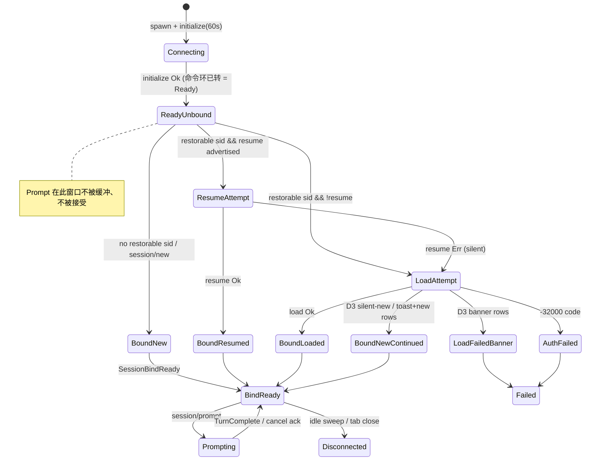
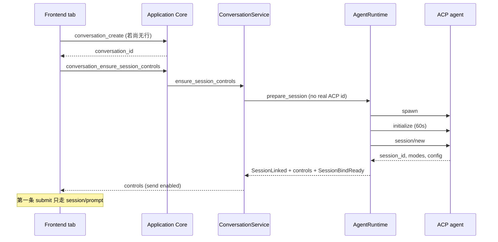
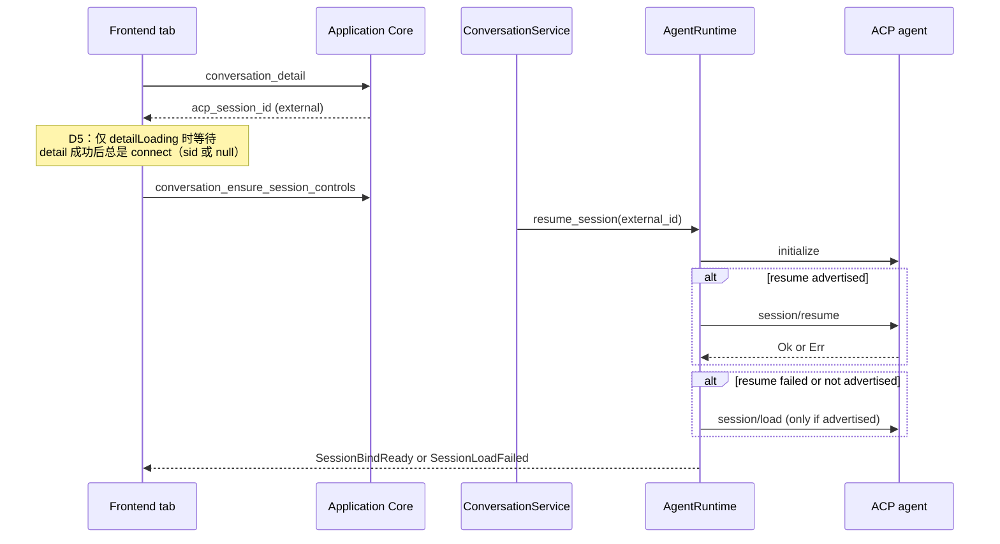
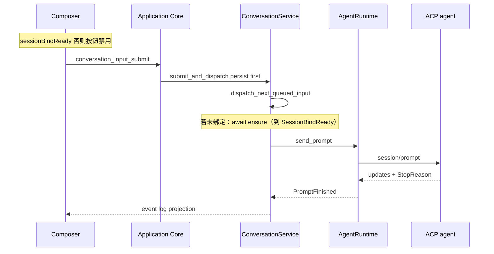
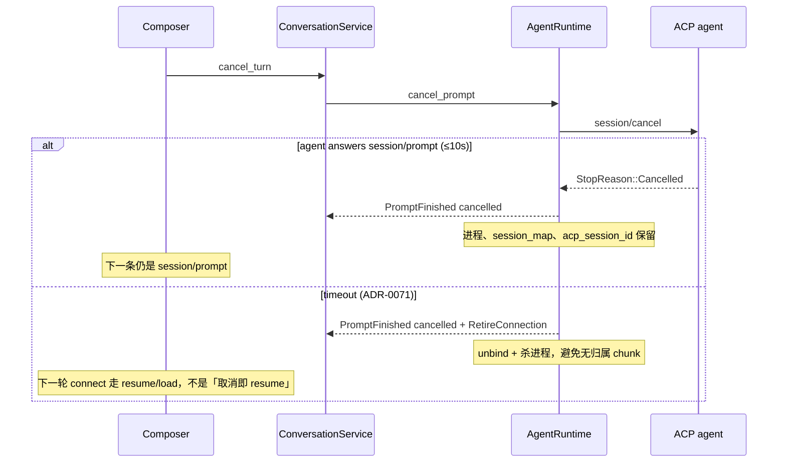
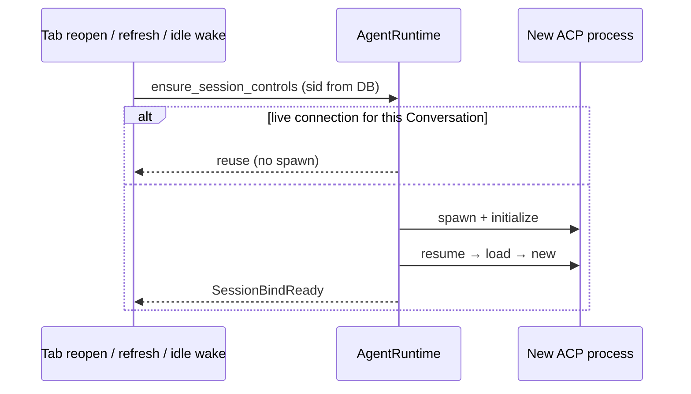
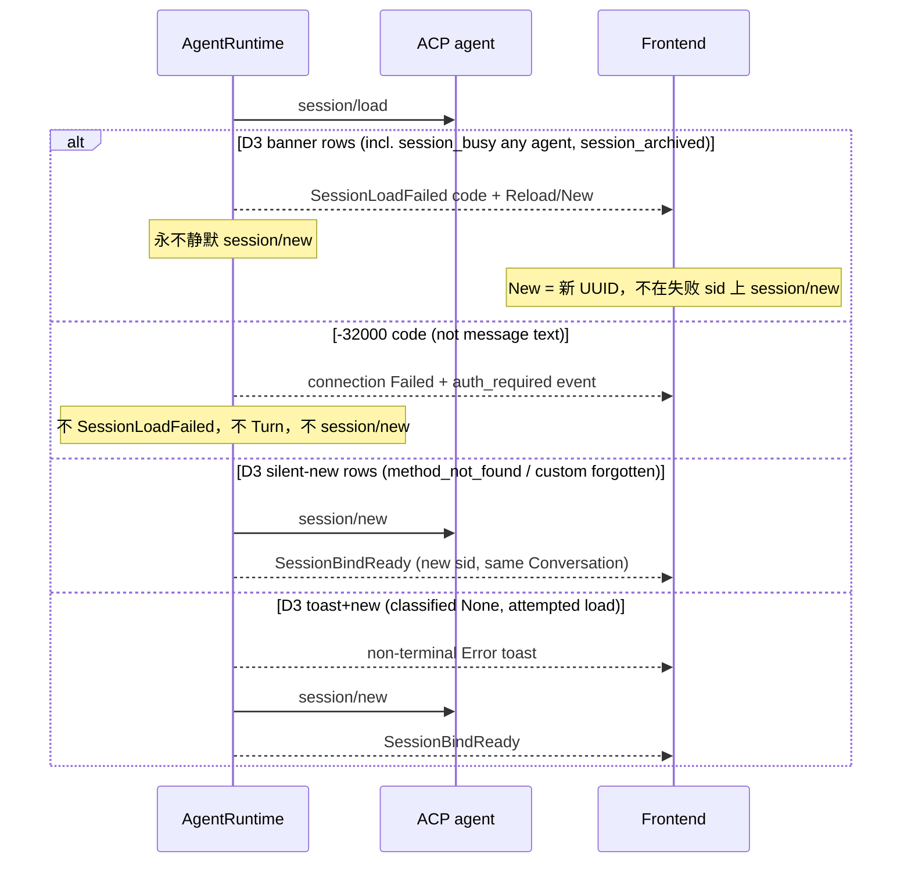

# 会话建立在连接时完成，Prompt 永不创建 ACP 会话（Codeg 对等）

对照基准：本地 sibling checkout `C:\Users\18190\Documents\projects\codeg`，
HEAD `9b2f0d493a5c18039682fa79d2bd840401c441ac`（`feat/653-pi-mcp-source`）。
adoption 记录钉住 `549add8d3ba07f31464c9cddde8ba7a7478eed14`
（`docs/third-party/codeg-adoption.md`）。行为以 **live checkout** 为准；钉住
commit 与 HEAD 已漂移，实施时以本 ADR 引用的 live 路径与函数为准。

本 ADR 只改会话**建立时机与边界**，不引入新的 actor / event bus，不重写
event-sourcing。Conversation 事件日志仍是 UI transcript 权威
（[ADR-0044](0044-conversation-control-plane-and-durable-inputs.md) /
[ADR-0071](0071-conversation-turn-integrity.md)）。Codeg 的磁盘 transcript
对 VibeX 只是适配映射，不是存储模型。

未经本 ADR 落盘，不得开始编码。实现必须可按本文件验收。

## Overview

VibeX 今天把 ACP 会话握手（`session/new` / `session/resume`）放进第一条用户
消息的 `start_turn`。Codeg 把握手放在 **connect**：进程 spawn → `initialize`
（60s）→ 无 `sessionId` 则 `session/new`，有则 **resume → load → new**；此后
每条用户消息只发 `session/prompt`。结果是 VibeX 的首条消息与 Prepare 竞态、
历史重开可能冷启动出新线程、发送按钮在会话未绑定时仍可点。

本决定把 Codeg 的建立链搬进 VibeX 现有三层：Agent Runtime 在连接启动时绑定
ACP 会话；Conversation 控制面在 **所有写入口**（桌面、Remote、CLI、Automation、
Workflow）于 Prompt 之前完成 connect；`start_turn` 只负责持久输入与
`session/prompt`；前端在打开标签时自动 connect，并在 `SessionBindReady`
之前禁用发送。VibeX 的 `initialize` 60s 超时已经存在
（`DEFAULT_HANDSHAKE_TIMEOUT_SECS`，`crates/agents/src/manager.rs` 199 行），
缺口是 initialize **之后**的会话绑定，不是握手超时本身。

## Background & Motivation

Codeg 的产品合同是：打开对话标签即建立 Agent 会话；输入框在会话初始化完成前
不可发送；历史对话必须带着已持久化的 `external_id` 去 resume/load，否则会
`session/new` 并把旧线程孤儿化。VibeX 已经禁止 Prompt 调用 `session/new`
（`crates/agents/src/manager.rs` 在 `session_map` 未命中时失败），但握手仍
挂在 Turn 上，因此这条禁令只把竞态从「静默分叉」变成「第一条消息失败」。

用户要求端到端对等，而不是在 `start_turn` 里再打补丁。

## 现状问题

对照 live Codeg 与当前 VibeX（0.2.x 主线，含 ADR-0071 已落地的 Prompt 禁令）
的缺陷如下。每条都有源码证据。

### 1. 握手发生在第一条 Turn，而不是 connect

Codeg：`acp_connect` → `ConnectionManager::spawn_agent` →
`spawn_agent_connection` → `run_connection` 在进入
`run_conversation_loop` **之前**完成 `initialize` 与
`session/new|resume|load`（`codeg/src-tauri/src/acp/connection.rs`
约 5246–6080 行）。`acp_prompt` 只向已活连接投递
`ConnectionCommand::Prompt`（`codeg/src-tauri/src/commands/acp.rs`
`acp_prompt` / `ConnectionManager::send_prompt_inner`）。

VibeX：`ConversationSessionService::send_turn_to_agent`
（`crates/conversations/src/service.rs` 约 3227–3538 行）在**已经
commit 了 Turn** 之后，按是否已有真实 ACP id 调用
`resume_session` 或 `prepare_session`，然后再 `send_prompt`。
前端打开对话**故意不**启动 Agent：
`useConversationTimeline` 测试锁定
「opening imported history / opening a conversation with no turns
does not launch an agent session」
（`frontend/src/features/conversation/UseConversationTimeline.test.tsx`）。

后果：首条消息的用户可见延迟包含 spawn + initialize + session/new；
取消/超时打在 Prepare 上会把已经持久化的 Turn 标失败。

### 2. 首条消息竞态（Prepare + Prompt 共用一个 `start_turn`）

`send_turn_to_agent` 把握手与 Prompt 放在同一条 Turn 临界区。
`cancel_turn` 在尚无 `active_prompt_id` 时只能
`drop_live_agent_connection` 来中止 `session/new`
（`service.rs` 约 2577–2579 行）。Prepare 超时、Prompt 在
`session_map` 未写入时到达、用户在「生成中」点停止，都会表现为
**第一条消息失败**，而不是「会话未就绪、消息仍在队列」。

Agent Runtime 已经拒绝未绑定的 Prompt：

```2284:2307:crates/agents/src/manager.rs
                            // Prompt must not call session/new. A Conversation
                            // already owns a thread; the host binds it with
                            // PrepareSession (first turn) or ResumeSession
                            // (follow-up). Creating a thread here forks Codex
                            // into a new session B while VibeX keeps writing A.
                            let acp_session_id = match runner
                                .session_map
                                .read()
                                .await
                                .get(&session_id)
                                .cloned()
                            {
                                Some(acp_session_id) => acp_session_id,
                                None => {
                                    runner
                                        .fail_active_turn(
                                            session_id,
                                            prompt_id,
                                            AgentError::Runtime(
                                                "ACP session is not bound on this connection; resume the existing thread instead of calling session/new".into(),
                                            ),
                                        )
                                        .await;
                                    continue;
                                }
                            };
```

这是正确的 Prompt 边界，但错误的调用时机：未绑定本应在 connect 阶段被消灭，
不应作为第一条 Turn 的失败模式。

### 3. 恢复链不完整：resume → load 之后没有 Codeg 的 new / `continues_from`

VibeX `load_or_new_acp_session`（`crates/agents/src/manager.rs` 约 2550–2698 行）：

- 若 `support.resume`：发 `session/resume`；成功则返回 `Resumed`。
- resume 失败且 `support.load`：发 `session/load`；成功则返回 `Loaded`。
- load 失败：**一律** `emit_session_load_failed` 并 `Err`，**从不**
  `session/new`。
- 两者都不支持：`SessionLoadFailed { Unsupported }`。

Codeg（`connection.rs` 5505–5971 行）是：

1. 广告了 resume 则先 `session/resume`；**任何** resume 失败都静默落入
   load，不 toast。
2. 未广告 `loadSession` 则不把 `session/load` 送上线，直接按
   Method not found 处理。
3. load 失败走 **两段函数**，不得混为一谈（见 D3 / D8）：
   - `classify_session_load_failure`（8343–8381）：只映射
     `ResourceNotFound` → `resource_not_found`；message
     `"is archived"` → `session_archived`；`"already has an active writer"`
     → `session_busy`；`"process exited"` / `"session has ended"` /
     `"Session not found"` → `session_unavailable`；**不映射 `-32000`**。
   - 分类之后：auth 是 **单独的** `err_str.contains("Authentication required")`
     然后 `return Ok(())`（5914–5916），不是 classifier 的臂。
   - `recovers_load_failure_locally`（8403–8408）：
     `classified.is_some() && transcript_dir_for(agent).is_some()`，但
     **`session_busy` 对任何 Agent 都不恢复**。
   - 完整决策表见 D3。

VibeX 已有 ADR-0074 合法的码位分类：`classify_session_load_error`
把 `-32000` → `AuthenticationRequired`、`-32002` → `ResourceNotFound`
（`manager.rs` 485–496）。没有 `continues_from`（全仓库零命中）。
load 失败发生在第一条 Turn 里，而不是连接级横幅。

### 4. 前端没有 connect 生命周期，发送不闸在会话就绪上

Codeg：

- `useConnectionLifecycle` 在 `isActive && workingDir` 时自动
  `acp_connect`（`codeg/src/hooks/use-connection-lifecycle.ts` 210–249 行）。
- 历史对话：`awaitingHistoricalSessionId = hasPersistedConversation &&
  selectedAgent !== "cline" && detailLoading`；`canAutoConnect` 在此为
  false，于是 `isActive && canAutoConnect` 挡住自动连接，避免
  `sessionId=undefined` 走 `session/new` 孤儿化历史
  （`conversation-detail-panel.tsx` 516–549 行）。Cline 不支持 resume，
  跳过这道闸，`sessionId` 固定 `undefined`。
- `selectorsLoading = (connected|prompting) && !selectorsReady`；
  composer 在 `selectorsLoading` / `!connectionReady` 时禁用发送。

VibeX：

- 发送走 `conversationApi.submitInput` → 控制面持久化 → `start_turn`
  内部握手（`useFollowUpSend.ts` / `useSessionComposerQueue.ts`）。
- 新会话在**第一条发送时**才 `sessionsApi.create`
  （`frontend/src/hooks/useFollowUpSend.ts` 160–168 行）。
- `ensureSessionControls` 只在用户显式 `reconnectAndReload` 时调用，
  打开标签不会 connect。
- composer 发送闸是 `canTypeFollowUp` / `canSendFollowUp` /
  `isEditable`（`sessionComposerSubmit.ts` 41–70，
  `ActionBarIdleControls.tsx` 51–53）：工作区、在途发送、retry、
  pending approval、compact、内容。`isAttemptRunning` 主要切换
  idle/stop UI。**没有** ACP 绑定闸。目标是在上述闸之外再加
  `sessionBindReady === false` → disable send。

### 5. 连接复用、空闲回收、取消后的会话身份与 Codeg 不对齐

Codeg `spawn_agent`（`manager.rs` 675–791 行）：

- 有 `session_id` 时取 per-`(agent, cwd, session)` 锁，查找可复用的活连接
  （`state.external_id` 匹配且非 Disconnected/Error）。
- 新会话（`session_id=None`）**故意不**去重。
- 有 sid 时等待 `SessionStarted`（或超时）才放锁。
- `sweep_idle`：Connected、无 pending permission、无后台任务、超过
  180s 无活动则断开（`idle_sweep.rs`）；前端对打开标签 keepalive。

VibeX：

- `ensure_session` 按 Conversation UUID 锁；ADR-0071 已禁止跨 Conversation
  复用连接。这点保持。
- 没有 idle sweep。标签关闭后的进程泄漏靠显式 disconnect。
- 取消：ADR-0071 要求等待 `session/prompt` 的 `StopReason::Cancelled`
  （10s 上限）；未确认则 **unbind + 退役连接**，下一轮必须冷启动。
  Codeg 在 `ConnectionCommand::Cancel`（`connection.rs` **9748–9838**）
  立即 `TurnComplete{cancelled}`（9773–9783）并后台 drain prompt
  future（9838），进程与 `session_id` 都保留，下一条仍是
  `session/prompt`。本 ADR **不削弱** ADR-0071 的握手；对等的是
  「成功取消后会话仍绑定，下一条是 prompt，不是 resume」。
  ADR-0071 §2「不可再复用」作用于**活连接/进程**，不是 durable sid：
  超时后退役进程，DB `acp_session_id` 保留，下一进程走
  resume→load→new，这不是「取消触发的 resume」。

### 6. 持久化时机错位

Codeg：

- 连接态 `external_id` 在 `SessionStarted` 写入
  （`session_state.rs` `apply_event`）。
- DB `conversations.external_id`：若连接上已有 `conversation_id`
  （历史已链接），`lifecycle.rs` 的 `SessionStarted` 处理调用
  `bind_external_id`；新对话则在**首次** `send_prompt_linked` 建行并绑定。
- 新标签可以先 connect、后建 DB 行。

VibeX：

- Conversation 行在第一条发送时由 `sessionsApi.create` 创建（或已有
  历史行）。
- `acp_session_id` 写在 `send_turn_to_agent` 握手成功之后的 binding
  上，因此「打开历史但还没发送」时运行时没有绑定，下一次发送才 resume。
- 若运行时误判「无真实 ACP id」，会 `prepare_session` → `session/new`，
  把 Codex 线程分叉成 B，而 VibeX 继续写 Conversation A
  （`service.rs` 3265–3270 行注释已承认这是缺陷）。
- 今天仍把占位 id 写进 prepare：`format!("vibex-new-session-{conversation_id}")`
  （`ensure_session_controls` 约 2434 行）。过滤器
  `is_placeholder_acp_session_id`（`vibex-new-session-` / `prepared-` /
  `pending-`，`service.rs` 4518–4521）和 `restorable_agent_binding` /
  `known_acp_session_id` 已经会丢掉占位符，但目标数据模型必须规定：
  **持久化的只能是 Agent 返回的真实 id**；占位符不得再写入 DB，也不得
  被历史 connect 当成 resume 目标。

---

## 目标

把 VibeX 的**可观察会话行为**对齐 Codeg：建立在 connect，Prompt 永不
`session/new`，发送闸在会话就绪，恢复链与错误表面与 Codeg 同类。

### Goals

1. **Connect-time bind。** Conversation 行在 auto-connect 前必须存在
   （打开即 `conversation_create`，见 D11）。cwd 已知且 Agent 已安装后
   spawn + 既有 `initialize`(60s) + `session/new|resume→load→new`。
   `SessionBindReady` 前 composer 不可发送。同一 connect 路径供
   Remote / CLI / Automation / Workflow 使用，不是 React 专属。
2. **Prompt 只 prompt。** `start_turn` / `send_prompt` / `session/prompt`
   不得调用 `session/new`。ADR-0044：`submit` **先持久化**。
   `dispatch_next_queued_input` 在 idle 且未绑定时 **await**
   `conversation_ensure_session_controls`，再 `commit_new_turn` /
   `send_prompt`。仍未绑定则 **不 commit Turn**，输入留在队列，
   返回 `acp_session_not_bound`。这不是 Prompt 建会话。
3. **恢复链对等。** `resume`（若广告）→ `load`（若广告，否则视同
   method-not-found）→ 按 D3 决策表：横幅 / auth 停 / 静默 new /
   toast+new。
4. **历史闸（D5）。** `detailLoading` 期间默认不 connect；未知能力 =
   等待 **仅限该窗口**。`conversation_create` 返回后或 `detail` 成功后
   **总是** connect（真实 sid 或 null → `session/new`）。禁止
   initialize 广告或 `agent_id == "cline"`。
5. **取消不是 resume。** 活进程上的取消（握手成功）保持进程、ACP 会话、
   `acp_session_id`；下一条消息仍是 `session/prompt`。
6. **UI transcript 权威不变。** `session/load` 回放不得进入 Conversation
   事件日志（ADR-0071 §1）。Codeg 磁盘 transcript 的职责由事件日志承担。
7. **可对照验收。** 每一条验收标准都能指向 Codeg 函数与 VibeX 目标路径。
8. **真实 ACP id 在 connect 持久化。** `SessionLinked` 已有写入路径
   （`runtime_events.rs` 166–177）；connect 必须发出该事件。占位符 id
   不得入库、不得 resume。

### Non-Goals

- 不把 VibeX 的 crate 拓扑改成 Codeg 的 `acp/` 单模块。
- 不把 UI transcript 改成 Codeg 的 JSONL 磁盘文件。
- 不削弱 ADR-0071 的取消握手（等待 prompt 响应，10s 超时后退役连接）。
- 不在本 ADR 落地 ACP v2（ADR-0035）；V2 的 `session/resume`+`replayFrom`
  是后续适配，不改变「建立在 connect」的时机。
- 不把连接改为跨 Conversation 复用（继续 ADR-0071 §3）。
- 不重做 Composer / Dockview / 控制面输入队列（ADR-0044 `submit` 仍是
  普通输入唯一入口）。
- 不把 Codeg 的 localStorage selector-prefs 搬进浏览器；偏好权威仍是
  Conversation binding + `agent_session_default`（ADR-0071 §4）。

---

## 与 Codeg 的对照结论

| 维度 | Codeg（live） | VibeX 今天 | 目标 |
|---|---|---|---|
| **结构** | `ConnectionManager` 拥有进程；`run_connection` 拥有 initialize/会话/命令环；`SessionState` 是连接权威；DB conversation 是 prompt 侧效应。`lifecycle.rs` 把 `SessionStarted` 写到 `external_id`。 | `AgentRuntime` + `ConnectionManager` + 每连接命令环；Conversation 事件日志是 UI 权威；`ConversationSessionService` 在 Turn 内调用 prepare/resume。`crates/agents/src/lifecycle.rs` 是卸载规划，**不是** ACP 生命周期。 | 保持 VibeX 三层。把 Codeg `run_connection` 的「进入命令环之前完成 bind」搬进 Agent Runtime 连接启动。Conversation 服务只在 connect 路径调用 prepare/resume，Turn 路径只 prompt。 |
| **状态机** | `ConnectionStatus`: Connecting / Connected / Prompting / Disconnected / Error。`initialize` 后即 `Connected`（cached selectors 可展示，prompt **缓冲**在 `cmd_rx`，`connection.rs` 5492–5495）。`selectorsReady` 稍后；send 禁用直到该事件（`selectorsLoading` + `chat-input.tsx` 197–200）。 | `AgentConnectionStatus`: Disconnected / Connecting / Recovering / Ready / Failed。initialize 成功即 Ready，随后才接受 `PrepareSession` 命令。无 `selectorsReady`。发送不看绑定。 | **Ready = initialize 完成 / 命令环已转**（保持现语义）。**Bind 完成 = 独立 `SessionBindReady`**，不得复用 `Ready`。VibeX **不**在 bind 前缓冲 Prompt（严于 Codeg）。send 与 `start_turn` 都要求该闩。`SessionLoadFailed` 升到连接级。auth 走 Failed + `auth_required` 事件，不是 Connected 上的静默 `Ok(())`。 |
| **生命周期** | 新标签 auto-connect（`sessionId=undefined` → `session/new`）。历史：`detailLoading` 期间不 connect，加载后把 `externalId`（可仍 undefined）传入。Cline 写死跳过。首次 prompt 建 DB 行。follow-up 只 prompt。取消保活。刷新/idle sweep/关标签重开走 resume。 | 新会话：第一条发送才 `sessionsApi.create` 并在 `start_turn` 里 `session/new`。历史打开不 connect。follow-up 若运行时未绑定则 resume 或误 new。无 idle sweep。Automation/Remote 也走 `start_turn` 内握手。 | 新 Conversation 打开即创建（D11）并 **立即** auto-connect（null sid → `session/new`）。历史闸仅 `detailLoading`（D5）。Turn 只 prompt。`dispatch_next_queued_input` 在 persist **之后**代理 connect。idle sweep 180s + 必选 touch ~30s。 |
| **消息/事件** | ACP：`initialize`, `session/new`, `session/resume`, `session/load`, `session/prompt`, `session/cancel`。UI：`StatusChanged`, `SessionStarted`, `SessionModes`, `SessionConfigOptions`, `SelectorsReady`, `TurnComplete`, `SessionLoadFailed`。load 回放默认 drain。 | ACP 方法同名。UI：`SessionLinked`, `SessionControls`, `PromptFinished`, `SessionLoadFailed`（挂在 Turn/恢复路径）。load 回放已按 ADR-0071 drain 内容类 update。 | 方法顺序对齐 Codeg。新增/固定 connect 完成信号。load 回放继续不进事件日志。`TurnComplete`/`PromptFinished` 仅表示 Turn，不表示会话拆除。 |
| **持久化** | 连接 `external_id`：`SessionStarted`。DB 行：首次 prompt 创建；`bind_external_id` 在已有 `conversation_id` 的 `SessionStarted` 或首次 prompt。custom transcript header 可带 `continues_from`。 | Conversation 行先于或等于首次发送。`acp_session_id` 在 Turn 内握手成功后写 binding。 | Conversation 行仍按 ADR-0044 先于 Prompt 存在。`acp_session_id` 在 **connect 成功**时写入 binding / `Session`（`AgentBindingReady`）。取消成功不改 id。fallback `session/new` 更新为新 id，事件日志不重写历史（`continues_from` 的适配）。 |
| **恢复** | resume 任意失败 → load。load：见上分类。活连接按 `(agent,cwd,sid)` 复用。 | resume 失败 → load（若支持）→ 失败则错。无 silent new。无 per-sid spawn 去重等待。 | 复制 Codeg 链与分类。spawn 对已有 sid 去重并等待 bind 完成。 |
| **错误处理** | 见 D3 决策表：`session_archived`/`session_busy`/`resource_not_found`/`session_unavailable` 横幅（busy 对 custom 也不 silent-new）；auth 文本检查后静默 `Ok(())` 且保持 Connected；method-not-found 静默 new 无 toast；其它 unexpected toast+new。 | 几乎所有 restore 失败都变成 Turn/`SessionLoadFailed`。`-32000` 已按码位分类（0074 合法）。auth 时机在 Turn。 | 保持 `-32000`/`-32002` 码位分类（D8）。B 级短语仅用于 load。auth → Failed + 既有 auth UI，不 `SessionLoadFailed`，不 Turn。横幅动作见 D13。 |
| **接口边界** | 前端可调：`acp_connect`, `acp_prompt`, `acp_cancel`, `acp_disconnect`, `acp_touch_connection`。后端拥有会话建立。Prompt 从不建会话。 | 前端可调：`conversation_create` / `submit` / `conversation_ensure_session_controls` / `agent_prepare_session` / `agent_resume_session`。生产路径把 prepare 藏在 `start_turn`。Automation `TurnLauncherPort::start_turn`、Remote `conversation_ensure_session_controls` 与 submit 分离。 | **Connect 是控制面义务**，不是 React effect。所有写入口（Tauri、Server、CLI、Automation、Workflow）在 Prompt 前 `conversation_ensure_session_controls`；dispatcher 在 idle+未绑定时自动调用。`conversation_touch` 与 idle sweep 同 PR、必选。Prompt 永不 `session/new`。 |

---

## 目标架构

不新开架构风格。映射到现有 crate：

```text
打开标签 / 显式重连（Desktop、Remote、CLI）
  → conversation_create（若尚无行，D11）
  → conversation_ensure_session_controls   （阻塞到 SessionBindReady 或 D3/D16 终态）
  → AgentRuntime prepare/resume
  → initialize → Ready(命令环) → new|resume→load→new
  → SessionLinked + SessionBindReady
  → composer 解锁

ConversationControl.submit                 （ADR-0044：先持久化，submit_and_dispatch）
  → dispatch_next_queued_input             （service.rs 1559+）
      若未绑定：await conversation_ensure_session_controls
      若仍未绑定：不 commit Turn，输入留在队列，返回 acp_session_not_bound
      否则：commit_new_turn + send_prompt（仅 session/prompt）
```

| Codeg | VibeX 落点 |
|---|---|
| `acp_connect` | `conversation_ensure_session_controls`（可保留别名 `conversation_connect`，同一 use case） |
| `spawn_agent` + 去重锁 | `AgentRuntime::ensure_session` + 连接启动 bind；去重键仍是 Conversation UUID（ADR-0071），外加「同一 Conversation 的活连接复用」 |
| `run_connection` 内 session 链 | `crates/agents/src/manager.rs` 连接任务：initialize 后命令环可转（Ready），**bind 在接受 Prompt 之前完成**。`PrepareSession`/`ResumeSession` 是启动参数，不与 Prompt 交错 |
| `SelectorsReady` | 专用 `AgentEvent::SessionBindReady { conversation_id, acp_session_id }`（空 modes 也发）。`SessionLinked` **只**负责 persist/投影（已有 `runtime_events.rs` 166–177 / 762–768），不兼任 ready 闩。modes/cache **不得**置位 |
| `external_id` | `ConversationAgentBinding.acp_session_id` / `Session` 元数据（仅 Agent 返回的真实 id） |
| 磁盘 transcript | Conversation 事件日志 |
| `continues_from` | 同一 Conversation 上更新 `acp_session_id` + `AgentBindingRecovered { CreatedNewSession }`；不复制事件 |
| `acp_prompt` | `submit` → `send_prompt`（bind 前不入命令队列） |
| `acp_cancel` | `cancel_turn` → `session/cancel` + ADR-0071 握手 |
| `idle_sweep` + `acp_touch_connection` | `sweep_idle` + **必选** `conversation_touch`（同 PR） |

### 连接启动状态机



`AgentConnectionStatus::Ready` 保持「initialize 完成、命令环在转」。
`SessionBindReady` 是独立事件/闩。send 与 `start_turn` 看闩，不看
`Ready`。Codeg 在早期 Connected 缓冲 `cmd_rx` 上的 Prompt
（`connection.rs` 5492–5495）；VibeX **拒绝**这种缓冲（Alternative D）。

### 新对话 connect



### 历史重开



### 首次 prompt / follow-up



Follow-up 与首次 prompt **同一条路径**。区别只在 connect 阶段已经
`session/new` 还是 `resume/load`。Turn 内不再出现 prepare/resume。

### 取消



这是相对 Codeg 的**有意加严**：Codeg 在
`ConnectionCommand::Cancel`（`connection.rs` 9748–9838）立即
`TurnComplete{cancelled}`（9773–9783）并后台 drain prompt future
（9838）。VibeX 保持 ADR-0071 握手，但对等「取消成功 ≠ 拆会话」。
ADR-0071「不可再复用」= 退役**活连接**；durable sid 仍在，下一进程
resume→load→new，不是「取消触发的 resume」。

### 重连 / resume（进程已死、sid 已知）



### load 失败

按 D3 表分发，不在此图折叠 `session_busy` / `session_archived` /
unexpected toast。



---

## API / Interface Changes

### 后端（Application / Tauri / Server 同一命令名）

| 命令 | 今天 | 目标 |
|---|---|---|
| `conversation_ensure_session_controls` | 显式重连；内部 prepare/resume；开头 `drop_live_agent_connection`（`service.rs` 2289–2296） | **所有客户端的 connect 入口**。默认 reuse-first（D12）。`reload=true` 才 drop。**阻塞直到 `SessionBindReady` 或 D3/D16 终态**（与今天 await prepare/resume 相同）。已绑定的活连接立即返回。在 `ReadyUnbound` 返回 **不是** 成功。失败按 D3。已有非占位 sid 禁止 prepare/`session/new`（Codeg#500 守卫，PR 1）。`SessionBindReady` 仍广播给未 await 的订阅者。 |
| `conversation_start_turn` / `conversation_input_submit` | `send_turn_to_agent` 内 prepare/resume + prompt | **submit 先持久化**（`submit_and_dispatch`）。`dispatch_next_queued_input`：未绑定则 await ensure；仍未绑定则 **不 commit Turn**，输入留队列，返回 `acp_session_not_bound`（D14）。零 `session/new`。UI 因 D10 不会未绑定 submit。 |
| `agent_prepare_session` / `agent_resume_session` | 底层仍可用 | 保留给设置验收、oneshot、测试。Chat / Automation / Remote 生产路径不调用。实现改为等待连接启动链。 |
| `conversation_touch` | 无 | **必选**，与 idle sweep 同 PR（D15）。对齐 `acp_touch_connection`。前端活动标签 **~30s** 一次，必须严格小于 idle timeout。 |

`AgentRuntime::prepare_session` / `resume_session` 的 Rust API 保留，但
连接任务在 `initialize` 之后、接受 `Prompt` 之前跑完建立链。把
`PrepareSession`/`ResumeSession` 从「可与 Prompt 交错的命令」改为
「启动参数或启动后的一次性等待」。**不要重写**已有
`DEFAULT_HANDSHAKE_TIMEOUT_SECS = 60`。

`AgentError` 增加变体 `AcpSessionNotBound`，
`turn_failure_code() == "acp_session_not_bound"`（ADR-0074 §7）。
Conversation 服务映射同码。今天的
`AgentError::Runtime("ACP session is not bound...")` 没有
`turn_failure_code()`（`error.rs` 37–49），必须替换。

### 前端

- 新增等价于 `useConnectionLifecycle` 的 hook（不必抄文件名）：
  活动标签 + cwd + 已安装 Agent + Conversation id →
  `ensureSessionControls`。**不**把 `isActive` 设为 false 来当闸；
  闸的是 connect 调用（D5）。`conversation_create` 返回后立即
  connect（null sid → `session/new`）。仅当打开**已有**对话且
  `detailLoading` 时等待。
- 未安装：不 auto-connect，走既有安装提示（ADR-0012；Codeg
  `canAutoConnect` 跳过 doomed draft connect）。
- `SessionLoadFailed` 未清除：不 auto-connect（Codeg `!acpLoadError`）。
- `detailError` 的已持久化对话：不 auto-connect。
- composer：在现有 `canSendFollowUp` / `canTypeFollowUp` 之外，
  `sessionBindReady === false` disable send。modes cache 不得置位。
- `SessionLoadFailed` 横幅动作见 D13。隐藏输入。
- 删除/改写
  `UseConversationTimeline.test.tsx` 中「打开对话不启动 Agent」的断言。

### 事件

- `AgentEvent::SessionLinked { acp_session_id, agent_id, capabilities }`：
  **保持**为 persist/投影事件。`runtime_events.rs` 166–177 已写入
  `conversation_agent_bindings.acp_session_id`；762–768 已投影
  `AgentBindingReady`。connect 成功必须发此事件（不得另开第二条
  persist 路径）。占位符 id 不得作为 payload。
- **新** `AgentEvent::SessionBindReady { conversation_id, acp_session_id }`：
  bind 完成后**总是**发出，包括 Agent 未广告任何 mode/config。
  这是 send/`start_turn` 的唯一解锁信号。不把 `bind_ready` 塞进
  controls 快照来代替该事件（避免第三份真值）。
- `SessionLoadFailed`：连接级，带 D3 `code`；archived 可附带
  `recovery_command`（如 `codex unarchive <id>`）。
- auth：`AgentError::AuthenticationRequired` / 既有 `auth_required` 码位
  + 连接 Failed。不发 `SessionLoadFailed`。

---

## Data Model Changes

**无强制 schema 迁移。** 继续用：

- `sessions` / Conversation 行（ADR-0044）
- `conversation_agent_bindings.acp_session_id`
- binding `status` 枚举（ADR-0071 §5：`pending|connecting|ready|recovering|failed|closed`）

行为变化：

1. `acp_session_id` 在 connect 成功时由现有 `SessionLinked` 写入
   （`runtime_events.rs` 166–177），不等第一条 prompt。
2. **不变量：** DB 中的 `acp_session_id` 要么为 null，要么是 Agent 返回的
   真实 id。`vibex-new-session-` / `prepared-` / `pending-` 占位符在本
   ADR 之后不得入库。历史 connect / 「已有 sid 必须 resume」守卫使用
   现有 `restorable_agent_binding` / `known_acp_session_id` /
   `is_placeholder_acp_session_id`（`service.rs` 4505–4561）。对占位符
   走 `session/new`，不 resume 假 id，也不被「已有 sid」守卫挡住首次
   connect。
3. fallback `session/new` 更新同一 binding 的 id，并追加
   `AgentBindingRecovered { CreatedNewSession }`（满足 ADR-0074 §6）。
4. 不新增 `continues_from` 列。事件日志已经把历史留在同一 Conversation。
5. 取消成功不把 binding 标 `closed`，不清除 `acp_session_id`。
6. 取消未确认（ADR-0071）仍 unbind 运行时 `session_map` 并退役连接；
   **DB 中的真实 `acp_session_id` 保留**，下一轮 resume 用它。

可选（非本 ADR 阻塞）：`conversation_agent_bindings` 增加
`continues_from_acp_session_id` 仅作诊断。默认不做。

---

## 关键决策与取舍

## Key Decisions

### D1. 会话建立是连接启动的一部分，不是 Turn 的一部分

**决定：** Agent Runtime 在 `initialize` 成功后、命令环接受 `Prompt` 前
完成 `session/new` 或 `resume→load→new`。`start_turn` 假设绑定已完成。

**理由：** Codeg `run_connection` 的结构；消灭 Prepare+Prompt 竞态。

**否决：** 在 `start_turn` 开头「先 prepare 再 prompt」打补丁——这就是
现状，无法满足「打开标签即可发送闸」和「取消 Prepare 不等于第一条消息失败」。

### D2. Prompt 永不 `session/new`（保持并上移保证）

**决定：** 保持 `manager.rs` 对未绑定 Prompt 的硬失败；同时保证生产路径
在 Prompt 之前已经绑定，使该失败只出现在测试/误用。

**理由：** 未绑定的 `session/new` 会把 Codex 线程分叉成 B。

**否决：** 让 Prompt 在 map 为空时自动 `session/new`「更方便」。

### D3. 恢复链严格复制 Codeg 决策表

**决定：** `recovers_locally` = 用户声明/custom ACP Agent（Codeg
`transcript_dir_for` = `custom_id()`；VibeX 映射 ADR-0036 用户声明
Agent）。内置 profile **否**。`session_busy` 对 **任何** Agent 都不
`recovers_locally`。

| 条件 | 动作 |
|---|---|
| `-32000`（码位，见 D8） | 停：连接 Failed + `auth_required` 事件。不 `SessionLoadFailed`，不 Turn，不 `session/new`（D16） |
| classified `resource_not_found` / `session_unavailable` / `session_archived` 且 **非** recovers_locally | 横幅 `SessionLoadFailed`（D13 Reload / 新对话）。永不静默 new。archived 可附带 `codex unarchive <id>` 复制 |
| classified `session_busy`（任何 Agent） | 同上横幅。**永不** silent-new（Codeg 8404–8406：busy 会话还在，new 会丢掉唯一指针） |
| classified forgotten/unavailable/archived 且 recovers_locally（custom，且非 busy） | 静默 `session/new` + 同一 Conversation 换 sid + `CreatedNewSession`。无 toast |
| `-32601` / message Method not found / 未广告 loadSession | 静默 `session/new` + 换 sid。**无 toast** |
| classified `None`（unexpected）且 `attempted_load` 且非 recovers_locally | **非 terminal Error toast**（「Failed to load session, starting new」）然后 `session/new` + 换 sid（Codeg 5924–5938） |
| classified `None` 且未 attempted_load | 静默 new，无 toast |

**理由：** 用户明确要求对等。事件日志能渲染历史，但不能恢复 Agent 侧
线程。busy 静默 new 会毁掉 fork 父线程的唯一指针。

**否决：** 「反正 UI 历史在事件日志，全部 silent new」。
Open Question 2 由本表关闭：用户声明 Agent = custom。

### D4. Conversation 行仍先于 Prompt 存在；ACP id 在 connect 绑定

**决定：** 不把 VibeX 改成 Codeg 的「首次 prompt 才 INSERT conversation」。
新标签在 auto-connect 前 `conversation_create`（若尚无行）。ACP
真实 `acp_session_id` 在 connect 成功时由 **既有** `SessionLinked`
写入（`runtime_events.rs` 166–177），PR 1 必须发出该事件。

**理由：** ADR-0044 控制面、Remote/CLI/Automation 都假设 Conversation
UUID 先存在。Codeg 晚建行是因为它用整数 DB id + 标签草稿；VibeX 用
UUID 事件源。对等的是 **ACP 会话时机**，不是 INSERT 时机。

**否决：** 为抄 Codeg 而把 Conversation 创建推迟到第一条消息——破坏
控制面与 operation id 幂等。

### D5. 历史闸只在 `detailLoading`；新对话 create 后立即 connect

**决定（实现按此粘贴）：**

1. **`detailLoading` 为真（打开已有 Conversation、detail 在飞）：**
   默认 **不 connect**。`未知能力 = 等待` **只适用于这个窗口**。
   跳过 in-flight 等待 **仅当** Built-in Profile 声明该 Agent 不能
   resume **且不能** load。detail 在飞时
   `ConversationActiveBinding.capabilities.resume_session` /
   `load_session`（`conversations.rs` 945–946，来自 binding 列）
   **还不可用**，不得用 SQL 缺省 `false` 当 skip。**禁止** initialize
   广告。**禁止** `agent_id == "cline"`。
2. **`detail` 成功之后，或 `conversation_create` 返回之后：**
   **总是 connect**。把 `active_binding?.acp_session_id` 交给 connect
   （占位符 → null；无 binding → null）。null sid → `session/new`。
   **不要**再为能力未知而等待。刚 create、`active_binding == null`
   的新行必须能 auto-connect（AC 1）。
3. 闸的是 **connect 调用**，不把 `isActive` 设为 false（Codeg 是
   `isActive && canAutoConnect`）。

**理由：** Codeg 的 `awaitingHistoricalSessionId` 只在已持久化对话
**加载中**挡住 connect；新草稿立即 `sessionId=undefined` →
`session/new`。VibeX D11 打开即 INSERT，若把「已持久化但从未绑定」
当成「历史 sid 仍在加载」，Goal 1 的新对话会永远等能力。未知=等待
必须钉死在 `detailLoading` 窗口，否则 catch-22。

**否决：** 对刚 create 的行继续等 binding 能力。否决：写死 Cline。
否决：用 initialize 广告做闸。

### D6. 取消：保持 ADR-0071 握手；对等「不拆会话」

**决定：** 不把取消改成 Codeg 的立即 `TurnComplete`。握手成功后
`session_map` 与 DB `acp_session_id` 保持。未确认则退役连接，但 DB id
仍在，下一次是 resume/load 不是「取消触发的 resume」。

**理由：** ADR-0071 的无归属 chunk 事故比 Codeg 更严；用户要求「取消不是
resume」。两者同时成立。

ADR-0071 §2「不可再复用」作用于活连接/进程，不是 durable sid。

**否决：** 为抄 Codeg 而去掉 10s 等待。否决：取消后强制 resume。

### D7. load 回放继续不进事件日志

**决定：** 维持 ADR-0071 §1。custom Agent 在 Codeg 里把 load 回放写入
磁盘 transcript 仅当本地还没有记录；VibeX 若事件日志已有历史则 drain；
若 Conversation 为空且 Agent 回放了历史，**仍不**把回放当新事实写入
（避免双份）。空 Conversation 的导入路径走既有 import，不走 load 回放。

**理由：** 事件日志是权威。Codeg 的 hydrate-from-replay 是因为它自己
就是 custom Agent 的 transcript 实现。

**否决：** 把 load 回放 append 进事件日志。

### D8. load 分类：保持 VibeX 码位图；不要抄 Codeg 对 `-32000` 的省略

**决定：** 两个函数，禁止混用：

1. **A 级码位**（现有 `classify_session_load_error`，`manager.rs`
   485–496，ADR-0074 合法）：`-32002` → `ResourceNotFound`；
   `-32000` → `AuthenticationRequired`。auth **只**走码位，**禁止**
   `"Authentication required"` 文本匹配。
2. **B 级、仅 `session/load` 的观测**（对齐 Codeg
   `classify_session_load_failure` 8343–8381 的真实臂，**不含
   `-32000`**）：`"is archived"` → `session_archived`；
   `"already has an active writer"` → `session_busy`；
   `"process exited"` / `"session has ended"` / `"Session not found"` →
   `session_unavailable`。测试锁死这些片段。不进入 Turn taxonomy。

工程师「对齐 Codeg 的 `classify_session_load_failure`」时 **不得**删掉
VibeX 已有的 `-32000` 码位分支。

**理由：** Codeg 把 auth 放在 classifier 之外的 C 级字符串检查。若照抄
该函数会制造 0074 回退。VibeX 用码位做 auth 更诚实。

### D9. 一个 Conversation 一个连接，但同一 Conversation 的活连接要复用

**决定：** 维持 ADR-0071 §3。对同一 Conversation UUID 的并发 connect
必须去重（Codeg per-sid lock 的映射）。刷新、关标签重开、keepalive
命中活连接则 reuse，不 spawn。

**否决：** 每次打开标签都杀进程重建。

### D10. 发送禁用直到 `SessionBindReady`；不缓冲 Prompt；Ready ≠ bind

**决定：**

- `AgentConnectionStatus::Ready` = initialize 完成、命令环在转（保持
  今天语义；对应 Codeg 早期 `Connected`）。
- bind 完成 = 专用事件 `SessionBindReady`（空 modes 也发）。
  `SessionLinked` 只 persist/投影。cache/modes **不得**置位。
- composer：`sessionBindReady === false` 时 disable send（叠加现有
  `canSendFollowUp` / `canTypeFollowUp`）。
- VibeX **不**在 bind 前把 Prompt 放进命令通道（严于 Codeg
  `cmd_rx` 缓冲，见 Alternative D）。`start_turn` 同样要求该闩。

**理由：** ADR-0058。把 Ready 复用成 bind 完成会弄坏「命令环已转」的
读者。缓冲 Prompt 会再次打开未绑定 Prompt 窗口。

### D11. 打开即 create 的 Conversation 进入列表；bind 从不推迟

**决定：** 新标签 `conversation_create` 后的行在会话列表中**可见**
（可无标题）。create 返回后按 D5.2 **立即** auto-connect（null sid →
`session/new`），不等 binding 能力。若日后要「未发送不进列表」，只做
投影/`draft` 过滤，**不得**推迟 ACP bind。AC 1 锁定此 UX。

**理由：** Goal 1 / D4 已经依赖 create-before-connect。把可见性留作
Open Question 会让 PR 3 无法对照单一 UX。

**否决：** 为了不进列表而推迟 create 或 bind。

### D12. `ensure_session_controls` reuse-first；显式 reload 才 drop

**决定：** auto-connect / dispatcher connect 默认复用同 Conversation
的活绑定连接。`reload=true`（用户 Reload、设置 Restart、显式
`reconnectAndReload`）才 `drop_live_agent_connection`。调用方 await
ensure 直到 `SessionBindReady`（或终态），不得在 `ReadyUnbound`
当作成功返回。关闭原 Open Question 4。

**否决：** 每次 ensure 都拆连接（今天 `service.rs` 2289–2296）。

### D13. `SessionLoadFailed` 的 Reload / 新对话

**决定：** 对齐 Codeg `conversation-detail-panel.tsx` 1715–1741 /
1813–1836：

- **Reload：** 清除 load error，对 **同一** `conversation_id` + **同一**
  `acp_session_id` 再调 `ensure_session_controls`（retry load/resume）。
  不在失败行上 `session/new`。
- **新对话：** `conversation_create`（**新 UUID**）+ connect
  `session/new`。旧 Conversation 保持 failed/只读。可关闭失败标签。
  **禁止**把「新对话」实现成对失败 sid 的 `session/new`。
- Codex `session_archived`：横幅可附带可复制 `recovery_command`
  （`codex unarchive <id>`）。

### D14. `acp_session_not_bound`：稳定码位；commit 前拒绝；输入留队列

**决定：** `AgentError::AcpSessionNotBound` +
`turn_failure_code() == "acp_session_not_bound"`。Conversation 服务
同码。`submit` 已按 ADR-0044 持久化后，`dispatch_next_queued_input`
若 bind 仍缺失：**不 commit Turn**，durable input **留在队列**
（不是 Failed Turn）。UI 因 D10 不会在未绑定 submit。非 UI 可以在
connect 进行中 submit；输入等待 dispatcher 下次认领；**不**自动
`session/new`。测试：connect 未完成的 UI submit → 零 Turn、零
`session/new`；非 UI submit → 输入 queued、零 Turn。

**否决：** 继续用无码位的 `AgentError::Runtime("ACP session is not bound...")`。
否决：先建 Turn 再失败（即今天的首条竞态）。

### D15. `conversation_touch` 与 idle sweep 同 PR、必选；触达 ~30s

**决定：** sweep 默认 180s（`VIBEX_ACP_IDLE_TIMEOUT_SECS`，0 关闭）。
**不** sweep：在途 Turn、ADR-0071 取消 10s 窗口、pending permission。
前端对**活动** Conversation 每 **~30s** `conversation_touch`（对齐
Codeg `idle_sweep.rs` 13–18 keepalive），且必须 **严格小于** idle
timeout（若 timeout 被 env 改小，cadence 跟着缩小）。无 touch 不得
合入 sweep。AC 17：活动标签即使 **没有 Turn** 也必须熬过一次 180s
sweep。

### D16. Connect-time auth：Failed + 既有 auth UI

**决定：** connect 路径遇到 `-32000`：连接 `Failed`，发
`AuthenticationRequired` / `auth_required`（既有 `TurnErrorCard` /
设置认证流，ADR-0012 / 0034 / 0064）。不发 `SessionLoadFailed`。
不创建 Turn。send 保持禁用。用户完成认证后 Reload/ensure 重试。

**否决：** Codeg 的 `return Ok(())` 且状态留在 Connected——VibeX 会
看起来像「已连接但不能发」的泛化故障。

---

## Alternatives Considered

### A. 只把 prepare 提前到 `ensure_session_controls`，连接环仍把 Prepare 当普通命令

前端打开标签调用 `ensureSessionControls`，`start_turn` 不再握手。
实现量小。

**否决为最终形态：** 命令环里 Prepare 仍可能与迟到的 Prompt 交错；
取消/超时窗口还在。可作为 PR 2 的过渡，但 PR 1 必须把建立链移到
进入 Prompt 循环之前。

### B. 完全照抄 Codeg：前端直接 `acp_connect` / `acp_prompt`，绕过 Conversation 控制面

行为最像。

**否决：** 破坏 ADR-0044（submit 是唯一写入口）、Remote/CLI/Automation
同路、事件日志权威。Codeg 是对照基准，不是 VibeX 的模块切分。

### C. 保持 Turn 内握手，仅加前端 disable 与重试

治标。首条消息仍包含 spawn；取消 Prepare 仍失败 Turn。

**否决：** 用户禁止局部修补。

### D. 像 Codeg 一样在 bind 前缓冲 Prompt（`cmd_rx`）

Codeg 在 `initialize` 后立刻 `StatusChanged { Connected}`，把提前到达的
`session/prompt` 留在 `cmd_rx`，等 `run_conversation_loop` 再执行
（`connection.rs` 5492–5495）。配合 `allowOfflineCompose`，用户可以在
selectors 未就绪时点发送。

**否决：** VibeX Prompt 在 `session_map` 为空时硬失败；把 Prompt 堆在
bind 前的通道上会重新打开 D2 窗口。composer 离线起草仍走 ADR-0042
draft，不走 Prompt 队列。解锁只认 `SessionBindReady`。

---

## Security & Privacy Considerations

- Connect-time `session/new` 仍走既有 launch lock、安装校验、认证探测
  （ADR-0021 / 0012）。未安装不得在 chat 里触发下载
  （Codeg `verify_agent_installed` / `SdkNotInstalled`）。
- auto-connect 增加了打开标签即拉起 Agent 进程的频率。必须：
  - 每个 Conversation 一个进程（ADR-0071）；
  - idle sweep 回收关标签泄漏；
  - 不在应用启动时批量拉起（ADR-0001 仍禁止启动急切重连）。
- `session/load` 回放可能含秘密；drain 且不写事件日志、不进 UI。
- auth required 停在 connect，避免用过期凭据 `session/new` 打出额外请求。
- MCP servers 仍按现有 injection 进入 `session/new`；custom Agent 拒绝
  MCP 的提示保持 Codeg `McpRejectedByAgent` 语义（hint，非误诊）。

威胁：恶意或错误的前端在 `acp_session_id` 未加载时 connect，导致
`session/new` 孤儿化 Agent 侧线程。缓解：D5 历史闸 + 后端对「已有
**非占位** `acp_session_id` 的 Conversation」拒绝无 sid 的 prepare
（必须走 resume 链）。该守卫在 PR 1/2 落地，不得等到 auto-connect
之后。这是 Codeg#500 在 VibeX 的对应。

未安装 Agent：auto-connect 不得 spawn（ADR-0012）。`SessionLoadFailed`
未清除时不得再 connect（Codeg `!acpLoadError`）。

---

## Observability

日志（`tracing`，已有 `[ACP]` 风格应对齐）：

- connect 开始：`conversation_id`, `agent_id`, `has_external_id`,
  `attempt`（resume/load/new）。
- resume 失败落入 load：`warn`，无用户 toast。
- load 分类结果：`code`（`resource_not_found` 等）+ 是否
  `recovers_locally`。
- bind ready：elapsed_ms（对齐 Codeg `dedup_wait` 日志）。
- Prompt 打到未绑定：`error` + 指标，这是 invariant 破坏。

指标：

- `acp_connect_seconds`（initialize / session 阶段分桶）
- `acp_session_bind_result{result=new|resumed|loaded|continued_new|load_failed|auth}`
- `acp_prompt_unbound_total`（应为 0）
- `acp_idle_sweep_disconnects`

告警：`acp_prompt_unbound_total` 连续 >0；initialize 超时率。

前端：connect 中显示任务（Codeg `tasks.connectingTitle` /
`initSessionTitle`）；`SessionLoadFailed` 横幅带 Reload / New。

---

## 分步实施计划

按 PR 拆分，每步可单独审查，合在一起覆盖端到端。禁止减范围。
**编号顺序 = 合入顺序。** 不得在 sid 持久化与 #500 守卫之前合入
前端 auto-connect。

1. **Runtime 建立链 + 真实 sid persist**（PR 1）：连接启动 bind；
   发出既有 `SessionLinked`（触发 `runtime_events.rs` 166–177）+
   `SessionBindReady`；已有非占位 sid 拒绝 prepare/new；Prompt 永不
   `session/new`。不重写 initialize 超时。
2. **控制面移出 Turn + 非 UI connect**（PR 2）：`submit_and_dispatch`
   仍先 persist；`dispatch_next_queued_input` 未绑定则 await ensure
   （阻塞到 `SessionBindReady`）；`send_turn_to_agent` 只 prompt；
   仍未绑定则输入留队列 + `acp_session_not_bound`。
3. **前端生命周期**（PR 3）：auto-connect、D5 闸、send disable、打开即
   create。依赖 PR 1–2 的 persist 与守卫。
4. **恢复/错误对等**（PR 4）：D3 全表、D13 横幅动作、D16 auth。PR 1
   阶段 custom forgotten 可以先横幅，本 PR 才 silent-new。
5. **连接寿命**（PR 5）：idle sweep + **必选** touch；取消身份；
   不负责首次 persist（已在 PR 1）。
6. **测试**（PR 6）：AC 1–18。flag 默认 off，本 PR 绿灯后才 default on
   并删除 flag。

---

## 验收标准

均为可测试、与 Codeg 对等的行为。括号内为 Codeg 锚点。

1. **新对话。** 打开新标签 → Conversation 行存在且**出现在列表**
   （即使 `active_binding == null`）→ **立即** auto-connect（null sid →
   `session/new`）→ `SessionLinked` 写入真实 sid → `SessionBindReady` →
   发送启用。此时尚未 `session/prompt`。不得因「能力未知」而等待。
2. **历史对话。** 打开已有 Conversation：仅在 `detailLoading` 期间不
   spawn。detail 成功后 **总是** connect，传入真实（或明确 null）
   `acp_session_id`。加载中 connect 视为回归。
3. **跳过 in-flight 等待。** 仅当 `detailLoading` 且 Built-in Profile
   声明不能 resume 且不能 load。禁止 `agent_id == "cline"`。未知能力
   的等待 **不得**延续到 detail 成功或 create 返回之后。
4. **首次 prompt。** bind ready 之后 `submit` 只产生 `session/prompt`。
   该 Turn 无 `session/new`。
5. **follow-up。** 同一连接、同一真实 `acp_session_id`、只 `session/prompt`。
6. **取消。** 握手成功：sid 不变，下一条 `session/prompt`。未确认：退役
   **连接**，DB sid 保留，下一进程 resume→load→new，不是「取消即 resume」。
7. **重连。** 进程已死、真实 sid 已知：resume→load→new。同 Conversation
   活连接被复用。
8. **load 失败横幅。** D3 banner 行（含 `session_busy` 对 custom、
   `session_archived`）：`SessionLoadFailed` + Reload/新对话。Reload
   重试同一 sid；**新对话不在失败 sid 上 `session/new`**。composer 隐藏。
9. **auth required。** `-32000` → 连接 Failed + 既有 auth UI。不
   `session/new`，不 `SessionLoadFailed`，不 Turn。
10. **发送禁用直到 `SessionBindReady`。** `Ready && !sessionBindReady`
    时发送禁用；cache modes 不得解锁。
11. **Prompt 永不 `session/new`。** connect 未完成的 UI submit →
    `acp_session_not_bound`，**零 Turn**、零 `session/new`。
12. **无首条消息竞态。** `submit` 先持久化。bind 完成前取消 connect：
    不 commit Turn；UI 草稿不是失败 Turn。非 UI 未绑定 submit：输入
    **留在队列**，不是 Failed Turn；`dispatch_next_queued_input` 在
    ensure 成功后认领。
13. **load 回放。** 重连后事件日志条数不因 load 回放增加（ADR-0071）。
14. **mode/config。** connect 时在首次 controls 广播前 apply 记忆值
    （ADR-0071 §4）。PR 1 不得回归现有 apply 路径。
15. **非 UI。** Automation 无 Dockview 标签的 turn、Remote submit、CLI
    follow-up：dispatcher 或调用方在 Prompt 前 connect；不得依赖 React
    hook。
16. **占位符。** DB 无 `vibex-new-session-*` / `prepared-*` / `pending-*`；
    历史 connect 不 resume 占位符。
17. **idle sweep。** 活动标签每 ~30s `conversation_touch`，即使 **没有
    Turn** 也必须熬过一次 180s sweep。在途 Turn / 取消窗口 / pending
    permission 不被 sweep。
18. **method-not-found** 静默 new 无 toast；unexpected load 失败先
    非 terminal toast 再 new（D3）。

---

## 风险与回滚

| 风险 | 严重度 | 缓解 | 回滚 |
|---|---|---|---|
| 打开标签即 spawn，进程数上升 | 中 | idle sweep 180s；非活动标签不 connect；ADR-0001 禁止启动批量拉起 | 关闭前端 auto-connect flag，恢复「首次发送才 connect」（行为回退，Runtime 链可留） |
| 历史闸失败导致 `session/new` 孤儿化 Agent 线程 | **高** | 后端拒绝「已有 acp_session_id 却走 prepare/new」；测试锁死 | 回退该 Conversation 的 binding 写入；用户 Reload |
| custom silent-new 被误用于内置 Agent | **高** | `recovers_load_failure_locally` 对等：仅用户声明/custom；单测抄 Codeg `agents_codeg_records_itself_absorb_a_forgotten_session` | 立即关掉 silent-new，全部走横幅 |
| ADR-0071 取消握手与「连接保活」冲突 | 中 | 成功 ack 保活；超时仍退役 | 保持 0071，不抄 Codeg 立即 TurnComplete |
| auto-connect 与 `ensure_session_controls` 现有「先 drop 再连」打架 | 中 | D12 reuse-first |  |
| initialize 60s 卡住 UI | 低 | **已有** `DEFAULT_HANDSHAKE_TIMEOUT_SECS`；不要重写 |  |
| 无 touch 的 sweep 杀掉活动标签 | **高** | D15：touch 与 sweep 同 PR | 关闭 sweep env=0 |
| 双路径 `start_turn` 带回 Prepare+Prompt 竞态 | **高** | flag 默认 **off**；绿灯后 default on 并**删除** flag；不保留 prepare-in-turn fallback | flag off |
| HEAD 相对钉住 commit 漂移 | 低 | 本 ADR 引用 live 行号；实施时若 Codeg 链变更，更新 ADR 再编码 |  |

**回滚策略：** feature flag `connect_time_session_bind` **默认 off**，
直到 PR 6 AC 1–18 nightly 绿灯，再 default on 并删除。不保留长时间
prepare-in-turn 双路径（那正是 D1 要杀掉的 bug）。Runtime 建立链在
flag off 时仍可拒绝 Prompt 建会话（更安全）。完整行为回退 = flag off
（前端不 auto-connect，dispatcher 仍可 connect；若必须旧路径，一次性
revert PR 2，不留开关）。

**与既有 ADR：** 本文件 **不废止** 0001 / 0021 / 0035 / 0044 / 0058 /
0071 / 0074。对 0001：打开会话即懒恢复，仍非启动急切。对 0071：取消
握手保留，仅明确成功取消后会话仍绑定。对 0074：`SessionLoadFailed` /
`CreatedNewSession` 接到 connect 路径，正好补齐其 §5–§6 的生产来源。

---

## Open Questions

1. ~~空 Conversation 是否进列表？~~ **已由 D11 决定：进列表。**
2. ~~用户声明 Agent 是否视为 custom？~~ **已由 D3 决定：是。**
3. idle timeout v1 仅 env `VIBEX_ACP_IDLE_TIMEOUT_SECS`（0 关闭）。
   是否要产品设置项？**不阻塞实施。**
4. ~~ensure drop vs reuse？~~ **已由 D12 决定：reuse-first。**
5. 实施冻结 Codeg 对照：本 ADR 选 **live** HEAD `9b2f0d49`。CI 对照
   向量写进 VibeX 仓库，不在构建时拉 Codeg。

---

## References

- Codeg live：`src-tauri/src/acp/connection.rs`（`spawn_agent_connection`,
  initialize 60s, resume→load→new, `classify_session_load_failure`,
  `recovers_load_failure_locally`, `run_conversation_loop` Cancel）
- Codeg `src-tauri/src/acp/manager.rs`（`spawn_agent`,
  `find_connection_for_reuse`, `send_prompt_inner`, `sweep_idle`）
- Codeg `src-tauri/src/acp/session_state.rs`（`apply_event` SessionStarted）
- Codeg `src-tauri/src/acp/lifecycle.rs`（`bind_external_id` on
  SessionStarted）
- Codeg `src-tauri/src/acp/idle_sweep.rs`
- Codeg `src-tauri/src/commands/acp.rs`（`acp_connect` / `acp_prompt` /
  `acp_cancel`）
- Codeg `src-tauri/src/db/service/conversation_service.rs`（`bind_external_id`）
- Codeg `src/hooks/use-connection-lifecycle.ts`
- Codeg `src/components/conversations/conversation-detail-panel.tsx`
- Codeg `src/contexts/acp-connections-context.tsx`
- VibeX `crates/agents/src/runtime.rs`（`ensure_session`, `prepare_session`,
  `resume_session`, `has_bound_acp_session`）
- VibeX `crates/agents/src/manager.rs`（Prompt 禁令, `load_or_new_acp_session`）
- VibeX `crates/conversations/src/service.rs`（`send_turn_to_agent`,
  `ensure_session_controls`, `cancel_turn`）
- VibeX `crates/conversations/src/runtime_events.rs`（`SessionLinked` persist）
- VibeX `frontend/src/features/conversation/useConversationTimeline.ts`
- VibeX `frontend/src/components/logs/AgentTimelineConversation.tsx`
- VibeX `frontend/src/components/tasks/follow-up/sessionComposerSubmit.ts`
- [ADR-0001](0001-crash-recovery-semantics.md)
- [ADR-0021](0021-acp-first-with-local-management-fallbacks.md)
- [ADR-0035](0035-acp-v2-dual-protocol-session-items.md)
- [ADR-0044](0044-conversation-control-plane-and-durable-inputs.md)
- [ADR-0058](0058-session-auxiliary-capability-honesty.md)
- [ADR-0071](0071-conversation-turn-integrity.md)
- [ADR-0074](0074-turn-failure-taxonomy-and-recovery-visibility.md)
- `docs/third-party/codeg-adoption.md`

---

## PR Plan

### PR 1: Connect-time session bind in Agent Runtime

- **Files:** `crates/agents/src/manager.rs`（含既有 apply/handshake 超时
  路径，**不重写** `DEFAULT_HANDSHAKE_TIMEOUT_SECS`）, `runtime.rs`,
  `events.rs`, `state.rs`, `error.rs`；`crates/conversations/src/runtime_events.rs`
  仅确认 `SessionLinked` persist 被触发；相关测试。
- **Depends on:** 无（本 ADR 已落盘）。
- **Changes:** 连接启动：既有 initialize(60s) 之后、接受 Prompt 之前
  `session/new` 或 `resume→load→new`。Ready = 命令环已转；bind 完成发
  `SessionBindReady`。**必须**发既有 `SessionLinked`（真实 Agent id），
  以触发 `runtime_events.rs` 166–177 写入 binding——不得另开 persist
  路径。已有非占位 sid 时拒绝 prepare/`session/new`（Codeg#500 守卫）。
  Prompt 未绑定失败、永不 `session/new`。resume 任意失败静默落入 load。
  load 失败本 PR 可一律横幅；**custom silent-new 等到 PR 4**（custom
  在此期间会看到横幅，可接受）。占位符不得入库。

### PR 2: Conversation service handshake leaves `start_turn`

- **Files:** `crates/conversations/src/service.rs`
  （`submit_and_dispatch`、`dispatch_next_queued_input`、
  `ensure_session_controls`、`send_turn_to_agent`、`cancel_turn`）；
  `crates/application/src/conversation.rs` / `conversation_execution.rs`；
  `src-tauri/src/commands/conversations.rs`；
  `crates/server/src/host/conversation.rs`；
  `crates/automation/src/runner.rs`（经 execution port）。
- **Depends on:** PR 1。
- **Changes:** ADR-0044 顺序不变：persist 先于 dispatch。
  `dispatch_next_queued_input` 在 `commit_new_turn` / `send_prompt`
  之前：未绑定则 **await** `ensure_session_controls`（该调用阻塞到
  `SessionBindReady` 或终态；`ReadyUnbound` 不是成功）。
  `send_turn_to_agent` 删除 prepare/resume。仍未绑定：不 commit Turn，
  输入留队列，返回 `acp_session_not_bound`（D14）。
  `ensure_session_controls` reuse-first（D12）。Automation/Remote/CLI
  走同一控制面。

### PR 3: Frontend connect lifecycle

- **Files:** `frontend/src/features/conversation/useConversationTimeline.ts`；
  `frontend/src/hooks/useFollowUpSend.ts`；
  `frontend/src/components/logs/AgentTimelineConversation.tsx`；
  `frontend/src/components/tasks/follow-up/sessionComposerSubmit.ts` /
  `ActionBarIdleControls.tsx`；新 lifecycle hook；对应测试。
- **Depends on:** PR 1–2（persist + #500 守卫必须先合入）。
- **Changes:** 活动对话 auto-connect（cwd + 已安装 Agent；
  `SessionLoadFailed` 未清除则不连）。D5 历史闸。`sessionBindReady` 前
  disable send。打开即 `conversation_create`（D11 列表可见）。改写
  「打开对话不启动 Agent」测试。横幅占位；Reload/新对话动作在 PR 4。

### PR 4: Recovery and error parity

- **Files:** `crates/agents/src/manager.rs`（D3 表、D8 两段分类）；
  Conversation 投影 / `SessionLoadFailed`；前端横幅 D13；auth D16。
- **Depends on:** PR 1–3。
- **Changes:** 落地 D3 全表：`session_busy` 永不 silent-new；
  `session_archived` 横幅 + 可选 unarchive 复制；method-not-found 静默
  new 无 toast；unexpected toast+new；custom forgotten silent-new。
  auth：Failed + 既有 auth UI，不 `SessionLoadFailed`。Reload 重试同一
  sid；新对话新 UUID。

### PR 5: Idle sweep, touch, cancel identity

- **Files:** `crates/agents` idle sweep；`conversation_touch` 命令
  （Tauri + Server）；前端活动对话 keepalive；`cancel_turn` 成功路径。
- **Depends on:** PR 1–2。可与 PR 3–4 并行。**不得**承担首次 sid
  persist 或 #500 守卫（已在 PR 1）。
- **Changes:** sweep 180s + 必选 touch ~30s（D15，cadence 严格小于
  idle timeout）。不 sweep 在途 Turn / 取消窗口 / pending permission。
  取消 ack 后下一 prompt 不 resume。AC 17：无 Turn 的活动标签熬过
  180s sweep。

### PR 6: Tests locking Codeg-equivalent end-to-end session flow

- **Files:** `crates/agents` / `crates/conversations` / `crates/application`
  / `crates/automation` 集成测试；frontend hook 测试；必要时 Playwright。
- **Depends on:** PR 1–5 的行为，测试可先红后绿按 PR 落地。
- **Changes:** 覆盖 AC 1–18。对照表每一行至少一条测试。flag 保持
  default off 直到本 PR nightly 绿灯，然后 default on 并删除 flag。

