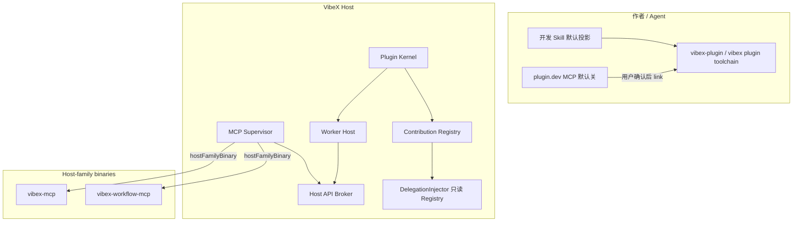

# VibeX 插件平台完整实现设计

| 字段 | 值 |
| --- | --- |
| 文档标题 | VibeX 插件平台：使「除核心服务与页面骨架外皆为插件」成为可交付系统 |
| 作者 | VibeX maintainers |
| 日期 | 2026-08-18 |
| 修订 | 2026-08-18 r5（用户拍板：v1 不运营公共 HTTPS index；Open Questions 关闭） |
| 状态 | Approved |
| 项目 | VibeX |
| 取代 / 修订 | 落实并收口 ADR-0046/0047/0048/0051/0052/0054/0055/0057；删除与本设计冲突的实现残留 |
| 读者 | 将按本文件拆 PR 实现的资深工程师 |

---

## Overview

VibeX 已经具备 v4 产品包、candidate-first 激活、Full Trust、Office 参考插件、linked-dev 与 CLI 的纵向切片，但公共扩展面仍然是封闭枚举，Host Broker 只有两条 RPC，Worker 只能跑 Node ESM，官方产品 MCP 靠插件 ID 特判，Agent 绑定写死 13 个内置身份。用户无法把「描述需求 → Agent 写插件 → 调试接入 → 启用」走通；第三方也无法把除文件预览之外的产品面真正插进 Host。

本设计给出**唯一目标系统**（不是分期愿景）：

1. Core 与页面骨架极小；其余一切是 Host 版本化 catalog 里的 contribution。
2. stdio JSON-RPC 1.1 是唯一 Worker 真相；Node / TypeScript / Python / Rust 四个一等写作面有完整 implementer spec；App 仍是 Web，协议保持 1.0。
3. 官方会话增强、多智能体协同、Workflow Creator 声明 `content.mcp` + 一等字段 `managedRuntime.hostFamilyBinary`，进程仍是 Host 家族 `vibex-mcp` / `vibex-workflow-mcp`。删除 `OfficialProductMcpGate`、`project_official_product_mcp`、按 ID 注入。不写 JS `session.mjs`。
4. 开发 Skill 默认投影；`plugin.dev.*` MCP 默认关闭，直到用户开启开发会话并确认 Full Trust。`plugin.dev.link` 需要用户确认，grant 绑定 (conversation, plugin identity, source digest)，token 不作为模型可见工具结果返回。
5. Isolated（manifestVersion 5）与 Marketplace 都在本列车。先交付 Isolated，再让 Marketplace 把未 TOFU 的第三方包默认到 Isolated。v1 Marketplace = 发行物内静态签名 index + 用户自备 URL + 本机 publisher TOFU。不运营公共 HTTPS index，没有「已验证 publisher」计划。
6. 迁移单向：每个子系统一次切换后删除旧实现。

---

## Background & Motivation

下列能力已经在源码与测试中成立，本设计不得回归：

- v4 产品包：README `summary`、`contents/`、根 `config.json`、Worker/App、Runtime、`integrations`、digest/generation。
- `/plugins` 目录 + 内容/配置详情（`frontend/src/pages/plugins/ProductPlugins.tsx`）。
- Candidate-first 激活、rollback、linked `dev`（loopback Plugin Dev Protocol）。
- Full Trust：无逐 capability 授权 UI（ADR-0048）。
- Office 是公共契约上的参考插件；核心不再按 Office ID 特判。
- Skill 可投影到 13 个内置 Agent 原生目录（Hermes 无 project 目录）。
- CLI：`init/validate/build/test/dev/install --link/uninstall/pack/doctor`。
- SDK 包位于 `packages/plugin-sdk`、`packages/plugin-cli`。

硬阻塞见「Hard Blockers and Replacements」。用户约束：第一性原理；不回归已有用户可见功能；改写后删除旧实现；硬阻塞必须替换；四语言一等；Maiden：单一真相源、完整可用、治本、不留残渣。

---

## Goals & Non-Goals

### Goals

- 用户可通过插件高度定制 VibeX：扩展前端、后端，以及 VibeX 管理的全部 Agent。
- 除不可再分解的 Core 与页面骨架外，产品功能都以 Plugin Package 交付。
- 作者（含会话里的 Agent）拥有完整开发指南、产品化 Skill、四语言 SDK、真实调试工具。
- 用户可从 Marketplace 安装第三方包；安装信任模型诚实。
- 一份协议、一份 schema/fixture corpus、一份 Host API catalog、一份 doctor 投影。
- 现有 Office 预览、Workflow Creator 文件 Tab、Skill 投影、linked-dev、目录/详情、builtin 物化、Full Trust 安装、candidate-first 激活继续可用（实现可替换）。

### Non-Goals

- 不把 Tauri plugin、Rust 动态库、主 React 树任意模块加载暴露为公共兼容面。
- 不把 Agent-native Codex/Claude 插件自动翻译成 VibeX App contribution。
- 不在 v4 Full Trust API 上静默恢复 sandbox / 权限弹窗。
- 不让 Rust/Python GUI 跑进 App iframe。
- 不保留 PluginAction 作为公共或运行时概念。
- 不把 VibeX git checkout 当作产品开发路径。
- 不引入长期双路径 feature flag。
- 不建设「已验证 publisher」运营计划；v1 只有本机 TOFU。
- 不把 kind/slot catalog 做成第三方可写的开放注册表。Catalog 随 Host 版本发布。

---

## Key Decisions

| # | 决定 | 理由 |
| --- | --- | --- |
| K1 | **Core 极小**：Host 进程、Application Core、会话事件日志、配对、数据目录、chrome/layout 骨架、Agent 启动管线、Plugin Kernel。其余全部是公共 contribution。 | 愿景要求「除核心服务与页面布局外皆为插件」。 |
| K2 | **扩展点是 Host 版本化 catalog，不是封闭 enum，也不是第三方注册表。** 未知 required kind → incompatible。 | 今日 `manifest.ts` 写死 6 kind / 2 slot。第三方不能发明 kind。 |
| K3 | **协议 1.1 是唯一 Worker 运行时。** 官方与内置包在同一 PR 改写为 1.1。App bridge 保持 1.0。`apiVersion` 保持 `"1.0"`（作者 API）。Handshake 只保留 `packageClass`，删除并行 `trust` 字段。作者只写 `runtime`；`format` 由 inspect 从 `runtime` 计算，不出现在公共 JSON。 | 今日 `activate` 是唯一握手。不能双栈。 |
| K4 | **TypeScript 编译为 Node ESM；原始 Node ESM 一等。二者 `runtime: "node"`。** | 共享 Node lock（已有 22.22.3）。 |
| K5 | **Python Worker = Host 托管 CPython 3.12.11 lock（python-build-standalone install_only）+ 包内冻结 site。** 用户 pip / PATH `python3` 不是权威。首次激活 Python 包时按需下载 lock。 | 与 Node lock 同构。 |
| K6 | **Rust Worker = 作者机器预编译的 6 个 triple 之一。禁止 WASM，禁止 Host rustc。** Windows 只认 MSVC。 | 离线、确定、可 drain。 |
| K7 | **App surface 永远是 Web（HTML/JS/TS），协议 1.0。** | 已有 iframe/CEF。 |
| K8 | **Host Broker 实现完整 catalog。** Full Trust 下 Broker 不是权限门；大体积 HTTP 不走 Broker，由语言运行时直连并记 audit `direct_network`。Isolated 禁止直连。 | 今日只有两条 RPC。 |
| K9 | **官方 MCP 进程模型：`managedRuntime.kind = hostFamilyBinary`。** 进程是 `locate_vibex_mcp_binary()` / sibling `vibex-workflow-mcp`。执行权威仍在 Application Core。包只声明 binaryId、args 模板、`hostScopes`、config→feature 映射。Desktop 与 `vibex-server` 共用**一份** Registry 注入实现。删除 `extra_stdio_servers`。删除 workflow-creator 的 JS `dist/mcp/workflow-control.mjs`，不再物化。 | 不把会话/委派重写成 JS Worker；不双注入。 |
| K10 | **删除 `OfficialProductMcpGate` 及其全部持有者。** 包括 `PluginControlPlane::official_mcp` / `sync_official_product_mcp_gate`、`VibexDelegationInjector`、`HeadlessDelegationInjector`、`product_mcp.rs` 的 gate bearer、`composition.rs` / `state.rs` 传 Arc、`project_official_product_mcp`、`COLLABORATION_PLUGIN_ID`。`conversations.rs` 与 HTTP `/internal/companion` 都按 scoped token + featureMap 鉴权。 | 按 ID 匹配是硬阻塞；桌面与 Server 必须同一缝。 |
| K11 | **`materialize_plugin_mcp_spec` 按 `hostScopes` 签发 scoped token。** 禁止把 Workflow gateway 注入每个 managed MCP。`hostFamilyBinary` 不走 Node entrypoint 物化。 | 当前 bug。 |
| K12 | **Agent 绑定四布尔来自静态表；Skill 落盘路径权威是现有 `agent_primary_skill_dir()` + `skill_dirs()`。** `mcp_session_new` 是静态意图，ACP probe 只能确认不能发明。删除 `ALL_AGENTS` / `skill_capable_agent_ids` 前，P16 fixture 必须对上当前 layout helper 的具体目录。 | 用户声明 Agent 今日被排除；简化路径表会回归投影。 |
| K13 | **Workflow 是唯一结构化调用。** Office 六个 workflow id 即幸存身份。`pluginActions[].actionId` → `workflowRefs[].workflowId` 恒等映射。同一 PR 一次性读旧列并删类型。 | ADR-0047。 |
| K14 | **`nativeRenderer` 是 Host renderer catalog id。** 删除 `"workflow.studio"` 白名单的同一 PR 必须注册 `host.renderer.workflow.studio`。 | 第三方复用 Studio。 |
| K15 | **实现 `depends.kind: "plugin"`。** 键是 `(publisher, id)`。缺失 required 依赖 → candidate 失败。永不自动拉取 Full Trust 依赖。 | 已声明未实现。 |
| K16 | **`content.hook` 使用本文件的事件目录与 per-Agent 投影表。** 不支持的 Agent 该项 `incompatible`。 | 文档有目录无 kind。 |
| K17 | **一份 JSON Schema + fixture；Rust 用 `jsonschema` crate；诊断 `code` 两边相同。** 语义检查（README、path escape、managedRuntime）留在共享 semantic pass，不进 JSON Schema。 | 两套 validator。 |
| K18 | **SDK/CLI/Skill 随 Host 家族，落在 ADR-0054 树下 `sdk/` 与 `bin/vibex-plugin`。** Locator 优先 `vibex plugin toolchain`（PATH / sibling），不依赖 MCP，不搜 `CONTEXT.md`。 | 无会话也能定位。 |
| K19 | **`vibex.plugin-development` 不可卸载。Skill 默认启用并投影。`plugin.dev.*` MCP 默认关闭，直到用户开启开发会话。** 这是对 ADR-0047 的唯一例外，且只覆盖 Skill。 | 发现 vs 执行分离。 |
| K20 | **`plugin.dev.link` 必须先经用户确认 + 与 Marketplace 相同的 Full Trust 文案。** Grant 绑定 (conversation_id, publisher, plugin_id, source_digest)。工具结果不含 token。CLI 读 Host 数据目录 grant 文件。删除产品路径上的 `VIBEX_PLUGIN_DEV_TOKEN`。 | 否则是 Agent→Full Trust RCE。 |
| K21 | **Isolated（v5）在本列车、排在 Marketplace 之前。** 四语言都有 Isolated 变体。未 TOFU publisher 的 Marketplace 包只能装 Isolated。Host 在 Isolated spawn（P27b）合并前，对任何 `packageClass=isolated` 的 install/link/activate **必须**失败 `plugin_class_unsupported`，且不得调用 `WorkerHost::spawn`。禁止把 Isolated 包送到 v4 Full Trust spawn。 | ADR-0048；K26。 |
| K22 | **Marketplace v1 = 发行物内静态签名 index + 用户自备 URL + 本机 publisher TOFU。** 不运营公共 HTTPS index。没有「已验证 publisher」程序。用户添加的 URL 或本地 index 是用户自己的信任决定。 | 用户 2026-08-18 拍板；公开目录若再出现是本文件范围外的新产品决策。 |
| K23 | **Doctor / UI 共用 Application Core `plugin.doctor`。** 停写 `plugin_grants_v4` 与停读在同一 PR；下一 PR 删表。 | 今日 `recentCrashes: []`。 |
| K24 | **`dev` 监视用 OS 通知；content digest 仍用于 candidate 身份。** | 只替换变更检测。 |
| K25 | **`/plugins/:id` 配置 Tab 挂 `plugin.detail.panel`。** 删除 `agentDefaults` 特判的同一 merge 必须交付 `vibex.multi-agent` 的 panel。通用表单复用已有 `frontend/src/components/rjsf`。删除 `PluginsSettings.tsx` 产品面。 | ADR-0057。 |
| K26 | **无 fallback、无双路径。** 一次切换。不存在「Isolated 未完成则 Full Trust 路径将就可用」的发行状态。 | 用户硬约束。 |
| K27 | **Catalog 随 Host 版本演进。** 新 kind 需要 Host adapter + catalog bump。第三方不能注册新 kind。 | 避免开放注册表。 |
| K28 | **能力来源是静态表，不是 session 广告。** `session/new.mcp_servers` 只用于投递，不写入能力目录。 | ACP 广告是运行时事实。 |
| K29 | **CPython 分发真相：indygreg python-build-standalone `install_only`，版本 3.12.11。** checksum 表与 Node 22.22.3 同文件格式。PR-04 合并前必须写入官方 SHA256SUMS 的真实哈希。 | 用户全局 Python 不可复现。 |
| K30 | **支持的 native triples：`aarch64-apple-darwin`、`x86_64-apple-darwin`、`x86_64-unknown-linux-gnu`、`aarch64-unknown-linux-gnu`、`x86_64-pc-windows-msvc`、`aarch64-pc-windows-msvc`。** | 与现有 Node lock 目标对齐。 |

---

## Hard Blockers and Replacements

| # | 硬阻塞 | 为何硬 | 替换 |
| --- | --- | --- | --- |
| B1 | 封闭 integration enum / slot | 新能力必须改三处源码 | Host 版本化 catalog。未知 required → incompatible。 |
| B2 | Broker 仅 `runtime.execute`、`artifact.preview` | 文档 client 是保留名 | 实现 §5 全表。删除 reserved。 |
| B3 | Worker 仅 Node ESM | Host 不是语言无关 | `runtime` = node \| python \| native。 |
| B4 | App 不能碰 palette / toolbar / status / composer / timeline / settings | 非布局部分不可插 | Host-rendered 孔挂在现有 `SearchPalette` / `Toolbar` / `StatusBar`。 |
| B5 | `/plugins/:id` 不挂 panel | ADR-0057 未落地 | 详情配置 Tab 挂载；删 `PluginsSettings` 产品面。 |
| B6 | `skill_capable_agent_ids()` 13 元 | 用户声明 Agent 被排除 | §7.1 静态能力表。 |
| B7 | Workflow gateway 注入每个 managed MCP | 凭据串味 | scoped token；`hostFamilyBinary` 不走该函数。 |
| B8 | `OfficialProductMcpGate` ID 匹配 | 官方产品绕过公共缝 | `hostFamilyBinary` + Registry。删 gate。 |
| B9 | `nativeRenderer: "workflow.studio"` 白名单 | 第三方不能复用 Studio | renderer catalog；同 PR 注册 Studio。 |
| B10 | `depends.kind: "plugin"` 未实现 | 多包无法声明依赖 | §8.2。永不自动拉 Full Trust。 |
| B11 | `contents/hooks/` 无 kind | 文件被当普通资源 | `content.hook` + 投影表。 |
| B12 | `PluginAction` 仍在 API | 产品说 Workflow | 恒等映射 + 删类型。 |
| B13 | TS / Rust 双 validator | 诊断漂移 | schema + semantic pass。 |
| B14 | locator 找 `CONTEXT.md` | 用户项目找不到工具链 | ADR-0054 树 + `vibex plugin toolchain`。 |
| B15 | doctor `recentCrashes: []`，读 grants | 无法调试 | 持久崩溃；停写 grants。 |
| B16 | 250ms 全树 sha256 | 大树卡死 | OS watch；digest 仍用于身份。 |
| B17 | Config 特判 `agentDefaults`，丢弃 object | Host 认识协同插件 | rjsf + 先交付 multi-agent panel。 |
| B18 | 无 Marketplace | 第三方无安装路径 | 静态签名 index + TOFU。 |
| B19 | Remote 写路径残缺 | Workstation 不能装包 | Artifact 身份 + Core 命令。 |
| B20 | SDK 不导出 app/testing；harness `return null` | 假绿 | 主入口导出；harness 实现 storage/log/secrets/artifact，其余硬失败。 |
| B21 | init 模板是玩具 | Agent 脚手架不出真包 | 模板矩阵。 |
| B22 | Full Trust vs 不受信 Marketplace | ADR-0048 | v4 / v5 两 major。Isolated 先于 Marketplace。 |

---

## Proposed Design

### 1. 不可再分解的 Core

| Core 对象 | 职责 |
| --- | --- |
| Host 进程 | Desktop 或 `vibex-server`，独占数据目录 |
| Application Core | ADR-0033 用例门面 |
| Conversation event log | 仅追加权威历史 |
| Pairing / Host identity | 设备信任 |
| Data directory | 包、generation、secrets、Runtime lock |
| Chrome / layout frame | 主窗口、设置壳、会话 Dock、Composer 外壳、侧栏、`Toolbar.tsx` / `StatusBar.tsx` 轨道本身 |
| Agent launch pipeline | ACP 连接、session new/resume/rebind、LaunchGate |
| Plugin Kernel | inspect / install / activate / registry / drain |
| Artifact Host | 路径校验、lease、identity |
| Design tokens | `DESIGN.md` / `--surface-*` |

插件只能往**已命名的孔**里塞 descriptor 或 iframe，不能替换轨道，不能注册未声明 DOM 选择器。

Kind/slot catalog **随 Host 版本发布**。第三方不能添加 catalog 条目。新 kind = 新 Host 版本。

### 2. 目标运行拓扑



### 3. 包格式与 Worker runtime

`entrypoints.worker`：

```json
{
  "path": "dist/worker.mjs",
  "runtime": "node",
  "protocol": "1.1"
}
```

作者**只写 `runtime`**。inspect 计算内部 `format`（`node`→`javascript-esm`，`python`→`python-module`，`native`→`executable`），不写回公共 `plugin.json`。P03 起 schema **拒绝** `format` 字段。

| `runtime` | 内部 format（inspect 计算） | Host 启动 |
| --- | --- | --- |
| `node` | `javascript-esm` | 见 §6.6 spawn 表 |
| `python` | `python-module` | 见 §6.6 |
| `native` | `executable` | 见 §6.6 |

官方内置包（Office、workflow-creator）在 PR-P03 **源码改写**为 1.1 且去掉 `format`，不是运行时兼容层。inspect 若遇到无 `runtime` 且旧 `format=javascript-esm` 的外来旧包：一次性编译进 `CompiledPluginPackage.runtime=node` 后只按 1.1 spawn。该 compiler 是 inspect 纯函数，不保留 1.0 运行时分支。v2/v3 若仍有 compiler，同样只输出 v4 描述符；运行时无 v2/v3 实体。本列车末班 PR-P41 删除「无 runtime / 仅有旧 format」compiler（此后缺 `runtime` 的包 incompatible）。

`apiVersion` 保持 `"1.0"`。App `protocol` 保持 `"1.0"`（不升 1.1）。Handshake 字段只有 `packageClass: "full-trust" | "isolated"`，不再重复 `trust`。

### 4. 公共 contribution kinds 与 App slots

#### 4.1 Kind catalog

`packages/plugin-contract/catalog/contribution-kinds.v1.json` 随 Host 版本冻结。初次必须包含：

| kind | 渲染 | handler | fixture |
| --- | --- | --- | --- |
| `content.skill` | 投影 | 否 | Office / session-enhance |
| `content.mcp` | 托管或静态 | 否 | 三官方包 + mcp 模板 |
| `content.hook` | 投影 | 可选 | `hook-fixture` |
| `workflow.binding` | Composer / Automation | 否 | Office 六个 |
| `file.opener` | 文件 Tab | 否 | Office、workflow-creator |
| `artifact.preview` | 预览 | 是 | Office |
| `app.surface` | iframe 或 native renderer | 是 | workflow-creator、multi-agent panel |
| `app.command` | SearchPalette 扩展 | 是 | `command-fixture` |
| `app.toolbar` | Toolbar 右簇 | 是 | `toolbar-fixture` |
| `app.status` | StatusBar | 是 | `status-fixture` |
| `app.composer.slash` | Composer `/` | 否，指向 workflow 或 command | Office |
| `app.timeline.card` | 时间线孔 | 是 | `timeline-card-fixture` |
| `app.settings.section` | 设置追加组 | 否或 App | `settings-section-fixture` |
| `host.service` | 后台 | 是 | `host-service-fixture` |

未知 `required` kind → incompatible。未知 optional → warning，不发布。

#### 4.2 Host-rendered 孔（挂在现有 chrome，不发明新壳）

**`command.palette`** 扩展已有 `frontend/src/components/search/SearchPalette.tsx`。新增 `PaletteResultKind = 'command'`。Descriptor：

```json
{
  "$id": "app.command.v1",
  "type": "object",
  "required": ["id", "kind", "title", "handler"],
  "additionalProperties": false,
  "properties": {
    "id": { "type": "string" },
    "kind": { "const": "app.command" },
    "title": { "type": "string", "maxLength": 64 },
    "subtitle": { "type": "string", "maxLength": 120 },
    "shortcut": { "type": "string", "pattern": "^(mod|alt|shift)\\+[a-z0-9]+(?:\\+(mod|alt|shift|[a-z0-9]+))*$" },
    "handler": { "type": "string" }
  }
}
```

快捷键与 `frontend/src/keyboard/registry.ts` 冲突 → 该项 `incompatible`，不覆盖 Host 绑定。排序：Host 内置结果先，插件按 `(pluginId, id)` 稳定序。无独立 Command Palette 窗口。

**`toolbar.main`** 挂在 `frontend/src/components/layout/Toolbar.tsx` 右侧 Host 按钮之后。

```json
{
  "id": "office-new",
  "kind": "app.toolbar",
  "slot": "toolbar.main",
  "title": "New document",
  "icon": { "kind": "svg", "resource": "assets/icon.svg" },
  "handler": "commands.newDocument"
}
```

图标 16×16，单色 currentColor。最多 **4** 个插件按钮，超出进「更多」菜单。overflow 按 `(pluginId, id)`。点击 invoke Worker。卸载即从轨道消失。

**`status.main`** 挂在 `StatusBar.tsx` 的 `AgentStatusMenu` 左侧。

```json
{
  "id": "office-cli",
  "kind": "app.status",
  "slot": "status.main",
  "text": { "maxLength": 24 },
  "handler": "status.probe",
  "refreshSeconds": 30
}
```

最多 **3** 项。`refreshSeconds` 最小 10。文本超长截断。

DESIGN.md：插件孔使用 `--surface-*` / `--text-*`，高度跟随现有 28px toolbar / 24px status，不引入新色板。

**`conversation.timeline.card`**：`minHeight` 上限 360px，由 `AppSurfaceHost` 强制 `max-height: 360px; overflow: hidden`。bridge 拦截 `window.open` / top-level navigation / `target=_blank`。违反则 revoke surface。

**`composer.slash`**：Composer 候选，指向 `workflow.binding` 或 `app.command`。身份是 Plugin Command，不覆盖同名 Agent Command。

**`settings.section`**：设置壳追加一组，不能改侧栏条目顺序或替换 Settings chrome。

**`nativeRenderer`**：字符串，必须等于 Host renderer catalog id。PR-P19 **同一提交**注册：

```text
id: host.renderer.workflow.studio
accept.fileNameSuffixes: [".vibex-workflow.json"]
adapter: 现有共享 Workflow Studio（ADR-0052）
```

删除字面量 `"workflow.studio"` 白名单。未知 id → 该项 incompatible。

#### 4.3 配置 Tab 挂载（不得回归协同配置）

`PluginDetailPage` 配置 Tab：

1. Registry 有该插件 `app.surface` 且 `slot == plugin.detail.panel` 且客户端支持 `plugin.surface` → 挂 `AppSurfaceHost`。
2. 否则用 `frontend/src/components/rjsf` 渲染 `config.schema`：`boolean` / `string` / `number` / `integer` / `enum` / `object` / `array` / `additionalProperties`。校验错误显示字段级 message，保存走既有 `plugin_save_config`。
3. **禁止** `key === 'agentDefaults'` 与 `x-widget` 分支。
4. **删除特判与交付 `vibex.multi-agent` 的 `plugin.detail.panel` 是同一 merge**（PR-P12）。panel 负责子智能体 ACP mode/config 探测 UI（ADR-0057）。session-enhance 四个布尔可用通用表单，不强制 panel。
5. `PluginsSettings.tsx` 产品插件面删除。Agent-native 入口只留「设置 → Agent」底部。产品路由只有 `/plugins` 与 `/plugins/:id`。

测试：`vibex.multi-agent` 启用后配置 Tab 能改 `depthLimit` 与某个 Agent 的 `agentDefaults`，且 `config.json` 被原子写回。

### 5. Host API catalog 与 Broker

`packages/plugin-contract/catalog/host-api.v1.json`。每个 operation 有 input/output schema 名、audit 字段、否认码。

#### 5.1 操作表

| cap.op | input schema | output | audit | 否认码 |
| --- | --- | --- | --- | --- |
| `runtime.execute.run` | `{runtimeId, argv?, stdin?}` | JSON 或 `{stdout,exitCode}` | plugin, gen, runtimeId | `runtime_not_locked` `runtime_timeout` |
| `artifact.preview.open` | `{artifactHandle, providerId}` | `{leaseId,port,capabilityToken,expiresAtUnixMs}` | handle 一次性 | `artifact_handle_invalid` |
| `artifact.preview.close` | `{leaseId}` | `{}` | lease | `preview_not_open` |
| `artifact.readText` | `{artifactId?}` 或 editor session | `{name,content,revision}` | artifactId | `artifact_not_found` |
| `artifact.writeText` | `{content, expectedRevision}` | `{revision}` | artifactId | `artifact_revision_conflict` |
| `storage.settings.get/put` | put: schema 校验后的对象 | 对象 | keys | `config_schema_invalid` |
| `storage.kv.get/put/delete/list` | `{key,value?}` | value / keys | key | `kv_quota_exceeded` |
| `storage.database.execute/query` | `{sql, params}` | `{rows,changes}` | sql hash | `db_migration_required` `db_sql_denied` |
| `secrets.get/put/delete` | `{name}` | `{present}` 或 Worker-only value | name，永不记 value | `secret_not_found` |
| `files.read/write/stat/list` | `{root, path}` | 内容/stat | root+path | `files_root_denied` `files_escape` |
| `network.fetch` | `{method,url,headers,body}` | `{status,headers,body}` body≤8MiB | url host | `network_denied` `network_body_too_large` |
| `log.debug/info/warn/error` | `{message,fields}` | `{}` | 截断 16KiB，redact | — |
| `events.subscribe` | `{kinds[], after?}` | `{cursor}` | kinds | `event_kind_unknown` |
| `events.ack` | `{cursor}` | `{}` | cursor | `event_cursor_invalid` |
| `agent.invoke` | `{contributionId, input}` | handler output | contributionId | `handler_not_visible` |
| `conversation.read.get` | `{conversationId?}` 默认注入 id | 只读投影 | id | `conversation_scope_denied` |
| `conversation.append.enqueueInput` | `{text}` | `{inputId}` | id | `conversation_scope_denied` |
| `app.notify.toast` | `{code, message}` | `{}` | code | `notify_rate_limited` |
| `plugin.self.doctor` | `{}` | DoctorReport | — | — |

KV：单 value 256 KiB，总 32 MiB。SQLite 文件 256 MiB。artifact 文本 16 MiB。App 文档 2_000_000 bytes。token TTL 5 min。handle TTL 30s。帧 1 MiB。Worker RPC 30s。

#### 5.2 SQLite migration 所有权

- 包内 `contents/migrations/00N_name.sql` 只追加、单调编号。
- Candidate 激活在插件 data 的 **snapshot 副本**上跑 migration；失败丢副本，不碰活跃 DB。
- 无 down migration。新 schema 若旧 Worker 读不了，package metadata `minReadableSchema=N` 阻止 rollback 到更旧 Worker。
- Isolated 与 Full Trust 同一规则。SQL 只允许单语句；禁止 `ATTACH`、pragma 改路径。

#### 5.3 files 根与符号链接

`root` ∈ {`plugin-data`, `plugin-tmp`, `workspace`, `artifact`}。

- `plugin-data` / `plugin-tmp`：Host 为该 identity 创建的目录。
- `workspace`：当前注入的 Workspace 根；无工作区会话则为该会话临时目录。
- `artifact`：当前 editor/preview 已解析 Artifact。
- 解析后 `canonicalize`，必须仍在 root 内。符号链接若最终目标逃出 root → `files_escape`。
- 拒绝设备文件、FIFO。与 package inspect 相同的 traversal 规则。

#### 5.4 events schema

```ts
type HostPluginEvent =
  | { kind: "generation.published"; pluginId: string; generation: number }
  | { kind: "generation.draining"; pluginId: string; generation: number }
  | { kind: "worker.crashed"; pluginId: string; generation: number; crashId: string }
  | { kind: "runtime.probe"; runtimeId: string; ok: boolean }
  | { kind: "conversation.sequence"; conversationId: string; sequence: number };
```

积压 1000。未知 kind：Worker 忽略。

#### 5.5 agent.invoke 可见性

只能调用 **同一 pluginId、当前 generation、manifest 已声明** 的 handler。跨插件一律 `handler_not_visible`。没有「public handler」标记。

#### 5.6 conversation.append

走 Application Core `enqueueInput`，与 Composer 同一校验。不是 steering，不创建 Turn。身份是注入的 `conversation_id`。不能指定其他会话。

#### 5.7 网络

- Broker `network.fetch`：请求+响应体合计 ≤ 8 MiB。更大 → `network_body_too_large`。
- **Full Trust**：插件可用语言运行时直连 HTTP。Host 在进程外无法拦截全部套接字；doctor 记 `direct_network_possible: true`。这是 Full Trust 语义，不是「仅 Node 旁路」。Python `urllib` / Rust `reqwest` 同样允许。
- **Isolated**：OS sandbox 拒绝未授权 `connect`。只能走 Broker fetch，且需 v5 permission `network.fetch`。

#### 5.8 Testing harness（一次写清）

`createWorkerHarness` **实现**内存：`storage.settings/kv/database`、`secrets`、`log`、`artifact.*`、`plugin.self.doctor`。  
其余 catalog 操作 **硬失败** `capability_unimplemented`（含 `runtime.execute`、`network.fetch`、`files`、`conversation.*`、`events.*`、`app.notify`、`agent.invoke`）。禁止 `return null`。fidelity 差写在 `testing.ts` 文件头注释。

### 6. 多语言 Worker Host

#### 6.1 选择算法

```text
if packageClass == isolated && Isolated spawn 未就绪（P27b 前）:
    return plugin_class_unsupported   # 不得进入下列 spawn
CompiledPluginPackage.entrypoints.worker.runtime
  node    → lock vibex-plugin-worker-node @ 22.22.3 + target + sha256（已有）
  python  → lock vibex-plugin-worker-cpython @ 3.12.11 + target + sha256（PR-P04 写入真实哈希）
  native  → 无解释器 lock；选 dist/worker-<triple>；校验可执行且在 package root 内
spawn stdio JSON-RPC 1.1
同一 CapabilityBroker / generation / drain
```

`PluginWorkerRuntimeProvider` 泛化为 `PluginLanguageRuntimeProvider`，复用 `ContentAddressedRuntimeHost`。禁止第二套安装器。CPython lock **按需**：直到某个已启用包需要 `runtime=python` 才下载。

#### 6.2 协议状态机（映射今日 `protocol.ts`）

今日 `WorkerRequest` = `activate` | `invoke` | `dispose` | `ping`。1.1 **替换**为：

```ts
export type WorkerRequest =
  | { id: string; method: "initialize"; params: InitializeParams }
  | { id: string; method: "activate"; params: PluginContext }
  | { id: string; method: "invoke"; params: { handler: string; input: JsonValue } }
  | { id: string; method: "dispose"; params: { reason: string } }
  | { id: string; method: "ping"; params: Record<string, never> };

export interface InitializeParams {
  protocolRange: ["1.1"];
  hostVersion: string;
  pluginIdentity: { publisher: string; id: string };
  packageVersion: string;
  packageDigest: string;
  generationId: number;
  declaredContributions: string[];
  packageClass: "full-trust" | "isolated";
  features: string[];
  limits: { maxFrameBytes: number; requestTimeoutMs: number };
  runtime: { id: string; version: string; target: string; digest: string };
}

export interface PluginContext {
  pluginId: string;
  pluginVersion: string;
  generation: number;
  packageClass: "full-trust" | "isolated";
  grantedCapabilities: string[]; // Isolated: 已授权 cap；Full Trust: ["*"]
}
```

顺序：`initialize` → Worker `initialized {protocolVersion:"1.1", sdkVersion, registrations, requestedFeatures}` → `activate` → Worker `{handlers}`（与今日 activate 结果相同，不再另发 `ready` 方法）。然后 `invoke` / `ping`。结束 `dispose`。

Host 若收到非 1.1 `initialized` → spawn 失败，candidate 不发布。官方包在 P03 同步改写。删除 `trust` 字段。

Windows stdio：行分隔 UTF-8 JSON，`\n`；二进制禁止。SDK 用 UTF-8，禁用 CRT 文本模式改 `\r\n`（Rust `std::io` raw；Python `sys.stdin.buffer` + 按行切；Node 已有 readline）。

#### 6.3 TypeScript / Node implementer spec

| 项 | 规格 |
| --- | --- |
| 公共 API | `definePluginWorker`、`runStdioPluginWorker`、`environment.host` 类型化 client、`environment.log`、`onDispose` |
| 包 | `@vibex/plugin-sdk` 子路径 `/worker` `/app` `/testing` `/protocol` `/stdio` `/host` `/isolated` |
| 打包 | 现有 esbuild → `dist/worker.mjs`；纯 Node 复制 ESM |
| Isolated | `@vibex/plugin-sdk/isolated` 导出同一 worker，不导出 Node `fs` 助手。运行靠 OS sandbox |
| CI | `node packages/plugin-sdk/scripts/run-protocol-fixtures.mjs --runtime node` 回放 `packages/plugin-contract/fixtures/protocol/*.jsonl` |

#### 6.4 Python implementer spec

| 项 | 规格 |
| --- | --- |
| 公共 API | `vibex_plugin.define_plugin_worker(setup)`；`registrar.handle`；`environment.host.call`；`environment.log`；`registrar.on_dispose`；`PluginSdkError(code, message)` |
| 同步 vs async | setup/handler 可为 sync 或 `async def`。stdio 循环用 **asyncio**（`asyncio.run`）。sync handler 在默认 executor 跑 |
| 包布局 | `sdk/python/pyproject.toml`，包名 `vibex-plugin`，`src/vibex_plugin/{__init__,stdio,worker,host,testing,isolated}.py` |
| Isolated | `from vibex_plugin.isolated import define_plugin_worker`，文档声明 fs/net/subprocess 会被 OS 拒绝 |
| 打包 | `vibex-plugin build` 识别 `runtime/worker.py` 或 `[tool.vibex.plugin]`。Vendor **仅纯 Python wheel 或 py3-none-any**。带 native 扩展（manylinux / macOS / win_amd64）→ `build` 失败 `python_native_wheel_forbidden`。site 写入 `dist/python-site/`，生成 `dist/python-site.lock.json`（name、version、sha256）计入 package digest |
| Lock | 见 §6.4.1。`PYTHONSAFEPATH=1` `PYTHONNOUSERSITE=1` `PYTHONPATH={lock}/lib:{package}/dist/python-site` |
| CI | `{cpython}/python -m vibex_plugin.protocol_fixtures packages/plugin-contract/fixtures/protocol` |

##### 6.4.1 CPython lock 工件

分发：`https://github.com/indygreg/python-build-standalone/releases` 的 `cpython-3.12.11+<builddate>-<target>-install_only.tar.gz`。

`crates/plugins/src/language_runtimes.rs` 表格式与现有 Node 表相同。PR-P04 **合并门禁**：哈希必须来自该 release 的 `SHA256SUMS`，禁止占位符。目标：

| OS/ARCH | target 字符串 | 入口 | probe |
| --- | --- | --- | --- |
| macos aarch64 | `aarch64-apple-darwin` | `bin/python3` | `["-c", "import sys; print(sys.version_info[:3])"]` 期望 `(3, 12, 11)` |
| macos x86_64 | `x86_64-apple-darwin` | 同上 | 同上 |
| linux aarch64 | `aarch64-unknown-linux-gnu` | 同上 | 同上 |
| linux x86_64 | `x86_64-unknown-linux-gnu` | 同上 | 同上 |
| windows aarch64 | `aarch64-pc-windows-msvc` | `python.exe` | 同上 |
| windows x86_64 | `x86_64-pc-windows-msvc` | `python.exe` | 同上 |

identity：`vibex-plugin-worker-cpython + 3.12.11 + target + sha256:{archive}`。

#### 6.5 Rust implementer spec

| 项 | 规格 |
| --- | --- |
| crate | `vibex-plugin-sdk`，MSRV **1.85**（与 workspace nightly 兼容的稳定下限写在 crate；CI 用仓库 `rust-toolchain.toml`） |
| features | 默认 `std`；`isolated` 不编译任何 fs/net helper |
| runtime | **tokio** current-thread + `io-util`，与 Host 异步 drain 对齐 |
| 公共 API | `define_plugin_worker`、`WorkerEnv`、`PluginSdkError`、`host.call`、`log`、panic hook 把 panic 写成 `worker_panic` 协议错误后 `dispose` |
| Isolated | `--features isolated`；sandbox 见 §11.3。任意 native 二进制仍受 OS sandbox 约束（不能靠 crate feature 防逃逸） |
| 打包 | `vibex-plugin build` 调 `cargo build --release --target <triple> --locked`。产物 `dist/worker-<triple>`（Windows `.exe`）。`.vxp` 可含多个 triple；Host 只 exec 当前 triple |
| 签名 | Full Trust native 二进制不强制 codesign。pack 把每个 worker 文件 sha256 写入 `package.lock.json`。Isolated 同样验 digest，再进 sandbox |
| MSVC vs GNU | 只接受 `*-pc-windows-msvc`。`*-gnu` → `worker_target_unsupported` |
| CI | `cargo test -p vibex-plugin-sdk protocol_fixtures` 读同一 `*.jsonl` |

#### 6.6 Spawn 环境 / argv

**公共**：cwd = package root（canonicalize）。stdio piped。`kill_on_drop`。stderr **捕获**到环形缓冲（不再 inherit）。

**Full Trust node**

```
argv: [{nodeLock}/node, --max-old-space-size=128, {path}]
env:  继承用户环境 + NO_COLOR=1 + VIBEX_PACKAGE_CLASS=full-trust
```

**Full Trust python**

```
argv: [{cpythonLock}/python3, -I, -B, {path}]
env:  继承用户环境 + PYTHONSAFEPATH=1 + PYTHONNOUSERSITE=1
      + PYTHONPATH={lock_lib}{sep}{package}/dist/python-site
      + VIBEX_PACKAGE_CLASS=full-trust
```

启动前校验 `dist/python-site.lock.json` 每个文件 sha256。

**Full Trust native**

```
argv: [{package}/dist/worker-<current-triple>]
env:  继承用户环境 + VIBEX_PACKAGE_CLASS=full-trust
```

Windows 选 `dist/worker-x86_64-pc-windows-msvc.exe`（或 arm64）。缺当前 triple → package incompatible。

**Isolated（三种 runtime 相同约束）**

```
env:  只保留
      VIBEX_PLUGIN_ID, VIBEX_GENERATION, VIBEX_PACKAGE_CLASS=isolated,
      VIBEX_PROTOCOL=1.1, LANG, TZ,
      TMPDIR/TEMP={plugin-tmp}
      （python 另加 PYTHON* 隔离变量）
cwd:  package root
stdio: piped（Broker 只在这组管道上，不开 localhost TCP）
然后套 §11.3 OS sandbox 再 exec
```

无 `PATH` 指向用户工具。无 `HOME` 指向真家目录（可指 `plugin-data`）。无 `VIBEX_SERVER_URL` 除非该 Isolated 包另有已授权 Host API（官方 MCP 永不进 Isolated Worker）。

#### 6.7 共享契约测试

`packages/plugin-contract/fixtures/protocol/*.jsonl`：每行一个 stdin 或期望 stdout。四语言 + Rust Host validator 消费。CI 命令见上表。`valid/` `invalid/` 包 fixture 同目录。

### 7. Agent 绑定与官方 MCP

#### 7.1 能力表（替换 13 元 enum）

新增 `crates/agents/src/contribution_capability.rs`。`UserAgentDefinition` 增加可选字段（缺省全 false）：

```rust
pub struct AgentContributionCapability {
    pub agent_id: String,
    pub skills_project: bool,
    pub mcp_session_new: bool,
    pub mcp_native_file: bool,
    pub hooks_project: bool,
}
```

**四布尔内置表（只表达意图，不是落盘路径）**：

| agent_id | skills_project | mcp_session_new（意图） | mcp_native_file | hooks_project |
| --- | --- | --- | --- | --- |
| `claude_code` | true | true | true | true |
| `codex` | true | true | true | false |
| `gemini` | true | true | true | false |
| `openclaw` | true | true | false | false |
| `opencode` | true | true | true | false |
| `cline` | true | true | true | false |
| `hermes` | true | true | false | false |
| `codebuddy` | true | true | false | false |
| `kimi_code` | true | true | false | false |
| `pi` | true | true | false | false |
| `grok` | true | true | false | false |
| `cursor` | true | true | true | false |
| `deepseek_harness` | true | true | false | false |
| `qa_mock` | false | false | false | false |

`mcp_session_new=true` 只表示「该内置 Agent **意图**接受 session MCP」。实际投递仍看会话开始时的 `AcpCapabilitySnapshot::accepts_session_mcp_servers()`（`mcp_stdio \|\| mcp_http \|\| mcp_sse`）。Probe 只能把已为 true 的意图再确认；不能把 false 改 true，也不能用广告替换 Skill 目录。

**Skill 落盘路径权威（P16 fixture oracle，禁止用上表路径列）**：

- 写入：`project_plugin_skills` → `system_skill_hosting_layout()` → `agent_primary_skill_dir()`（`crates/agents/src/skills.rs`）。
- 扫描 / 用户 Skill UI：`skill_dirs(agent, workspace)`。
- Hermes：`skills_surface` 的 `project_supported=false`；`skill_dirs` 的 project relatives 为空；仍有全局 `hermes_home()/skills`。
- Cline 主键是 `~/.agents/skills`，不是 `.cline/skills`。Pi 主键是 `~/.pi/agent/skills`。OpenCode 主键是 `$XDG_CONFIG_HOME/opencode/skills`。

P16 必须对每个内置 Agent 断言：

1. `agent_primary_skill_dir(kind)` 等于今日 helper 的返回值（Cline=`$HOME/.agents/skills`，OpenCode=`$XDG_CONFIG_HOME/opencode/skills`，Pi=`$HOME/.pi/agent/skills`，Claude=`$CLAUDE_CONFIG_DIR/skills` 或 `~/.claude/skills`，其余同 `skills.rs:927`）。
2. `skill_dirs(kind, Some(ws))` 的相对路径集合等于今日实现（Cline 含 `.agents/skills`、`.cline/skills`、`.clinerules/skills`、`.claude/skills`；Codex/Gemini/Cursor/Deepseek/Pi/Opencode 含 `.agents/skills` 等现列）。
3. Office 三 Skill 与 session-enhance Skill 投影到 `agent_primary_skill_dir`，**不是**上表任何简化相对路径。

这些断言全绿之前，禁止删除 `ALL_AGENTS` 与 `skill_capable_agent_ids()`。删除后 binding 的「全部 Agent」迭代改为「`skills_surface.global_supported` 或用户声明 `skills_project`」的 id 列表，路径仍调同一 helper。

**用户声明 Agent**：设置页四布尔 + 可选绝对 Skill 目录 / 共享 `.agents/skills`（现 `CustomAgentSkillStorage`）。未声明目录则 `skills_project=false`。

**ACP probe**：只能确认静态 `mcp_session_new`；广告缺失不改表。

#### 7.2 官方 MCP：唯一进程模型 `hostFamilyBinary`

不把官方 MCP 改写成包内 `session.mjs`。进程仍是 Host 家族二进制。

`contents/mcps/session.json`（session-enhance）：

```json
{
  "managedRuntime": {
    "kind": "hostFamilyBinary",
    "binaryId": "vibex-mcp",
    "protocolRevision": "2026-07-28",
    "defaultBinding": "all-compatible-agents",
    "hostScopes": [
      "conversation.feedback",
      "conversation.ask",
      "conversation.read",
      "conversation.control"
    ],
    "product": "session",
    "featureMap": {
      "feedback": { "configKey": "feedback", "arg": "feedback", "tokenPermission": "feedback" },
      "ask": { "configKey": "question", "arg": "ask", "tokenPermission": "ask" },
      "sessions": { "configKey": "sessionInfo", "arg": "sessions", "tokenPermission": "session_info" },
      "session-control": { "configKey": "sessionControl", "arg": "session-control", "tokenPermission": "session_control" }
    },
    "argsTemplate": [
      "--parent-connection-id", "{parentConnectionId}",
      "--socket-path", "{companionSocketPath}",
      "--token", "{companionToken}",
      "--features", "{features}",
      "--conversation-id", "{conversationId}",
      "--server-url", "{hostUrl}",
      "--server-token", "{scopedToken}",
      "--product", "session"
    ]
  }
}
```

`contents/mcps/delegation.json`：`product: "delegation"`，`hostScopes: ["delegation.*"]`，`featureMap` 空（插件启停即总闸），`--features delegation`，`--product delegation`。

`contents/mcps/workflow-control.json`：`binaryId: "vibex-workflow-mcp"`，`argsTemplate: []`，`hostScopes: ["workflow.*"]`。删除今日 `entrypoint: "dist/mcp/workflow-control.mjs"` 与包内 `dist/mcp/workflow-control.mjs` / `runtime/mcp-server.mjs`。P18 **不**再对该 JS 做 Node materialize。进程只 exec Host sibling `vibex-workflow-mcp`。

`binaryId` 解析：

| binaryId | 定位 |
| --- | --- |
| `vibex-mcp` | 现 `locate_vibex_mcp_binary()`：`VIBEX_MCP_BIN` 或 sibling `vibex-mcp[.exe]` |
| `vibex-workflow-mcp` | 现 `locate_named_sibling("vibex-workflow-mcp")` |

未知 `binaryId` → contribution incompatible。第三方包 **禁止** `hostFamilyBinary`（仅 `publisher=vibex` 的 builtin 可声明）。第三方继续用 in-package `entrypoint` + Host 语言 lock。

`featureMap` 求值：读该插件根 `config.json`；键缺省或非 `false` 则打开（与今日 `session_enhance_feature_bits` 相同：`!= Some(false)`）。拼 `{features}` 为逗号列表 `feedback,ask,sessions,session-control`。全关 → 不注入 session server。

#### 7.3 一份 Registry 注入实现（Desktop + Server）

官方 MCP 是**一条**替换面，不是只改桌面 injector。抽出 `crates/plugins`（或 `crates/delegation`）中的 `RegistryDelegationInjector`，Desktop 与 Headless 都只包一层适配。

持有：`ContributionCatalog` 快照 + 每插件 `config.json` 读取器 + `TokenRegistry` + companion socket + scoped token 签发器。**不**持有 `OfficialProductMcpGate`。

```text
injected_stdio_servers(context):
  if !accepts_session_mcp_servers → Unsupported delegation_parent_unsupported
  servers = []
  for each published content.mcp
      where managedRuntime.kind == hostFamilyBinary
      and plugin activation == Enabled
      and All-agents binding includes this agent:
        resolve binaryId → locate_vibex_mcp_binary() | locate_named_sibling("vibex-workflow-mcp")
        evaluate featureMap against that plugin's config.json
        if product == session && features empty: skip
        mint companion TokenRegistry token with TokenPermissions from featureMap
          (workflow: no companion token bits; argsTemplate 可为空)
        issue scoped Host token (hostScopes)
        expand argsTemplate
        push InjectedMcpServer { name: mcp contribution id, command, args }
  if servers empty → Unsupported official_product_mcp_disabled
  else Injected(servers)   // 含 session + delegation + workflow，一次列表

extra_stdio_servers():
  永远返回 []
```

`crates/agents/src/manager.rs` 的 `session_mcp_servers_with_companion` **继续**先 `injected_stdio_servers` 再 `extra_stdio_servers`，但后者恒空。删除 `DelegationInjector::extra_stdio_servers` 的默认拼接语义（`delegation_inject.rs` 里把 extra 并进 injected 的实现一并删）。禁止「Registry 循环 + extra 再发一遍 workflow」。

**必须同时改写 / 删除（P18 同一 merge）**：

| 文件 | 动作 |
| --- | --- |
| `src-tauri/src/delegation/inject.rs` | `VibexDelegationInjector` 改为薄封装 `RegistryDelegationInjector` |
| `crates/server/src/delegation_runtime.rs` | `HeadlessDelegationInjector` 同样替换；`HeadlessDelegationRuntime::start` 不再接收 `Arc<OfficialProductMcpGate>` |
| `crates/server/src/product_mcp.rs` | 见 §7.4；删除 `gate.session_token()` / `gate.delegation_token()` / `gate.set_http_base` |
| `crates/plugins/src/control_plane.rs` | 删除字段 `official_mcp`、`official_product_mcp_gate()`、`sync_official_product_mcp_gate()` |
| `crates/plugins/src/official_mcp.rs` | 删除整文件 |
| `crates/server/src/composition.rs` | 删除 `sync_official_product_mcp_gate` 与把 gate 传入 runtime |
| `src-tauri/src/state.rs` | 同上；gateway 不再拿 gate Arc |
| `src-tauri/src/commands/plugin_control.rs` | 删除 `project_official_product_mcp`、`refresh_official_product_runtime` 里的 gate 同步 |
| `crates/plugins/tests/bundled_product_mcp.rs` | 改为断言 Registry 注入 + scoped token，不读 gate |
| `crates/agents/src/delegation_inject.rs` | extra 不再并入 injected |

删除 `COLLABORATION_PLUGIN_ID`：启动时若 `plugin_installations` 仍有 `vibex.collaboration`，一次性改写为 `vibex.multi-agent`（已有则丢弃旧行）。

`SESSION_FEAT_*` 不再作为进程级 gate 状态；featureMap 求值内联在 injector。

#### 7.4 Composer 与 HTTP gateway 同一鉴权

`conversation_submit_feedback` 删除：

```rust
gate.allow_session_mcp() || gate.session_features() & SESSION_FEAT_FEEDBACK
```

替换为 Application Core：

```rust
session_mcp_config_enabled(plugins, "conversation.feedback")
```

实现：找已启用、已发布、`hostScopes` 含 `conversation.feedback` 的 `content.mcp`；读其插件 `config.json`；按该 contribution 的 `featureMap.feedback.configKey`（默认 `feedback`）取值 `!= false`。无此类 contribution → 关闭。Composer 提问/反馈 UI 用同一函数。不按插件 ID 匹配。

`apply_official_product_runtime` 里按 `vibex.multi-agent` 读 `depthLimit` 的逻辑改为：找 `hostScopes` 含 `delegation.*` 的已启用 MCP 插件的 `config.json`。

**`crates/server/src/product_mcp.rs` `/internal/companion`**：

今日用 `Authorization: Bearer` 对 `gate.session_token()` / `gate.delegation_token()`，再按 `x-vibex-product` 铸全开 `TokenPermissions`。替换为：

1. Bearer 必须是 §7.5 的 scoped `vibex.plugin-mcp` token（`plugin_id` + `mcp_id` + `generation` + `scopes` + `conversation_id`）。
2. `x-vibex-product` 必须与该 token 的 MCP contribution `product` 一致（`session` / `delegation`）。Workflow 官方二进制不走此 HTTP companion 面。
3. 临时 `TokenRegistry` 权限 **只** 从该 contribution 当前 `featureMap`（再读一遍 `config.json`）映射，不再 `feedback: true` 全开。
4. 删除 `OfficialProductMcpGate::set_http_base` / `http_base`。gateway listen 地址由 Host 在 spawn 官方 MCP 时写入 argsTemplate 的 `{hostUrl}`，与 scoped token 一同注入。
5. 未知 / 过期 / 停用插件的 token → 401。scopes 不含所调工具 → 403。

#### 7.5 Scoped token（第三方 managed MCP）

第三方 `managedRuntime.entrypoint`（非 hostFamilyBinary）才走 `materialize_plugin_mcp_spec`。签发：

```json
{
  "typ": "vibex.plugin-mcp",
  "plugin_id": "...",
  "mcp_id": "...",
  "generation": 12,
  "scopes": ["...from hostScopes..."],
  "conversation_id": "<session spawn>",
  "workspace_id": "<injected>",
  "exp": null
}
```

官方产品：启用期间长驻，停用作废。第三方默认 session 结束作废。`env` 只有 scoped token + Host URL，**没有** Workflow gateway token。

ACP 不能热插 STDIO。binding 变化 → `mcp_rebinding_required`。UI：「重新绑定以使用 {plugin.name} 的工具」。不自动 rebind。`&` 保持 ADR-0057。

### 8. PluginAction、depends、hooks、host.service

#### 8.1 PluginAction → Workflow

Office 幸存身份（`assets/plugins/office/.vibex-plugin/plugin.json`）：

| 旧 actionId / invocation id | 新 workflowId |
| --- | --- |
| `create-presentation` | `create-presentation` |
| `modify-presentation` | `modify-presentation` |
| `create-document` | `create-document` |
| `modify-document` | `modify-document` |
| `analyze-spreadsheet` | `analyze-spreadsheet` |
| `generate-spreadsheet` | `generate-spreadsheet` |

映射规则（所有插件）：`workflowId = actionId`。找不到已发布 `workflow.binding` → 该引用 `unavailable`（与今日缺 catalog 相同，不丢历史行）。

SQLite / JSON 改写（同一迁移）：

- `automation` 规格 JSON `pluginActions: [{pluginId, actionId}]` → `workflowRefs: [{pluginId, workflowId, version}]`。`version` = 迁移时该插件已装版本，缺则 `null`（解析时按当前已发布 generation）。
- `TurnLaunchSpec` / `ConversationInputPayload` 同改。
- 迁移后列名/字段只剩 `workflow_refs`。

同一 PR：更新 `crates/automation`、`crates/application`、Tauri/server DTO；删除 `PluginAction`、`PluginActionRef`、`InvocationKind::Action`、`ContributionKind::Action`、`ContributionKind::Command`、`UnifiedPluginActionCatalogDto`、`DomainCommand::PluginActionCatalog`、`PluginActionEditor`。Composer/Automation 只列 `workflow.binding`。`generate-types` + `prepare-db` 必须在该 PR 跑。测试：Office 六条 + automation fixture 旧 JSON 读入后能启动对应 workflow。

#### 8.2 `depends.kind: "plugin"`

键：`(publisher, id)`。`versionRange` 用 Rust `semver` crate 的 `VersionReq`（Cargo 语义：`^1.0.0`）。同 id 不同 publisher **不是**同一依赖。

Activation：required 依赖必须已安装、已启用、已发布 generation、版本满足。环 → candidate 失败 `dependency_cycle`。缺失 → `dependency_unsatisfied`，**不**触发 Marketplace 下载，即使 index 里有。optional 缺失 → 该项 degraded。禁用 required 依赖 → 依赖方停用。卸载 UI 列出 dependents。

#### 8.3 `content.hook`

**事件目录**（Host 版本化）：

| event | 何时 | payload |
| --- | --- | --- |
| `session.before_prompt` | 用户输入已接受、即将 `session/prompt` | `{conversationId, textLength}` |
| `session.after_turn` | Turn 终态 | `{conversationId, turnId, terminal}` |
| `session.on_permission` | 权限请求展示前 | `{requestId}` |

**投影表**（与 §7.1 `hooks_project` 对齐）：

| Agent | 投影位置 | 格式 |
| --- | --- | --- |
| `claude_code` | `~/.claude/settings.json` 的 `hooks` 中 VibeX 拥有块 `vibex.plugin.<pluginId>` | Claude hook JSON |
| 其他 `hooks_project=false` | 不投影 | contribution `incompatible` |

冲突：同一 event 多个插件按 `(pluginId, id)` 稳定序全部注入，不覆盖。卸载只删 `vibex.plugin.*` 块。

Declarative hook：`inject` 文件内容作为 prompt 前缀（仅 `before_prompt`）。Worker hook：调用 handler，超时 2s，失败记 degraded 不挡会话。

PR-P13 **硬依赖** PR-P16（能力表已填）。禁止对 stub 接口落地。

#### 8.4 `host.service`

- **一个 Worker 进程**服务该插件全部 `host.service` handler（不 per-service 进程）。
- `schedule.seconds` 最小 5。上一次 tick 未完成则 **跳过** 下一次（不重叠）。
- Host 重启：按最后发布 generation 再 spawn，不补跑停机期间的 tick。
- 每插件服务数最多 8。RSS 软顶 256 MiB；连续 3 次超限停自动重启，doctor `service_quota`。
- 崩溃：指数退避 1s、2s、4s、8s、16s，上限 5 次后停，写入 `plugin_crashes`。
- Remote：只观察 `plugin.doctor` / events，不在客户端跑服务。

### 9. Agent 写作闭环与工具链

#### 9.1 `vibex.plugin-development`

- builtin，不可卸载。
- **Skill 默认启用并投影**到所有 `skills_project` Agent。
- **`content.mcp`（`plugin.dev.*`）默认关闭。** 用户在 `/plugins/vibex.plugin-development` 点「开始开发会话」或 CLI `vibex plugin dev-session start` 才启用 MCP，并展示与 Marketplace 相同的 Full Trust 文案。关闭开发会话即停 MCP、作废 grant。
- Skill 第一步：**不依赖 MCP**。写明执行 `vibex plugin toolchain`（见 §9.2）。MCP 仅用于确认后的 `plugin_dev_link_request`。

删除产品路径 `locate_toolchain.py`。仓库贡献者用 `pnpm --filter @vibex/plugin-cli`，不进 Skill。

#### 9.2 Toolchain 布局（扩展 ADR-0054，不是另起树）

**Server 目录**（在既有四项旁增加，不替换）：

```text
vibex-server
vibex-mcp
vibex-workflow-mcp
vibex-plugin          # CLI 入口：#/bin/sh 转调 Host 托管 Node lock + sdk/js/plugin-cli
web/
plugins/bundled/
sdk/
  plugin-contract/
  js/                 # @vibex/plugin-sdk 与 @vibex/plugin-cli 的 packed tgz + 解包
  python/             # vibex-plugin wheel
  rust/               # vibex-plugin-sdk .crate
```

**Desktop**：

- macOS：`VibeX.app/Contents/Resources/{sdk,plugins/bundled}`；`Contents/MacOS/{vibex,vibex-mcp,vibex-workflow-mcp,vibex-plugin}`
- Windows：安装根 `resources/` 与 `vibex-plugin.exe` sibling
- Linux：`/usr/lib/vibex/` 或 AppImage `usr/lib/vibex/`

体积：SDK 源/包约 15–25 MiB；**不含** CPython/Node lock（lock 在用户数据目录按需）。codesign：Desktop 现有 ad-hoc/正式签名覆盖 `MacOS/` 新二进制；`sdk/` 作资源。

`vibex plugin toolchain`：查 `current_exe()` sibling，再查 `VIBEX_HOST_ROOT`，再查 PATH。**不需要**活会话或 MCP。输出 §9.2 JSON（hostVersion、cli、contract、js、python、rust、templates）。Skill 与 Agent 都先跑这个命令。

#### 9.3 `plugin.dev.link`

Application Core：

```rust
pub struct PluginDevLinkRequest {
    pub conversation_id: ConversationId,
    pub source_workspace_relative: PathBuf, // Remote / Agent 只用相对路径
    pub expected: ExpectedPackage,          // publisher, id, version, digest
}

pub struct PluginDevLinkView {
    pub request_id: Uuid,
    pub status: "pending_confirmation" | "granted" | "denied" | "expired" | "revoked",
    pub endpoint: Option<String>,  // granted 时
    pub grant_id: Option<Uuid>,    // granted 时，不含 token
}
```

流程：

1. Agent 调 MCP `plugin_dev_link_request`（仅当开发会话已开）。
2. Host 校验：source 在该会话 Workspace 内；digest 匹配；开发 MCP 已启用。
3. **不签发 grant**。创建 `plugin_dev_grants` 行 `status=pending_confirmation`。
4. 工具结果只有 `PluginDevLinkView`（pending，无 `grant_id`）。**token 永不进工具结果、事件、日志。**
5. Desktop/Workstation 弹确认框，文案与 Marketplace Full Trust 相同，展示 publisher、id、source 相对路径、digest。
6. 用户确认后签发 grant：绑定 `(conversation_id, publisher, plugin_id, source_digest)`。TTL 15 min。scope：`linked-install`、`candidate-reload`、`doctor`、`uninstall-link`。token 只写入 `{data}/plugin-dev/grants/{grant_id}.env`，mode `0600`（仅 Host 本机进程可读）。
7. Host 向该 Conversation 追加事件（无 secret）：

```json
{ "kind": "plugin.dev.link", "request_id": "...", "grant_id": "...", "status": "granted" }
```

   Agent 用 MCP `plugin_dev_link_status({request_id})` 读同一 `PluginDevLinkView`（granted 时含 `grant_id` + `endpoint`，仍无 token）。
8. CLI **禁止**扫描 grant 目录。`vibex-plugin dev` 只在 **Host 本机**运行（Host console 终端，或该 Host 上 Agent 的 shell）。它调用 Application Core `plugin.dev.grant_for_cwd`：入参 `{workspaceId, sourceDigest}`，返回 `{endpoint, grantId}`；Host 再把 token 注入该 CLI 子进程环境。Companion / Workstation 上的 `vibex-plugin dev` 必须失败，稳定码 `dev_link_host_only`。删除 `--token` 与 `VIBEX_PLUGIN_DEV_TOKEN`。
9. 限流：每 conversation 每小时最多 5 个 pending。会话结束 / 开发会话关闭 / digest 变化 → revoke。
10. link **不等于** enable。启用仍走用户开关，默认 false（开发 Skill 插件除外）。

Workstation 可以**确认**对话框（有 `plugin.write`），但不能在 Workstation 上跑 link CLI。Companion 不能确认。

Dev Protocol 线格式保持 `packages/plugin-cli/PLUGIN_DEV_PROTOCOL.md` 1.0，直到 grant 签发测试通过后再在 P24 把 header 改成 grant（同一 PR 内 CLI 与 Host 一起改，无双认证）。

#### 9.4 模板

`skill`、`mcp`、`file-tab`、`full`、`ts-worker`、`node-worker`、`python-worker`、`rust-worker`、`host-service`、`hooks`。删除 `--template agent` 及任何别名。

### 10. 调试

#### 10.1 日志 / 崩溃

`plugin_crashes`：`id, plugin_id, generation, package_digest, exited_at, exit_code, signal, stderr_tail (8 KiB), protocol_error, restart_count`。保留最近 50 条或 30 天。

`plugin_logs`：每插件 20 MiB 或 10_000 条，滚动删。Redaction：匹配 `token`、`authorization`、`secret`、`password`、`VIBEX_SERVER_TOKEN`、`VIBEX_PLUGIN_DEV_GRANT` 的 key 与 `Bearer ` 前缀；替换为 `[redacted]`。

Worker stderr 捕获入日志。App bridge `log` 同源。

`DoctorReport` 无 `grants` 字段。CLI `vibex-plugin doctor` 调 Application Core `plugin.doctor`（Dev Protocol `/doctor` 改为该 Core 的 HTTP 适配），与 `/plugins/:id` 开发者抽屉同一 JSON。Remote 也走 `plugin.doctor`。

`plugin_grants_v4`：P21 **停写且停读**（`control_plane.rs` `grant_permissions` 删除或变成 no-op 后删函数）。P21b 迁移 `DROP TABLE plugin_grants_v4`。Full Trust 测试不得再 INSERT grants。

#### 10.2 Watch

删除 `sourceDigest` 轮询。`@parcel/watcher`（FSEvents / ReadDirectoryChangesW / inotify）。忽略 `.git` `dist` `node_modules` `.vxp`。debounce 150ms。

**candidate digest 仍用全树 sha256**（身份）。只替换变更检测。

测试：`watchPluginSources` 接受 `createWatcher` 注入。单测提供 `FakeWatcher.emit(path)`；不测真实 OS。Windows CI 不要求额外权限（ReadDirectoryChangesW 用户态）。

### 11. Isolated 与 Marketplace

#### 11.1 包类

| 类 | manifestVersion | Marketplace |
| --- | --- | --- |
| `full-trust` | 4 | 仅当该 publisher 已在本机 TOFU |
| `isolated` | 5 | 未 TOFU publisher 的唯一可选项 |

v5 新 schema、`packageClass: "isolated"` 必填、handshake `packageClass: "isolated"`。不能在 v4 加 sandbox 字段。

Isolated 默认允许的 Broker：`storage.*`、`log`、`artifact.readText`（仅已打开 Artifact）、`plugin.self.doctor`。`files` / `network.fetch` / `runtime.execute` / `conversation.append` 需 v5 `permissions` + **产品 grant UI**（新类，不违反 ADR-0048）。

Full Trust 文案：

> 安装「{name}」即允许发布者 {publisher} 的代码使用这台电脑，权限与 VibeX 相同。请确认你信任该发布者。

#### 11.2 Isolated SDK（四语言）

| 语言 | 入口 |
| --- | --- |
| TS/Node | `@vibex/plugin-sdk/isolated` |
| Python | `vibex_plugin.isolated` |
| Rust | `vibex-plugin-sdk` feature `isolated` |

作者 API 与 Full Trust 相同（`define_plugin_worker`）。差别全部在 Host spawn + OS sandbox，不靠语言禁止 import。

#### 11.3 每 OS sandbox（default-deny + fixture 派生 allowlist）

Broker **只走 piped stdio** 上的 `host.call`。Isolated Worker **不得**获得指向 product MCP / Workflow gateway 的 localhost TCP。Seatbelt / AppContainer / seccomp 默认 **deny 全部 `network-*` / `socket`/`connect`**；仅当 v5 已授予 `network.fetch` 时，才允许出站且仍须经 Broker（Host 代发），不给 Worker 任意 loopback。

syscall / 文件允许列表**不是**手写猜测。权威在 `packages/plugin-contract/isolated/`：

```text
packages/plugin-contract/isolated/
  record.md                 # 如何用 strace/dtruss 录 protocol-fixture smoke
  node.linux.syscalls       # 去重后的 syscall 名，一行一个
  python.linux.syscalls
  native.linux.syscalls
  node.darwin.syscalls      # dtruss / sandbox 需要的 mach/sysctl 名
  python.darwin.syscalls
  native.darwin.syscalls
  node.windows.caps         # AppContainer 能力名（默认空；network.fetch → internetClient）
```

**录制门禁（P27b 合并前必须存在真实文件，禁止空表）**：

1. 在 Full Trust 下跑同一条 `packages/plugin-contract/fixtures/protocol/initialize-activate-ping.jsonl`，分别用 Host 托管 Node 22.22.3、CPython 3.12.11、native hello worker。
2. Linux：`strace -f -e trace=all -o raw` → 归一化 syscall 名，去掉失败的探测调用后写入 `*.linux.syscalls`。
3. macOS：`dtruss` / `sandbox-exec -D` 记录后写入 `*.darwin.syscalls`。
4. 审查：列表必须含解释器启动所需项（至少 `openat`/`newfstatat`/`mmap`/`munmap`/`ioctl`/`fcntl`/`pipe`/`epoll_*` 或 `kqueue`/`rt_sigaction`/`prctl`/`clone` 无 `CLONE_NEWUSER`），且必须**不含** `connect`/`accept`/`bind`（无 network grant 时）。
5. Isolated spawn 的 seccomp/seatbelt **只**允许该文件中的名字。CI 在 Isolated 下重跑同一 fixture，断言 Worker 到达 `initialized`。

**macOS 骨架**（具体 allow 以 darwin 录制文件为准；下列是否认约束）：

```
(version 1)
(deny default)
(deny network*)
(allow process-exec (literal "${RUNTIME_BIN}") (literal "${WORKER_PATH}"))
(allow process-fork)
(allow signal (target same-sandbox))
(allow file-read* (subpath "${PACKAGE_ROOT}") (subpath "${RUNTIME_LOCK}")
                 (subpath "/usr/lib") (subpath "/System/Library"))
(allow file-write* (subpath "${PLUGIN_DATA}") (subpath "${PLUGIN_TMP}"))
; 禁止 (allow network-outbound (remote ip "localhost:..."))
; 授予 network.fetch 后仍不开放 Worker 套接字；Host Broker 代发
```

**Linux**：Landlock ABI 3 约束路径（读 package/runtime/`/usr/lib`/`/lib`/`/lib64`；写 plugin-data/tmp）。无 Landlock → Isolated 包 incompatible，不回退 Full Trust。Seccomp-bpf allowlist = 对应 `*.linux.syscalls`；显式拒绝 `ptrace` `mount` `bpf` `init_module` `reboot` `CLONE_NEWUSER`；无 `network.fetch` 时拒绝 `socket`/`connect`/`accept`/`bind`。

**Windows**：`CreateAppContainerProfile("vibex.plugin.isolated.<pluginId>")`。无 grant 时不加 `INTERNET_CLIENT`。文件 ACE 同路径规则。Job：`KILL_ON_JOB_CLOSE` + 256 MiB。

Isolated App：iframe `sandbox="allow-scripts allow-forms"` + CSP `default-src 'self'` + opaque origin。bridge 仅 JSON。

Cutover 测试（P27b，每 OS）：Isolated Node fixture Worker 必须打印 `initialized` 且 `host.call("network.fetch")` 在未授权时失败；不得 SIGSYS / seatbelt 拒 `openat`。

#### 11.4 Marketplace v1（静态 index + 用户 URL + TOFU）

v1 **不**运营公共 HTTPS index，也没有 `plugins.vibex.dev` 或等价官方目录。本列车不把公开托管 index 列为工作项。

1. Host 发行物带 `plugins/index/official.v1.json` + `official.v1.json.minisig`，用 **VibeX 发行 Ed25519 公钥**（内置于 Host，与 updater 同一密钥族或独立 `MARKETPLACE_ROOT_PUBKEY` 常量）。这是随安装包分发的静态文件，不是网络服务。
2. index schema：`packages[]` = publisher、id、name、summary、class、version、digest、sig（publisher 对 digest 的签）、updatedAt。随发行物的 index 只列 `publisher=vibex` 的 builtin 镜像（可选）。
3. 用户可添加额外 **用户自备** index URL 或本地文件。添加 = TOFU 该 index 的公钥（或该 URL 的 HTTPS pinning 公钥）。Host 不为任何第三方 URL 背书。
4. 安装第三方 Full Trust：该 `(publisher, keyid)` 必须已在 `plugin_publishers` TOFU。首次 TOFU 展示 Full Trust 文案。未 TOFU → **只能装 Isolated**，或拒绝 Full Trust 包。
5. 没有「已验证」徽章、没有人工审核流程、没有官方账号发放。
6. 自动更新默认关。开启后只允许同 publisher、同 class、同 major，且只跟随用户已添加的 index 或发行物内副本。
7. yank：用户刷新其自备 index 或升级 Host 发行物副本后标 `yanked`；已装不自动卸；doctor `publisher_yanked`；更新拒绝。不假装存在实时中央撤销。
8. `vibex-plugin pack` 用作者本机 publisher 私钥写 `signature.json`。密钥管理：用户文件，不是 device token。
9. 依赖：见 K15，不自动拉 Full Trust。

#### 11.5 列车顺序与 Isolated 激活门

Isolated schema/grants（P27a）与每 OS spawn（P27b）都**先于** Marketplace（P28）。

P27a 落地后、P27b 合并前，Activation Manager / linked-dev / Artifact install / Marketplace（若已出现）对 `packageClass=isolated` 或 `manifestVersion=5` 一律：

1. inspect 可以解析并返回 `packageClass`（便于 UI 显示「需要 Isolated 运行时」）。
2. **禁止** `WorkerHost::spawn`、禁止启动 managed MCP、禁止发布 candidate generation。
3. `activate` / `install --link` / enable 返回稳定错误 `plugin_class_unsupported`（contribution 标 `incompatible`，插件状态 `incompatible`，不是 `active`）。
4. 不得把该包当作 v4 Full Trust 执行。

P27b 在 Isolated Node protocol fixture 到达 `initialized` 之后，才把上述门改为 Isolated spawn 路径。Marketplace 代码不得在该测试合并前把未 TOFU 包标为可装。禁止「Isolated 未完成则 Full Trust 将就可用」。

### 12. Remote 写路径

#### 12.1 命令 DTO

```ts
type PluginInstallSource =
  | { marketplace: { publisher: string; id: string; version: string; digest: string } }
  | { artifactId: string };

type PluginInstallArgs = {
  source: PluginInstallSource;
  conflict?: "reject" | "keep" | "replace"; // 默认 reject
};

type PluginUpdateArgs = { pluginId: string; version?: string; digest?: string };
type PluginUninstallArgs = { pluginId: string; retainData: boolean };
type PluginDoctorArgs = { pluginId: string };
```

冲突：与今日 import preview 相同三选一。`replace` 保留 `config.json` 并再校验。

Artifact 安装：`.vxp` 字节进 Artifact Host（content digest = package digest）。`plugin.install` 验 digest、验 publisher 签、inspect、candidate。Workstation 无本机 dialog：先 `artifact.upload`（已有或本 PR 补的 Remote 上传）再 install。

Companion：无 `plugin.write`。

#### 12.2 去掉绝对路径的 DTO

今日泄漏点，全部改为空或 identity：

| 位置 | 今日 | 目标 |
| --- | --- | --- |
| Remote `plugin_control_catalog` `executablePath` | 已置 `""` | 保持 |
| Desktop catalog `source.path` | 绝对路径 | Remote：省略；Desktop doctor 可显示 |
| Preview `loopback_port` | 端口 | 客户端只用 preview proxy URL |
| doctor `sourcePath` | 绝对 | Remote 改 `sourceKind` + digest |

`canInstall`：`supports('plugin.write')`。本机选文件仍要 `desktop.tauri` **只用于 dialog**，选完走 Artifact。

### 13. SDK 导出与发布

`index.ts` 导出 manifest、protocol、stdio、worker、app、testing、host。Isolated 子路径另导出。

发布：Host tag 同步 npm/PyPI/crates.io 同一版本。CI：四语言 protocol fixtures。

### 14. 迁移（本列车内删完）

| 旧物 | 删除点 |
| --- | --- |
| 无 `runtime` 的 ESM / 公共 `format` 字段 | P03 官方源码去掉 `format`；inspect compiler 至 P41 删除 |
| `OfficialProductMcpGate` 及 Desktop+Server 全部持有者 / `extra_stdio_servers` / `workflow-control.mjs` | P18 |
| `PluginAction*` | P20 |
| `PluginsSettings` 产品面 | P12 |
| `plugin_grants_v4` 读写 | P21 停；P21b DROP |
| `skill_capable_agent_ids` / 以 `ALL_AGENTS` 为路径权威 | P16：`agent_primary_skill_dir`+`skill_dirs` 断言绿后才删 |
| `locate_toolchain.py` | P23 |
| `VIBEX_PLUGIN_DEV_TOKEN` 产品路径 | P24 |
| `--template agent` | P25 |
| `x-widget` / `agentDefaults` 特判 | P12（与 multi-agent panel 同 merge） |
| sha256 轮询 watch | P22 |
| handshake `trust` 与 `packageClass` 并存 | 只留 `packageClass`（P03） |

---

## API / Interface Changes

见 §3–§12。Remote `docs/protocol/v1/` 增加 `plugin.install/update/uninstall/doctor/dev.link`。错误码：`plugin_signature_invalid`、`plugin_class_unsupported`、`mcp_rebinding_required`、`worker_target_missing`、`dependency_unsatisfied`、`dev_link_pending_confirmation`、`dev_link_denied`、`dev_link_host_only`。

删除 `plugin_control_grant_permissions`。v5 用新命令 `plugin.isolated.grant`。

---

## Data Model Changes

| 表 | 变更 |
| --- | --- |
| `plugin_packages` | + `package_class`、`signature_keyid`、`marketplace_source` |
| `plugin_contributions` | `kind` 文本 + catalog 版本 |
| `plugin_runtime_locks` | + cpython 行 |
| `plugin_mcp_bindings_v4` | + `token_id`、`host_scopes` |
| `plugin_agent_bindings_v4` | agent_id 含用户声明 |
| `plugin_crashes` / `plugin_logs` | 新 |
| `plugin_dev_grants` | 新：request_id、conversation_id、publisher、plugin_id、source_digest、token_hash、status、exp |
| `plugin_publishers` | 新：publisher、keyid、pubkey、tofu_at |
| `plugin_isolated_grants` | 新（v5） |
| `plugin_grants_v4` | P21 停用，P21b DROP |
| Automation / Conversation JSON | `plugin_actions` → `workflow_refs` |

每个改表 PR 跑 `pnpm run generate-types` 与 `pnpm run prepare-db`。

---

## Alternatives Considered

- **封闭 enum 逐个加 kind**：否决。
- **WASM 统一 Worker**：否决。
- **Host rustc / rustup**：否决。
- **v4 上 `sandbox: true`**：否决。
- **官方 MCP 再包一层 JS 仍走 ID 门**：否决。
- **官方 MCP 改写成包内 session.mjs**：否决。执行权威与 `vibex-mcp` 二进制已存在；重写会回归会话工具。选 `hostFamilyBinary`。
- **长期 monorepo locator**：否决。
- **能力完全靠 ACP probe**：否决。广告是运行时，不能当静态 catalog。
- **Marketplace 官方「已验证」计划**：否决为 v1。TOFU 足够实现。
- **Isolated 放到后续 ADR**：否决。用户要求本列车覆盖愿景；改为可实现规格并排在 Marketplace 前。

---

## Security & Privacy Considerations

| 威胁 | 严重度 | 缓解 |
| --- | --- | --- |
| Full Trust 读凭据 | High（接受） | 诚实文案；TOFU；digest |
| Agent 无确认 link → RCE | High | 确认框；MCP 默认关；token 不回模型；digest 绑定 |
| Agent 见 device token | High | scoped / grant 文件 0600 |
| Workflow gateway 串味 | High | 删除万能注入 |
| Isolated 逃逸 | High | 每 OS profile；缺 Landlock 则 incompatible |
| Marketplace 投毒 | High | 签；TOFU；不自动拉 Full Trust 依赖 |
| yank 不实时 | Medium | doctor 用缓存副本，不假装实时 |

---

## Observability

结构化日志：plugin_id、generation、digest、capability、operation、duration_ms、code。指标：candidate 成功、drain 超时、崩溃、probe 失败、验签失败、dev.link 确认/拒绝、rebind 待处理。审计：install/update/uninstall/enable/rollback/TOFU/dev.link 确认。延迟：Host API p99 < 50ms（除 runtime/preview）；无 Runtime 下载的 candidate < 2s；dev reload < 3s。

---

## Cutover 矩阵（不得回归）

| 用户可见路径 | 守门 PR | 证明 |
| --- | --- | --- |
| Office 预览 docx/xlsx/pptx | P03、P08、P32 | 现有 Office preview 测试 + bundled office 安装 |
| Workflow Creator 文件 Tab / Studio | P19 同提交注册 renderer | `bundled_workflow_creator` + 打开 `.vibex-workflow.json` |
| Skill 投影到 13 个内置目录 | P16 | 断言 `agent_primary_skill_dir`+`skill_dirs` 与今日 helper 一致；Office/session-enhance 写入 primary dir；Hermes 无 project |
| linked-dev loopback | P24 改认证前保持 PROTOCOL.md；同 PR 切 grant | CLI smoke |
| `/plugins` 目录与详情 | P12 | ProductPlugins 测试 |
| Full Trust 安装无 grant UI | P21 删 grants 后 | 启用 Office 无权限弹窗 |
| candidate-first / rollback | 不改 Activation Manager 语义 | 现有 generation 测试 |
| 会话增强反馈开关 | P18 | `conversation_submit_feedback` 读 config；关 feedback 返回 Conflict |
| `&` 与委派 | P18 | ADR-0057：启用+已投递才显示 |
| 协同 `agentDefaults` | P12 | panel 写回 config.json |

---

## Rollout Plan

按 PR Plan 顺序合并。每个子系统一次切。不设长期 flag。不存在 Isolated/Marketplace「未完成则 Full Trust 将就」的状态：二者都在本列车，且 Isolated 先合并。

发行说明：官方 MCP 改 Registry；旧会话需 rebind；开发用 `vibex plugin toolchain`；Marketplace Full Trust 文案；未 TOFU 第三方只能 Isolated。

---

## Open Questions

无。用户 2026-08-18 拍板：**v1 不运营公共 HTTPS index。** Marketplace v1 仅发行物内静态签名 index + 用户自备 URL + 本机 publisher TOFU。公开目录若再出现，是本文件范围外的新产品决策，不列入本列车或「以后会运营」工作项。

其余分叉已在 Key Decisions 拍板：官方 MCP = hostFamilyBinary；能力 = 静态表；dev.link = 确认 + Skill 开 / MCP 关；Isolated 在本列车且先于 Marketplace；CPython = python-build-standalone 3.12.11；native triples = K30；catalog = Host 版本化。

---

## References

- `CONTEXT.md`；ADR-0046/0047/0048/0051/0052/0054/0055/0057
- `docs/plugins/{platform-architecture,sdk-and-cli,implementation-status,bb-parity-and-product-readiness,package-v4}.md`
- `packages/plugin-sdk/src/{manifest,protocol,worker,app,testing,index}.ts`
- `packages/plugin-cli/src/{cli,scaffold,validation,dev,pluginControl}.ts`
- `crates/plugins/src/{lib,contribution,host_capability_broker,app_surface,official_mcp,worker_host,package,runtime,control_plane}.rs`
- `src-tauri/src/commands/{plugin_control,conversations}.rs`
- `src-tauri/src/delegation/inject.rs`
- `src-tauri/src/plugin_dev_server.rs`
- `frontend/src/pages/plugins/{ProductPlugins,PluginConfigForm}.tsx`
- `frontend/src/pages/settings/PluginsSettings.tsx`
- `frontend/src/components/{search/SearchPalette,layout/Toolbar,layout/StatusBar,rjsf}`
- `crates/agents/src/{skills,user_definition}.rs`
- `assets/plugins/*/.vibex-plugin/plugin.json`

---

## PR Plan

每一项独立可审。改类型/SQL 的 PR 必须跑 `pnpm run generate-types` 与 `pnpm run prepare-db`。依赖写明。无「以后再做」。

### PR-P01 — plugin-contract：schema、catalog、fixtures

- **影响**：新建 `packages/plugin-contract/`
- **依赖**：无
- **说明**：JSON Schema、kind/slot/Host API/renderer catalog、protocol jsonl、valid/invalid 包。新增 kind 标 `status: specified` 直到 adapter 合并。

### PR-P02 — 双校验器合一

- **影响**：`packages/plugin-cli/src/validation.ts`；`crates/plugins/src/package.rs`；引入 `jsonschema` crate
- **依赖**：P01
- **说明**：Schema 拥有结构/enum/path pattern。Semantic pass 拥有：`readme_unreadable`、`content_index_invalid`、`integration_resource_invalid`、`managed_mcp_invalid`、`mcp_resource_invalid`、`file_opener_*`、`app_surface_invalid`、path escape。两边同一 `code`。删除 `INTEGRATION_KINDS` 与 `format===javascript-esm` 常量。fixture 驱动。

### PR-P03 — Worker 协议 1.1 + runtime 字段

- **影响**：`protocol.ts`、`worker_host.rs`、`package.rs`、Office 与 workflow-creator `plugin.json`/worker
- **依赖**：P02
- **说明**：实现 initialize/initialized；删除 `trust`；官方包改 `runtime:node` `protocol:1.1` 并**删除公共 `format`**。schema 拒绝 `format`。inspect 从 `runtime` 计算内部 format。App 保持 1.0。Cutover：Office preview 测试。无 1.0 运行时分支。

### PR-P04 — 语言 Runtime lock + CPython 表

- **影响**：`crates/plugins/src/runtime.rs` → `language_runtimes.rs`
- **依赖**：P03
- **说明**：泛化 provider。写入 §6.4.1 六个目标的**真实** URL+sha256。按需下载。Node 表保持 22.22.3。`prepare-db` 若无 SQL 则不必。

### PR-P05 — Python SDK + CLI + fixtures

- **影响**：`sdk/python/`；CLI build；CI 命令 §6.4
- **依赖**：P04
- **说明**：完整 implementer spec。禁止 native wheel。

### PR-P06 — Rust SDK + native spawn

- **影响**：`crates/plugin-sdk`（vibex-plugin-sdk）；WorkerHost native；CLI cargo build
- **依赖**：P03
- **说明**：六 triple；Windows MSVC only。CI protocol fixtures。

### PR-P07 — SDK 导出 + harness 策略

- **影响**：`packages/plugin-sdk/src/{index,testing,host}.ts`
- **依赖**：P01
- **说明**：导出 app/testing/host。Harness 实现 storage/log/secrets/artifact；其余 `capability_unimplemented`。删除 `return null`。

### PR-P08 — Broker：storage / secrets / files / log / events

- **影响**：`host_capability_broker.rs`；storage 模块；`plugin_logs` 迁移
- **依赖**：P01、P03
- **说明**：§5.1–5.4。`generate-types` + `prepare-db`。

### PR-P09 — Broker：artifact 文本、agent.invoke、conversation、notify

- **影响**：Broker；Conversation enqueue 适配
- **依赖**：P08
- **说明**：§5.5–5.6。无 Node 大包旁路。

### PR-P10a — SearchPalette 挂 `app.command`

- **影响**：`SearchPalette.tsx`；Registry；command fixture；keyboard 冲突
- **依赖**：P02
- **说明**：扩展现有 palette，不新建 Command Palette。Descriptor schema 见 §4.2。

### PR-P10b — Toolbar / StatusBar 孔

- **影响**：`Toolbar.tsx`、`StatusBar.tsx`；overflow；DESIGN tokens
- **依赖**：P02
- **说明**：最多 4 / 3。独立于 palette，可单独审。

### PR-P11 — composer.slash + timeline.card

- **影响**：Composer 候选；`AppSurfaceHost` 高度/导航强制；fixture
- **依赖**：P10a
- **说明**：slash → workflow/command。卡片 max-height 360。

### PR-P12 — 详情挂 panel + rjsf + multi-agent App + 删旧设置面

- **影响**：`ProductPlugins.tsx`；`PluginConfigForm` 改用 rjsf；`assets/plugins/multi-agent` App entrypoint；删 `PluginsSettings.tsx` 产品挂载；删 `agentDefaults` 特判
- **依赖**：P10b（settings.section 可同 PR 后半）
- **说明**：**同一 merge** 交付协同 panel。测试写回 `agentDefaults`。session-enhance 可用通用表单。`generate-types` 如有 DTO。

### PR-P13 — content.hook + host.service

- **影响**：catalog adapter；Claude hook 投影；调度；`plugin_crashes` 最小表
- **依赖**：**P16**、P03
- **说明**：事件目录与投影表见 §8.3–8.4。不对 stub 能力落地。

### PR-P14 — depends.kind plugin

- **影响**：Activation Manager；卸载 UI
- **依赖**：P02
- **说明**：semver `VersionReq`；(publisher,id)；不自动拉包。

### PR-P16 — Agent 能力表；删 13 元函数

- **影响**：`contribution_capability.rs`；`UserAgentDefinition` + 设置 UI；`plugin_control.rs` 全部 `known`；`skills.rs`
- **依赖**：无（建议先于 P13/P18）
- **说明**：写入 §7.1 **四布尔**表。Fixture oracle 是 `agent_primary_skill_dir()` + `skill_dirs()` 的现实现（含 Cline `~/.agents/skills`、OpenCode XDG、Pi `~/.pi/agent/skills`、Hermes 无 project）。Office/session-enhance 必须投影到 primary dir。路径断言全绿前不删 `ALL_AGENTS`。`mcp_session_new` 只是意图。`generate-types`。

### PR-P17 — Scoped MCP token；修 materialize

- **影响**：`plugin_control.rs`；server 鉴权 `vibex.plugin-mcp`
- **依赖**：P09
- **说明**：非 Workflow 插件 env 不得含 Workflow token。hostFamilyBinary 不走 Node materialize。

### PR-P18 — 官方三包 hostFamilyBinary；一份注入缝；删 gate 全图

- **影响**：三个 `plugin.json` + mcp JSON；`RegistryDelegationInjector`；`src-tauri/src/delegation/inject.rs`；`crates/server/src/delegation_runtime.rs`；`crates/server/src/product_mcp.rs`；`crates/plugins/src/control_plane.rs`；`crates/plugins/src/official_mcp.rs`（删）；`crates/server/src/composition.rs`；`src-tauri/src/state.rs`；`plugin_control.rs`（删 `project_official_product_mcp`）；`crates/plugins/tests/bundled_product_mcp.rs`；`crates/agents/src/delegation_inject.rs`（extra 恒空）；删除 `workflow-creator` 的 `dist/mcp/workflow-control.mjs` 与 `runtime/mcp-server.mjs`；`conversations.rs`；`COLLABORATION_PLUGIN_ID`
- **依赖**：P12、**P16**、P17
- **说明**：§7.2–7.4。`injected_stdio_servers` 含 workflow；`extra_stdio_servers` 永久 `[]`。HTTP companion 验 scoped token + featureMap。Cutover：反馈开关、委派、单次 workflow 注入（manager 列表里 `vibex-workflow-mcp` 恰好一条）。无 JS session/workflow MCP 物化。

### PR-P19 — renderer catalog；开放 nativeRenderer

- **影响**：manifest/package 白名单删除；前端 opener；**同提交注册** `host.renderer.workflow.studio`
- **依赖**：P01、P12
- **说明**：Studio 文件 Tab 回归测试。

### PR-P20 — PluginAction → Workflow；删类型

- **影响**：automation/application/db/frontend/shared types
- **依赖**：P11
- **说明**：§8.1 映射表。一次读旧 JSON，测 Office+automation，然后删类型。`generate-types` + `prepare-db`。

### PR-P21 — Doctor 真相；停 grants

- **影响**：`plugin_dev_server.rs`；`control_plane.rs` 停写 grants；Core `plugin.doctor`；UI 抽屉；stderr 捕获
- **依赖**：P08、P13
- **说明**：CLI 与 UI 同一 Core。Redaction/retention §10.1。

### PR-P21b — DROP plugin_grants_v4

- **影响**：迁移；删除 grant 测试插入
- **依赖**：P21
- **说明**：本列车删表，不是「后续」。`prepare-db`。

### PR-P22 — OS file watch

- **影响**：`packages/plugin-cli/src/dev.ts`
- **依赖**：无
- **说明**：digest 仍算身份。FakeWatcher 测试双。

### PR-P23a — ADR-0054 安装树 + `vibex plugin toolchain`

- **影响**：打包脚本；Desktop/Server 布局；`vibex-plugin` sibling；文档 ADR-0054 补遗
- **依赖**：P01
- **说明**：无 MCP 也能 locate。体积说明见 §9.2。

### PR-P23b — builtin 开发插件（Skill 默认开，MCP 默认关）

- **影响**：`assets/plugins/plugin-development/`；迁 Skill；删 `locate_toolchain.py`
- **依赖**：P23a
- **说明**：Skill 投影；MCP 关闭直到开发会话。

### PR-P24 — plugin.dev.link 确认 + grant 交接

- **影响**：Core `plugin.dev.grant_for_cwd`；`plugin_dev_grants`；会话事件 `plugin.dev.link`；MCP `plugin_dev_link_status`；CLI 只在 Host 调 Core；删 token 复制 UI 与 `VIBEX_PLUGIN_DEV_TOKEN`
- **依赖**：P17、P23b
- **说明**：§9.3。确认后发无 token 事件。Workstation 可确认不可跑 CLI。限流与会话结束 revoke 测试。Dev Protocol 认证同 PR 切完。

### PR-P25 — 真实 init 模板

- **影响**：`scaffold.ts`；模板；CI clean-room
- **依赖**：P05、P06、P23b
- **说明**：删除 `--template agent`。

### PR-P26 — Remote install/update/uninstall + Artifact

- **影响**：application/server/frontend/protocol
- **依赖**：P21
- **说明**：§12 DTO。去掉路径泄漏。`generate-types`。

### PR-P27a — Isolated v5 schema / grants / UI（先于 spawn 与 Marketplace）

- **影响**：`plugin.schema.v5.json`；`plugin_isolated_grants`；grant UI；四语言 Isolated SDK crate（仅作者 API，Host 不 spawn）；Activation Manager 对 Isolated 的硬拒绝
- **依赖**：P03、P05、P06、P08
- **说明**：包类与权限模型可审。`packageClass=isolated` 的 install / link / enable / candidate **必须**在进入 `WorkerHost::spawn` 之前以 `plugin_class_unsupported` 失败（contribution `incompatible`）。SDK 可以编译，Host **不得**用 v4 Full Trust 路径执行 Isolated 包。测试：一份 v5 fixture 启用失败且无 Worker 进程。`generate-types` + `prepare-db`。

### PR-P27b — Isolated 每 OS spawn + fixture allowlist

- **影响**：`packages/plugin-contract/isolated/*` 录制文件；macOS seatbelt；Linux landlock+seccomp；Windows AppContainer；`WorkerHost` Isolated 分支；撤销 P27a 的 `plugin_class_unsupported` 门（仅当 Isolated spawn 就绪）
- **依赖**：P27a
- **说明**：§11.3。Broker 仅 stdio。无 network grant 则 deny 全部 network。Cutover：Isolated Node 跑 protocol fixture 到达 `initialized`，未授权 `network.fetch` 失败。此测试绿之前不得撤销 P27a 拒绝门。Linux 无 Landlock → incompatible。P28 依赖本 PR。

### PR-P28 — Marketplace：静态 index + TOFU

- **影响**：`marketplace.rs`；`plugin_publishers`；发行物 `plugins/index/official.v1.json`；`/plugins` 添加流；pack 签名
- **依赖**：**P27b**、P26
- **说明**：§11.4。发行物内静态签名 index + 用户自备 URL + TOFU。不运营公共 HTTPS index。未 TOFU 只能 Isolated。无已验证计划。不自动拉 Full Trust 依赖。

### PR-P29 — 四语言 SDK 随 Host 发 registry

- **影响**：发行流水线；npm/PyPI/crates.io
- **依赖**：P05、P06、P07、P23a
- **说明**：版本对齐 Host。clean-room init。

### PR-P30 — Rebind 提示与投影证据

- **影响**：ConversationRuntimeState；Composer；doctor 字段
- **依赖**：P16、P18、P21
- **说明**：无热插 STDIO。

### PR-P31 — 文档 / ADR 收口

- **影响**：`docs/plugins/*`；ADR：catalog、多语言、hostFamilyBinary、v5、dev.link、开发 Skill 例外、ADR-0054 树
- **依赖**：P18、P20、P23b、P27b、P28
- **说明**：implementation-status 按证据重写。墓碑列表。

### PR-P32 — E2E 门禁

- **影响**：CI 三 OS
- **依赖**：P25–P30
- **说明**：四语言 Worker；Office；Studio Tab；官方 MCP Registry；Skill 脚手架 + 确认后 link；Isolated 拒绝直连 fs；Marketplace 验签正反；Workstation Artifact 安装。

### PR-P41 — 删除 inspect 对无 runtime 旧字段的 compiler

- **影响**：`package.rs` inspect
- **依赖**：P03、P31、官方包已全部 1.1
- **说明**：此后缺 `runtime` 的包 incompatible。关闭本列车最后一扇一次性 compiler。

以上覆盖全部愿景。无未列入项。
