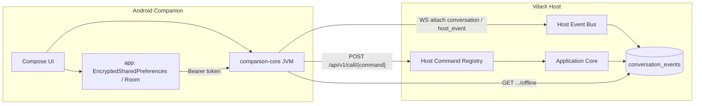
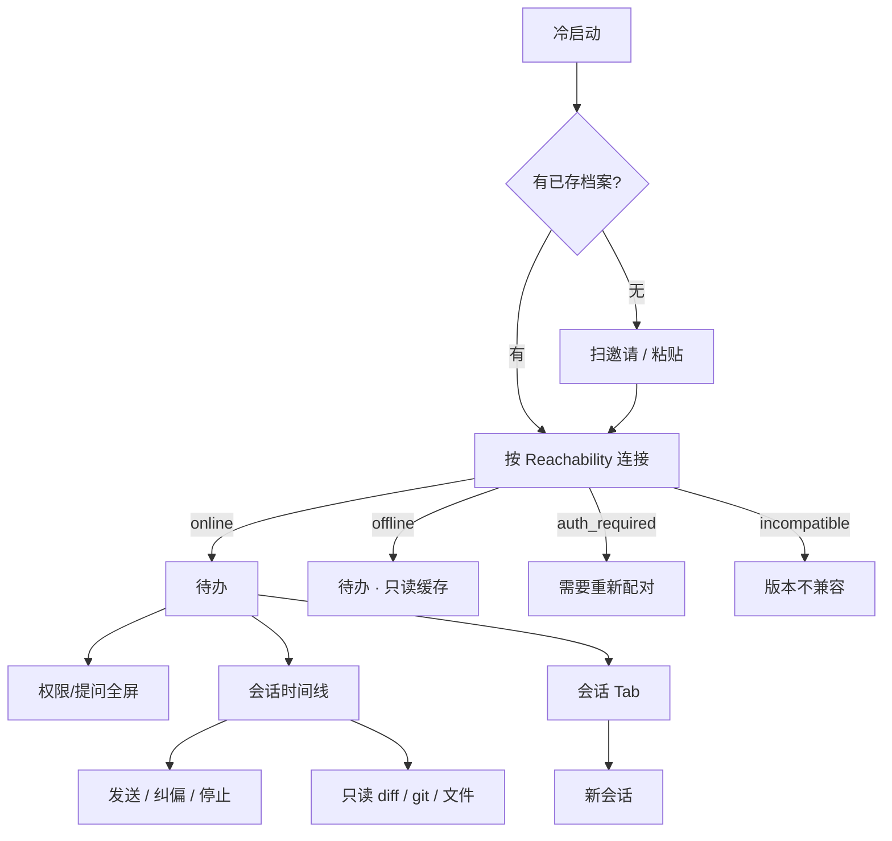
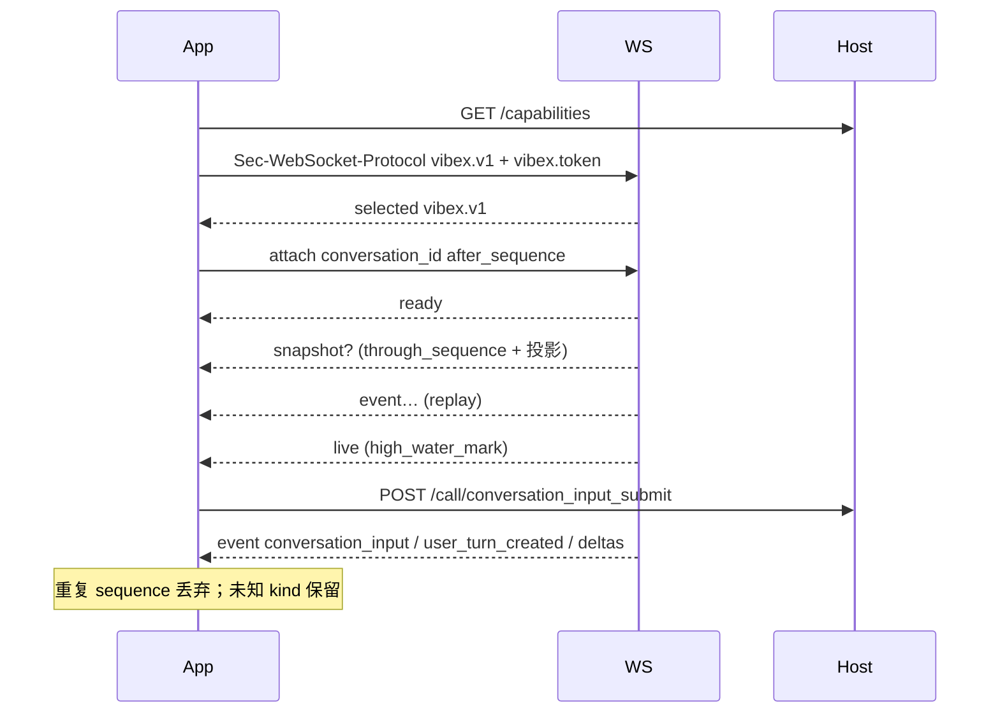

# Android Companion App 大规模优化：对齐新 Host 架构与能力面

| 字段 | 值 |
|---|---|
| 状态 | Draft |
| 日期 | 2026-09-08 |
| 作者 | VibeX maintainers |
| 产品身份 | Mobile companion（伴随端）：观察、沟通、拍板。不是 Workstation。 |
| 首个平台 | Android（`mobile/android`，minSdk 26） |
| 相关 ADR | ADR-0033、ADR-0041、ADR-0044、ADR-0054、ADR-0058、ADR-0059、ADR-0065、ADR-0068、ADR-0071、ADR-0074、ADR-0078 |
| 取代 | `docs/companion/android-frontend.md` 的信息架构（文件夹优先）与「先选项目再同步 3 天会话」路径；视觉语言（Ink / Paper / Signal、Plex、信号条）保留并落到 Material 3 |

---

## Overview

VibeX 已把产品执行面收敛成 **VibeX Host**（桌面或 `vibex-server`）+ 客户端表面。Host Command Registry（ADR-0078）与 Host Event Bus 是唯一产品接缝：Workstation / WebUI 走同一张命令表，capabilities 由注册表派生。Android Companion 仍是薄客户端，不在手机上跑 Agent、Git worktree 或 Plugin。

现状与目标差一整层产品。`mobile/android` 今天只有配对兑换骨架：`companion-core` 能 `POST /api/v1/auth/pairings/redeem` 并拒绝非 Companion scope，Compose `MainActivity` 是两个输入框。Host 侧已经具备会话控制面（排队输入、纠偏、权限/提问、durable attach）、Attention inbox、只读 Artifact、Workflow/Automation 读面、会话目录。这些能力大多已在 Companion preset 里，但手机没有消费；另有一批「日常拍板必需」的命令被错挂在 `application.call` 上，Companion 调了也会 fail-closed。

本文件给出完整、可实施的方案：**待办优先的信息架构、逐屏交互与视觉、能力差距矩阵、Host 侧最小补缝、Android 客户端集成与分 PR 落地**。产品一句话：离开键盘时看清 Agent 在干什么，卡住时拍板。

---

## Background & Motivation

### 当前 Host 架构（已落地）

```text
Android Companion / Workstation / WebUI
        │  Remote Protocol v1
        │  POST /api/v1/call/{command}
        │  GET  /api/v1/ws  (offer: vibex.v1, vibex.token.<base64url>; selected: vibex.v1)
        ▼
Host Command Registry  ──  Application Core
crates/application::RegisteredCommand + DomainCommand
        │
        ├── Conversation / Workflow 用例（Core）
        └── crates/server::host/<domain>.rs（其余产品命令）
                │
                ▼
        Host Event Bus  ──  conversation-events:{id}
                            host_event / patch_stream / conversation attach
```

权威文件：

- 命令名与 scope：`shared/hostCommands.ts`（由 `RegisteredCommand::host_command_names()` 生成）
- 命令实现：`crates/application/src/command.rs`、`crates/application/src/domain.rs`、`crates/server/src/host/`
- 设备预设：`crates/remote-protocol/src/device_auth.rs` `DevicePermissionPreset::companion_scopes()`
- 推送频道：`crates/server/src/host/events.rs` `HOST_EVENT_CHANNELS`
- HTTP：`crates/server/src/runtime.rs`（`/api/v1/call/{command}`、`/ws`、offline、notification-summary、配对/撤销）

### 当前 Android 实现（已核对，不是猜测）

`mobile/android` 不是一个可用的伴随 App，是配对冒烟壳：

| 模块 | 路径 | 实际能力 |
|---|---|---|
| Compose 壳 | `mobile/android/app/src/main/java/dev/vibex/companion/app/MainActivity.kt` | 两个 `OutlinedTextField`（origin + pairing token）+「Pair」按钮。无导航、无主题、无 Keystore、无相机、无会话。 |
| 配对客户端 | `mobile/android/companion-core/.../PairingClient.kt` | `redeem()` → 兑换 + `GET /capabilities`。**不解析** `host_id` / `reachability`。不扫 `vibex-pairing:` 邀请。 |
| Scope 白名单 | `CompanionScopes.kt` | 与 Host `companion_scopes()` 一致。 |
| Origin | `HostOrigin.kt` | 拒绝 URL 内凭证/query/fragment。**仍接受**公网 `http://`（P1 必须补 `origin_allows_plaintext_http`）。 |
| 协议模型 | `docs/protocol/v1/generated/kotlin/RemoteProtocolModels.kt` | companion-core 以 sourceDir 引用；是 compile-smoke fixture，不是完整 Kotlin 客户端。 |
| 测试 | `CompanionScopesTest`、`PairingClientTest`、`CompanionCoreSmoke` | 只覆盖兑换与 scope 拒绝。 |
| Manifest | `AndroidManifest.xml` | 仅 `INTERNET`；`usesCleartextTraffic=true`；`allowBackup=false`。无相机、无前台服务、无通知。 |
| 版本 | `app/build.gradle.kts` | `applicationId=dev.vibex.companion`，minSdk 26，targetSdk 35，versionName `0.1.3`。Material 3 BOM `2024.10.01`。 |

README 写「凭证进 Keystore」——**代码里没有 Keystore**。`parseServerCapabilities()` 丢掉 `host_id` 与 `reachability`，无法按 ADR-0059 合并档案。没有 WebSocket、没有 `POST /call/{command}`、没有离线缓存。

### 旧产品规格与本方案的关系

`docs/companion/android-frontend.md`（2026-08-18）把首页定为「文件夹」，底栏为「项目 / 会话 / 状态 / 设置」，连接后先选项目再同步近 3 天会话。那是对照当时 CodeG Android 的 IA。Host 现在有 `attention_inbox_list`、排队输入、纠偏、会话目录、只读 Artifact 与 Workflow/Automation 读面。手机的峰值时刻是 **Agent 卡住等你拍板**，不是浏览项目树。本方案把 IA 改为待办优先，视觉语言（夜班仪器、Ink/Paper/Signal、Plex、信号条）继承并落到 Material 3。

### 痛点

1. Host 能力面已经统一，Companion 没有接上，用户离开键盘等于失明。
2. ADR-0033 Android P1（多档案、配对、会话、审批、只读 diff/git、离线缓存）几乎全部未做。
3. 若干「拍板/观察」命令挂在 `application.call` 上，Companion 即使用 UI 调了也会 `Forbidden`。
4. 若把 `application.call` 塞进 Companion preset，手机会变成残缺 Workstation，违反 ADR-0054。

---

## Goals & Non-Goals

### Goals

1. 把 Companion 做成可用的「观察 / 沟通 / 拍板」客户端，覆盖 ADR-0033 Android P1。
2. 消费 Host Command Registry 与 Host Event Bus，不另写协议权威。
3. 缺 scope / 缺 capability **fail-closed**，从不假装成功。
4. 原生 Android 体验：Material 3 结构 + VibeX 色/字/间距；不是缩小版 Dockview，不是 iOS 套皮。
5. Host 只做最小补缝：把「会话读模型的一部分」从 `application.call` 挪到已有 `conversation.read`，不开放 Workstation 写面。这会扩大该 scope 的含义（见 Key Decision 3），但 **不** 把新 scope 字符串塞进 Companion preset。

### Non-Goals（P1 明确不做 · PR 审查清单）

下列条目是每一条 Companion / Host-fix PR 的拒绝条件。任一 PR 若引入下列能力，直接打回：

- iOS、KMP UI、在设备上跑 Agent / Git / Plugin。
- 把桌面三栏、Dockview、Host console（监听、token、设备管理、升级）搬到手机。
- 插件写入、Workflow/Automation 写入、终端 PTY、Git 写、文件编辑。
- 把 `application.call`、`device.revoke`、`plugin.write`、`workflow.write|run|approve`、`automation.write` 放进 Companion preset 或客户端 allowlist。
- FCM / APNs / 云中继。
- 无工作区会话（**已决隐藏**，直到 Host catalog 显式 `workspaceLessAvailable`）。
- 跨设备 Composer 草稿同步（**已决 P1 不做**；本机 DataStore 扛进程被杀；P2 再走 scratch revision）。
- `workflow.approve` 进入 Companion preset 或手机批准 Workflow 步骤（**已决 P1 不做**）。
- 管理其它设备（list/revoke others）。
- 离线排队写。

---

## Key Decisions

1. **待办优先，而不是会话优先或文件夹优先。** Companion 的峰值是权限/提问/失败/中断。底栏三处：待办 / 会话 / 我的。项目过滤放在会话顶栏，不单独占一栏。
2. **同一时刻只绑定一台 Host**（Server-bound window 的手机等价物）。顶栏 Host 芯片切换档案；不在同一屏混两个 Host 的会话。
3. **不把 `application.call` 放进 Companion preset。** Attention、只读文件/diff/git 挂到已有 `conversation.read`。这 **不是** 新 preset 字符串（ADR-0054「新增 scope 不得自动进入旧预设」仍成立），但 **是** `conversation.read` 含义的扩大：已配对 Companion token 在 Host 升级后、无需重新配对，即可拉 inbox 与任意 catalog `workspaceId` 的只读文件/git。授权半径见 Alternatives「Host-fix 分叉」。不采用新 `workspace.read` / `attention.read`（那会迫使所有已配对手机重新配对）。
4. **写操作只有在线。** 离线缓存 `read_only: true`，禁止离线排队写（CONTEXT.md Offline conversation cache）。
5. **发送一律走 `conversation_input_submit`。** payload 必须带会话的 `agentId` 与 `workspaceId`（从 `conversation_detail.summary` 读取）。不在客户端判断空闲再选 `start_turn`。纠偏是独立按钮，失败不得降级成排队（ADR-0044）。P1 不发 `images[]`。
6. **权限/提问是全屏决策面，不是时间线里的小卡片。** Inbox 阻塞项嵌入完整 `ConversationPermissionView` / `ConversationQuestionRequest`（含 `options` / `details` / `schema`），从会话投影或事件日志读取，**不只** `ConversationRuntimeState` 的 id。点待办 → 全屏 → `respond` **不再二次拉取**。权限 `response` 是 `AgentPermissionResponse`；提问 `response` 是 `AgentElicitationResponse` `{ action: "accept", content: { answer } }`。Back 不发请求。客户端用 `conversationId`（=`sessionId`）。
7. **Material 3 管结构，VibeX token 管品牌。** NavigationBar、Scaffold、Predictive Back、48dp 触控。不用 Dynamic Color 的系统紫，不用整页玻璃。
8. **Kotlin 协议模型只从 `docs/protocol/v1` 生成。** Companion 命令 allowlist **只有** `shared/companionHostCommands.ts`（`export const COMPANION_HOST_COMMANDS`）∩ 生成的 `shared/hostCommands.ts`。`pnpm run generate-companion-commands` 写出 `HostCommands.kt`。CI 检查 subset。没有第二份 JSON allowlist。**禁止**解析本中文设计文档。禁止手写第二份协议 schema（ADR-0041）。
9. **Workflow/Automation 只观察，且不进入待办空态。** 写入/运行/审批 P1 不开放。**已决：`workflow.approve` 不进 Companion preset**，不改 ADR-0054。待办只展示「有一个工作流在等电脑上的批准」。
10. **Forget 可达时撤销的是本设备，不是 `device.revoke` 管理权。** Host 允许已配对设备 `DELETE` **自己的** `device_id`；列出或撤销其它设备仍 Forbidden。Companion preset **不加** `device.revoke`。
11. **无相机配对必须同时有 origin 与一次性码。** 8 位连接码单独不够兑换。完整 `vibex-pairing:` 原文是另一条一次到位路径。
12. **旧规格 `docs/companion/android-frontend.md` 的四栏 IA 作废；事件折叠继续以 `docs/companion/host-events.md` 为准，但 WS 握手以本文件 + `crates/server/src/ws.rs` 为准。**
13. **`@` 面板 P1 含提交 Tab。** 文件 / 会话 / 提交 / 指令。提交列表走新 Core 命令 `conversation_workspace_git_log`（`conversation.read`，只要 `workspaceId`）。token 与桌面相同：`[shortSha](vibex://commit/<encodeURIComponent(repoId)>@<sha>)`（ADR-0065）。**已决：无工作区入口隐藏；跨设备草稿 P1 不做。**

---

## Proposed Design

### 产品对象与一句话

- 对象：离开键盘的 Host 主人。
- 一句话：看清 Agent 在本机干什么，卡住时拍板。
- 不是：缩小版 VibeX 桌面，也不是远程 IDE。

### 系统拓扑



---

## Capability Gap Matrix

图例：

- **Proposed**：`ship` 手机要实现；`observe-only` 只读呈现、无写控件；`hide` 不出现入口；`expand-scope` 本方案不采用（`workflow.approve` 已决否）；`host-fix` 命令已存在但 scope 挂错，或需新增 `conversation.read` 只读命令。
- Android today：以 `mobile/android` **源码**为准，不是 README 宣称。

### A. 配对、身份、连接

| Capability | Host command / 协议 | Companion scope today | Android app today | Proposed | Why | Primary mobile surface |
|---|---|---|---|---|---|---|
| 兑换配对 | `POST /api/v1/auth/pairings/redeem` | 兑换后得到 companion scopes | 手填 origin+token，无 QR | **ship** | P1 入口 | 开屏 / 扫码 |
| 邀请 payload | `PairingInvitationPayload` `vibex-pairing:` | n/a | **未解析** | **ship** | ADR-0059 扫一次即连 | 扫码 / 粘贴 |
| 8 位连接码 | `connection_code` / `is_connection_code` | n/a | **无** | **ship（必须同时有 origin）** | 无相机退路；码单独不能 redeem | 手动配对两栏 |
| 公网明文 HTTP | `origin_allows_plaintext_http` | n/a | `HostOrigin.parse` **接受** `http://203.0.113.10` | **ship** | 邀请已过滤；粘贴 origin 必须再拒 | 连接层 |
| Capabilities | `GET /api/v1/capabilities` | Bearer | 调了但丢掉 `host_id`/`reachability` | **ship** | 协商 + 档案合并 | 连接层 |
| 多 Reachability | `ServerCapabilities.reachability` | n/a | **无** | **ship** | 上次成功 → HTTPS → 其余 | 连接层 / Host 详情 |
| 多 Server Profile | 客户端本地 | n/a | **无** | **ship** | ADR-0033 | Host 芯片 / 我的 |
| Disconnect | 关 WS，保留档案 | n/a | **无** | **ship** | 不可与 Forget 混 | Host 详情 |
| Forget server | 本地删档案 + 可达时 `DELETE /api/v1/auth/devices/{id}` | 今日 Host 要求 `device.revoke` → Companion **403** | **无** | **host-fix → ship** | 自撤销本 `device_id`，preset **不加** `device.revoke` | Host 详情 |
| 管理其它设备 | `device.revoke` / `list_devices` | **无**（正确） | 无 | **hide** | Host console | — |
| 监听 / token / 升级 | 桌面壳 / `desktop.tauri` | **无** | 无 | **hide** | Host console | — |

### B. 会话控制面（ADR-0044）— 已在 Companion scope，App 未接

| Capability | Host command / event | Companion scope today | Android app today | Proposed | Why | Primary mobile surface |
|---|---|---|---|---|---|---|
| 会话目录 | `conversation_catalog` | `conversation.read` | **无** | **ship** | 选 Project/Workspace/Agent 不必 `application.call`（host-events §6） | 新会话 sheet |
| 近 N 天列表 | `conversation_list_recent` | `conversation.read` | **无** | **ship** | 默认 3 天 | 会话 Tab |
| 按工作区列表 | `conversation_list` | `conversation.read` | **无** | **ship** | 过滤 | 会话 Tab |
| 搜索 | `conversation_search` | `conversation.read` | **无** | **ship** | P1 | 会话顶栏 |
| 时间线页 | `conversation_timeline_page` / `conversation_detail` / `conversation_events_since` | `conversation.read` | **无** | **ship** | 首屏分页 + 增量 | 时间线 |
| Durable attach | WS `resource: conversation`（live）；HTTP `conversation_attach` 仅 conversation/workflow_run 快照 | `conversation.attach` | **无** | **ship** | live 与 `companion-attention` 只走 WS | 连接层 |
| 离线缓存 | `GET /api/v1/conversations/{id}/offline` | `offline.read` | **无** | **ship** | 只读 | 离线浏览 |
| 终态摘要 | `GET .../notification-summary` | `notification.summary` | **无** | **ship** | 本地通知，无 FCM | 前台服务 |
| 新建会话 | `conversation_create` | `conversation.write` | **无** | **ship** | 需 `workspace_id` + `agent_id` | 新会话 |
| 发送/排队 | `conversation_input_submit` `{ request: { conversationId, payload } }` | `conversation.write` | **无** | **ship** | payload **必填** `agentId`+`workspaceId`+`text`；P1 不发 `images` | Composer |
| 列出/改/取消排队 | `conversation_input_list` / `_update` / `_reorder` / `_cancel` | read / write | **无** | **ship** | 跨设备可见；写命令包在 `{ request }` | Composer 队列条 |
| 纠偏 | `conversation_steer` `{ request }` | `conversation.steer` | **无** | **ship** | 必须带 `expectedTurnId` | Composer 次按钮 |
| 取消在途 | `conversation_cancel_turn` `{ request: { conversationId, reason? } }` | `conversation.cancel` | **无** | **ship** + **host-fix 可选 expectedTurnId** | 今日 Host 无 expectedTurnId；Companion 有则带上 | 停止 |
| 权限 | `conversation_respond_permission` `{ request }` | `conversation.permission` | **无** | **ship** | `response` 是 `AgentPermissionResponse`，不是 boolean | 权限全屏 |
| 提问 | `conversation_respond_question` `{ request }` | `conversation.question` | **无** | **ship** | `response` = `AgentElicitationResponse`；P1 `{ action: "accept", content: { answer } }`；空 options / 有 schema → 「到电脑上回答」；Back 不发 | 提问全屏 |
| 反馈 | `conversation_submit_feedback` / `_list_feedback` | 注册表 **write** / Core **steer** | **无** | **ship** + **host-fix** | 对齐注册表为 `conversation.steer`；Companion 两 scope 都有 | 时间线（Agent 发出才显示） |
| 取消/重试 | 取消走 cancel；重试 = 新 `submit`，**禁止自动重发 Interrupted** | write | **无** | **ship** | ADR-0001 / 0071 | 时间线终态条 |
| 归档/置顶/删/改名/四态 | `conversation_archive` / `_set_pinned` / `_delete` / `_rename` / `_set_status` | `conversation.write` | **无** | **ship** | 列表长按 | 会话列表 |
| 模式/配置 | `conversation_set_session_mode` / `_set_session_config_option` | `conversation.write` | **无** | **ship** | 有协议事实才显示（ADR-0058） | Composer 摘要 sheet |
| 斜杠命令 | `conversation_slash_commands` | 注册表误标 **write**；Core 查 **read** | **无** | **ship** + **host-fix** | 对齐为 `conversation.read` | Composer `/` |
| 工作区文件条目 | `conversation_workspace_entries` | 同上，注册表 write / Core read | **无** | **ship** + **host-fix** | `@` 文件 Tab | 引用 sheet |
| 父子关系 | `conversation_relation_list` | `conversation.read` | **无** | **ship** | 子会话卡，不合并历史 | 时间线 |
| 分叉 | `conversation_fork` | `conversation.write` | **无** | **hide**（P1） | 桌面才完整；手机易误触 | — |
| 子会话创建 | `conversation_child_create` | `conversation.write` | **无** | **hide**（P1） | 委派由 Host/Agent 创建；手机只读 child | — |
| 截断/重绑 | `conversation_truncate_to_turn` / `_rebind_session` | write | **无** | **hide**（P1） | 破坏性，桌面确认流 | 时间线只给「Host 上处理」 |
| 导出 | `conversation_export_*` | read | **无** | **hide**（P1） | 非拍板路径；**不进 allowlist** | — |
| 创建 Workspace | `conversation_workspace_create` | **write**（过宽） | **无** | **hide** | 会造 worktree；Companion 不建工作区 | — |
| 启动 Turn（旧） | `conversation_start_turn` | write | **无** | **hide** | 被 `submit` 取代，避免竞态 | — |
| `&` Agent mention | 无 catalog 标志 | n/a | **无** | **P1 hide**，除非当前会话 `delegation_mcp_delivered` 或 `prompt_capabilities_updated` 给出事实 | catalog 没有协同插件位 | Composer |

### C. Attention、观察面 — 部分 scope 错挂

| Capability | Host command / event | Companion scope today | Android app today | Proposed | Why | Primary mobile surface |
|---|---|---|---|---|---|---|
| Attention inbox | `attention_inbox_list` | **`application.call`** | **无** | **host-fix → ship** | scope→`conversation.read`；阻塞项嵌入完整 `ConversationPermissionView` / `ConversationQuestionRequest`（投影，不只 runtime id） | **待办 Tab（首页）** |
| Attention 推送 | HostEvent `desktop-session-attention` | **`application.call`** | **无** | **host-fix** | 新增 `companion-attention`，scope=`conversation.read`，**仅 WS** `host_event` | 待办角标 |
| Artifact 列表 | `artifact_list` | `artifact.read` | **无** | **ship** | 只读产物 | 时间线 / 产物页 |
| Artifact 预览租约 | `artifact_open_preview` 等 | **`artifact.preview` 不在 Companion** | **无** | **hide**（P1） | 租约/proxy 是 Workstation；手机用只读文件内容 | — |
| 只读文件内容 / git status / diff | 现有 `read_file_content` / `get_workspace_git_status` / `get_workspace_file_diffs` 是 `application.call`，且 git status 还要 `repo_id` | **不可用** | **无** | **host-fix → ship** | 新命令只要 `workspaceId`（catalog 无 `repoId`）。DTO 对齐 `DetailedGitStatus` / `GitFileDiffEntry`。**不**复用 `get_workspace_git_status`。路径沙箱见 Host-fix | 变更 sheet |
| `@` 提交引用 | `get_workspace_git_log` / `get_repo_git_log` 均为 `application.call` 且要 `repo_id`；`conversation_catalog` 工作区只有 `id/projectId/name/branch` | **不可用** | **无** | **host-fix → ship（P1）** | 新 Core 命令 `conversation_workspace_git_log(workspaceId)`，Host 解析主键 `repoId`。token 用桌面 `vibex://commit/<repoId>@<sha>` | Composer `@` 提交 Tab |
| 文件变更摘要 | event `file_change_summary_updated` | attach | **无** | **ship** | 时间线「N 个文件」，点开再拉只读 diff | 时间线 |
| Workflow 列表/步骤/事件 | `workflow_list` / `_show` / `_steps` / `_events` / `_versions` | `workflow.read` | **无** | **observe-only** | 已有 scope；不给运行/暂停/发布 | 待办「运行」分组 |
| Workflow 写/跑/批 | `workflow_publish` / `_start` / `_decide` 等 | **无 write/run/approve** | 无 | **hide** | **已决**：`workflow.approve` 不进 Companion。待办文案「有一个工作流在等电脑上的批准」 | — |
| Automation 列表/运行/引擎 | `automation_list` / `_runs` / `_engine_status` / `_unseen_failures` / `_preview_next_runs` | `automation.read` | **无** | **observe-only** | 失败进待办 | 待办 |
| Automation 写 | `automation_create` / `_run_now` / `_cancel_run` 等 | **无** | 无 | **hide** | ADR-0054 | — |
| Delegation 读 | `conversation_relation_list` + `delegation.read` | `delegation.read` | **无** | **observe-only** | 子会话卡 | 时间线 |
| Delegation 取消 | `delegation_cancel` | **无 `delegation.cancel`** | 无 | **hide** | 用会话 `cancel` 即可 | — |
| Plugin 目录 | `plugin_control_catalog` 等 | **无 `plugin.read`** | 无 | **hide** | 非拍板路径；不 expand | — |
| Chat channel | `list_chat_channels` 等 | **`application.call`** | 无 | **hide** | Host 配置面 | — |
| Agent 安装/登录/供应商 | `agent_management_*` / `agent_auth_mode_set` 等 | **`application.call`** | 无 | **hide** | 目录里 `usable=false` 时文案「到电脑上登录」 | 新会话 Agent 行 |
| 用量报表 | `get_project_usage_statistics` | **`application.call`** | 无 | **hide** | ADR-0075 桌面 Kanban；手机只用会话内 `usage_updated`（缺失保持缺失） | Composer 用量环 |
| 终端 | `create_terminal` / `attach_terminal` / `terminal-output` | **无**；事件 `terminal_updated` 可经 attach 到达 | 无 | **observe-only 摘要** | 无 PTY | 工具行「命令已运行」 |
| Git 写 / 文件写 / PR | `commit_*` / `push_*` / `save_file_content` 等 | **无** | 无 | **hide** | Workstation | — |

### D. 会话辅助诚实性（ADR-0058）

| Capability | 事实来源 | Android today | Proposed |
|---|---|---|---|
| 用量环 | `usage_updated` 的 `context_used` / `context_window_max` | 无 | 有窗口才显示比值；分项 token 未提供则不显示「0」 |
| Plan | `plan_updated` 的 status/priority | 无 | 整块替换；禁止一律 pending |
| Goal | 用户 `/goal` 命令，不是助手文本 | 无 | 有则 chip，无则不画 |
| Compact | 用户 `/compact` + Turn 终态 | 无 | 不匹配本地化文案 |
| 草稿 | scratch revision | 无 | P1 不跨设备同步草稿；进程被杀用本机 DataStore，提交成功再清 |
| 查找 | 当前时间线可见文本 | 无 | 会话内查找（P1 可做）；不是全局 FTS |
| SessionConfigStale | 事件 | 无 | 通知「默认未生效」，不假装已应用 |
| 未知 event kind | `RemoteEvent.kind` 开放字符串 | 无 | 占位「Host 更新了此会话」，payload 进缓存，attach 不得失败 |

---

## Product IA and User Journeys

### 顶层导航（3 个，不多于 5）

```text
┌─────────────────────────────────┐
│ 信号条：在线 · 书房的 Mac       │  ← Host 芯片，点开切换
├─────────────────────────────────┤
│                                 │
│           当前 Tab 内容          │
│                                 │
├─────────────────────────────────┤
│  待办 ●    会话      我的        │  ← NavigationBar
└─────────────────────────────────┘
```

| Tab | 职责 | 为何在底栏 |
|---|---|---|
| **待办**（默认启动） | Attention 分组见下表。Workflow/Automation「运行」是 PR 11 观察面，**不参与**空态判断 | 峰值路径；角标 = `blockingCount`（仅权限+提问） |
| **会话** | 列表、搜索、项目过滤、新会话 | 沟通路径 |
| **我的** | 本机 Host 档案、连接、持续监控、外观、关于。**不是** Host console | 低频、危险操作（忘记）放这里 |

不采用第四栏「文件夹」：项目是过滤器，不是目的地。不采用「状态」四列 Kanban：手机宽度撑不起四栏，四态是会话行上的 chip，待检查（`IN_REVIEW`）进入待办「需要跟进」。

### 待办分组 ↔ `AttentionItemKind`

Host 种类（`src-tauri/src/commands/attention.rs` / `host/product.rs`）：`PENDING_PERMISSION`、`PENDING_QUESTION`、`SESSION_NOTICE`、`TURN_FAILED`、`TURN_INTERRUPTED`、`TURN_COMPLETED`、`IN_REVIEW`，优先级 0–6。`blockingCount` 只计权限+提问（角标），**不是**列表过滤器。

| `AttentionItemKind` | 手机分组 | P1 |
|---|---|---|
| `PENDING_PERMISSION` | 需要你处理 | 显示；点开全屏权限 |
| `PENDING_QUESTION` | 需要你处理 | 显示；点开全屏提问 |
| `SESSION_NOTICE` | 需要跟进 | 显示 |
| `TURN_FAILED` | 需要跟进 | 显示 |
| `TURN_INTERRUPTED` | 需要跟进 | 显示 |
| `IN_REVIEW` | 需要跟进 | 显示（待检查） |
| `TURN_COMPLETED` | — | **丢弃**。完成不是待办；留下会让「此刻没有需要处理的事」几乎永不出现 |

空态「此刻没有需要处理的事」= 上表显示种类为空。Workflow/Automation 观察列表即使非空，也不阻止该空态；「运行」分组只在 PR 11 且该列表非空时出现。

### 为何待办优先

离开键盘打开 App 的原因几乎总是：通知、担心 Agent 卡住、出门前看一眼。会话优先适合聊天工具；Companion 不是聊天工具。待办为空时，首页自己变成「此刻安静」+ 最近 3 条会话入口，不逼用户空点第二栏。

### 多 Host

- 一个前台连接 = 一个 Server Profile（Host 身份，不是 URL）。
- 顶栏芯片显示档案名与连接态。点芯片 → Host 切换 sheet（列表 + 添加）。
- 切换 = disconnect 当前 WS，连另一档案；会话栈清空，避免跨 Host 资源混用。
- 后台不保持多 Host 同时 live attach（省电）。未选中的档案只在用户打开「持续监控」时轮询 **当前** Host 的 notification-summary。

### 主路径



### 关键旅程（用户可见规则）

1. **第一次配对：** 开屏 → 扫描连接二维码（完整 `vibex-pairing:`，含 Reachability）→ 兑换 → 待办。无相机：粘贴完整邀请原文，**或** origin + 8 位连接码两栏。禁止只填 8 位码。禁止「管理员 token」栏。
2. **已持有该 Host 身份再扫：** 只合并 Reachability，文案「已更新地址」，不建第二档案。
3. **拍板权限：** 通知或待办行 → 全屏权限 → 允许/拒绝 → 回到时间线，桌面同一请求消失（先到生效）。
4. **继续会话：** 会话 Tab 或待办行进入时间线 → Composer 发送。有在途 Turn 时发送变为排队，队列条可见、可改、可删。纠偏是明确的第二动作。
5. **只读看变更：** 时间线「N 个文件」→ 变更 sheet（git 状态 + diff hunk）。没有提交按钮。
6. **离线：** 信号条「离线 · 上次同步 14:12」。待办/会话/时间线读缓存。Composer 禁用。恢复后 durable replay，不丢、不双份。
7. **忘记：** 我的 → Host → 忘记这台 Host。可达则先撤销本设备；不可达则说明「电脑上的信任可能还在」。

### 拇指区

- 底栏三处、Composer 发送/停止、权限页两个主按钮：全部在屏幕下三分之一。
- FAB「新会话」只出现在会话 Tab，且仅 `online`。
- 权限全屏的允许/拒绝固定在底部，不放在滚动内容里。

---

## Visual System（原生 Android，VibeX 气质）

场景：夜间或通勤看一台正在跑的机器。冷静、不透明内容、信号清楚。不是米白衬线，不是黑底酸绿，不是报纸细线，不是 Material 默认紫。

### 60 / 30 / 10

| 角色 | 日间 | 夜间 | 占比 |
|---|---|---|---|
| 底（60%） | Paper `#EEF1F6`（对齐桌面 `--shell-bg` `#eef1f5`） | Ink `#12161C`（对齐 `--dark-shell-bg` `#10151c`） | 60% |
| 墨/结构（30%） | Text strong `#1D2530`、正文 `#46505B`、次要 `#727B85` | `#E7EBEF` / `#C5CDD6` / `#8B949E` | 30% |
| 信号（10%） | Signal `#171717`（桌面 primary） | 同；夜间按钮填 Signal、字反白 | 10% |

语义色不进 10% 装饰：Hold `#D48A2A`（待你处理）、Stop `#C43C3C`（失败/中断/撤销）、Quiet 轨道 `#6B7380`。成功不铺绿，完成态用 Quiet。

内容层始终不透明：Card `#F3F4F5` / 夜间 `#343B45`。Sheet `#E6E7E9` / `#2A3038`。Liquid Glass **只**用于信号条与底栏的轻微饱和，不做整页 blur（impeccable 禁装饰性玻璃；DESIGN.md 玻璃只在 chrome）。

### 8pt 网格

4 / 8 / 12 / 16 / 24 / 32 / 48。屏幕左右 16dp。卡片内边距 16dp。列表行最小高度 64dp（含 48dp 触控）。FAB / 底栏图标 24dp，触控 48dp。圆角 14dp（对齐 `--radius`），底栏与 sheet 例外：sheet 顶角 28dp（Material 3 大 sheet），pill 999dp。

### 字体（Material type roles，不是手选 px）

品牌脸 **IBM Plex Sans**；序列 / origin / agent id **IBM Plex Mono**。CJK：`Noto Sans SC`。三种字体作为 `res/font` 打进 APK（PR 3）；桌面只有 Plex Mono 模块，不能直接复用。不要 Roboto 当品牌脸；未捆绑前的系统回退仅限开发。

| Role | Size / Line | Weight | 用途 |
|---|---|---|---|
| Headline Small | 22 / 28 | Semibold | 开屏、空状态标题 |
| Title Large | 17 / 24 | Semibold | 页标题 |
| Body Large | 15 / 22 | Regular | 正文、气泡 |
| Body Medium | 14 / 20 | Regular | 列表第二行 |
| Label Large | 13 / 18 | Medium | 底栏、chip、按钮 |
| Mono | 12 / 18 | Regular | origin、sha、sequence 诊断（用户不可见的不展示） |

`sp` 跟随系统字号。对比：正文 vs 底 ≥ 4.5:1。

### Compose 主题映射

```kotlin
// 建议文件：mobile/android/app/.../ui/theme/VibexTheme.kt
darkColorScheme(
    primary = Color(0xFF171717),
    onPrimary = Color(0xFFFFFFFF),
    surface = Color(0xFF12161C),          // Ink
    onSurface = Color(0xFFE7EBEF),
    surfaceVariant = Color(0xFF343B45),   // Card
    onSurfaceVariant = Color(0xFFC5CDD6),
    secondary = Color(0xFFD48A2A),        // Hold，仅待办
    error = Color(0xFFC43C3C),
    outline = Color(0x1AFFFFFF),
)
lightColorScheme(
    primary = Color(0xFF171717),
    onPrimary = Color(0xFFFFFFFF),
    surface = Color(0xFFEEF1F6),          // Paper
    onSurface = Color(0xFF1D2530),
    surfaceVariant = Color(0xFFF3F4F5),
    onSurfaceVariant = Color(0xFF46505B),
    secondary = Color(0xFFD48A2A),
    error = Color(0xFFC43C3C),
    outline = Color(0x0F0B1628),
)
```

`dynamicColor = false`。跟随 `uiMode` 日夜间。Reduce motion：`LocalAccessibilityManager` / 系统「去掉动画」→ 信号条呼吸与行插入改为瞬切。

签名元素：**信号条 + 待办行左侧 3dp 色轨**（Hold / Stop / Signal / Quiet）。不是聊天壁纸，不是桌面时间线 gutter 的缩小版。

### 动效

- 标准：120–180ms 状态，200–260ms 表面；easing `cubic-bezier(0.22, 1, 0.36, 1)`。
- 只强调两处：信号条 recovering 呼吸（2.4s）；新时间线行 fade+4dp 上移 120ms。
- 权限页进入：shared-axis Y（Material）。Predictive Back 必须可用。
- 禁止：全页粒子、骨架屏闪烁循环、弹跳、弹性。

---

## Screen-by-screen UI

以下文案为中文产品句；i18n 英文本地化后续用同一 key，不在 P1 做第二语言。专有名 VibeX、Host、Agent 不译。不用 webhook、scope、sequence、bind、JSON。

通用状态（每屏都要有，不重复写实现注释）：

| 状态 | 表现 |
|---|---|
| loading | 内容区 3–5 条静态占位块（不循环闪），信号条保持连接态 |
| empty | 一句事实 + 一个动作 |
| error | 一句原因 + 「重试」；不道歉 |
| offline | 顶栏已说明；写控件 `enabled=false`，不隐藏 |
| missing scope | 该块不画，或画「此 Host 未提供」；禁止假成功 |
| disconnected | 同 offline |
| incompatible | 全屏阻断：「需要更新 Companion」或「电脑上的 VibeX 过旧」 |
| auth_required | 「需要重新配对」+ 主按钮 |

### 1. 开屏

- 目的：冷启动品牌瞬间。
- 层级：墨底 + 标记，无口号。
- 布局：全屏 `Box`，居中 64dp 标记。约 0.8s 或直到档案读完，取较长者，上限 1.2s。系统关动画则瞬切。
- 无障碍：标记 contentDescription「VibeX」。

### 2. 未配对（Onboarding）

目的：连上你的 Host。主按钮在拇指区。

```text
┌─────────────────────────────────┐
│                                 │
│            [标记]               │
│         连接到你的 VibeX         │
│                                 │
│  打开电脑上的 VibeX → 设置 →     │
│  远程连接 → 生成连接码           │
│                                 │
│  ┌───────────────────────────┐  │
│  │     扫描连接二维码         │  │  filled, 48dp
│  └───────────────────────────┘  │
│        手动输入连接码            │  text button
└─────────────────────────────────┘
```

- 不要功能卖点列表。不要图标下再写一遍 VibeX。
- 相机权限：只在点扫描时请求。拒绝 → 自动去手动，不弹第二次。
- 空：就是本屏。错误：见扫描/手动。

### 3. 扫描 / 手动配对

**扫描**

- `CameraX` + **ZXing**（不选 ML Kit：避免 Play Services，本地优先）。只认 `vibex-pairing:` 前缀。
- 无效码：「这不是 VibeX 邀请」。
- 过期：「邀请已过期。请在电脑上再出示。」
- scope 超出 Companion：「这台邀请给的是工作站权限。请在电脑上选择伴随设备。」（`CompanionScopes.extras`）
- 兑换中：按钮变进度，码仍可对但忽略第二次快门。

**手动（无相机）**

桌面 Workstation 是在 **已发现、已有 origin 的 Host 行上** 输入 8 位码。手机 P1 **没有** mDNS 发现，因此 8 位码不能单独兑换（`POST {origin}/api/v1/auth/pairings/redeem`）。

默认展开两栏，不是折叠退路：

1. **Host 地址**（origin，https 或私网 http）
2. **连接码**（8 位，`CONNECTION_CODE_ALPHABET`）

另提供「粘贴完整邀请」：一次贴上 `vibex-pairing:` 原文（含 Reachability + token），等价于扫码。

- 无「管理员 token」。
- 已持有该 `host_id`：合并 Reachability，「已更新地址」。
- 公网 `http://` origin：拒绝发送 Bearer，「请使用 https 或局域网地址。」（companion-core 移植 `origin_allows_plaintext_http`）

**连接试探**

- 顺序：上次成功 origin → `kind=published` 且 HTTPS → 其余非 loopback。`127.0.0.1` 永不来自邀请（ADR-0059）。
- 全部失败：列出每个 origin 一句结果。主按钮「再扫描邀请」，次按钮「打开电脑上的 Host」（无法远程打开，文案到此为止，不假装 deep link 到桌面）。

### 4. 待办（首页）— 最重要屏幕之一

目的：处理现在挡着 Agent 的事。主动作：点进权限/提问。

```text
┌─────────────────────────────────┐
│ ● 在线 · 书房的 Mac          2  │  信号条；右侧 blockingCount
├─────────────────────────────────┤
│ 需要你处理                      │
│ ┃ 允许读 src/main.rs            │  Hold 轨
│   Codex · 网站改版 · 刚刚       │
│ ┃ Agent 在问：用哪套配色？      │
│   Claude · 营销页 · 2 分钟前    │
│                                 │
│ 需要跟进                        │
│ ┃ 这一轮失败                    │  Stop 轨
│   Codex · API · 10 分钟前       │
│ ┃ 已中断 · 不会自动重试         │
│   Claude · 重构 · 昨天          │
│ ┃ 待检查                        │  IN_REVIEW
│   Codex · 登录 · 昨天           │
└─────────────────────────────────┘
│  待办●    会话      我的        │
```

- 视觉：分组标题 13/18 Quiet；行 64dp+；第一行是用户要做的事（权限标题/问题标题/失败），第二行 `Agent · 项目 · 相对时间`。
- 数据：`attention_inbox_list`（Host-fix 后）。Host 排序保留，但客户端 **丢掉 `TURN_COMPLETED`**。不在手机重排其余种类。
- Inbox 项合同（PR 1a）。Host **必须**从会话投影 / 事件日志折叠 pending 权限与提问（`ConversationEvent::PermissionRequested` → `ConversationPermissionView`；`QuestionRequested` → `ConversationQuestionRequest`），**不要**只抄 `ConversationRuntimeState.pending_permission_id`（那里没有 `options`）。

顶层 inbox 项保持今日 `attention_item()` 的 **camelCase**。嵌套 `permission` / `question` **原样嵌入**现有 Rust 类型，**没有** `rename_all = "camelCase"`，因此嵌套键是 **snake_case**（与 `shared/types.ts` 一致）。Kotlin 不得把两种风格混读。

```text
// 顶层 camelCase
kind, conversationId, sessionId, workspaceId, projectId, projectName,
sessionName, agentType, detail, happenedAtMs,
permission?,                       // ConversationPermissionView 原样 JSON
question?                          // ConversationQuestionRequest 原样 JSON

// permission（snake_case）
permission_id, title, status, details?, options[]
  options[]: { id, label, kind, description? }

// question（snake_case）
question_id, prompt, options[], schema?, asked_at?
```

**没有**单独的 `resource` 字符串。列表第一行用 `permission.title` 或 `question.prompt`；全屏用 `title` + `details`（与桌面 `PermissionRequestCard` 相同），提问用 `prompt` + `options[]`。
命令请求仍是 camelCase：`permissionId` = `permission.permission_id`，`questionId` = `question.question_id`。

点待办 **不经过时间线路由、不二次 GET/attach**：inbox JSON 已够映射 `AgentPermissionResponse.option_id` 并 `respond`。成功后再进入时间线看结果。旧 Host 缺 `permission`/`question` 对象：「到电脑上处理。」（P1 不靠「先 attach 再决定」补全峰值路径；那会违反 Key Decision 6。）
- 「运行」分组：**不在本屏 P1 数据里。** PR 11 才拉 `automation_unseen_failures` / 非终态 `workflow_list`；列表空则不画该分组，也不影响上面的空态。
- 空：「此刻没有需要处理的事。」= 过滤后的 Attention 种类为空。次行：「最近的会话」三条。无插画。
- 下拉刷新：重拉 inbox。offline：标题旁「只读」，行仍可进缓存时间线。
- TalkBack：行「需要允许。读 src/main.rs。Codex。网站改版。」

### 5. 会话列表

目的：找到并打开会话；online 时新建。

```text
┌─────────────────────────────────┐
│ 会话                    [Host]  │
│ ┌────────────┐ 近 3 天 ▾  全部▾ │  搜索 + 窗口 + 项目
│ │ 搜索会话    │                 │
│ └────────────┘                  │
│ 今天                            │
│  ● 修复登录超时                 │  状态点 + 标题
│    Codex · 进行中 · 12:40       │
│  ● 配色方案                     │
│    Claude · 待检查 · 11:02      │
│ 昨天                            │
│  …                              │
│                            ＋   │  FAB 仅 online
└─────────────────────────────────┘
```

- 命令：`conversation_list_recent`（`sinceDays=3|7|30`，可选 `projectId`）；搜索走 `conversation_search`。
- 行：标题（无标题则「未命名」）、Agent 显示名（catalog 有则用，无则缺失，**不**造字母头像）、四态 chip、相对时间。置顶段在「今天」之前。
- 长按：置顶 / 归档 / 删除（删除需确认 sheet：「删除后无法从这台手机恢复。」）。
- 空 + online：「还没有会话」+ FAB 含义已足够，不重复按钮。
- 空 + 未选项目：不要「先选择文件夹」。项目过滤默认「全部」。
- 空 + offline：「上次同步 · 只读」。
- 左滑归档仅作为长按的加速，须有 Undo Snackbar「已归档」+「撤销」。

### 6. 新会话

目的：选 Agent（必选）与工作区（项目根默认），提交即创建并发送可选首句。

- 布局：`ModalBottomSheet`（大），不要独立全屏路由。
- 字段顺序：Agent 列表（可用的可点，不可用的灰）→ 项目 → 工作区（默认该项目的 project-root，文案用分支名；ADR-0068）→ 可选首句。
- Agent 行：显示名 + `usable`。`usable=false`：「到电脑上登录」或「未启用」，不可提交。事实来自 `conversation_catalog.agents` 的 `lifecycle` / `authentication`，不猜。
- 无工作区：Host catalog 未声明该能力（ADR-0006 未落地）→ **不出现**该选项。
- 提交：`conversation_create`（`workspaceId`、`agentId`、`title?`、`initialPrompt?`）+ 客户端 `operationId`。成功关闭 sheet，进入时间线。
- 离线：sheet 打不开；FAB 禁用。

### 7. 时间线 + Composer — 最重要屏幕之一

目的：看这一轮、回复、纠偏、停止。规则对齐 `.impeccable/companion-session.md` 与 host-events §4，不克隆桌面 Dockview。

```text
┌─────────────────────────────────┐
│ ← 修复登录超时           ⋯     │  标题；菜单：重命名/四态
│ 在线 · Codex                    │
├─────────────────────────────────┤
│          已折叠 12 条消息        │
│                                 │
│              ┌──────────────┐   │  用户右气泡，无描边
│              │ 帮我看超时    │   │
│              └──────────────┘   │
│ 已读 3 个文件  ▸                │  工具组折叠
│ 登录接口在 2s 超时，因为 …      │  助手左对齐 Markdown
│ ┃ 允许执行 git push             │  行内待办（点开全屏）
│                                 │
│ ┌ 已排队 ──────────────  ✕ ┐   │
│ │ 再加上日志               │   │
│ └──────────────────────────┘   │
│ ┌─────────────────────────────┐ │
│ │ 继续说明…            ◎发送 │ │  悬浮 Composer
│ └─────────────────────────────┘ │
└─────────────────────────────────┘
```

- 顶栏：返回（系统 Back 等价）、标题、溢出。连接超时用 **全局 Banner**，不塞进 Composer。
- 用户气泡：右、最大宽 82%、14dp 圆角、浅墨 8% 填充、无主色描边。
- 助手：左、无头像。思考默认隐藏（设置可改）。工具连续调用收成一句「已读 N 个文件」等，展开一行一条。
- 未知 kind：一条 Quiet「Host 更新了此会话」。
- `turn_failed`：错误卡 + 「再试一次」（新 submit，文案不是「重放」）。
- `turn_interrupted`：「已中断 · 不会自动重试」+ 「再试一次」。
- `turn_cancelled`：「已取消」。
- Composer：底 12dp 边距、16dp 圆角、8dp 轻阴影。内部：文本、`@` / `/`、发送。无图片按钮（P1 不采集、不发送 `images[]`）。
  - 空闲 + 有文案：黑圆白箭头发送 → `conversation_input_submit`，`args.request.payload` 填当前会话的 `agentId`、`workspaceId`（`conversation_detail.summary`；缺一则禁用发送，「会话还不完整」）。
  - 在途 + 无文案：红方停止 → `conversation_cancel_turn` `{ request: { conversationId, reason?, expectedTurnId? } }`。Companion **总是带上**当前在途 `expectedTurnId`。今日 Host 忽略该字段；Host-fix 后若不匹配则 conflict，「这一轮已经换了」。
  - 在途 + 有文案：发送 = 排队；另有文字按钮「纠偏这一轮」→ `conversation_steer` `{ request: { conversationId, expectedTurnId, text } }`。不支持时 Host 返回错误，snackbar「这个 Agent 现在不能纠偏」，**不**改成排队。
- 队列条：未认领可改可删（`update` / `cancel` + `expectedRevision`，均 `{ request }`）。已认领不可改。
- `@`：底部 sheet，四个 Tab：**文件 / 会话 / 提交 / 指令**（ADR-0065 顺序）。见 7.2。
- `/`：`conversation_slash_commands`。无则空，不造命令。
- `&`：P1 默认不展示。仅当打开会话的 `active_binding.delegation_mcp_delivered == true`，或事件 `prompt_capabilities_updated` 明确给出 mention 能力。catalog **没有**协同插件标志，禁止猜测。
- 用量环：仅当 `context_window_max` 存在。
- 溢出 `⋯` / Composer 摘要：**会话配置 sheet**（见 7.1）。
- 离线：Composer 禁用，占位「离线时不能发送」。
- 流式：同一 `message_id` 合并 delta，不每字一行。
- 无障碍：发送「发送」；停止「取消这一轮」；队列「已排队，点按编辑」。

#### 7.1 会话配置 sheet

顶栏 `⋯` 与 Composer 左侧摘要（有 mode/config 事实时才出现）打开同一 `ModalBottomSheet`：

- 标题、四态（`conversation_set_status` / `_rename`）。
- **智能体选项**：仅列出 `conversation_detail.session_modes` / `session_config_options` 里 Host 给的项。选中走 `conversation_set_session_mode` / `_set_session_config_option`，`{ request }`。缺失字段不画，不写「默认」。
- `session_config_stale`：一句「默认未生效」，不假装已应用。
- 无用量数字则无用量环。
- 归档/删除不在此 sheet（回列表长按）。

#### 7.2 `@` 引用 sheet（P1 含提交 Tab）

目的：插入与桌面同一 markdown token。触发：Composer 输入 `@`。布局：`ModalBottomSheet`，顶 48dp 搜索框 + 四个 Tab（文件 / 会话 / 提交 / 指令），列表 64dp 行，点选插入并关闭。空 Tab 仍显示（ADR-0065）。每 Tab 最多 50 条。

```text
┌─────────────────────────────────┐
│  引用                           │
│ ┌─────────────────────────────┐ │
│ │ 搜索                         │ │  48dp
│ └─────────────────────────────┘ │
│ 文件   会话   提交   指令        │  选中下划线 Signal
│ abcdef1                         │
│   Fix login timeout             │  shortSha · summary
│ 9f3c2aa                         │
│   Bump deps                     │
└─────────────────────────────────┘
```

**文件：** `conversation_workspace_entries`。插入 `[@:name](relative/path)`。无仓库/空：「没有可引用的文件。」

**会话：** `conversation_list_recent`（当前项目，默认 3 天）。插入 `[title](vibex://conversation/<uuid>)`。排除当前会话。空：「没有其它会话。」

**提交（P1 必做）：**
- 命令：`conversation_workspace_git_log` `{ workspaceId, limit? }`（默认 50，clamp 1–50）。
- **不要**调用 `get_workspace_git_log` / `get_repo_git_log`（`application.call` + 必需 `repo_id`）。`conversation_catalog` 工作区 **没有** `repoId`。
- Host 从 `workspace_repos` 取该 workspace 的 **主仓库**：`ORDER BY display_name ASC` 的第一行 `repos.id`（与 `WorkspaceRepo::find_by_workspace` 一致；桌面 `@` 用 `repoIds.find(Boolean)` 同样取第一个）。用该 repo 的 worktree 跑 `GitService::get_log`（`crates/git/src/panel_ops.rs`），不要 `application.call` 那条要双 id 的路径。
- 响应（顶层 camelCase）：

```json
{
  "repoId": "<repos.id uuid>",
  "branchName": "main",
  "entries": [
    { "sha": "<full>", "summary": "...", "author": "...", "timestamp": 1710000000, "refs": [] }
  ]
}
```

`entries` 形状即现有 `GitLogEntry`（`crates/git/src/types.ts` / `shared/types.ts`：`sha`, `summary`, `author`, `timestamp`, `refs`）。无 `workspace_repos` 行：`entries: []`，省略 `repoId`。
- 客户端插入（与 `composerAtReferences.ts` `commitToAtReference` 相同）：

```text
[shortSha](vibex://commit/<encodeURIComponent(repoId)>@<fullSha>)
```

`shortSha` = `sha` 前 7 位。`repoId` 必须是 Host 返回的 `repos.id` UUID 字符串，**禁止**用路径、项目 id 或 workspace id 冒充（桌面 `parseCommitReferenceUri` 解出的是 repo UUID）。无 `repoId` 或 `entries` 空：Tab 仍在，「没有可引用的提交。」不插入残缺 token。
- 搜索：Host 命令 **不**按 query 搜 git。拉最近 50 条后，客户端对 `sha` / `summary` / `author` 做大小写不敏感包含过滤（对齐桌面 `matchesQuery`）。
- 行：主 `shortSha`（Plex Mono），次 `summary` 一行截断。TalkBack：「提交 {shortSha}。{summary}。」
- 离线：用上次缓存的 git_log（若有）；无缓存：「离线时不能查提交。」不插入。
- 错误 / 缺命令：「这台 Host 还不能在手机上引用提交。」
- 无 Git 写：点选只插入 token，不能 checkout / cherry-pick。

**指令：** `conversation_catalog.tags`。插入桌面同一 `[#:name]([[tag:...]])`。空：「没有指令。」

### 8. 权限 / 提问（峰值）— 最重要屏幕之一

全屏，不要小 dialog。系统 Back = **不决定**：不发 `respond`，也不发 `cancel` / `decline`。请求仍待决。

```text
┌─────────────────────────────────┐
│ 需要你允许                      │
│ Codex · 网站改版                │
│                                 │
│ {permission.title}              │  与桌面卡同一 title
│                                 │
│ {details 预览，有则显示}        │  ACP details JSON，按桌面规则折叠
│                                 │
│ 允许一次 / 始终允许 / 拒绝 …    │  来自 options[]，不是自造文案
│                                 │
│                                 │
│ ┌───────────────────────────┐   │
│ │          允许              │   │  filled Signal
│ └───────────────────────────┘   │
│ ┌───────────────────────────┐   │
│ │          拒绝              │   │  outlined Stop
│ └───────────────────────────┘   │
└─────────────────────────────────┘
```

- 数据只来自 inbox 项上的 `permission` / `question`（或时间线行上同一投影）。**禁止**用 inbox 的 id 再 fetch 一次才画按钮。
- 权限命令：`conversation_respond_permission` `{ request: { conversationId, permissionId, response } }`。
  `permissionId` = `permission.permission_id`。`response` 是 `AgentPermissionResponse`：
  `{ "kind": "selected", "option_id": "<id>" }` 或 `{ "kind": "cancelled" }`。**不是 boolean。**
  `option_id` **必须**是 inbox `permission.options[].id`（桌面 `PermissionRequestCard` 同样规则）。
  - 恰好能映射「允许/拒绝」两个快捷按钮时：允许 → 第一个 `AllowOnce`，否则任意 `kind.is_allow`；拒绝 → `RejectOnce`，否则 `RejectAlways`，再否则发 `cancelled`。
  - 三个及以上 option，或无法映射成两个快捷按钮：列出每条 `options[].label`（48dp），提交对应 `id`。
  - `options` 为空：「到电脑上处理。」不发明 option_id。
- 提问命令：Host `respond_question` 把 `request.response` 反序列化为 **`AgentElicitationResponse`**（`crates/agents/src/elicitation.rs`），**不是** `ConversationQuestionResponse`，也不是选项字符串。
  `questionId` = `question.question_id`。
  P1 有 `options[]` 且 **没有** `schema` 时，选中一项后提交：

```json
{
  "request": {
    "conversationId": "<uuid>",
    "questionId": "<question.question_id>",
    "response": {
      "action": "accept",
      "content": { "answer": "<选中的 options[] 字符串>" }
    }
  }
}
```

  与桌面 `AgentQuestionCard` 无 schema 时的 fallback（`fieldName: "answer"`）相同。
  - `options` 为空 → 「到电脑上回答」，不发 respond。
  - `schema` 存在 → 「到电脑上回答」，**不**按 JSON Schema 拼 `content`。
  - 系统 Back / 关闭全屏 → **什么都不发**（不是 `action: "cancel"` 或 `decline`）。
- 冲突（另一设备已批）：「已经在别处处理。」关闭。
- TalkBack：`title` 或 `prompt`、details 摘要、每个 option 的 label。
- 成功：轻 haptic + 回到时间线，该卡变为已处理。这是 peak；不要烟花。

### 9. 只读文件 / Diff / Git 状态

目的：看这一轮改了什么。主动作：没有写动作。

- 入口：时间线「N 个文件」、工具行文件名、待办失败旁的变更。
- 布局：sheet。上：`branch_name` + 是否有 staged/unstaged（`conversation_workspace_git_status` → `DetailedGitStatus`：`branch_name`, `staged_files`, `unstaged_files`, `total_additions`, `total_deletions`）。ahead/behind 仅当 Host 一并返回 `GitLogStatus` 的可选字段时显示，缺失则不画（ahead/behind 在 `crates/git` `get_log_status`，不在 `DetailedGitStatus`）。**不要** `repoId`；不要调用 `get_workspace_git_status`（它要 `workspace_id` + `repo_id` 且为 `application.call`）。
- 中：文件列表。点文件：`conversation_workspace_file_diff` → `GitFileDiffEntry`（`path`, `status`, `diff`, `is_binary`, `is_image`）或 `conversation_workspace_file_read`（截断）。
- 无提交、暂存、推送、丢弃。
- 缺命令/scope：sheet 说明「这台 Host 还不能在手机上看变更」，列出事件里已有的文件名（`file_change_summary_updated`），不假装完整 diff。
- 代码：IBM Plex Mono 12/18；增删色用 Stop / Quiet 绿仅在 diff 行背景 12% 透明度。

### 10. Artifact 只读

- `artifact_list` `{ conversationId }`。行：相对路径 + producer。点开：若有文件只读命令则打开；否则「在电脑上查看」。
- 不调用 `artifact_open_preview`（缺 `artifact.preview`）。

### 11. 我的（设置）— 不是 Host console

多级：本机 / 通知 / 外观 / 关于。

| 页 | 内容 | 明确没有 |
|---|---|---|
| 本机 | 设备名（`Build.MODEL`，可改本地显示名）、已配对 Host 列表 | 监听端口、管理员 token、别人的设备 |
| Host 详情 | 档案名、`host_id` 短码、Reachability 列表与上次成功、断开、再扫邀请、忘记这台 Host | 升级 Host、备份 |
| 通知 | 持续监控开关（前台服务）、权限（系统通知） | FCM |
| 外观 | 跟随系统 / 浅色 / 深色；消息流：思考、失败工具、工具组、历史折叠（默认：隐藏思考、隐藏失败工具、折叠工具、折叠历史） | — |
| 关于 | Companion 版本、协议版本、最低 Host | 实现文件路径、隐藏手势、诊断彩蛋 |

忘记确认：「将删除这台手机上的档案和缓存。电脑上的 VibeX 不会被关闭。」可达附加：「同时解除这台手机的配对。」不可达：「现在连不上。电脑上的信任可能还在，之后在本机控制台撤销。」

### 12. Host 切换 sheet

- 列表：档案名、连接态点、上次在线。
- 底：「添加 Host」→ 扫描。
- 当前项有 check。切换需确认若有未提交的本机草稿：「未发送的文字只留在这台手机。」

### 13. 离线缓存浏览

不是独立 Tab。offline 时各列表标「上次同步 {时间}」。打开未缓存过的会话：「这次离线没有这份记录。」时间线用 Room 里的 events/rows，写禁用。

### 14. 通知（本地）

- 仅当用户打开持续监控：前台服务保持 **当前 Host** 的 WS 或短轮询 `notification-summary`。Manifest 增加 `FOREGROUND_SERVICE`、`FOREGROUND_SERVICE_DATA_SYNC`、Android 13+ `POST_NOTIFICATIONS`。通知权限拒绝则开关关回去，「没有通知权限」。
- 通知内容：`{会话标题或「会话」} · 完成|失败|取消|中断`。无 prompt、输出、路径、token。
- 渠道：`attention`（高，权限/提问）、`run`（默认，终态）。
- 点通知：若权限/提问 → 决策全屏；否则时间线。
- 应用被杀或 Host 离线：不承诺即时通知；下次启动 replay。

---

## Interaction Logic

### 连接态

```text
connecting → online → recovering → online
                ↘ offline
                ↘ auth_required
                ↘ incompatible
```

| 状态 | 信号条 | 写 |
|---|---|---|
| connecting | 正在连接 | 禁 |
| online | 在线 · {档案名} | 允许 |
| recovering | 正在恢复 | 禁 |
| offline | 离线 · 上次同步 {时间} | 禁 |
| auth_required | 需要重新配对 | 禁 |
| incompatible | 版本不兼容 | 禁 |

只有 `online` 可写。`recovering` 保留当前投影并重 attach。

### Disconnect vs Forget vs Revoke

| 动作 | 网络 | 本地档案 | 缓存 | EncryptedSharedPreferences | Host 上的设备 |
|---|---|---|---|---|---|
| 断开 / 关 App / 断网 | 关 WS | 保留 | 保留 | 保留 | 保留 |
| 忘记 | 可达则 `DELETE /api/v1/auth/devices/{own}` | 删除该档案 | 删除该 Host 缓存 | 删除该凭证 | 可达则 **自撤销**（Host-fix：不需 `device.revoke`） |
| 撤销（本机控制台） | 已有 WS 立刻失效，后续 401 | 用户看到 auth_required；清凭证需再配对 | 可留只读直到忘记 | 失效 | 终止 |

今日 Host `SqliteServerAuth::revoke_device` 一律要求 `device.revoke`，Companion 会 403。PR 1b：若 `actor.device_id == path device_id` 则允许；`list_devices` 与撤销 **其它** id 仍 Forbidden。Companion preset **不加** `device.revoke`。

Companion **不能**撤销其它设备。自撤销失败（旧 Host）时：仍删除本地档案/缓存/凭证，并使用不可达文案「电脑上的信任可能还在」。

### 会话与 Turn

- 同一 Conversation 同一时刻至多一个在途 Turn。
- 普通输入只走 `conversation_input_submit` + 客户端 UUID `operationId`。同一 operationId 重试不得产生第二条输入。
- Interrupted ≠ Failed ≠ Cancelled。Interrupted **绝不**自动重发。
- Steering 必须 `expectedTurnId`；conflict 或 `steering_unsupported` 原样呈现。
- 取消：当前 Host `CancelConversationTurn` 是 `{ conversationId, reason? }`，**没有** `expectedTurnId`（与 ADR-0044 / host-events §3 不一致）。Companion 仍发送 `expectedTurnId`（若已知）。Host-fix：字段可选；提供且与在途 Turn 不符 → `Conflict`。省略时保持今日行为（桌面暂不改），存在「取消打到更新一轮」的竞态。
- 两台设备批同一权限：先到生效，后到「已经在别处处理。」
- 排队输入是 Host 事实，所有已授权设备一致；手机展示 Host 列表，不在本地再做一条队列。
- Composer 本机草稿 P1 不与 Host scratch revision 同步；提交成功且仍是这份文字才清除。

### Fail-closed

- HTTP `Forbidden` / `CapabilityUnavailable`：该控件禁用或移除，snackbar 用产品句「没有这项权限」，不把错误码念给用户。
- 未知能力：当不存在。
- 缺字段：不画，不填零，不写「默认」。
- Workflow/Automation/Git/终端/插件写入口：不渲染。观察面若列表为空：「没有运行中的工作流。」不是「加载失败」。

### 能力协商

每次进入 online：

1. `GET /api/v1/capabilities`
2. 比较 `protocol_version` 主版本、`minimum_client_version`、`host_id`
3. 刷新 Reachability
4. 命令 allowlist ∩ Host 返回的 capabilities/scopes。不在交集里的 UI 隐藏。

Companion 可旧一个次版本（ADR-0054）。主版本不同 → `incompatible`。

---

## API / Interface Changes

### Android 调用方式

所有产品命令：

```http
POST /api/v1/call/{command}
Authorization: Bearer <device token>
X-Vibex-Protocol-Version: 1.0
Content-Type: application/json

{ "operationId": "<uuid>", "args": { ... } }
```

成功：`{ "operationId", "data" }`。失败：`ErrorEnvelope` `{ code, message, retryable, operationId, details? }`。

WS（`crates/server/src/ws.rs` `.protocols(["vibex.v1"])`，token 从 `ws_token_from_protocols` 解析）：

```http
GET /api/v1/ws
Sec-WebSocket-Protocol: vibex.v1, vibex.token.<base64url(device_token)>
```

客户端必须 **同时 offer** `vibex.v1` 与 `vibex.token.<base64url>`。服务端 **选中** `vibex.v1`。只发 token 子协议会协商失败。凭证永不进 URL。Android WS 栈：OkHttp（PR 8）。

`companion-attention` 与 live 时间线 **只走这条 WS**（`SubscriptionResource::HostEvent`）。HTTP `POST /call/conversation_attach` 只能 bootstrap `conversation` / `workflow_run` 快照；对 `host_event` / `patch_stream` 返回 bad_request（`command.rs`）。HTTP attach 可选，不是 live bus。

### Companion 命令 allowlist（P1 客户端只许发这些）

权威名单是 `shared/companionHostCommands.ts`（字符串数组，CI 检查每个名字都在 `HOST_COMMANDS` 且 scope 属于 Companion preset 或 PR 1 扩大后的 `conversation.read`）。`pnpm run generate-companion-commands`（`scripts/generate-companion-host-commands.mjs`）只读这两个 TS 文件，写出 `mobile/android/companion-core/generated/HostCommands.kt`。本设计文档里的列表是给人看的，**不是**生成器输入。

**读（`conversation.read`）**

`conversation_catalog`, `conversation_list`, `conversation_list_recent`, `conversation_search`, `conversation_detail`, `conversation_timeline_page`, `conversation_events_since`, `conversation_output`, `conversation_input_list`, `conversation_relation_list`, `conversation_list_feedback`，以及 **host-fix 后**：`attention_inbox_list`, `conversation_workspace_entries`, `conversation_slash_commands`, `conversation_workspace_git_status`, `conversation_workspace_file_read`, `conversation_workspace_file_diff`, `conversation_workspace_git_log`

**写（`conversation.write`）**

`conversation_create`, `conversation_input_submit`, `conversation_input_update`, `conversation_input_reorder`, `conversation_input_cancel`, `conversation_archive`, `conversation_set_pinned`, `conversation_delete`, `conversation_rename`, `conversation_set_status`, `conversation_set_session_mode`, `conversation_set_session_config_option`

**其它 conversation scopes**

`conversation_steer`, `conversation_submit_feedback`（Core 为 `conversation.steer`）, `conversation_respond_permission`, `conversation_respond_question`, `conversation_cancel_turn`, `conversation_attach`

**观察**

`artifact_list`（`artifact.read`）；`workflow_list`, `workflow_show`, `workflow_steps`, `workflow_events`, `workflow_versions`（`workflow.read`）；`automation_list`, `automation_runs`, `automation_engine_status`, `automation_unseen_failures`, `automation_preview_next_runs`（`automation.read`）

**禁止发送（即使 registry 里存在）**

一切 `application.call`、`plugin.*`、`workflow.write|run|approve`、`automation.write`、Git 写、终端、`conversation_workspace_create`、`conversation_start_turn`、`conversation_fork`、`conversation_child_create`、`conversation_export*`、`conversation_truncate_to_turn`、`conversation_rebind_session`、预览租约、`device.revoke`。

### Host 必须先做的修正（拆到 PR 1a/1b/1c）

这是 **`conversation.read` 含义扩大**，不是新 preset 字符串。已配对 Companion 在 Host 升级后自动获得新读面，无需重新配对。所有持有 `conversation.read` 的 Remote principal（含 Workstation）同样变宽。见 Alternatives。

**PR 1a — scope + inbox DTO + attention 频道**

1. `attention_inbox_list`：`application.call` → `conversation.read`。
2. Inbox 阻塞项嵌入完整投影，**不是**只加 id：
   - `conversationId`（与 `sessionId` 同值）
   - `permission`: 嵌入现有 `ConversationPermissionView` JSON（snake_case：`permission_id`, `title`, `status`, `details`, `options`）
   - `question`: 嵌入现有 `ConversationQuestionRequest` JSON（snake_case：`question_id`, `prompt`, `options`, `schema`, `asked_at`）
   顶层仍 camelCase。不要再包一层 camelCase DTO。来源：会话投影 / 事件日志里未响应的 `PermissionRequested` / `QuestionRequested`。`ConversationRuntimeState` 只可用来发现「哪些 session 正阻塞」，不够构造 `option_id`。不发明 `resource` 字段。
3. `conversation_workspace_entries` / `conversation_slash_commands`：注册表改为 `conversation.read`（Core 已按 read 鉴权）。
4. `conversation_submit_feedback`：注册表改为 `conversation.steer`（Core 已是 `LIVE_FEEDBACK_SCOPE`）。
5. Host Event 频道 `companion-attention`：`required_scope = conversation.read`，`durability = Invalidation`。**仅 WS** `host_event`。不要订 `desktop-session-attention`。

**PR 1b — 自撤销**

6. `DELETE /api/v1/auth/devices/{id}`：若 `actor.device_id == id`，不要求 `device.revoke`。撤销其它 id 或 `list_devices` 仍要管理 scope。契约测试：Companion 撤自己 200；撤别人 403。preset **不加** `device.revoke`。

**PR 1c — 只读工作区命令 + cancel 可选 expectedTurnId**

7. 新命令加为 **Core `RegisteredCommand`**，与 `conversation_workspace_entries` / `conversation_slash_commands` 同级（`crates/application/src/command.rs`），**不要**放进 `DomainCommand`。scope 均为 `conversation.read`，参数只有 `workspaceId`（**不要**让客户端传 `repoId`）：

```text
conversation_workspace_git_status(workspaceId)
  -> DetailedGitStatus { branch_name, staged_files, unstaged_files, total_additions, total_deletions }
     可选附带 ahead, behind, upstream（来自 GitLogStatus；没有就不返回）
conversation_workspace_file_read(workspaceId, relativePath, maxBytes?)
  -> { path, content, truncated }
conversation_workspace_file_diff(workspaceId, relativePath?)
  -> { files: GitFileDiffEntry[] }  // path, status, diff, is_binary, is_image
conversation_workspace_git_log(workspaceId, limit?)
  -> { repoId, branchName, entries: GitLogEntry[] }
     // repoId = workspace_repos 主仓库 repos.id（ORDER BY display_name ASC 第一行）
     // 无仓库：entries=[]，省略 repoId
     // limit 默认 50，clamp 1–50（ADR-0065 MAX_AT_REFERENCES_PER_TAB）
     // 不复用 get_workspace_git_log（application.call + 双 id）
```

路径必须落在该 workspace 容器内：拒绝绝对路径、`..`、symlink 逃逸。测试：Companion 调 `commit_workspace_changes` / `get_workspace_git_log` → Forbidden。`git_log` 契约测试：返回的 `repoId` 等于该 workspace 的主 `repos.id`；无 `workspace_repos` 时无 `repoId`。

8. `CancelConversationTurn` 增加可选 `expectedTurnId`。提供且不匹配在途 Turn → `Conflict`。省略 = 今日桌面行为。

9. `pnpm run generate-types` 更新 `shared/hostCommands.ts`。

**客户端（非 Host）**：`parseServerCapabilities` 读取 `host_id`、`reachability`。

### 关键请求形状

Core 写命令走 `serde_json::from_value::<XxxArgs>`，`XxxArgs { request: T }`，**没有** compat 扁平解码。HTTP body：

```json
{ "operationId": "<uuid>", "args": { "request": { /* 命令字段 */ } } }
```

适用于：`conversation_input_submit` / `_update` / `_reorder` / `_cancel`、`conversation_steer`、`conversation_respond_permission` / `_question`、`conversation_cancel_turn`、`conversation_submit_feedback`、`conversation_set_session_mode` / `_set_session_config_option`。

扁平 `args`（无 `request` 包一层）：`conversation_create` `{ workspaceId, agentId, title?, initialPrompt? }`、`conversation_list_recent` `{ limit?, sinceDays?, projectId? }`、`conversation_catalog`、`attention_inbox_list`、`artifact_list` `{ conversationId?, limit? }`、`conversation_workspace_git_log` `{ workspaceId, limit? }`。

`ConversationInputPayload` **必填** `agentId`, `workspaceId`, `text`。可选 `displayText`, `images`（P1 不发）, `modeOverride`, `configOverrides`, `workflowRefs`, `fileRefs`。从打开会话的 `conversation_detail.summary.agent_id` / `workspace_id` 填入。

`AgentPermissionResponse`：`{ kind: "selected", option_id }` | `{ kind: "cancelled" }`。

`conversation_respond_question` 的 `response` 必须是 `AgentElicitationResponse`：

```json
{ "action": "accept", "content": { "answer": "<options[] 选中项>" } }
```

或 `{ "action": "decline" }` / `{ "action": "cancel" }`（P1 全屏关闭 **不**发后两者）。不要发裸字符串，也不要发 `{ answer }` 而无 `action`。

### Durable attach 序列



Companion 在 **同一条 WS** 上 attach：

- 打开的那一个 `conversation`（live）
- `host_event { channel: companion-attention }`（PR 1a 后；HTTP 无法 attach 此资源）
- 可选 `workflow_run`（只读；P1 产品若未展示运行编辑器，协议仍不得失败）

不要为每个列表会话开一条 attach。列表靠 inbox invalidation + `conversation_list_recent` 刷新。

---

## Data Model Changes

### Host

- 无新表。Attention、git 只读、文件只读都是现有投影/工作区的新命令或改 scope。
- `generate-types` 更新 `shared/hostCommands.ts`。
- 四个 `conversation_workspace_*` 只读命令（status / file_read / file_diff / git_log）：Core `RegisteredCommand` 变体，与 `ConversationWorkspaceEntries` 并列，scope=`conversation.read`。`git_log` 在 Host 内解析主 `repoId`，不要求客户端知道 catalog 没有的字段。

### Android 本地（Room + DataStore + EncryptedSharedPreferences）

**唯一凭证存储：AndroidX Security `EncryptedSharedPreferences`（MasterKey AES256-GCM）。** 不用第二套 raw Keystore alias，也不把 token 写入普通 DataStore / Room。

- 每档案：`device_id`, `access_token`, `scopes[]`, `host_id`

**DataStore（非秘密）**

- 档案列表：`host_id`, 显示名, reachability[], last_success_origin, last_sync_epoch_ms, provision_kind
- 当前 `host_id`
- 外观、消息流控制、持续监控开关、本机草稿（conversation_id → text）

**Room（只读缓存）**

```text
HostEntity(host_id PK, name, protocol_version, last_sync)
ConversationCache(host_id, conversation_id, title, status, agent_id, project_name,
                  updated_at, confirmed_through, snapshot_json)
EventCache(host_id, conversation_id, sequence, kind, payload_json)
  PK (host_id, conversation_id, sequence)
InboxCache(host_id, json, fetched_at)
CatalogCache(host_id, json, fetched_at)
```

约束：从 EventCache 重建的离线对象必须 `read_only=true`。忘记 Host = 删该 `host_id` 全部行 + 凭证。

存储量级：按近 30 天、每会话上限 10_000 事件（Host `MAX_OFFLINE_EVENTS`），payload 截断大工具输出。目标：单 Host 缓存 < 200 MB，超则按 LRU 丢最旧会话事件、保留 inbox 与列表行。

---

## Technical Integration Plan

### 模块（在现有 Gradle 上长，不新建第二 App）

```text
mobile/android/
  companion-core/     JVM：协议、配对、命令客户端、reducer、scope
  app/                Compose：导航、主题、屏幕、EncryptedSharedPreferences、Room、FGS
```

`companion-core` 继续无 Android SDK，便于 `./gradlew :companion-core:test`。Android 专用放 `app`。

建议包：

```text
dev.vibex.companion
  PairingClient, CompanionScopes, HostOrigin          // 已有，扩展邀请
  remote/ CommandClient, WsSession, Capabilities
  timeline/ ConversationReducer                       // golden fixture
  allowlist/ CompanionCommands                        // 生成
dev.vibex.companion.app
  MainActivity                                        // 改为 Nav host
  ui/theme, ui/nav, ui/components
  ui/pair, ui/inbox, ui/conversations, ui/timeline
  ui/decision, ui/changes, ui/settings
  data/EncryptedCredentialStore, ProfileStore, CacheDb   // app 模块；token 注入 CommandClient
  connect/ReachabilityDialer, ForegroundMonitor
```

### 生成，不手写

| 产物 | 来源 | 用法 |
|---|---|---|
| `RemoteProtocolModels.kt` | `pnpm run remote-protocol-schema` | DTO |
| `HostCommands.kt` | `pnpm run generate-companion-commands`：读 **机读 allowlist** `shared/companionHostCommands.ts`（`export const COMPANION_HOST_COMMANDS`）∩ `shared/hostCommands.ts` | 编译期禁止乱调。**不解析**本 Markdown |
| 时间线 reducer 测试 | 桌面 conversation-projection golden | 同行 id / 终态 |

### 后台连接

- 默认：仅 App 前台维持 WS。进后台：短时保活（30s）后断，进 `offline` 展示缓存。
- 「持续监控」：`foregroundServiceType=dataSync`，通知「正在等待 Host」。只连当前 Host。Android 13+ 通知权限拒绝则开关关回去，文案「没有通知权限」。
- 不做 FCM。

### 测试

1. **协议：** 扩展 `PairingClientTest`：邀请 payload、拒绝 workstation scopes、host_id 合并、capabilities 主版本冲突。
2. **Reducer：** 未知 kind、重复 sequence、interrupted 不自动重发、权限已处理。
3. **能力：** 命令不在 allowlist → 客户端拒绝发送；Host 403 → UI fail-closed。
4. **Compose：** 待办空/有阻塞、权限全屏两个按钮、offline Composer 禁用、Forget 文案。
5. **Host 契约：** `attention_inbox_list` 的 scope；inbox 阻塞项含 `options[].id`；自撤销 vs 撤别人；新 workspace 只读拒绝绝对路径 / `..` / symlink 逃逸；Companion 调 `commit_workspace_changes` Forbidden。
6. **Origin：** companion-core 对公网 HTTP 拒绝发 Bearer；RFC1918 / loopback / `.local` HTTP 允许。Manifest cleartext 不充当范围策略。

---

## Alternatives Considered

### 1. 把 `application.call` 加入 Companion preset

Workstation 用这个 scope 覆盖项目创建、Git 写、终端、Agent 安装。加进去等于手机拿到近乎全写面，只能靠 UI 隐藏——ADR-0033/0054 明确禁止。**否决。**

### 2. 保持文件夹优先四栏（旧 android-frontend.md）

符合 CodeG 习惯，但强制多一次点选才能看到卡住的 Agent。Host 已有 Attention inbox。手机宽度也不该再加「状态」四列。**否决为默认 IA**；项目改为会话过滤器。

### 3. 会话优先（聊天 App 结构）

对「继续问一句」更好，对「出门批一个权限」更差。Companion 的通知与峰值都是阻塞项。**否决为首页**；会话仍是第二 Tab，一步到达。

### 4. KMP 共享 UI / 现在做 iOS

ADR-0041 已否决。iOS 不在 P1。共享协议与 fixture，不共享 Compose。

### 5. 手机离线排队写，上来再 flush

违反 Offline conversation cache 不变量，且与其它设备排队输入冲突（两个权威）。**否决。**

### 6. Host-fix 分叉：扩大 `conversation.read` vs 新 scope vs Companion 专用命令

这是真正有争议的 Host 改动。

| 方案 | 配对 | 授权半径 | 结论 |
|---|---|---|---|
| A. 扩大 `conversation.read`（选用） | 旧 Companion token 升级即生效，不重新配对 | 所有持有该 scope 的 Remote principal（Companion **和** Workstation）都能 inbox + 按 catalog `workspaceId` 读文件/git | 选这个。ADR-0054「新增 scope 不得自动进入旧预设」仍满足（没有新字符串）。必须在 PR 1 写明这是 **含义** 扩大，并用路径沙箱测试封住 `..` / 绝对路径 / symlink。 |
| B. 新 `workspace.read` / `attention.read` 并加入 Companion preset | 已配对设备 **必须重新配对** 才能拍板 | 半径更干净 | 否决为 P1：破坏「扫一次就能用」；出门在外的已配对手机升级 Host 后仍 403。 |
| C. Companion 专用命令名，scope 仍 `application.call` | 仍 403 | 无 | 否决：又把拍板绑到 Workstation scope。 |
| D. 把 `application.call` 塞进 Companion | 不重新配对 | 手机拿到 Git 写/终端/Agent 安装 | 否决（方案 1）。 |

选用 A 的代价：任意 `conversation.read` 设备可读取 **catalog 里每一个 workspace** 的文件字节与 git 状态，没有 per-conversation ACL。这与 host-events §6「目录是会话读模型」一致，但仍比「只能看当前打开会话的变更」更宽。P1 接受；若未来要收紧，再加 conversation-scoped 读命令，而不是再发明 preset。

---

## Security & Privacy

| 威胁 | 缓解 |
|---|---|
| 长期凭证进 QR / 日志 | 邀请只含一次性 secret 与 Reachability；token 只进 EncryptedSharedPreferences；`allowBackup=false` |
| 公网明文 HTTP | **策略在 companion-core**：移植 `origin_allows_plaintext_http` / `is_public_plaintext_http_origin`，粘贴的 `http://203.0.113.10` **拒绝发 Bearer**。`android:usesCleartextTraffic="true"` 允许 **全部** HTTP，**不是** RFC1918 范围开关。可选再加 Network Security Config，把 cleartext 限到私网/loopback/`.local`；有无该 XML，策略仍以 core 拒绝为准 |
| 局域网嗅探 | 默认由用户在 Host 控制台确认暴露；App 不降低 TLS |
| SSRF / 任意路径 | 只读文件命令只接受 workspace 相对路径 |
| 通知泄漏 prompt | `TerminalNotificationSummary` 无 prompt/输出/路径；客户端不得把事件正文放进通知 |
| 撤销延迟 | Host 必须立刻断开 WS；客户端 401 → `auth_required` |
| 截屏敏感 diff | P1 不强制 FLAG_SECURE；设置里可后续加 |
| 相机 | 仅扫码时请求 |

威胁模型：设备即主人的另一台可信设备（P0/P1 无多用户）。丢失手机 → 用户在 Host 控制台撤销该设备，并在手机上忘记。

---

## Observability

- 客户端日志：连接态迁移、origin 试探结果、command 名与 `operationId`、error `code`。**禁止** token、pairing secret、prompt、文件内容。
- 不在 P1 做远程遥测。Debug 构建可导出 redacted 日志（对照 `operation_id`）。**关于页没有连点彩蛋**，用户文案不提诊断入口。
- 指标（本地 Debug）：WS 重连次数、attach 到 live 延迟、inbox 刷新耗时。目标：inbox 首屏 < 400ms（有缓存）/ < 1.5s（冷在线）；attach 到首个 snapshot < 800ms（局域网）。

---

## Risks

| 风险 | 严重度 | 缓解 |
|---|---|---|
| Host-fix 未合并时 App 调 `attention_inbox_list` 得 403 | 高 | PR 顺序：1a/1b/1c 先合；Android 待办依赖 1a。禁止「从近 3 天会话扫 pending」的过渡假面 |
| Forget 在旧 Host 上 403 | 高 | PR 1b 自撤销；失败则清本地并用「信任可能还在」 |
| 只读 git/file 命令被做成 `application.call` 包装 | 高 | 新命令必须 `conversation.read` + `..`/绝对路径/symlink 测试 + Companion 调 commit Forbidden |
| `conversation.read` 扩大后任意 workspace 可读 | 中 | 接受为 P1（Alternatives A）；沙箱限制在容器内 |
| `conversation_workspace_create` / `child_create` / export 误暴露 | 中 | allowlist 排除；UI 无入口 |
| 前台服务耗电 / 被系统杀 | 中 | 默认关闭持续监控；被杀后诚实为离线 |
| 时间线与桌面投影分叉 | 高 | 共用 golden fixture；客户端不折叠 ACP |
| 把桌面 Composer 控件堆进手机 | 中 | 设计已删增强/压缩/任务 orb；审查时对照本文件屏幕 |
| 邀请扫到 Host 听页 HTML | 低 | 听页文案已禁止扫该 URL；无效码处理 |

---

## Rollout Plan

1. Host 补缝合入（1a scope/DTO/频道 → 1b 自撤销 → 1c 只读命令）。无客户端也可发：Workstation 已有 `conversation.read`，读面变宽但写面不变。
2. Android 配对/档案/连接（可演示扫码连上并看到信号条）。
3. 待办 + 权限/提问（最小完整「拍板」）。
4. 会话列表 + 时间线 + submit/cancel/steer。
5. 只读变更 + artifact + 离线缓存。
6. 观察 Workflow/Automation、通知监控、设置打磨。
7. 特性开关：无。Companion 是独立 APK；按版本协商。回滚 = 装回旧 APK；Host 补缝向后兼容，旧手机不调用新命令即可。

---

## Recorded decisions（原 Open Questions，已拍板）

1. **`workflow.approve` 是否进入 Companion preset？** **不需要。** P1 不做。待办只展示「有一个工作流在等电脑上的批准」。不改 ADR-0054，不加独立 PR。
2. **无工作区会话入口？** **不需要。** 保持隐藏，直到 Host catalog 显式 `workspaceLessAvailable`。
3. **跨设备草稿？** **不需要（P1）。** P2 再走 scratch revision。P1 只提交；进程被杀用本机 DataStore。
4. **提交引用 Tab（`@` 面板的 commit Tab）？** **需要。P1 必须做。** Host：`conversation_workspace_git_log`（PR 1c）。UI：Composer `@` sheet 第四个 Tab（PR 9）。
5. **Attention `sessionId` 与 conversation id。** 合同（非产品开放项）：inbox **同时**返回 `conversationId` 与 `sessionId`，二者同值（`sessions.id`）。客户端只读 `conversationId`（缺则回退 `sessionId`）。阻塞项另带完整 `permission` / `question` 投影。若未来拆表，Host 不得再把二者当同一个字段。

---

## What we will NOT do

与 **Non-Goals** 同一份 PR 审查清单。额外强调：

- iOS、KMP UI。
- 设备上跑 Agent、Git worktree、Plugin Worker。
- 克隆 Dockview / 三栏 / Kanban 四列。
- Host console：监听、token、设备管理、备份、升级。
- FCM/APNs/云中继。
- 离线排队写。
- 把 `application.call` / `plugin.write` / Git 写 / 终端授予 Companion。
- `workflow.approve`、无工作区会话入口、跨设备草稿（P1）。
- 用 workspace id 或仓库路径冒充 `vibex://commit` 的 `repoId`（必须是 `repos.id`）。

---

## References

- `CONTEXT.md` Remote and device domain；Conversation；ADR-0058 术语
- ADR-0033、0041、0044、0054、0058、0059、0065、0068、0071、0074、0075、0078
- `docs/companion/host-events.md`、`docs/companion/android-frontend.md`（IA 被本文件取代）
- `.impeccable/companion-session.md`
- `DESIGN.md`、`frontend/CLAUDE.md`（桌面视觉；手机适配而非复制）
- `crates/remote-protocol/src/device_auth.rs`、`pairing_invitation.rs`、`subscription.rs`
- `crates/application/src/command.rs`、`domain.rs`、`conversation.rs`
- `crates/server/src/runtime.rs`、`host/events.rs`、`host/product.rs`（attention）
- `shared/hostCommands.ts`
- `mobile/android/**`
- `docs/protocol/v1/`

---

## PR Plan

每条可独立审查、可单独合并。Host 补缝在前，避免 App 对着 403 做假面。

**每条 PR 的拒绝清单（Non-Goals）：** 不得加入 `application.call`、Git 写、终端 PTY、plugin 写、`device.revoke` 进 Companion preset、离线排队写、Dockview/Host console、FCM。

### PR 1a — Host：scope、inbox DTO、attention 频道

- **标题：** `fix(host): companion-safe attention inbox and conversation.read alignment`
- **影响：** `crates/application/src/domain.rs`、`command.rs`（entries/slash/submit_feedback scope）、`crates/server/src/host/product.rs`（inbox 嵌 `ConversationPermissionView` / `ConversationQuestionRequest`）、投影查询、`crates/server/src/host/events.rs`（`companion-attention`）、`command_contract.rs`、`pnpm run generate-types`
- **依赖：** 无
- **说明：** `attention_inbox_list` → `conversation.read`。阻塞项带完整 `options`/`details`/`schema`，从事件投影读取。频道仅 WS。不改 Companion preset。写明这是 `conversation.read` **含义**扩大。契约测试：Companion 用 inbox 里某个 `option.id` 即可 `respond`，不必 attach。

### PR 1b — Host：本设备自撤销

- **标题：** `fix(host): allow paired device to revoke itself`
- **影响：** `crates/server/src/auth.rs` `revoke_device`、配对/auth 测试
- **依赖：** 无（可与 1a 并行）
- **说明：** `actor.device_id == path id` 不需 `device.revoke`。撤别人 / `list_devices` 仍 Forbidden。preset 不加 `device.revoke`。

### PR 1c — Host：workspace 只读命令 + cancel expectedTurnId

- **标题：** `feat(host): conversation.read git status, file read, diff, and git log`
- **影响：** `crates/application/src/command.rs` 新增 Core 变体 `ConversationWorkspaceGitStatus` / `FileRead` / `FileDiff` / `GitLog`（与 `ConversationWorkspaceEntries` 并列）、从 `workspace_repos` 解析主 `repoId`、路径沙箱、`CancelConversationTurn.expectedTurnId` 可选、`generate-types`
- **依赖：** 无（可与 1a 并行）
- **说明：** 客户端只要 `workspaceId`，不要 `DomainCommand`，不要复用 `get_workspace_git_status` / `get_workspace_git_log`。DTO 对齐 `DetailedGitStatus` / `GitFileDiffEntry` / `GitLogEntry`。测试：`..`、绝对路径、symlink、Companion `commit_workspace_changes` Forbidden；`git_log.repoId` = 主 `repos.id`。

### PR 2 — 协议 Kotlin：邀请、reachability、明文 HTTP

- **标题：** `feat(mobile): parse pairing invitation, reachability, and plaintext HTTP policy`
- **影响：** `PairingClient.kt`、`RemoteJson.kt`、`HostOrigin.kt`（移植 `origin_allows_plaintext_http`）、测试
- **依赖：** 无（可与 PR 1* 并行）
- **说明：** 解析 `vibex-pairing:`、`host_id`、`reachability`；拒绝公网 HTTP 上的 Bearer；合并同 Host 档案。仍无 UI。

### PR 3 — Android 壳：主题、导航、字体、凭证

- **标题：** `feat(mobile): Material 3 shell, profiles, fonts, and encrypted credentials`
- **影响：** `VibexTheme.kt`、IBM Plex Sans/Mono + Noto Sans SC 资源、`MainActivity` NavHost、`EncryptedSharedPreferences`、DataStore、`strings.xml`
- **依赖：** PR 2
- **说明：** 三 Tab 空壳 + 信号条。**一种**凭证存储。捆绑字体，不用 Roboto 品牌脸。`usesCleartextTraffic=true` 保持（LAN HTTP）；可选 `network_security_config.xml` 把 cleartext 限到私网，**策略仍以 companion-core 拒绝公网 HTTP Bearer 为准**。

### PR 4 — 配对扫码与 Reachability 拨号

- **标题：** `feat(mobile): ZXing QR pairing and reachability dialer`
- **影响：** 扫描（ZXing + CameraX）、手动 **origin + 8 位码** 两栏、粘贴完整邀请、`CAMERA` 权限、`ReachabilityDialer`
- **依赖：** PR 3
- **说明：** 8 位码单独不能兑换。扫同 Host 只更新地址。

### PR 5 — CommandClient + 生成 allowlist

- **标题：** `feat(mobile): CommandClient and generated HostCommands allowlist`
- **影响：** `CommandClient`（`POST /api/v1/call/{command}`）、`shared/companionHostCommands.ts`、`scripts/generate-companion-host-commands.mjs`、`pnpm run generate-companion-commands`、`companion-core/generated/HostCommands.kt`、capabilities ∩ allowlist
- **依赖：** PR 2；Host 命令名以已合入的 1a/1c 为准（allowlist 含 `conversation_workspace_git_log`；生成器对未知名失败）
- **说明：** 生成器只读 `companionHostCommands.ts` ∩ `hostCommands.ts`。CI 检查生成物新鲜度。不在这里做会话 UI。

### PR 6 — 待办 + 权限/提问全屏

- **标题：** `feat(mobile): attention inbox and decision screens`
- **影响：** Inbox、决策全屏、`AgentPermissionResponse`、提问 `options[]` / schema fail-closed
- **依赖：** PR 1a、PR 4、PR 5
- **说明：** 点 inbox 用项上的 `permission`/`question`（含 `options`）直接全屏并 `respond`，无二次拉取。提问 body 为 `AgentElicitationResponse` `{ action: "accept", content: { answer } }`。丢掉 `TURN_COMPLETED`。Compose 测试：允许映射到 `option.id`、选项提问 accept+answer、空 options / schema「到电脑上回答」、Back 不发网络。

### PR 7 — 会话列表、目录、新会话

- **标题：** `feat(mobile): conversation list, catalog, and create`
- **影响：** 会话 Tab、搜索、FAB、新会话 sheet
- **依赖：** PR 5、PR 4
- **说明：** 扁平 `conversation_create` args。`usable=false` 不可提交。

### PR 8 — WS attach 与时间线 reducer

- **标题：** `feat(mobile): OkHttp durable attach and conversation reducer`
- **影响：** OkHttp WS（offer `vibex.v1, vibex.token.<base64url>`）、`ConversationReducer`、只读时间线 UI、golden tests；若频道存在则订阅 `companion-attention`
- **依赖：** PR 5、PR 7；**订阅 `companion-attention` 依赖 PR 1a**（频道未合入则 **skip subscribe**，inbox 靠下拉刷新，不得假装 live）
- **说明：** **不含** Composer 写。未知 kind 不崩。HTTP attach 不做 live bus。capabilities / 频道清单里没有 `companion-attention` 时 fail-closed：不 attach 该 resource。

### PR 9 — Composer 写：submit / steer / cancel / 队列 / `@` 四 Tab / 配置 sheet

- **标题：** `feat(mobile): composer submit, steer, cancel, at-reference sheet, and session config`
- **影响：** Composer、队列条、`{ request }` 包装、`agentId`/`workspaceId` 从 detail 填入、**`@` sheet（文件/会话/提交/指令）**、`conversation_workspace_git_log`、配置 sheet、无图片
- **依赖：** PR 8、PR 1c（workspace 只读命令含 git_log + cancel expectedTurnId）
- **说明：** Interrupted 无自动重发。steer 失败不降级排队。`&` P1 默认隐藏。**提交 Tab 在此 PR 落地**，不要另开 PR。插入 `[shortSha](vibex://commit/<encodeURIComponent(repoId)>@<sha>)`；无 `repoId` 不插入。Compose 测试：四 Tab、提交行、空仓库、离线。

### PR 10 — 只读变更、Artifact、离线缓存

- **标题：** `feat(mobile): read-only diff, artifacts, and offline cache`
- **影响：** Room、offline GET、变更 sheet、`artifact_list`
- **依赖：** PR 1c、PR 8
- **说明：** 离线只读；禁写。

### PR 11 — 观察运行与本地通知

- **标题：** `feat(mobile): observe workflow/automation runs and local summaries`
- **影响：** 待办「运行」分组（空则不画）、FGS `dataSync`、`POST_NOTIFICATIONS`、`notification-summary`
- **依赖：** PR 6、PR 10
- **说明：** 无 FCM；无写按钮。该分组不改变 Attention 空态。

### PR 12 — 设置、Forget、无障碍

- **标题：** `feat(mobile): device settings, forget server, and a11y polish`
- **影响：** 我的、Host 详情、外观、消息流、TalkBack、Predictive Back
- **依赖：** PR 1b、PR 4–11
- **说明：** Disconnect ≠ Forget。自撤销失败用「信任可能还在」。无关于页彩蛋。审查对照 Non-Goals。

### PR 13 — CI / 模拟器门禁

- **标题：** `ci(mobile): Gradle wrapper, unit tests, and emulator smoke`
- **影响：** `mobile/android/gradlew`（若缺失）、GitHub Actions：JDK 17 `:companion-core:test`；有 emulator 时 `:app:connectedDebugAndroidTest` 或明确文档化「真机验收仍为 ADR-0033 完成门槛、CI 本步只跑 JVM」
- **依赖：** PR 5 起有测试即可先合 wrapper；完整 connected 测试跟 PR 6+
- **说明：** ADR-0033 Android P1 完成门槛含模拟器/真机。本 PR 把仓库门禁写死，避免永远停留在开发者本机。

### PR 14 — 文档对齐

- **标题：** `docs(companion): replace folder-first IA with attention-first`
- **影响：** `docs/companion/android-frontend.md`、`README.md`、`host-events.md`（WS 握手 + attention 频道 + 自撤销）
- **依赖：** PR 1a 后即可
- **说明：** 实现权威在 `mobile/android`。
