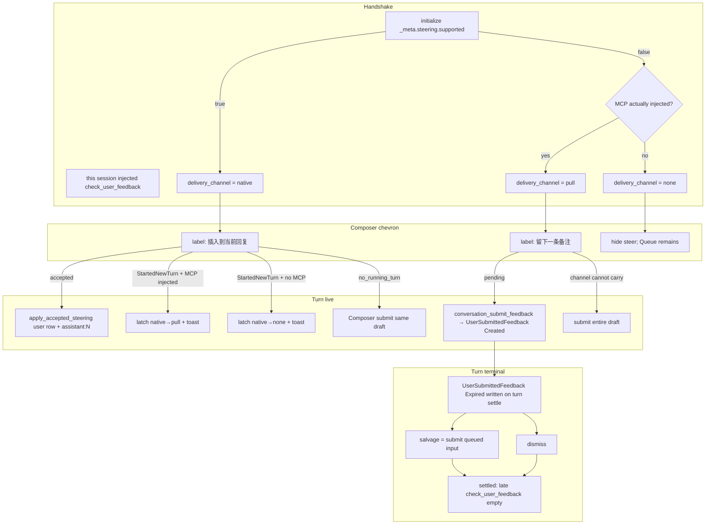
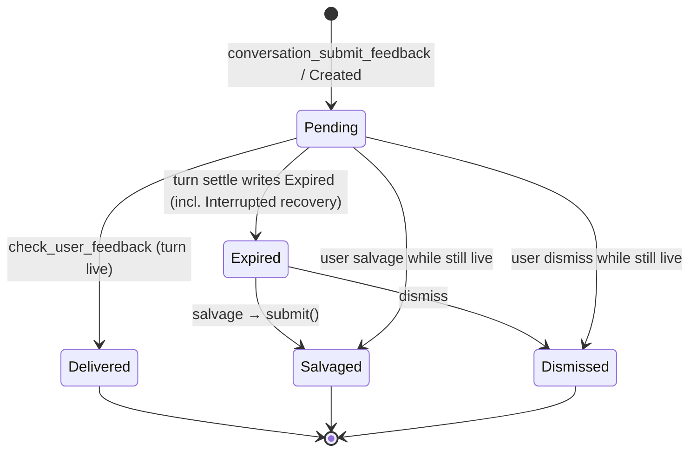
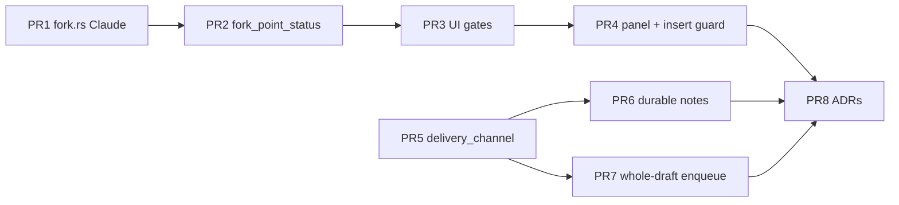

# Conversation Fork 与 Turn Steering：对齐并超越 CodeG 0.30.1–0.30.5

| 字段 | 值 |
| --- | --- |
| Status | draft |
| Date | 2026-09-09 |
| Authors | VibeX maintainers |
| Domain | Conversation / AgentRuntime / Composer |
| Supersedes (storage) | 无。继续 ADR-0005 独立 child Conversation + 事件拷贝 |
| Updates | ADR-0005、ADR-0044 |
| Remains in force | ADR-0001、ADR-0003、ADR-0033、ADR-0035、ADR-0042、ADR-0058、ADR-0071、ADR-0078 |
| Target product | CodeG v0.30.1–v0.30.5 的 **产品行为**（非存储把戏） |
| Non-clone | CodeG 两行 reshuffle、NoActiveTurn 拒附件、内存 unread notes、无法命名时静默尾部分叉 |

---

## Overview

本设计让 VibeX 的 **Conversation Fork** 与 **mid-turn Turn steering** 在产品行为上对齐 CodeG 0.30.1–0.30.5，并在三处明确超越：

1. **事件溯源权威**：fork 切点可命名性、投递通道、未读备注全部是可重建投影，而不是前端猜测或进程内存。
2. **未读 pull notes 恰好一次**：turn 结束后备注进入 `expired`，salvage / dismiss 提交后，迟到的 `check_user_feedback` 不能再投递同一条备注。
3. **能力诚实**：控制面永不把 `steer` 静默改成 `submit`；通道装不下整个草稿时整份入队，绝不发文字、丢附件。

VibeX 继续使用独立 child Conversation（拷贝事件到切点），**不**采用 CodeG 把当前 conversation 行改绑到 S2 的两行 reshuffle。Agent 上下文通过 ACP `session/fork` 延续；无法诚实地延续时走 `history_only` 并作为警告，而不是假装成功。

用户可感知的结果：

- Fork 之后，Kanban **active 槽**（`rightSession`）已经在子会话上；parent 不再占第二个面板，只留在列表。Composer 带着原来的 mode / model / effort，可以立刻发送。
- 历史切点只有在投影声明 `named` 时才能点；`unnamed` 灰掉并给出原因；进行中的气泡以 `busy` 灰掉。不会把纠偏回复的前半段静默切走。
- 运行中的主按钮仍是 Queue。Steer 是 chevron 动作，文案按该 session 的 `delivery_channel`（`native` = 插入当前回复，`pull` = 留下备注）。
- Native steer 只承载 text + images。任何 file / plugin ref（以及 pull 通道上的 images）整份草稿入队，不发残缺文字。
- 未读备注在崩溃、重开、第二台设备上仍在；回合结束后可「作为下一条发送」或「忽略」。

---

## Background & Motivation

### 产品对照（要对齐的是行为，不是存储）

CodeG 0.30.1–0.30.5 在 fork 与 steering 上已经形成稳定的用户预期：

**Fork**

1. 分叉完成后用户看着的是 **forked work**，可以立刻发送；model / effort / mode 跟着走。
2. Claude 0.75.1 的历史切点需要 `messageId` **和** fingerprint（加 occurrence），否则废弃分支上的切点无法命名。
3. 忙碌时 fork 按钮仍可见；无法命名的非尾部切点用 `aria-disabled` + tooltip 灰掉（原因：`busy` 或 `unnamed`）。禁止静默切走纠偏回复的前半段。
4. 时间线、列表、画布共用 **一个** `fork_session` 能力门。
5. 分叉 **IPC 进行中** 新键入的 follow-up 落到 **child**（新 draft 身份）。分叉前已存在的 parent draft 留在 parent。

**Steer**

1. 每个 session 的投递通道由后端合成：`native` vs `pull`。文案按通道。降级要锁存且可见。
2. 未读备注在回合结束后仍在，进入 expired UI，可「作为普通输入重发」或 dismiss。第二观察者能恢复。
3. Native 被接受的 steer 是时间线上的真实 user 行（图片立即可见）。回复作为新的 assistant segment 继续。
4. 通道装不下整个草稿（图片 / 文件 / plugin refs）时，**整份**入队；绝不只发文字、丢掉附件。
5. 只要 session 有可用通道，就提供 mid-turn 发送；措辞按通道诚实。

### 当前 VibeX（已核实）

**Fork（ADR-0005）**

- 拷贝事件到切点；切点能命名则 ACP `session/fork`；不能命名的历史切点必须 `history_only`，且 **不得** 发尾部 `session/fork`（否则 Agent 上下文长于可见历史）。
- `crates/agents/src/fork.rs` `resolve_fork_point`：
  - Claude = 仅 `agent_message_id`（无 fingerprint）
  - Codex = sha256 fingerprint + occurrence
  - DeepSeek = id + fingerprint
  - 其他 `AgentKind` = `None`
- `crates/server/src/host/conversation.rs` `fork_conversation`：`fork_visible_conversation`，relation kind `Fork`，标题 `{base}（分叉）`，child binding `Closed`，拷贝 `working_dir` 与 capability JSON。若 `!is_tail && fork_point.is_none()` → 仍先建 child 再 `history_only`。`session/fork` 失败 → `history_only`。
- `ConversationForkResult.continuity`: `agent_context | history_only` + 可选 `continuity_note`。
- 时间线：`AgentTimelineConversation.tsx` `canFork = capabilities.fork_session && not streaming`。`TurnStats.tsx` 仅在途时 `forkDisabled`（`forkBusy`），没有 unnamed 原因。
- 列表：`SessionHubListItem.tsx` 右键 fork **总是** 可见，不看 `fork_session`。
- 子面板：`kanbanSessions.placeCreatedSession`（`frontend/src/lib/kanbanSessionLayout.ts`）把 child 放进 `rightSession`，并把 parent **追加到 `monitorSessions`**。用户已经在看 child，但 parent 仍占第二个可见面板。缺口是「parent 还留在画布上 + Composer overlay 不跟随」，不是「卡在父会话」。Binding `Closed`，下一次发送需要 resume / load。今日 fork 走 Kanban layout，**不**走 `dockviewApi.addPanel`。

**Steering（ADR-0044）**

- Steer 必须能力诚实；控制面不得把 steer 静默改成 queued input。`expected_turn_id` 必填。
- `crates/conversations/src/service.rs`：`ConversationSteering` 事件 `Requested / Accepted / Rejected / Unknown`。Injected → Accepted；`PromptRequired` → `no_running_turn`；`StartedNewTurn` → Unknown；缺能力 → `steering_unsupported`；turn 不匹配 → `turn_not_live` / `turn_conflict`。
- Handshake：`AcpCapabilityNormalizer::steering_is_advertised` 读 `_meta.steering.supported == true`；`snapshot.steering` 在 manager initialize 之后写入。
- 投影 `apply_accepted_steering`（`crates/conversations/src/projection.rs`）：关闭当前 assistant 气泡，插入 user `MessageTurn` id `{turn}:steer:{steering_id}`，新 assistant segment `{turn}:assistant:N`。
- Composer：`TaskFollowUpSection.tsx` `handleSteer`；`ActionBarRunningControls.tsx` Queue 主按钮 + chevron steer。Native 当 `current_turn` live **且** `capabilities.steering`；否则若官方产品 MCP feedback **全局** 开关打开则走 pull。
- Pull 图片：`steerImagesBlocked`。Plugin refs：`steerPluginBlocked`。`no_running_turn`：前端 `submitInput` + toast `steerQueuedInstead`（Composer 策略，不是控制面转换）。
- Pull 备注已有命令对：`RegisteredCommand::ConversationSubmitFeedback` / `ConversationListFeedback`（`conversation_submit_feedback`、`conversation_list_feedback`）。类型是 `ConversationLiveFeedbackNote`（`id`, `text`, `status`, `deliveredAt`）。权威存储是 `InMemoryCompanionFeatures`：`push_feedback` 要求 live connection **且** `turn_in_flight`，否则 `conflict("no active turn")`（VibeX 侧的 CodeG `NoActiveTurn` 同类物）。MCP `check_user_feedback` 读这块内存。Composer `conversationApi.submitFeedback` + `useQuery` 仅在 `isComposerExecutionRunning && liveFeedbackOn` 时轮询。回合结束未读备注消失。无 resend / dismiss。

这些差距会直接造成：Claude 废弃分支切错点、忙碌时误切纠偏前半段、列表出现「假 fork」、分叉后还停在父会话、steer 文案与真实通道不符、备注丢、附件被静默丢掉。

### 明确不抄的 CodeG 存储把戏

| CodeG 做法 | 为何不抄 | VibeX 替代 |
| --- | --- | --- |
| 两行 reshuffle：当前 conversation 行改绑到 S2 | 破坏 Conversation 身份稳定性，与 ADR-0005 / ADR-0042 冲突 | 独立 child；**当前面板切换到 child**，父 identity 不变 |
| 用 `NoActiveTurn` 拒绝 pull 通道附件 | 把「通道装不下」伪装成「没有在途 turn」 | 通道装不下 → Composer 整份 `submit()`，toast 可见。替换 `InMemoryCompanionFeatures` 的 `no active turn` 拒附件 |
| 未读备注只活在内存 | 崩溃 / 重开 / 第二设备丢失；与事件溯源原则冲突 | 迁移 `conversation_submit_feedback` 到事件溯源；expired 可 salvage / dismiss |
| 历史切点无法命名时静默 `session/fork` 尾部 | Agent 上下文长于可见历史，等于切错地方 | 非尾部 unnamed：**不建 Conversation**；`tail` = 整段会话最后一个 assistant（含在途），只有真正的尾部才允许无切点 `session/fork` |

---

## Goals & Non-Goals

### Goals

G1. Fork 完成后，用户看着 child，Composer 可发送；pending 的 mode / config / model 在 fork 时写入 child binding。

G2. 分叉 **IPC 进行中** 新键入的 follow-up 作为 **新的 child draft** 提交到 child。分叉前已存在的 parent draft 留在 parent，禁止 `UPDATE draft.conversation_id`。

G3. 每个 assistant 气泡的 `fork_point_status` 由投影给出：`named | unnamed | tail | unsupported`。`tail` = 整段会话最后一个 assistant segment（**含在途**）。前端不从 live id 猜测。

G4. Claude 切点 payload 发送 `messageId` + fingerprint + occurrence；无 id 的空文本不得变成 `fingerprint("")`。

G5. 非尾部 unnamed：按钮禁用 + 原因，**不创建** Conversation。`!fork_session` → `fork_unsupported`，不 insert。`history_only` 仅在 **已经合法创建 child**（named 或真正的 tail）之后、ACP/binding 无法延续时作为警告。

G6. 无 `session/fork` 的 Agent：时间线、列表、画布同时隐藏 fork。没有「只拷文本」的假 fork。

G7. 运行中 Composer 主按钮保持 Queue。Steer 是 chevron，按 `delivery_channel` 标注。

G8. `delivery_channel: none | native | pull` 是该 session 能力快照上的后端事实。全局 plugin 开关不能凭空发明通道。

G9. Pull 未读备注事件溯源、跨崩溃 / 重开 / 远程存活；turn 结束后 `expired`，salvage 或 dismiss 恰好一次。

G10. 控制面永不 `steer → queue`。Composer 在 `no_running_turn` 或通道装不下时用同一草稿、**新的** `operation_id` 走 `submit()`，toast 可见。

G11. Native accepted steer 保持现有 `apply_accepted_steering` 时间线 user 行；图片 block 立即渲染；live 与 reopen 一致。

G12. `StartedNewTurn` 锁存 `native → pull` **仅当本 session 已注入** `check_user_feedback`；否则锁存 `native → none`。toast 可见，不当作插入成功。锁存事件在 handshake+MCP 合成 **之后** 再折叠，reopen 不得复活 native，也不得发明假 pull。

### Non-Goals

- 不引入 CodeG 式 conversation 行改绑 / 两行 reshuffle。
- 不把 fork 做成「把历史文本塞进第一条 prompt」的假 fork。
- 不把 unread notes 做成 React state 或 `ConversationRuntimeState` 唯一存储。
- 不在前端维护第二份 `AgentKind` → fork payload 表。
- 不把 Queue 与 Steer 合成一个会隐藏降级的按钮。
- 不修改 Turn 终态机（Completed / Failed / Cancelled / Interrupted，ADR-0001 / ADR-0071）。
- 不在本设计中重做 session resume / rebind（ADR-0005 的 child binding `Closed` + 下次发送 resume/load 仍然成立）。
- 不把官方产品 MCP 的全局 flag 当成 per-session 通道。
- 不为「无 `session/fork` 的 Agent」默认提供 copy-only fork（见 Q1）。
- **不把 file / plugin ref 放进 native steer。** 现有 `SteerConversationTurnRequest` / `ConversationSteerInput` 只有 `{ text, images }`。任何非 text/非 image（含 plugin refs、workflow refs）一律整份 `submit`。不在本设计扩展 steer payload。

---

## Proposed Design

### 1. 领域对象与单一事实来源

```text
Conversation (parent) ──relation:fork──► Conversation (child, independent event log)
       │                                        │
       │ events through cut                     │ copied events + new sequence/idempotency
       │ fork_point_status on assistant rows    │ binding: Closed, S2 or none
       │                                        │ current_mode / config_selection_json from Composer
       ▼                                        ▼
AcpCapabilitySnapshot.delivery_channel     Composer: forking → ready(child)
UserSubmittedFeedback (event-sourced)      during-fork keystrokes = new child draft
                                           pre-fork parent draft stays on parent
```

权威顺序：

1. Conversation Event Log（ADR-0003）
2. 投影（`fork_point_status`、`delivery_channel`、`ConversationLiveFeedbackNote`）
3. `ConversationRuntimeState` 只保存连接期瞬时（in-flight turn、live message、pending permission）
4. Composer：parent draft（ADR-0042）与 forking 期间的 **本地 held delta**（尚未成为任何 Conversation 的 draft 行）分开

### 2. Fork：先判定切点，再决定是否创建 child

今天的 `fork_conversation` **先** `fork_visible_conversation` 再发现 unnamed，会留下一个用户没要求的 child。本设计把判定提前。

```mermaid
sequenceDiagram
    participant UI as Composer / Timeline
    participant Core as Application Core / CommandRegistry
    participant Host as conversation_fork_host
    participant Proj as projection
    participant Fork as agents/fork.rs
    participant ACP as AgentRuntime
    participant Child as child Conversation

    UI->>Core: conversation_fork(at_turn_id, overlay, operation_id)
    Core->>Host: DomainCommand::ConversationFork
    Host->>Proj: load parent turns + capabilities
    Host->>Fork: resolve_fork_point_for_turn
    alt unsupported / !fork_session
        Host-->>UI: error fork_unsupported (no child)
    else cut is in-flight OR omitted at_turn_id while latest is in-flight
        Host-->>UI: error fork_turn_in_flight (no child)
    else unnamed AND not tail
        Host-->>UI: error fork_point_unnamed (no child)
    else named OR true tail
        Host->>Child: fork_visible_conversation + relation Fork
        Host->>Child: apply composer overlay (current_mode, config_selection_json)
        alt live connection AND fork_session
            Host->>ACP: session/fork (ForkPoint if historical; none if true tail)
            alt S2 ok
                Host->>Child: binding Closed + acp_session_id=S2
                Host-->>UI: continuity=agent_context
            else RPC fail
                Host-->>UI: continuity=history_only, warning
            end
        else no resumable binding
            Host-->>UI: continuity=history_only, warning
        end
        UI->>UI: placeForkedChild: rightSession=child, parent list-only
        UI->>UI: during-fork keystrokes → new child draft; parent draft untouched
    end
```

#### 2.1 `fork_point_status`（K3）

投影字段，挂在 **assistant** `MessageTurn` / timeline row 上，不挂在 user 行或 tool 行。

```rust
#[derive(Debug, Clone, Copy, Serialize, Deserialize, TS, PartialEq, Eq)]
#[serde(rename_all = "snake_case")]
#[ts(export)]
pub enum ForkPointStatus {
    Named,
    Unnamed,
    Tail,
    Unsupported,
}
```

判定（后端唯一，前端只读）。`tail` = **整段会话**最后一个 assistant segment，**含在途 Turn**。只要后面还有更晚的 Turn（在途或已完成），更早的切点永远是历史切点：`named` 或 `unnamed`，**绝不是** `tail`。不得把「最后一条已完成 Turn」当成 tail——否则在途会话会无切点地 `session/fork` Agent 真尾部，而 child 只拷到上一完成 Turn，Agent 上下文长于可见历史。

Host 的 `is_tail` 必须与今天一样用 `ConversationTurnRecord::latest_for_conversation`（最新一行，不论是否完成），禁止改成 last-completed。

| 条件 | 状态 |
| --- | --- |
| 当次 binding / capability snapshot `fork_session == false` | `unsupported`（所有 assistant 行） |
| 该气泡是整段会话最后一个 assistant segment（含在途、含 `{turn}:assistant:N`） | `tail` |
| 不是最后一个 assistant，且 `resolve_fork_point` 返回 `Some(ForkPoint)` | `named` |
| 不是最后一个 assistant，且 `resolve_fork_point` 返回 `None` | `unnamed` |

「最后一个 assistant segment」必须使用已有的 `last_assistant_for_turn`：纠偏后的 `{turn}:assistant:N` 才是该 Turn 的切点。禁止对 `{turn}:assistant`（纠偏前半段）静默 fork。

`tail` **不要求** 能命名：真正的尾部 `session/fork` 可以不带 AIR `_meta` 切点。`unnamed` 只对非尾部历史切点有意义。

UI 叠加：若该行所属 Turn 在途，按钮 `busy`，后端 `fork_turn_in_flight`。列表默认 fork（`at_turn_id` 省略）在最新 Turn 在途时等于切在途尾部 → `busy`，**不是**对上一完成气泡的无切点 tail fork。

#### 2.2 Claude / Codex / DeepSeek 命名规则（K4）

只改 `crates/agents/src/fork.rs` 的 `resolve_fork_point`。**不要**在前端再做一张 `AgentKind` 表。Adapter 版本差异写在该文件注释与单测里。

```rust
pub struct ForkPoint {
    pub message_id: String,
    pub message_fingerprint: Option<String>,
    pub message_occurrence: Option<u32>,
}
```

| AgentKind | 规则 | 无法命名 |
| --- | --- | --- |
| `ClaudeCode` | 必须有 `agent_message_id`。有非空文本则附加 `sha256:{hex}` fingerprint 与 occurrence。`to_meta()` 带 `messageId` + 可选 fingerprint / occurrence。 | 无 `agent_message_id` → `None`。**禁止**对空文本做 `fingerprint("")` 冒充 id。有 id 但文本为空：只发 id，fingerprint / occurrence 为 `None` |
| `Codex` | fingerprint-only：非空文本 → fingerprint + occurrence；`message_id` 可用 VibeX turn row id 占位（现有行为） | 空文本 → `None` |
| `DeepseekHarness` | id + fingerprint（现有行为）：有 id 或非空 fingerprint 即可 | 无 id 且空文本 → `None` |
| 其他 | `None` | 全部非尾部切点 `unnamed`；无 `fork_session` 则行级 `unsupported` |

Fingerprint 算法保持 `fingerprint_agent_message`：只拼接该 assistant 行的 `ContentBlock::Text`，`sha256:` 前缀。occurrence 仍是「在该行之前、相同 fingerprint 的 assistant 行数 + 1」。

注释约定（不要写成第二张运行时表）：

```text
// Claude Code ≥ 0.75.1 (CodeG 0.30.x): abandoned-branch cuts need
// messageId + messageFingerprint + messageOccurrence.
// Older adapters ignore unknown fingerprint fields; missing messageId
// cannot be recovered by hashing empty text.
```

#### 2.3 何时创建 Conversation（K5、K6、K14）

| `fork_point_status` | 切点 Turn | 连接 | 是否创建 child | 结果 |
| --- | --- | --- | --- | --- |
| `unsupported` / `!fork_session` | * | * | **否** | `fork_unsupported`。UI 已隐藏。Host **不得** insert，也不得 `history_only` |
| `unnamed`（因此一定非 tail） | * | * | **否** | `fork_point_unnamed` |
| `tail` 且该 Turn in-flight | in-flight | * | **否** | `fork_turn_in_flight`。列表省略 `at_turn_id` 走这条 |
| `named` 且该 Turn in-flight | in-flight | * | **否** | `fork_turn_in_flight`（在途气泡即使能命名也不可切） |
| `named` 历史切点（后面还有更晚 Turn，含在途） | 已完成 | live + `fork_session` | 是 | `session/fork` **必须带** `ForkPoint` → `agent_context`；RPC 失败 → 已建 child + `history_only` 警告 |
| `named` 历史切点 | 已完成 | 无 resumable binding | 是 | 已建 child + `history_only` 警告 |
| `tail` 且会话空闲 | 已完成且为最新 | live + `fork_session` | 是 | `session/fork` 可无 meta → `agent_context`；RPC 失败 → `history_only` 警告 |
| `tail` 且会话空闲 | 已完成且为最新 | 无 resumable binding | 是 | 已建 child + `history_only` 警告 |

`history_only` **不再**用于 unnamed，也 **不再**用于 `!fork_session`。它是警告，不是静默成功，且只出现在 child 已经合法 insert 之后。`ConversationForkResult.continuity_note` 必须有人话；前端用 warning 条展示，并删除 `forkSuccess` toast。

相对 ADR-0005 原文「父会话存在在途 turn 时拒绝 fork」的精确化（K14）：

- **拒绝**：切点落在在途 Turn（含纠偏中的当前 segment）；省略 `at_turn_id` 而最新 Turn 在途。
- **允许**：会话虽有在途 Turn，但切点是更早的已完成 Turn，且该切点 `named`。必须发送 `ForkPoint`。child 只拷到该已完成 Turn。父会话继续其在途 Turn。
- **禁止**：把上一完成 Turn 标成 `tail` 然后无 meta 地 `session/fork`。

这避免「会话忙碌就锁死所有历史切点」，同时禁止切走正在生成的回复，也禁止 Agent 上下文长于可见历史。

#### 2.4 Fork 完成与 Composer（K1、K2）

IPC 返回即完成。Child binding 仍是 `Closed`；下一次 `submit` 走既有 resume/load 或冷启动。没有「S2 稍后才贴上」的异步缺口，因此 **不** 引入 `sendable` 字段，也 **不** 引入 `waiting_sendable` 状态。

```rust
#[derive(Debug, Clone, Serialize, Deserialize, TS)]
#[serde(rename_all = "camelCase")]
#[ts(export)]
pub struct ConversationForkResult {
    pub conversation_id: Uuid,           // child
    pub imported_event_count: usize,
    pub projection_version: u32,
    pub continuity: ConversationForkContinuity, // agent_context | history_only
    #[serde(default, skip_serializing_if = "Option::is_none")]
    pub continuity_note: Option<String>,
    pub parent_conversation_id: Uuid,
}

pub enum ConversationForkContinuity {
    AgentContext,
    HistoryOnly,
}
```

```text
fork_completed ⇔ child Conversation 已存在
                ∧ continuity ∈ { history_only, agent_context }
```

- `agent_context`：child binding 已带 S2 `acp_session_id`，status `Closed`。
- `history_only`：无 S2。Composer 仍可 `submit`（冷启动）。必须展示 `continuity_note`。不要渲染成「上下文已延续」。

Composer 状态机：

```text
idle ──fork──► forking ──IPC ok──► ready(child)
                 │
                 │ error (unnamed / unsupported / in_flight)
                 ▼
               idle(parent)
```

三条对象，禁止混成一次 draft 改绑（ADR-0042）：

| 对象 | 身份 | 去向 |
| --- | --- | --- |
| 分叉前已存在的 parent draft | 仍属 parent，`base_revision` 不变 | **留在 parent**。禁止 `UPDATE conversation_id`。其他设备冲突仍走 ADR-0042 双份保留 |
| `forking` 期间的新键入（held delta） | 本地缓冲区，尚无 draft 行 | IPC 成功后写成 **新的 child draft**（新 identity），非空则 `submit(child)`，`operation_id` ≠ fork `operation_id` |
| Composer pending mode / config | 不是 draft 正文 | 写入 child binding overlay（K1） |

规则：

- `forking` 是 **non-idle**：主发送键不把稿子发到 parent。
- 用户在 `forking` 期间清空 held delta → 不自动 submit。
- Fork 失败（未建 child）→ 回到 parent；parent draft 与 held delta 都不丢（delta 回到当前 Composer，仍属 parent）。
- 自动 submit 只消耗 held delta，**绝不**把 parent draft 发到 child。

#### 2.5 布局切换与 mode/config（K1）

Conversation fork 的画布模型是 `KanbanSessionLayoutState`（`rightSession` + `monitorSessions`），**不是** Dockview `panelId` 换绑。今日 fork 不调用 `dockviewApi.addPanel`。ADR-0042 的「一 Conversation 一窗口至多一面板」对 **若存在** 的 Dockview conversation 表面仍然成立；本 fork 路径只规定 Kanban 函数。若日后另一表面用 Dockview 打开同一 Conversation，复用「一窗口一面板、重复打开只聚焦」，不要让 Kanban 函数假装自己是 Dockview。

**不要**再对 fork 调用 `placeCreatedSession`（它会把 parent 推进 `monitorSessions`）。

新函数：

```ts
function placeForkedChild(
  state: KanbanSessionLayoutState,
  parent: KanbanSessionPlacement,
  child: KanbanSessionPlacement,
  options: KanbanSessionPlacementOptions,
): KanbanSessionLayoutState
```

产品规则：成功后 **active 槽显示 child**；parent **不**作为第二面板留下（只在 session list）。child 已打开则聚焦/提升它，不建第二份 child 面板。

算法（单一实现，时间线 / 列表 / canvas 共用）：

1. 从 `rightSession` 与 `monitorSessions` **去掉 parent**（parent 只回列表）。
2. 从 `monitorSessions` **去掉已有 child**（防重复）。
3. 若 `!options.canUseRightPanel`：child 进 `monitorSessions`（`appendMonitorSession`）；若原 `rightSession` 是 parent，则 `rightSession = null`。
4. 若 `canUseRightPanel`：
   - 若当前 `rightSession` 不是 child 也不是 parent，把它 `appendMonitorSession`（无关会话不丢）。
   - `rightSession = child`。

分情况（`canUseRightPanel = true`）：

| 起点 | 结果 |
| --- | --- |
| parent 是 `rightSession`，child 未打开 | `rightSession = child`；parent 不进 monitor |
| parent 在 `monitorSessions`，child 未打开 | 去掉 parent；`rightSession = child`；原 right（若不是 parent）进 monitor |
| child 已是 `rightSession` | 去掉 parent；child 不动 |
| child 已在 `monitorSessions` | 提升 child 为 `rightSession`；去掉 parent；原 right 进 monitor |
| 从列表 fork、parent 不在 layout | `rightSession = child`；原 right 进 monitor |
| 从列表 fork、parent 是 right | 同第一行 |

Parent Conversation **identity** 不变（不改绑 S2）。再次从列表打开 parent 才占用一个槽（`placeSessionFromList` / 聚焦已有面板）。

`history_only` banner：写入 Fork `ConversationRelation.metadata`（已有 JSON：`source`、`forkTurnId`）增加 `continuity`、`continuityNote`。Child 面板读这条 relation。Dismiss 是 per-device UI 状态；metadata 保留，其他设备重开仍能看到。不依赖未钉死的 `ConversationSessionNotice` 家族。

Child binding 写入顺序：

1. 从 parent `ConversationAgentBindingRecord` 拷贝 `working_dir`、capability JSON、`load/resume/close/terminal` 等（现有）。
2. **覆盖** Composer 此时的 pending 选择：
   - `current_mode` ← Composer pending mode ?? parent binding `current_mode`
   - `config_selection_json` ← Composer pending config/model/effort ?? parent `config_selection_json`
3. `status = Closed`
4. 若 `agent_context`：`acp_session_id = S2`

IPC 入参（与 overlay 同一线材：JSON **字符串**，与 binding 列 `config_selection_json` 一致，不要一边 `string` 一边 `Value`）：

```ts
type ForkConversationArgs = {
  conversationId: string;
  operationId: string;
  atTurnId?: string | null;
  currentMode?: string | null;
  configSelectionJson?: string | null; // serialized Agent config map, same as binding column
};
```

```rust
pub struct ForkBindingOverlay {
    pub current_mode: Option<String>,
    pub config_selection_json: Option<String>,
}
```

不要让后端读前端内存。pending 值由调用方显式传入。`DomainCommand::ConversationFork` 必须带 `operation_id` 走 `CommandRegistry`（ADR-0078）。不要复用 `create_fork_conversation`（那是 create_child + 首条 prompt，不是事件拷贝 fork）。

#### 2.6 统一能力门（K6）

单一谓词，时间线 / 列表 / canvas 共用：

```ts
function canOfferFork(snapshot: AcpCapabilitySnapshot | null): boolean {
  return snapshot?.fork_session === true;
}
```

| 表面 | 无 `fork_session` | 有能力 + unnamed 非尾 | 有能力 + 切点 in-flight / 列表省略切点且最新在途 | 有能力 + named 历史或空闲 true tail |
| --- | --- | --- | --- | --- |
| Timeline `TurnStats` | 隐藏按钮 | `aria-disabled` + tooltip unnamed | `aria-disabled` + tooltip busy | 可点 |
| Session list 右键 | 隐藏菜单项 | 不提供 unnamed 历史切点 | `aria-disabled` busy（默认切点是 true tail = 在途） | 可点（默认 true tail） |
| Canvas | 同时间线 | 同时间线 | 同时间线 | 同时间线 |

禁用必须用 `aria-disabled`（元素仍可见、可聚焦、可读原因），不要 `disabled` 到无法读 tooltip，也不要在 busy 时把按钮卸掉。

文案（maiden-skill：只帮助行动 / 理解状态）：

| 原因 | UI 字符串 key | 文案 |
| --- | --- | --- |
| unnamed | `tasks:hubListItem.forkUnnamed`（PR3 新增，与 hub 同命名空间） | 无法在此处分叉 |
| busy | `tasks:hubListItem.forkBusy` | 回复完成后可分叉 |
| history_only 警告 | **沿用** `tasks:hubListItem.forkHistoryOnly` + `continuityNote` | 仅复制了可见历史 |
| 已切换 | **删除** 现有 `forkSuccess` toast（与 historyOnly chrome 同一 PR） | 无「分叉成功」吹嘘 |

`unnamed` 不解释 AIR / fingerprint。`history_only` 的细节来自 `continuity_note`，放在 warning 条，不进按钮 tooltip。禁止再引入平行的 `conversation.fork.historyOnly` key。

### 3. Steering：per-session 通道、整份草稿、持久备注



#### 3.1 `delivery_channel`（K8、K12）

加到 `AcpCapabilitySnapshot`（`crates/agents/src/conversation.rs`），随 binding / initialize 快照走，不进前端猜测。

```rust
#[derive(Debug, Clone, Copy, Default, Serialize, Deserialize, TS, PartialEq, Eq)]
#[serde(rename_all = "snake_case")]
#[ts(export)]
pub enum DeliveryChannel {
    #[default]
    None,
    Native,
    Pull,
}

pub struct AcpCapabilitySnapshot {
    // ... existing fields ...
    pub steering: bool,
    pub delivery_channel: DeliveryChannel,
    // ...
}
```

合成规则（manager，initialize 之后、MCP 注入完成之后各跑一次）：

```text
if steering_is_advertised(_meta)        → Native
else if check_user_feedback injected
        for THIS session                → Pull
else                                    → None
```

硬约束：

- 官方产品 MCP 的 **全局** flag 只决定「是否允许注入」，**不能**在未注入的 session 上写成 `pull`。
- 合成瞬间：`steering: true` 与 `delivery_channel: native` 一起出现。锁存之后允许 `steering` 广告仍为 true 而 `delivery_channel` 已是 `pull` 或 `none`（广告描述握手，通道描述本 session 实际投递）。
- Native 优先于 Pull：同一 session 若两者都存在且 **尚未锁存**，UI 走 native。
- `StartedNewTurn`：追加锁存事件，**目标通道按本 session 是否真的注入了 `check_user_feedback`**：

```rust
ConversationEvent::DeliveryChannelLatched {
    from: DeliveryChannel::Native,
    to: DeliveryChannel, // Pull if injected; None otherwise
    reason: DeliveryChannelLatchReason::StartedNewTurn,
}
```

| 本 session MCP | latch `to` | chevron | toast |
| --- | --- | --- | --- |
| 已注入 `check_user_feedback` | `pull` | 「留下一条备注」 | `tasks:composer.steerDeliveryChanged` = 「已改为留下备注」 |
| 未注入 | `none` | 隐藏 | `tasks:composer.steerDeliveryUnavailable` = 「无法插入到当前回复」 |

**不要**走 `apply_accepted_steering`。当前 `Unknown` 升级为带 `code=started_new_turn` 的明确 latch，不是无声成功。

重建顺序（reopen / resume 必须遵守，否则会复活 native 或发明假 pull）：

```text
1. handshake + 本 session MCP 注入 → candidate channel（native / pull / none）
2. 按 sequence 折叠 DeliveryChannelLatched → latched
3. delivery_channel = latched ?? candidate
```

锁存对 **这个 Agent binding** 粘性：后来的 initialize 即使仍广告 `steering.supported`，也不得把通道折回 `native`。锁存写入时的 `to` 已经是事实（Pull 或 None）；不得在折叠时因为「现在没有 MCP」把历史 `to=Pull` 改成 None，也不得因为「现在有 MCP」把历史 `to=None` 改成 Pull。新 binding / 新握手才重新合成。

PR 落地：PR5 备注命令尚未迁移时，latch **一律写 `to=None`**（chevron 隐藏，Queue 仍在）。PR6 接上事件溯源 notes 后，注入了 MCP 的 session 才允许 `to=Pull`。

#### 3.2 Composer 主按钮与 chevron（K7）

运行中：

| 元素 | 行为 |
| --- | --- |
| Primary | **始终 Queue**（`submit` → queued input）。不因 native 通道改成 Steer |
| Chevron | `delivery_channel=native` → 「插入到当前回复」；`pull` → 「留下一条备注」；`none` → 不渲染 steer |
| Idle | Steer 隐藏；主按钮是发送 |

这是相对 CodeG「有 native 就把主按钮变成 Steer」的有意差异，保留 VibeX Queue 作为运行中的明确下一输入。Q2 若改口再动。

#### 3.3 Native accepted steer（K11）

保持 `apply_accepted_steering`：

1. 关闭当前 assistant 气泡。
2. 插入 user `MessageTurn`，id = `{turn}:steer:{steering_id}`，blocks 为完整 `ConversationInputBlock`（含 image）。
3. 打开新 assistant segment `{turn}:assistant:N`。

图片按已有 block 渲染，live 与 reopen 走同一投影。不把 native steer 做成 tool card 或系统提示。**不要重写** `apply_accepted_steering` 的 id 映射（已是 `{turn}:steer:{id}` 与 `{turn}:assistant:{n}`）。Resource / Protocol blocks 今天会被投影丢掉——本设计不把 files 放进 steer，因此不必改这段映射。

#### 3.4 控制面 vs Composer salvage（K10）

`ConversationControl.steer(...)` 的语义不变：

| Agent / 运行时结果 | 控制面 | Composer |
| --- | --- | --- |
| Injected / accepted | `Accepted` | 时间线插入 |
| 缺能力 | `steering_unsupported` | 错误，不改 queue |
| `expected_turn_id` 不匹配 | `turn_conflict` / `turn_not_live` | 错误 |
| `PromptRequired` / 无在途 | `no_running_turn` | **Composer** `submit(same draft, operation_id)` + toast `steerQueuedInstead` |
| `StartedNewTurn` | `Unknown` + `code=started_new_turn` + latch 到 Pull 或 None | toast；草稿仍在；chevron 跟新通道 |
| 通道装不下附件 | Host 拒绝 steer（`steering_payload_unsupported`）；Composer 应在调用前整份 `submit` | **Composer** `submit(entire draft)` + toast |

禁止在 `crates/conversations/src/service.rs` 内部把失败的 steer 改写成 `submit`。Salvage 的 `operation_id` 与失败的 steer `operation_id` 可以相同（同一用户意图），但 command 名不同（`steer` vs `submit`），幂等域按 ADR-0044「相同 principal、command 和资源」。因此 salvage 使用 **新的** `operation_id`（Composer 生成），toast 让用户看见「已作为下一条输入」。

#### 3.5 整份草稿入队（产品第 4 条 + PR7）

**Non-goal：files-on-steer。** 现有 `SteerConversationTurnRequest` / `ConversationSteerInput` 只有 `{ conversation_id, expected_turn_id, text, images: Vec<String> }`。本设计不扩展该 payload。任何非 text / 非 image（files、plugin refs、workflow refs）一律整份 `submit`。

权威谓词在 **Host / 控制面**（客户端镜像同一规则，不得只在 TS 里发明一份）：

```text
channel_can_carry(channel, prompt, draft):
  if channel == none → false
  if draft has files OR plugin_refs OR workflow_refs → false
  if channel == pull → draft is text-only (no images)
  if channel == native → text always; images iff prompt.image
```

```ts
// Client mirror of the Host predicate. Host still rejects
// steering_payload_unsupported if the client is stale.
function channelCanCarry(
  channel: DeliveryChannel,
  prompt: AgentPromptCapabilities,
  draft: { text: boolean; images: boolean; files: boolean; pluginRefs: boolean },
): boolean {
  if (channel === 'none') return false;
  if (draft.files || draft.pluginRefs) return false;
  if (channel === 'pull') return draft.text && !draft.images;
  if (draft.images && !prompt.image) return false;
  return true;
}
```

若 `!channelCanCarry`：

1. **不要**调用 `steer` / `conversation_submit_feedback`。
2. **不要**剥掉附件只发 text。
3. `submit(entire draft)` 进入 queued input。
4. Toast：沿用 Composer 命名空间 `tasks:composer.queuedWholeDraft` = 「含附件，已作为下一条输入」。

删除（或不再走到）`steerImagesBlocked` / `steerPluginBlocked` 那种「阻止并留下残缺草稿」的死路。Pull 图片即使 turn live 也走整份入队，取代 `InMemoryCompanionFeatures` 的 `no active turn` 拒附件。

#### 3.6 Durable unread notes（K9、K13）——迁移现有 pull 路径

**一条写路径。** PR6 迁移已有命令，而不是平行再做一个 `leave_feedback_note`，也禁止复用 `steer`。

| 现有 | 迁移后 |
| --- | --- |
| `RegisteredCommand::ConversationSubmitFeedback`（`conversation_submit_feedback`） | **保留为唯一 create**。语义改为：追加 `UserSubmittedFeedback::Created` 事件 + 侧表。不再写入 `InMemoryCompanionFeatures` |
| `RegisteredCommand::ConversationListFeedback` | 读投影（扩展后的 `ConversationLiveFeedbackNote`），不读内存 |
| `CompanionSessionAdapter` / `InMemoryCompanionFeatures.push_feedback` | **同一 PR 替换**：`check_user_feedback` 改为读 pending 投影。删除 `no active turn` 拒附件这条路径 |
| `ConversationLiveFeedbackNote` | **同一 TS 名**，经 `replacement_declarations` 扩展字段；不要第二个 `FeedbackNoteProjection` 类型 |
| `ConversationEvent::FeedbackRequested` | **不动**（Agent 发起的征求反馈，不是用户 pull note） |

禁止：`leave_feedback_note` 与 `conversation_submit_feedback` 并存；禁止 `steer` + `code=feedback_note`。旧客户端继续打 `conversation_submit_feedback`；新语义对它们透明（create 仍返回 `ConversationLiveFeedbackNote`）。

事件名用 `UserSubmittedFeedback`，避免与 `FeedbackRequested` 在 tagged `kind` 联合上撞车。



`Expired` 是 **写入的事件**，不是读侧折叠。由结算 Turn 的同一个 service 追加（Completed / Failed / Cancelled，以及 ADR-0001 启动恢复把孤立在途标为 Interrupted 时）。Reducer 只折叠事件。MCP 与侧表都看不见「纯 fold 状态」。

恰好一次：

```text
settled ∈ {Delivered, Salvaged, Dismissed}
check_user_feedback:
  begin txn
  load note by conversation_id + expected_turn_id (pending only)
  if none or settled → return empty
  if pending → append Delivered, mark delivered, return text/blocks
  commit

salvage / dismiss:
  begin txn
  if already Delivered → conflict (agent 已取走)
  if already Salvaged/Dismissed → idempotent success by *that command's* operation_id
  if Pending or Expired → append Salvaged/Dismissed
  salvage additionally submit()s blocks as queued input in the SAME txn
  commit
```

幂等域（K10）：

- `Created.operation_id` = `conversation_submit_feedback` 的 id
- `Salvaged.operation_id` = salvage command 的 **新** id
- salvage 内部 `submit` 再使用 **第三个** id（command 名 `conversation_submit_input` / 既有 submit）
- 三者不得共用，以免 ADR-0044「相同 principal、command、资源」把 note create 与 queued input 合成一次

Interrupted 只过期、不自动 salvage。

第二观察者：`conversation_list_feedback` 读投影。不依赖 `isComposerExecutionRunning`。

扩展后的 `ConversationLiveFeedbackNote`：

```rust
pub struct ConversationLiveFeedbackNote {
    pub id: String,
    pub text: String,
    pub created_at: String,
    pub status: String, // pending | delivered | expired | salvaged | dismissed
    pub delivered_at: Option<String>,
    #[serde(default, skip_serializing_if = "Option::is_none")]
    pub expected_turn_id: Option<String>,
    #[serde(default, skip_serializing_if = "Option::is_none")]
    pub salvage_input_id: Option<String>,
    #[serde(default, skip_serializing_if = "Option::is_none")]
    pub created_sequence: Option<i64>,
    #[serde(default, skip_serializing_if = "Option::is_none")]
    pub settled_sequence: Option<i64>,
}
```

UI：

| 状态 | 表面 |
| --- | --- |
| `pending` 且 turn live | 现有 `LiveFeedbackNotes` 样式，增加 dismiss |
| `expired` | 过期条：主动作「作为下一条发送」，次动作「忽略」 |
| `delivered` / `salvaged` / `dismissed` | 不展示 |

文案走 `tasks:composer.*`，见 Copy deck。不要解释 MCP / `check_user_feedback`。

验收必须含：崩溃在途 + pending note → 启动恢复写入 Interrupted **和** `Expired` → MCP 再 poll 为空。

### 4. 前端状态（可直接实现）

```ts
type ForkUiState =
  | { kind: 'hidden' }
  | { kind: 'enabled' }
  | { kind: 'disabled'; reason: 'busy' | 'unnamed' }
  | { kind: 'forking' };

type ComposerRunPrimary = 'send' | 'queue'; // running → queue

type SteerChevronState =
  | { kind: 'hidden' }
  | { kind: 'insert' }      // native
  | { kind: 'leave_note' }; // pull

type FeedbackNoteUi =
  | { kind: 'none' }
  | { kind: 'pending'; note: ConversationLiveFeedbackNote }
  | { kind: 'expired'; note: ConversationLiveFeedbackNote };
```

`AgentTimelineConversation`：`canFork` 不再用 `!streaming` 隐藏按钮；streaming / in-flight 变成 `disabled.reason='busy'`。`fork_session` 为假时 `hidden`。

`TurnStats`：读取行上的 `fork_point_status`，禁止本地 `agent_message_id == null` 推断。

### 5. 失败矩阵

#### 5.1 Fork × 切点 × 在途 × 连接

行含义：用户对该 assistant 切点按下 fork（或等价命令）。「创建」= 是否插入 child Conversation。

| status | turn | connection | 创建 child | 连续性 | UI |
| --- | --- | --- | --- | --- | --- |
| `named` 且为 true tail | idle | live `fork_session` | 是 | `agent_context`（RPC 失败则 `history_only` 警告） | `placeForkedChild`，Composer `ready(child)` |
| `named` 历史切点 | 已完成，会话另有更晚 Turn（可在途） | live `fork_session` | 是 | 必须带 `ForkPoint`；失败则 `history_only` | 允许；child 不含更晚 Turn |
| `named` | idle / 历史 | none / 无 binding | 是 | `history_only` 警告 | 同上 + warning 条 |
| `named` | 切点本身 in-flight | * | **否** | — | `aria-disabled` busy |
| `unnamed`（非 tail） | * | * | **否** | — | `aria-disabled` unnamed |
| `tail` | idle（最新 Turn 已完成） | live `fork_session` | 是 | `agent_context` / RPC 失败警告 | `placeForkedChild` |
| `tail` | idle | 无 resumable binding | 是 | `history_only` 警告 | + warning 条 |
| `tail` | in-flight（true tail 就是在途；含列表省略 `at_turn_id`） | * | **否** | — | busy。**不是**对上一完成 Turn 的无切点 fork |
| `unsupported` / `!fork_session` | * | * | **否** | — | 隐藏。Host `fork_unsupported`，不 insert |

后端防御性错误码（即使 UI 已禁用）：

| code | HTTP / ApplicationError | 何时 |
| --- | --- | --- |
| `fork_unsupported` | bad_request | `!fork_session` |
| `fork_point_unnamed` | bad_request | 非尾部且 `resolve_fork_point = None` |
| `fork_turn_in_flight` | conflict | 切点是在途 Turn，或省略 `at_turn_id` 而最新 Turn 在途 |
| `fork_turn_not_found` | not_found | `at_turn_id` 不存在 |
| `fork_idempotent_conflict` | conflict | 同 `operation_id` 不同 payload |

成功但警告：`continuity=history_only` **不是** error；前端必须渲染 `continuity_note`。

#### 5.2 Steer × 通道 × 载荷 × turn 状态

| channel | payload | turn | 控制面 | Composer / 投影 |
| --- | --- | --- | --- | --- |
| `native` | text | live | `steer` → Accepted | user 行 + assistant:N |
| `native` | images（`prompt.image`） | live | `steer` → Accepted | 图片 block 立即可见 |
| `native` | images（无 `prompt.image`） | live | Host `steering_payload_unsupported`；Composer 不调用 | 整份 `submit` + toast |
| `native` | files / plugin refs | live | 不调用 steer（non-goal files-on-steer） | 整份 `submit` + toast |
| `native` | 任意 | just ended / `no_running_turn` | `no_running_turn` | `submit` 同草稿 + `steerQueuedInstead` |
| `native` | 任意 | `StartedNewTurn` **且** MCP 已注入 | Unknown + latch `native→pull` | toast 「已改为留下备注」；不插入 user 行 |
| `native` | 任意 | `StartedNewTurn` **且** 未注入 MCP | Unknown + latch `native→none` | toast 「无法插入到当前回复」；chevron 隐藏 |
| `pull` | text | live | `conversation_submit_feedback` → `UserSubmittedFeedback::Created` | pending 备注；agent `check_user_feedback` 可取 |
| `pull` | images / files / plugin refs | live | 不写 note、不发残缺 text | 整份 `submit` + toast |
| `pull` | text | just ended | 若已 Created → **写入** `Expired` | expired UI：salvage / dismiss |
| `pull` | text | live 时 Created，随后终态（含 Interrupted recovery） | 写入 `Expired` | 同上 |
| `none` | 任意 | live | `steering_unsupported` 若误调用 | chevron 隐藏；只能 Queue |
| `none` | 任意 | just ended | — | 普通 `submit` |

Pull 图片 **不再** 因为「无在途」被拒；即使 turn live，pull 通道也装不下图片，走整份入队。这取代 CodeG `NoActiveTurn` 拒附件。

### 6. 与既有 ADR 的关系

| ADR | 本设计的关系 |
| --- | --- |
| 0001 | Interrupted recovery **写入** `Expired`；不自动 salvage / 不自动重发 |
| 0003 | 新事件与投影仍归 `crates/conversations` |
| 0005 | 独立 child + 拷贝事件不变；更新切点命名、禁止 unnamed 建 child、Kanban active 槽切到 child、history_only 仅作警告；在途精确化为 K14 |
| 0033 | 新 command / event 走版本化 schema；旧客户端对未知 `delivery_channel` / note 字段安全忽略 |
| 0035 | steer 仍在 Semantic Session seam；通道来自当次握手 + 当次 MCP 注入 |
| 0042 | parent Conversation 与 parent draft 身份不变；during-fork delta 才是新 child draft。Kanban 一槽一面板；重复打开只聚焦 |
| 0044 | `steer` 永不改 `submit`；note salvage 显式走 `submit`；fork 带 `operation_id` 走 Application Core |
| 0058 | fork / 通道 / 备注只展示后端事实；锁存不得发明假 pull |
| 0071 | Turn 完整性不变；纠偏仍属同一 turn |
| 0078 | 新/改 command 必须是 `RegisteredCommand`（或已登记的 `DomainCommand`）+ `host_command_names()` + `shared/hostCommands.ts` |

---

## API / Interface Changes

ADR-0078 活接缝是 `RegisteredCommand` + `DomainCommand`，由 `crates/application/src/command.rs` 分发；`pnpm run generate-types` 把 `RegisteredCommand::host_command_names()` 写进 `shared/hostCommands.ts`。CLI 名称只是 transport 别名，**不是**第二套 registry。

### 1. 登记命令

| 变体 | `as_str()` | scope | 本设计 |
| --- | --- | --- | --- |
| `DomainCommand::ConversationFork` | `conversation_fork` | `conversation.write` | **已有**。PR4 把事件拷贝 fork 收进 Application Core：args 增加 `operation_id`、`current_mode`、`config_selection_json`（`string`）。走 `CommandRegistry`，与 steer 相同。**禁止**复用 `create_fork_conversation` |
| `RegisteredCommand::ConversationSteer` | `conversation_steer` | `conversation.write` | 已有。无静默降级。`StartedNewTurn` → `code=started_new_turn` |
| `RegisteredCommand::ConversationSubmitFeedback` | `conversation_submit_feedback` | `conversation.write` | **唯一 create-note**。PR6 迁移存储，不改命令名 |
| `RegisteredCommand::ConversationListFeedback` | `conversation_list_feedback` | `conversation.read` | 已有。改为读投影 |
| `RegisteredCommand::ConversationSalvageFeedbackNote` | `conversation_salvage_feedback_note` | `conversation.write` | PR6 新增 |
| `RegisteredCommand::ConversationDismissFeedbackNote` | `conversation_dismiss_feedback_note` | `conversation.write` | PR6 新增 |
| 既有 submit input | 既有名 | `conversation.write` | Composer salvage / 整份入队复用 |

每个新增/改名的 PR 必须改：`RegisteredCommand`（或 `DomainCommand` 宏）、`as_str()`、`host_command_names()`、dispatch、`shared/hostCommands.ts`（generate-types）。

Application Core 形状：

```text
fork(conversation_id, at_turn_id?, overlay: ForkBindingOverlay, operation_id)
  -> ConversationForkResult
steer(...) -> SteeringReceipt          // unchanged honesty
submit(...) -> InputReceipt            // unchanged
submit_feedback(conversation_id, expected_turn_id, input, operation_id)
  -> ConversationLiveFeedbackNote      // migrated
salvage_feedback_note(conversation_id, note_id, operation_id) -> InputReceipt
dismiss_feedback_note(conversation_id, note_id, operation_id) -> ConversationLiveFeedbackNote
list_feedback(conversation_id) -> Vec<ConversationLiveFeedbackNote>
```

```rust
pub struct ForkBindingOverlay {
    pub current_mode: Option<String>,
    pub config_selection_json: Option<String>, // same wire as binding column
}
```

`ConversationForkResult` 增加 `parent_conversation_id`。**不加** `sendable`。

`salvage_feedback_note` 同一事务：`Salvaged` + `submit(blocks)`。`dismiss_feedback_note` 只 settle。

CLI transport（非第二 registry）：

```text
conversation fork | steer | send | feedback | feedback-salvage | feedback-dismiss
```

### 2. 错误码

错误 envelope 保持 ADR-0033 / ADR-0078：稳定 `code` + `message`。前端只分支 `code`。

`SteeringReceipt.code`：

| code | 含义 |
| --- | --- |
| `steering_unsupported` | 已有 |
| `turn_not_live` / `turn_conflict` | 已有 |
| `no_running_turn` | 已有 |
| `started_new_turn` | 新，配合 latch |
| `steering_payload_unsupported` | Host 防御：payload 超通道（files/plugin/images-on-pull） |

### 3. ACP / AgentRuntime

- `fork_session(session_id, Option<ForkPoint>)` 保持。历史切点必须带 `ForkPoint`；true tail 才允许 `None`。Claude 路径必须把 fingerprint / occurrence 写入 AIR `_meta`。
- `AcpCapabilityNormalizer` 继续只读 `_meta.steering.supported`。`delivery_channel` **不是** Agent 广告字段，是 Host 合成，再被 latch 事件覆盖。
- `check_user_feedback`：同一 PR6 改为读 pending `ConversationLiveFeedbackNote` 投影。无 pending → 空。

### 4. 生成类型

禁止手改 `shared/types.ts` / `shared/hostCommands.ts`。

| PR | generate-types |
| --- | --- |
| PR2 | `ForkPointStatus`；`MessageTurn.fork_point_status` |
| PR4 | `ConversationForkResult.parent_conversation_id`；`ForkConversationArgs` / overlay 字段；`conversation_fork` args 若进入 hostCommands |
| PR5 | `DeliveryChannel`；`DeliveryChannelLatchReason`；`AcpCapabilitySnapshot.delivery_channel` |
| PR6 | 扩展 `ConversationLiveFeedbackNote`（replacement，不是新名）；`UserSubmittedFeedback` 事件；`ConversationSalvageFeedbackNote` / `ConversationDismissFeedbackNote` + `hostCommands.ts` |

`ForkBindingOverlay` 只有作为独立 `#[ts(export)]` 时才 `insert_declaration`；若只嵌在 fork args 里，随 args 导出即可。

### 5. 前端入口文件

| 文件 | 变化 |
| --- | --- |
| `frontend/src/components/NormalizedConversation/AgentTimelineConversation.tsx` | `canFork` 只用 `fork_session`；busy 不隐藏 |
| `TurnStats.tsx` | `aria-disabled` + tooltip：`busy` \| `unnamed`；读 `fork_point_status` |
| `SessionHubListItem.tsx` | 右键 fork 与时间线同一 `canOfferFork` |
| `frontend/src/lib/kanbanSessionLayout.ts` | 新增 `placeForkedChild`；fork **不再** `placeCreatedSession`。加 layout 单测 |
| `frontend/src/contexts/KanbanSessionContext.tsx` | 暴露 `placeForkedChild` |
| `frontend/src/components/tasks/TaskFollowUpSection.tsx` | `handleSteer` 按 `delivery_channel`；整份入队；during-fork held delta |
| `ActionBarRunningControls.tsx` | Queue 主按钮不变；chevron 文案按通道 |
| `frontend/src/components/tasks/follow-up/LiveFeedbackBar.tsx` | pending + expired salvage/dismiss |

---

## Data Model Changes

### 1. 事件

在 `ConversationEvent` 联合上增加（名称可在实现时按 crate 惯例微调，语义不得改）：

```rust
ConversationEvent::DeliveryChannelLatched {
    from: DeliveryChannel,
    to: DeliveryChannel,
    reason: DeliveryChannelLatchReason,
}

// Not FeedbackNote, not FeedbackRequested.
ConversationEvent::UserSubmittedFeedback {
    event: UserSubmittedFeedbackEvent,
}

enum DeliveryChannelLatchReason {
    StartedNewTurn,
}

enum UserSubmittedFeedbackEvent {
    Created {
        note_id: Uuid,
        expected_turn_id: Uuid,
        operation_id: String, // conversation_submit_feedback
        payload_digest: String,
        blocks: Vec<ConversationInputBlock>,
        principal: serde_json::Value,
    },
    Delivered {
        note_id: Uuid,
        expected_turn_id: Uuid,
    },
    Expired {
        note_id: Uuid,
        expected_turn_id: Uuid,
        turn_status: String, // completed|failed|cancelled|interrupted
    },
    Salvaged {
        note_id: Uuid,
        input_id: Uuid,
        operation_id: String, // conversation_salvage_feedback_note, distinct
    },
    Dismissed {
        note_id: Uuid,
        operation_id: String, // conversation_dismiss_feedback_note, distinct
    },
}
```

`ConversationSteeringEvent` 保持 `requested | accepted | rejected | unknown`。不要把 pull note 塞进 steering accepted。Pull 成功创建备注 ≠ native 插入。`ConversationEvent::FeedbackRequested` 保持原义（Agent 征求反馈）。

### 2. 投影字段

**Assistant `MessageTurn` / timeline row**

```rust
pub fork_point_status: Option<ForkPointStatus>,
```

User / tool / permission 行为 `None`。序列化 `skip_serializing_if = "Option::is_none"`。

**Conversation 投影 / runtime 可读快照**

```rust
pub delivery_channel: DeliveryChannel,
pub feedback_notes: Vec<ConversationLiveFeedbackNote>,
```

`apply_accepted_steering` 不变。Turn **结算路径**（含 ADR-0001 Interrupted recovery）对仍为 `pending` 且 `expected_turn_id == 该 turn` 的备注 **追加写入** `UserSubmittedFeedback::Expired`。Reducer 只折叠，不发明 Expired。

`DeliveryChannelLatched` reducer：在 handshake+MCP candidate 之后覆盖投影 `delivery_channel`。

Fork 投影：child 是独立日志，不需要在 parent 行上标「已分叉」；relation 已有。可选：parent 行不增加 fork 装饰（避免与 child 面板重复）。

### 3. 侧表（可重建，非权威）

与 `conversation_steering` 并列：

```sql
CREATE TABLE conversation_feedback_note (
  id TEXT PRIMARY KEY NOT NULL,
  conversation_id TEXT NOT NULL,
  expected_turn_id TEXT NOT NULL,
  operation_id TEXT NOT NULL,
  payload_digest TEXT NOT NULL,
  blocks_json TEXT NOT NULL,
  status TEXT NOT NULL,
  salvage_input_id TEXT,
  created_sequence INTEGER NOT NULL,
  settled_sequence INTEGER,
  created_at TEXT NOT NULL,
  updated_at TEXT NOT NULL,
  UNIQUE (conversation_id, operation_id) -- Created.operation_id of submit_feedback
);

CREATE INDEX conversation_feedback_note_lookup
  ON conversation_feedback_note (conversation_id, expected_turn_id, status);
```

`status` CHECK：`pending | delivered | expired | salvaged | dismissed`。

SQLx：新 `query!` 后必须 `pnpm run prepare-db`。

### 4. Binding / capability JSON

`ConversationAgentBindingRecord` 已有 `current_mode`、`config_selection_json`、`session_capabilities_json`。

- Fork 时用 `ForkBindingOverlay` 覆盖前两个。
- `delivery_channel` 进入 `AcpCapabilitySnapshot`，随 `session_capabilities_json` / 现有 snapshot 序列化路径走，不另开列（避免双写）。若 snapshot 目前只存在 runtime：initialize 与 latch 都必须写入可重建处（binding JSON 或 conversation 事件）。**事件是 latch 的权威**；snapshot 字段是折叠结果。

### 5. 不改的表

- 不改 `conversations` 主键去改绑 S2。
- 不把 parent 的 `acp_session_id` 换成 S2。
- 不复制投影快照（ADR-0005：投影可重建）。

---

## Alternatives Considered

### A. Fork 存储：独立 child vs CodeG 两行 reshuffle vs 引用父日志

| 方案 | 说明 | 结论 |
| --- | --- | --- |
| **独立 child + 拷贝事件（采用）** | ADR-0005 已定。父 identity 稳定；面板切换只是 UI 导航 | 采用。用「当前面板看 child」满足 CodeG「看着 forked work」而不破坏身份 |
| CodeG 两行 reshuffle | 当前行改绑 S2，原行变成兄弟 | 否决。截断、FTS、Remote、operation id 全部以 conversation_id 为键；改绑等于改历史身份 |
| 引用父日志 copy-on-write | child 只存 `parent_id + sequence` | ADR-0005 已否：`conversation_truncate_to_turn` 会物理删除父事件 |
| 无 `session/fork` 时把历史文本塞进首条 prompt | 假 fork | 否决（K6）。见 Q1 |

### B. Unnamed 历史切点：禁用 vs `history_only` child vs 静默尾部分叉

| 方案 | 说明 | 结论 |
| --- | --- | --- |
| **禁用且不建 child（采用）** | 按钮可见、`aria-disabled`、原因 unnamed | 采用。避免垃圾会话，避免 Agent 上下文长于可见历史 |
| 今天的实现：建 child + `history_only` | 用户点了就有会话，但 Agent 从切点之后全盲 | 否决为 unnamed 路径。`history_only` 留给尾部无法 `session/fork` / RPC 失败 |
| 静默对尾部 `session/fork` | CodeG 曾用的危险路径 | 明确非目标 |

### C. 忙碌时 fork：隐藏 vs 全局拒绝 vs 切点级 busy

| 方案 | 结论 |
| --- | --- |
| **切点级 busy（采用）** | 在途气泡禁用；历史 named 切点仍可 fork |
| 隐藏按钮 | 否决：忙碌时找不到能力，违反「按钮保持可见」 |
| ADR-0005 原文全局拒绝 | 过粗；精确化为「切点在途才拒绝」 |

### D. Steering 降级：控制面转换 vs Composer salvage vs 禁止一切降级

| 方案 | 结论 |
| --- | --- |
| **Composer salvage（采用，K10）** | 控制面保持诚实；用户看见 toast；同一草稿 |
| 控制面 `steer` 失败改 `submit` | ADR-0044 明确禁止 |
| `no_running_turn` 只报错、丢掉草稿 | 体验差；CodeG 也会把意图留下 |
| 用 `NoActiveTurn` 拒 pull 附件 | 否决；整份入队 |

### E. 未读备注：内存 vs runtime-only vs 事件溯源

| 方案 | 结论 |
| --- | --- |
| **事件溯源 + 侧表投影（采用）** | 崩溃 / 远程 / 第二观察者一致；恰好一次可在事务里实现 |
| 仅 `ConversationRuntimeState` | 重启丢失，Remote 对不上 |
| CodeG 内存 unread | 明确非目标 |
| 把 pull note 写成 `ConversationSteering Accepted` | 会在时间线插 user 行，与「备注」产品语义不符；agent 也还没读到 |

### F. 运行中主按钮：Queue vs native 时 Steer

| 方案 | 结论 |
| --- | --- |
| **Queue 为主（采用，K7）** | VibeX 已有持久 queued input，主按钮应对应 `submit` |
| Native 时主按钮改 Steer | CodeG 行为；与 Queue 抢入口，隐藏「下一回合」与「插入当前回复」的差别。留 Q2 |

### G. 布局：Kanban active 槽 vs 今日 placeCreatedSession vs Dockview 换绑 vs 父改绑

| 方案 | 结论 |
| --- | --- |
| **`placeForkedChild`：`rightSession = child`，parent 不进 monitor（采用）** | 对齐「看着 forked work」。parent 只在列表。child 已打开则提升/聚焦，不复制面板 |
| 今日 `placeCreatedSession`：child 进 right，parent 进 monitor | 否决。用户已经在看 child，但 parent 仍占第二面板，正是当前缺口 |
| 虚构的 Dockview `panelId` 换绑 | 否决。本路径的模型是 `KanbanSessionLayoutState`，不是 `dockviewApi.addPanel` |
| 父面板改绑同一 conversation_id 到 S2 | 即 reshuffle，否决 |
| child 已打开时再 add 一份 | 否决。违反「一 Conversation 一窗口至多一面板」 |

### H. `StartedNewTurn` 锁存目标

| 方案 | 结论 |
| --- | --- |
| **按是否注入 MCP：Pull 或 None（采用）** | 满足 K8。无 pull 工具时不假装「留下备注」 |
| 一律 `native→pull` | 否决。未注入的 session 会得到不能投递的通道（ADR-0058） |
| 保持 native + 硬错误 | 否决。同一条失败会反复出现，用户没有诚实的下一动作 |
| PR5 先一律 latch 到 None，PR6 才允许 Pull | 采用为落地顺序，避免 toast「留下备注」却没有 create 命令 |

---

## Security & Privacy

1. **授权**：`conversation_fork` / `conversation_steer` / `conversation_submit_feedback` / `conversation_salvage_feedback_note` / `conversation_dismiss_feedback_note` 与现有 Conversation 写权限相同。不能跨 conversation salvage。child 创建与 relation 在同一授权检查下原子进行（已有 `ConversationRelationControl`）。
2. **Principal**：`UserSubmittedFeedback::Created` 记录 principal；salvage 产生的 queued input 继承同一 principal，禁止把 A 的备注变成 B 的 submit。
3. **operation_id**：fork、steer、salvage、dismiss 均幂等。payload 冲突失败。Salvage 与 steer 使用不同 command 名，避免 ADR-0044 幂等域把两次不同意图合成一次。
4. **恰好一次**：`check_user_feedback` 与 salvage/dismiss 同一事务互斥，防止备注既被 Agent 读走又作为用户输入发出（双投递会把隐私内容打进两条路径）。
5. **附件**：整份入队，不把 image/file 写进 pull MCP 的文本通道（避免在不支持的通道上泄漏或截断二进制）。
6. **Capability honesty（ADR-0058）**：UI 不得从 Agent 名称推断 `fork_session` 或 `delivery_channel`。全局 plugin flag 不是通道。
7. **Child binding Closed**：fork 不自动在 child 上开新的在途 Turn，避免未授权续跑。
8. **日志**：`continuity_note`、steer `message` 可含 Agent 错误字符串，按现有红处理；`payload_digest` 记录哈希不记录明文到 tracing。
9. **Remote（ADR-0033）**：备注与通道锁存必须在 Application Core，桌面内存不得成为第二权威，否则配对设备会再投递一次。

---

## Observability

### Tracing

| span / event | 字段 | 何时 |
| --- | --- | --- |
| `conversation.fork` | `parent_id`, `child_id`, `at_turn_id`, `fork_point_status`, `continuity`, `agent_kind` | `conversation_fork` |
| `conversation.fork.point` | `has_message_id`, `has_fingerprint`, `occurrence`, `is_tail` | `resolve_fork_point`（debug） |
| `conversation.fork.session` | `ok`, error code | ACP `session/fork` |
| `conversation.steer` | `channel`, `expected_turn_id`, `status`, `code` | control plane |
| `conversation.delivery_channel` | `from`, `to`, `reason` | latch |
| `conversation.user_submitted_feedback` | `note_id`, `status`, `turn_id` | create/deliver/expire/salvage/dismiss |

### 度量（计数器，低基数）

- `vibex_conversation_fork_total{status,continuity}` — `status` ∈ named/unnamed/tail/unsupported/in_flight；`continuity` ∈ none/agent_context/history_only
- `vibex_conversation_steer_total{channel,code}`
- `vibex_feedback_note_total{to_status}`
- `vibex_steer_whole_draft_enqueue_total{reason}` — `reason` ∈ images/files/plugin_refs

不要用 Agent 名字当 label（基数 + 能力不诚实）。`agent_kind` 只进 debug span。

### 用户可见

- `history_only` warning 条（不是 silent log）
- `deliveryChanged` toast
- `steerQueuedInstead` / `queuedWholeDraft` toast
- expired note 条

不把 span 名、RPC 名、fingerprint 算法展示给用户。

### 测试可观察性

每个失败矩阵格子至少一条单测或集成测。断言：

- unnamed 非尾 **不** 出现新 `conversations` 行
- latch 后投影为写入的 `to`（Pull 或 None）；未注入 MCP 时绝不是 pull
- salvage 后 MCP 再 poll 为空
- 整份入队的 queued input blocks 与草稿相等（含 image）

---

## Rollout Plan

分 PR 落地（见文末 PR Plan）。发布策略：

1. **协议兼容**：新字段全部 `#[serde(default)]`。旧客户端忽略未知事件（ADR-0033）。旧后端没有 `delivery_channel` 时前端视为 `none`，只显示 Queue（能力诚实，短暂少一个 chevron，好过假 native）。
2. **无功能开关**：这是正确性修复，不是实验。若需紧急回退：
   - PR1–2 可独立回退
   - PR4（`placeForkedChild`）回退为 `placeCreatedSession` 但保留 overlay
   - PR6 回退不得把已写入的 note 事件丢掉；最多隐藏 expired UI
3. **迁移**：`conversation_feedback_note` 空表即可。进程内旧 `InMemoryCompanionFeatures` 备注不迁移（重启本就丢）。PR6 替换内存源与 MCP 读取必须同一提交。
4. **生成物**：涉及类型的 PR 必须包含 `pnpm run generate-types`；涉及 SQL 的 PR 必须 `pnpm run prepare-db`。
5. **验证顺序**：先 Rust 单测（fork 命名、投影、恰好一次），再前端组件测（按钮门、chevron 文案），最后手动：Claude 废弃分支切点、纠偏中点 fork、pull 备注跨重启、图片整份入队。
6. **文档**：行为稳定后才合 ADR PR（PR8），避免 ADR 与代码窗口分叉。

---

## Open Questions

留给产品确认。下列为推荐默认，**本设计按默认写死实现合同**；若推翻需显式改 ADR。

### Q1. 无 `session/fork` 的 Agent：隐藏 vs 带警告的 copy-only？

- **默认（K6）**：隐藏时间线 / 列表 / 画布的 fork。不创建只拷文本的 child。
- 备选：提供「仅复制可见历史」并强制 warning modal。这会重新引入假 fork，且与「一个能力门」冲突。
- 若采纳备选：必须是独立 command `duplicate_visible_history`，不得叫 fork，不得发 `session/fork`。

### Q2. 运行中 Composer 主按钮：保持 Queue vs native 时改为 Steer？

- **默认（K7）**：Queue 为主，Steer 为 chevron。
- 备选：`delivery_channel=native` 时主按钮变成「插入到当前回复」，Queue 进 chevron。更接近 CodeG，但削弱持久队列的主入口。
- 若采纳备选：仅 native；pull / none 仍 Queue 为主。

### Q3.（已由 K14 关闭）历史切点在「会话另有在途 Turn」时是否允许？

- **合同（K14）**：允许 *historical named* 切点；true tail / 在途切点拒绝。省略 `at_turn_id` 而最新 Turn 在途 = 拒绝。
- 备选：恢复 ADR-0005 全局拒绝。更简单，但忙碌时无法从更早回复分叉。推翻 K14 需改 ADR-0005。

### Q4. `history_only` banner 存在哪里？

- **合同**：写入 Fork `ConversationRelation.metadata` 的 `continuity` + `continuityNote`。Child 面板读 relation。Dismiss 为 per-device UI。不依赖 `ConversationSessionNotice`，不为 banner 新建事件家族。
- 备选：只 toast 一次。否决（过弱）。

---

## References

- ADR-0001 crash recovery semantics
- ADR-0003 conversations crate
- ADR-0005 session fork copies events — 本设计更新切点命名、创建前置条件、面板切换
- ADR-0033 shared application core and versioned remote transport
- ADR-0035 ACP v2 dual protocol session items
- ADR-0042 conversations are first-class Dockview panels
- ADR-0044 conversation control plane and durable inputs — 本设计更新通道、备注、salvage
- ADR-0058 session auxiliary capability honesty
- ADR-0071 conversation turn integrity
- ADR-0078 host command registry single seam
- `crates/agents/src/fork.rs` — `ForkPoint`, `resolve_fork_point`, `resolve_fork_point_for_turn`
- `crates/agents/src/capability.rs` — `AcpCapabilityNormalizer::steering_is_advertised`
- `crates/agents/src/conversation.rs` — `AcpCapabilitySnapshot`
- `crates/application/src/command.rs` — `RegisteredCommand`, `ConversationSubmitFeedback`
- `crates/application/src/domain.rs` — `DomainCommand::ConversationFork`
- `crates/application/src/conversation.rs` — `ConversationLiveFeedbackNote`, steer request `{ text, images }`
- `crates/server/src/host/conversation.rs` — `fork_conversation`
- `crates/server/src/companion_session.rs` — `InMemoryCompanionFeatures`（PR6 替换）
- `frontend/src/lib/kanbanSessionLayout.ts` — `KanbanSessionLayoutState`, `placeCreatedSession`
- `crates/conversations/src/bundle.rs` — `ConversationForkResult`, `ConversationForkContinuity`
- `crates/conversations/src/projection.rs` — `apply_accepted_steering`
- `crates/conversations/src/service.rs` — steering receipts
- CodeG v0.30.1–v0.30.5 product behavior (not storage)

---

## Key Decisions

以下为合同。实现不得在未更新本表与 ADR 的情况下反转。

**K1. 独立 child，Kanban active 槽切过去，Composer 配置跟着走。**  
Fork 仍按 ADR-0005 拷贝事件到新 Conversation。成功后 `placeForkedChild`：`rightSession = child`，parent **不**留在 `monitorSessions`（只在列表）。child 已打开则聚焦/提升，不复制面板。parent Conversation identity 不变。调用方传入的 pending `current_mode` 与 `config_selection_json`（JSON **字符串**）在创建 child binding 时写入。

**K2. 完成 = IPC 返回且 child 存在；`forking` → `ready(child)`。**  
不引入 `sendable` / `waiting_sendable`。分叉前 parent draft 留在 parent。仅 `forking` 期间的新键入作为 **新的 child draft** 身份；非空则 `submit(child)`。禁止 `UPDATE draft.conversation_id`。

**K3. 切点可命名性是投影字段。**  
Assistant 行携带 `fork_point_status: named | unnamed | tail | unsupported`。`tail` = 整段会话最后一个 assistant（含在途）。前端禁止用 live `agent_message_id` / streaming id 猜测。纠偏后的切点是 `{turn}:assistant:N`，不是前半段。

**K4. Claude payload = id + fingerprint + occurrence。**  
`AgentKind::ClaudeCode`：无 `agent_message_id` → unnamed；禁止 `fingerprint("")`。有 id 则发送 id，非空文本再加 fingerprint 与 occurrence。Codex 仍 fingerprint-only。DeepSeek 仍 id + fingerprint。Adapter 版本只写 `fork.rs` 注释与测试，前端不维护 `AgentKind` 表。

**K5. Unnamed 非尾部不建 Conversation；`!fork_session` 不 insert；`history_only` 是警告。**  
判定在 `fork_visible_conversation` **之前**。`!fork_session` → `fork_unsupported`，不 insert。`history_only` 仅在 named/true-tail 已合法创建 child 之后、无 resumable binding 或 `session/fork` RPC 失败。前端必须展示 `continuity_note`（`tasks:hubListItem.forkHistoryOnly`），删除 `forkSuccess` toast。

**K6. 无 `session/fork` 则所有表面隐藏 fork。**  
时间线、列表、画布同一 `canOfferFork`。没有只拷文本的假 fork（Q1 默认）。

**K7. 运行中主按钮是 Queue；Steer 是按通道标注的 chevron。**  
`native` → 「插入到当前回复」；`pull` → 「留下一条备注」；`none` → 无 chevron。

**K8. `delivery_channel` 是该 session 的后端事实。**  
`none | native | pull` 写在 `AcpCapabilitySnapshot`。Native 当且仅当本次握手 `_meta.steering.supported == true`。Pull 当且仅当 **本 session 实际注入** `check_user_feedback`。全局 plugin flag 只授权注入，不发明通道。

**K9. Pull 未读备注事件溯源，过期后 salvage/dismiss 恰好一次。**  
Survive crash / reopen / remote。Turn 结算路径（含 Interrupted recovery）**写入** `Expired`。Salvage = 同一事务 `submit` 为 queued input。Dismiss 只 settle。二者都会让迟到的 `check_user_feedback` 得到空。这超越 CodeG 内存备注，并替换 `InMemoryCompanionFeatures`。

**K10. 控制面永不 `steer→queue`。**  
`no_running_turn` 与「通道装不下」由 Composer 显式 `submit()` + toast 处理，同一草稿、新的 `operation_id`。`service.rs` 不得改写 command。

**K11. Native accepted steer 仍是时间线 user 行。**  
继续 `apply_accepted_steering`。Image blocks 立即渲染。Live 与 reopen 同一投影。

**K12. `StartedNewTurn` 按事实锁存，不是插入成功。**  
写 `DeliveryChannelLatched`。`to = Pull` 仅当本 session **已注入** `check_user_feedback`；否则 `to = None`。折叠发生在 handshake+MCP 合成之后。不调用 `apply_accepted_steering`。PR5 落地时先一律 `None`，PR6 才允许 `Pull`。

**K13. 备注 create 命令 = 迁移后的 `conversation_submit_feedback`，永不走 `steer`。**  
不新增平行的 `leave_feedback_note`。`ConversationLiveFeedbackNote` 改字段不改名。Salvage / dismiss 是新的 `RegisteredCommand`。`check_user_feedback` 与侧表在同一 PR 替换内存源。

**K14. 在途父会话只允许 historical named 切点。**  
True `tail` = 整段会话最后一个 assistant（含在途）。省略 `at_turn_id` 而最新 Turn 在途 → `fork_turn_in_flight`。更早切点绝不是 `tail`，必须带 `ForkPoint` 或 unnamed 拒绝。这是对 ADR-0005「有在途 turn 则拒绝 fork」的精确化，不是无切点尾部分叉。

---

## PR Plan

每个 PR 可独立合并、可测试、有明确回退面。类型生成与 SQLx 只出现在真正改到它们的 PR。

### PR1 — Claude fork fingerprint

| 项 | 内容 |
| --- | --- |
| Title | `fix(agents): name Claude fork cuts with fingerprint and occurrence` |
| Files | `crates/agents/src/fork.rs`；`crates/agents` 内既有 fork 测试模块（同文件 `#[cfg(test)]` 或 `crates/agents/tests/`） |
| Deps | 无 |
| Description | 仅改 `resolve_fork_point` 的 `AgentKind::ClaudeCode` 分支：有 `agent_message_id` 则带 fingerprint/occurrence；无 id 返回 `None`；空文本不 `fingerprint("")`。**必须改写**现有测试 `claude_names_message_id_only`。Codex / DeepSeek 行为加回归断言保持不变。注释写明 Claude ≥ 0.75.1 废弃分支需要三件套。不改 Host、不改 UI。 |

验收：针对「有 id + 文本」「有 id 无文本」「无 id 有文本」「无 id 无文本」「相同 fingerprint occurrence」的单测；`claude_names_message_id_only` 不再是正确名字/断言。

### PR2 — 投影 `fork_point_status`

| 项 | 内容 |
| --- | --- |
| Title | `feat(conversations): project fork_point_status on assistant turns` |
| Files | `crates/agents/src/conversation.rs`（若 `MessageTurn` 在此）；`crates/conversations/src/projection.rs`；`src-tauri/src/bin/generate_types.rs`；生成的 `shared/types.ts` |
| Deps | PR1（命名结果必须正确才能投影 named/unnamed） |
| Description | 新增 `ForkPointStatus`。折叠 assistant 行时调用 `resolve_fork_point` / **整段会话最后一个 assistant（含在途）** / `fork_session`。导出 TS。前端此 PR **只消费类型，不改按钮**。 |

验收：投影单测覆盖 named / unnamed / tail / unsupported；在途时上一完成 Turn **不是** `tail`；纠偏后 `{turn}:assistant:N` 为该 Turn 切点。

### PR3 — Fork 按钮门与 unnamed/busy UI

| 项 | 内容 |
| --- | --- |
| Title | `fix(ui): gate fork on fork_session and disable unnamed or busy cuts` |
| Files | `AgentTimelineConversation.tsx`；`TurnStats.tsx`；`SessionHubListItem.tsx`；canvas 上对等 fork 入口（与时间线同一 helper）；i18n keys；对应 `*.test.tsx` |
| Deps | PR2 |
| Description | 抽取 `canOfferFork`。无能力则隐藏（列表不再「总是 fork」）。有能力则按钮保持可见；`unnamed` / in-flight 用 `aria-disabled` + tooltip。删除「streaming 就卸按钮」。i18n 用 `tasks:hubListItem.forkUnnamed` / `forkBusy`。此 PR **仍调用现有 fork IPC**；Host 仍可能对 unnamed 建 child——**已知中间态**，PR4 必须紧随其后合入。 |

验收：组件测四态 hidden / enabled / disabled unnamed / disabled busy。

### PR4 — 面板切换、binding overlay、创建前置条件、`operation_id`

| 项 | 内容 |
| --- | --- |
| Title | `feat(conversation): switch fork panel to child and fail unnamed cuts before insert` |
| Files | `crates/application/src/command.rs` / `domain.rs`（`ConversationFork` args + `operation_id`）；`crates/server/src/host/conversation.rs`；`crates/conversations/src/bundle.rs`；`fork_visible_conversation` 调用点；`src-tauri/src/bin/generate_types.rs` + `shared/types.ts` + `shared/hostCommands.ts`；`kanbanSessionLayout.ts` + `kanbanSessionLayout.test.ts`；`KanbanSessionContext.tsx`；fork 调用方；Composer held delta（`TaskFollowUpSection.tsx`） |
| Deps | PR1–PR3 |
| Description | 事件拷贝 fork 走 Application Core / `CommandRegistry`，带 `operation_id`。Host：**先**解析切点。`!fork_session` / unnamed 非尾 / 切点 in-flight（含省略 `at_turn_id` 且最新在途）不 insert。`is_tail` 用 `latest_for_conversation`（含在途）。历史 named 必须带 `ForkPoint`。Args overlay 为 JSON **字符串**。结果加 `parent_conversation_id`，**不加** `sendable`。`history_only` 写入 relation metadata。前端：`placeForkedChild` 取代 fork 场景的 `placeCreatedSession`；Composer `forking` → `ready(child)`；parent draft 不动；during-fork delta 才去 child。删除 `forkSuccess` toast，改用 `tasks:hubListItem.forkHistoryOnly`。不复用 `create_fork_conversation`。必须 `pnpm run generate-types`。 |

验收：unnamed 不产生 row；`!fork_session` 不 insert；在途时上一完成 Turn 不会无切点 `session/fork`；RPC 失败产生 child + `history_only`；layout 测 parent 不在 monitor、child 不重复；parent draft `conversation_id` 不变。

### PR5 — `delivery_channel` 与 Composer 文案

| 项 | 内容 |
| --- | --- |
| Title | `feat(agents): synthesize per-session delivery_channel for steering` |
| Files | `crates/agents/src/conversation.rs`；`crates/agents/src/capability.rs`；`crates/agents/src/manager.rs`；`crates/conversations/src/service.rs`（`StartedNewTurn` → latch 事件）；`crates/conversations/src/projection.rs`；`generate_types.rs` / `shared/types.ts`；`ActionBarRunningControls.tsx`；`TaskFollowUpSection.tsx`；capability 单测 |
| Deps | 无硬依赖 fork PR；建议在 PR4 之后合以降低 Composer 冲突。可与 PR1–3 并行 |
| Description | `DeliveryChannel` 进 snapshot。合成：handshake native vs 本 session 注入 pull vs none。全局 flag 不写通道。Chevron 文案按通道。Queue 保持 primary。`StartedNewTurn` 写 `DeliveryChannelLatched`；**本 PR 的 latch `to` 一律 `None`**（备注 create 尚未事件化）。折叠在 handshake+MCP 之后。不 `apply_accepted_steering`。`pnpm run generate-types`。 |

验收：注入未发生时通道不是 pull；`StartedNewTurn` 后通道为 `none`、chevron 隐藏；无通道不渲染 chevron。

### PR6 — Durable notes + expired salvage/dismiss 恰好一次

| 项 | 内容 |
| --- | --- |
| Title | `feat(conversations): persist pull feedback notes with exactly-once salvage` |
| Files | `crates/db/migrations/*_conversation_feedback_note.sql`；`crates/db/src/models/`；`crates/conversations/src/projection.rs`；`crates/conversations/src/service.rs`；`crates/application/src/command.rs`（`ConversationSalvageFeedbackNote` / `ConversationDismissFeedbackNote` + 迁移 `ConversationSubmitFeedback`）；`crates/server/src/companion_session.rs`；`crates/vibex-mcp` / `crates/delegation` 的 `check_user_feedback`；`LiveFeedbackBar.tsx`；`TaskFollowUpSection.tsx`；`generate_types.rs`；`shared/types.ts`；`shared/hostCommands.ts`；`.sqlx` via `prepare-db` |
| Deps | PR5（通道合成已在） |
| Description | 迁移 `conversation_submit_feedback` 为唯一 create。事件 `UserSubmittedFeedback`。扩展 `ConversationLiveFeedbackNote`。**同一 PR** 替换 `InMemoryCompanionFeatures` 为投影源。Turn 结算（含 Interrupted recovery）**写入** `Expired`。Salvage/dismiss 新 RegisteredCommand。`StartedNewTurn` 在已注入 MCP 时允许 latch `to=Pull`。禁止平行 `leave_feedback_note`，禁止复用 `steer`。 |

验收：崩溃在途 + pending note → Interrupted + Expired + MCP 空；salvage 后再 poll 为空；Delivered 与 Salvage 并发一对一；旧客户端仍打 `conversation_submit_feedback`。

### PR7 — 通道装不下则整份草稿入队

| 项 | 内容 |
| --- | --- |
| Title | `fix(composer): enqueue whole draft when steer channel cannot carry attachments` |
| Files | `TaskFollowUpSection.tsx`；`channelCanCarry` helper + `*.test.ts`；可能的 `steer_conversation` 防御性 `steering_payload_unsupported`；i18n（替换 `steerImagesBlocked` / `steerPluginBlocked` 死路） |
| Deps | PR5；与 PR6 弱相关（pull+image 不再建 note，直接 submit） |
| Description | Host 权威 `channel_can_carry`：native = text + 可选 images；pull = text-only；任何 files/plugin refs 整份 `submit`。不扩展 `ConversationSteerInput`。客户端镜像谓词。`no_running_turn` 仍走 Composer `submit`（K10）。控制面不转换。Host 防御 `steering_payload_unsupported`。 |

验收：图+文草稿入队后 queued input blocks 完整；无「只发了字」的 steering 事件。

### PR8 — ADR 与领域文档

| 项 | 内容 |
| --- | --- |
| Title | `docs(adr): update ADR-0005 and ADR-0044 for named forks and delivery channels` |
| Files | `docs/adr/0005-session-fork-copies-events.md`；`docs/adr/0044-conversation-control-plane-and-durable-inputs.md`；如需 `CONTEXT.md` 术语（`delivery_channel`、`UserSubmittedFeedback`、`fork_point_status`、`placeForkedChild`） |
| Deps | PR4、PR5、PR6、PR7 已合（文档描述落地行为，不超前） |
| Description | ADR-0005：Claude 三件套；unnamed 不 insert；K14 在途精确化；`placeForkedChild`；`history_only` 警告。ADR-0044：`delivery_channel`；`conversation_submit_feedback` 迁移；备注恰好一次；Composer salvage vs 控制面；整份入队；K12 latch 到 Pull 或 None。记录 Q1/Q2 默认、Q3/Q4 已关闭。不写实现日记。 |

### 依赖图



PR5 可与 PR1–3 并行。PR5 latch 到 `none` 直到 PR6。PR6 与 PR4 无代码硬依赖，但 Composer 文件与 PR4/PR7 重叠，串行减少冲突。不把 ADR 提前到行为未落地。每个新增 command 的 PR 列出 `RegisteredCommand` + `hostCommands.ts`。

### 刻意不拆的部分

- 不把 Claude fingerprint 与 DeepSeek 规则分两个 PR（同一函数，回归必须一起跑）。
- 不把 `placeForkedChild` 与 Host unnamed-guard 拆开：否则会出现「UI 切到不存在的 child」或「建了 child 却还把 parent 留在 monitor」的中间态。
- 不把 note 表、`conversation_submit_feedback` 迁移和 MCP 恰好一次拆开：缺一半就是双投递。

---

## Implementation notes（给落地 PR 的钉死细节）

### Host `fork_conversation` 伪代码

```text
fn fork_conversation(source_id, until_turn_id, overlay, operation_id) -> Result<ConversationForkResult> {
    idempotency_begin(operation_id, payload);
    let snapshot = load_capability_snapshot(source_id);
    if !snapshot.fork_session { return Err(fork_unsupported); } // no insert

    let latest = ConversationTurnRecord::latest_for_conversation(source_id); // includes in-flight
    let cut_turn_id = until_turn_id.unwrap_or(latest.id);
    if turn_is_in_flight(cut_turn_id) { return Err(fork_turn_in_flight); }

    let is_tail = latest.id == cut_turn_id; // whole conversation, not last-completed
    let point = resolve_fork_point_for_turn(turns, cut_turn_id, agent_kind);
    if !is_tail && point.is_none() { return Err(fork_point_unnamed); }

    let child = fork_visible_conversation(source_id, until_turn_id);
    create_relation(parent=source_id, child, kind=Fork, metadata={
        source, forkTurnId: until_turn_id, continuity: pending, continuityNote: null
    });
    set_title("{base}（分叉）");
    let binding_mode = overlay.current_mode.or(parent.current_mode);
    let binding_config = overlay.config_selection_json.or(parent.config_selection_json); // String

    let fork_meta = if is_tail { None } else { Some(point) }; // historical ⇒ ForkPoint required
    if parent_has_resumable_binding {
        match agent_runtime.fork_session(parent, fork_meta) {
            Ok(s2) => attach_binding(child, Closed, s2, binding_mode, binding_config),
                      write_relation_continuity(agent_context),
                      return agent_context(parent_conversation_id=source_id),
            Err(e) => attach_binding_without_session(child, Closed, binding_mode, binding_config),
                      write_relation_continuity(history_only, e),
                      return history_only(warning=e, parent_conversation_id=source_id),
        }
    }
    attach_binding_without_session(...);
    write_relation_continuity(history_only, no_resumable_binding);
    return history_only(warning=no_resumable_binding, parent_conversation_id=source_id);
}
```

`!fork_session` 已在第一行返回。后面的 `history_only` **只**覆盖「合法 insert 之后 binding/RPC 失败」。

### `resolve_fork_point` Claude 分支

```text
AgentKind::ClaudeCode => {
    let Some(message_id) = turn.agent_message_id.clone() else { return None };
    let text = turn_text(turn);
    let fingerprint = (!text.trim().is_empty()).then(|| fingerprint_agent_message(&text));
    let occurrence = fingerprint.as_ref().map(|fp| fingerprint_occurrence(turns, idx, fp));
    Some(ForkPoint {
        message_id,
        message_fingerprint: fingerprint,
        message_occurrence: occurrence.and_then(|n| u32::try_from(n).ok()),
    })
}
```

### Composer `handleSteer` 顺序

```text
1. if delivery_channel == none → return
2. if !channelCanCarry(channel, prompt, draft) → submit(entire draft); toast queuedWholeDraft; return
3. if !current_turn_live → submit(entire draft); toast steerQueuedInstead; return
4. if native → conversation_steer(expected_turn_id, { text, images })
      accepted → clear draft (timeline shows user row)
      started_new_turn → keep draft; toast (leave-note or unavailable per latch to)
      no_running_turn → submit; toast steerQueuedInstead
      other error → keep draft; show error
5. if pull → conversation_submit_feedback(expected_turn_id, text, operation_id)
      成功 → clear draft; show pending ConversationLiveFeedbackNote
```

Pull 路径 **不要** 调用 `_session/steering`，**不要** 复用 `steer`，**不要** 新增 `leave_feedback_note`。Create = 迁移后的 `conversation_submit_feedback`（K13）。

### 在途 vs unnamed 的 UI 优先级

```text
if !fork_session → hidden
else if this row's turn is in-flight → disabled busy
else if fork_point_status == unnamed → disabled unnamed
else if fork_point_status == unsupported → hidden
else → enabled   // named or tail
```

`unsupported` 是会话级，通常整列隐藏，不会走到行级。

### 与 `ConversationRuntimeState` 的边界

| 状态 | 放哪里 |
| --- | --- |
| in-flight turn id、live assistant 文本 | runtime |
| `fork_point_status` | 投影（可含 runtime 的 in-flight 提示，但 namedness 仍来自已持久 turn） |
| `delivery_channel` 含 latch | 事件 + 投影 |
| pending/expired notes | 事件 + 投影（`ConversationLiveFeedbackNote`） |
| 分叉前 parent draft | ADR-0042，conversation_id 不变 |
| forking 期间 held delta | 本地缓冲区 → 新 child draft |
| Queue 主按钮 | 持久 queued input 投影 |

---

## Copy deck（全部用户可见字符串）

沿用 `tasks:` 命名空间。不平行发明 `conversation.fork.*`。

| key | 中文 | 备注 |
| --- | --- | --- |
| `tasks:hubListItem.forkUnnamed` | 无法在此处分叉 | PR3 新增 |
| `tasks:hubListItem.forkBusy` | 回复完成后可分叉 | PR3 新增 |
| `tasks:hubListItem.forkHistoryOnly` | 仅复制了可见历史 | **已有**，配 `continuityNote` |
| （删除）`forkSuccess` | — | PR4 与 historyOnly chrome 一起删掉成功 toast |
| `tasks:composer.steerInsert` | 插入到当前回复 | chevron native |
| `tasks:composer.steerLeaveNote` | 留下一条备注 | chevron pull |
| `tasks:composer.steerDeliveryChanged` | 已改为留下备注 | latch → pull |
| `tasks:composer.steerDeliveryUnavailable` | 无法插入到当前回复 | latch → none |
| `tasks:composer.steerQueuedInstead` | 回合已结束，已作为下一条发送 | **已有**则复用 |
| `tasks:composer.queuedWholeDraft` | 含附件，已作为下一条输入 | 替换 `steerImagesBlocked` / `steerPluginBlocked` 死路 |
| `tasks:composer.noteExpired` | 备注未送达 | |
| `tasks:composer.noteSalvage` | 作为下一条发送 | |
| `tasks:composer.noteDismiss` | 忽略 | |

Queue 主按钮沿用现有 queue 文案，不在本设计改名。

---

本文件是实现合同：类型、事件、command、投影字段、前端状态、失败矩阵与 PR 边界以本文为准。产品行为对齐 CodeG 0.30.1–0.30.5；存储与控制面诚实性按 VibeX ADR 超过它。
