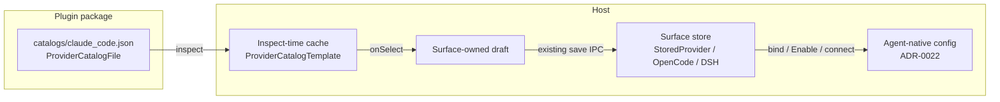
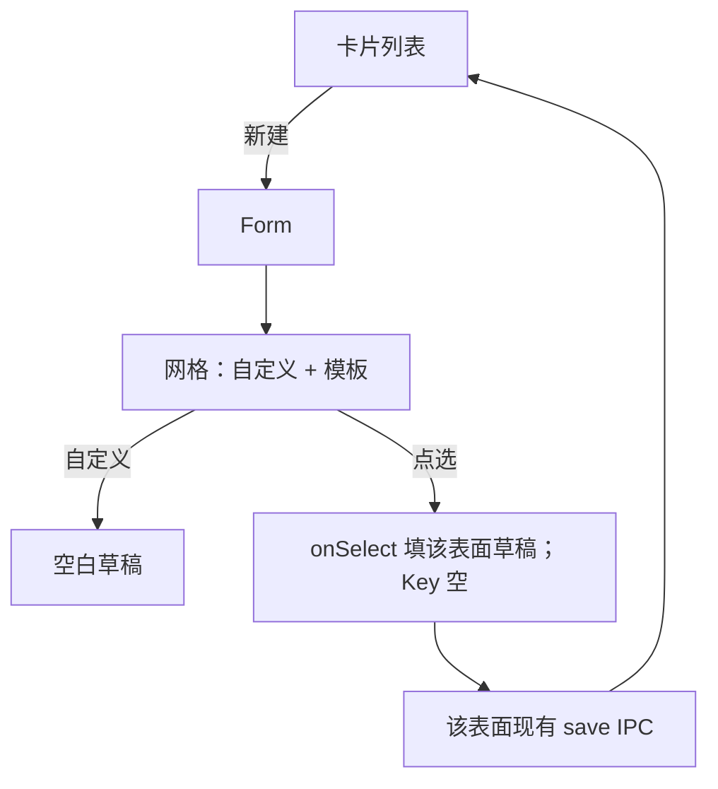

# ProviderSwitch：供应商预置目录插件与 Host 基础能力补足

| 字段 | 值 |
| --- | --- |
| 状态 | Draft |
| 作者 | VibeX maintainers |
| 日期 | 2026-09-13 |
| 相关 ADR | ADR-0022、ADR-0063、ADR-0064、ADR-0066、ADR-0069、ADR-0078 |
| 拟新增 ADR | ADR-0079（本设计落地时撰写；见 §13） |

---

## Overview

VibeX 当前「设置 → Agent → 鉴权 → 供应商」的新建表单是空白的（名称 / API URL / API Key / 模型）。用户要的不是再做一个 CC-Switch，也不是把 `provider.model.importSource` 扩成目录：他们要的是 **每个支持供应商模式的 Agent 都有一份预置模板目录**；点选模板填表，用户只补密钥；保存后成为 VibeX 自己的 Model Provider preset；启用（绑定）仍投影到 Agent 原生配置。

本设计分两层交付：

1. **Part A — 基础能力补足。** 新增稳定贡献点 `provider.model.catalog`、Host 聚合命令 `provider_catalog_list`、Catalog DTO，以及现有新建表单对目录的消费。这些能力走公开 SDK，Host **不得**按插件 ID `vibex.provider-switch` 特判。
2. **Part B — 官方产品插件 ProviderSwitch。** 以 CC-Switch MIT 预置数据为来源，整理成按 VibeX Agent id 分文件的版本化 JSON 目录。安装并启用后：可复用 Model Provider 与 DSH 自定义的**新建**表单顶部出现可搜索模板网格（首位永远是 Host 的「自定义」）；OpenCode / MiMo 的供应商表面把插件模板**合并进现有** `models.dev` 列表并标注来源，不另开第二张网格。禁用后模板消失，已保存连接保留。

Runtime 权威仍是 Agent 原生配置（ADR-0022 / ADR-0063）。本插件不引入本地协议转换代理、不全量覆盖原生快照、不成为配置权威。

---

## Background & Motivation

### CC-Switch 实际做的事（已核对 [farion1231/cc-switch](https://github.com/farion1231/cc-switch)，MIT）

CC-Switch 不是「导入已有配置」。主列表是 **已经添加的供应商卡片**。添加流程：

1. 选择 App（Claude / Codex / Gemini / Grok Build / OpenCode / OpenClaw / Hermes / Pi，外加 Claude Desktop）。
2. 「添加」打开全屏表单；顶部是 `ProviderPresetSelector` 网格（`src/components/providers/forms/ProviderPresetSelector.tsx`）。
3. **第一格永远是 Custom。** 其余来自 `src/config/*ProviderPresets.ts`，可搜索；默认排序为官方 → 尊享合作伙伴 → 赞助商 → 其余按显示名。
4. 点选预置填入名称、官网、Base URL、模型/环境变量、API Key 字段名、endpoint 候选。用户主要填 Key（或走 OAuth）。
5. 保存后卡片出现在 **该 App 的列表**。「Enable」把一份快照写入该 App 的原生配置。未保存的目录项不会自动变成卡片。

2026-09-13 对 CC-Switch tag `v3.20.3`（commit `d695a2d77fd9081eafd3e9eedcbf2a97b3410928`）`websiteUrl` 顶层条目的**约数**（比 README「50+」新，也比笼统数 `name:` 更准；Hermes/OpenCode/Pi 文件里大量嵌套 `name:` 是模型而不是供应商）。ADR-0079 只记「约」，不把约数写成契约：

| CC-Switch App | 文件 | 顶层预置约数 |
| --- | --- | --- |
| Claude Code | `claudeProviderPresets.ts` | 90 |
| Claude Desktop | `claudeDesktopProviderPresets.ts` | 87 |
| Codex | `codexProviderPresets.ts` | 85 |
| Gemini | `geminiProviderPresets.ts` | 26 |
| Grok Build | `grokBuildProviderPresets.ts` | 39（另加官方 seed） |
| Hermes | `hermesProviderPresets.ts` | 79 |
| OpenClaw | `openclawProviderPresets.ts` | 78 |
| OpenCode | `opencodeProviderPresets.ts` | 78 |
| Pi | `piProviderPresets.ts` | 74 |

典型 Claude 预置形状：`name` / `websiteUrl` / `apiKeyUrl` / `apiKeyField` / `settingsConfig.env`（`ANTHROPIC_BASE_URL`、模型 env）/ `endpointCandidates` / `category` / `isPartner` / `primePartner` / `apiFormat` / `requiresOAuth` / `providerType`。这些是 **模板**，不是已保存供应商。Codex 预置额外带将写入 `~/.codex/auth.json` 的 `auth` 与将写入 `config.toml` 的 TOML 字符串。

CC-Switch 还有本设计 **明确不搬** 的部分：本地 Chat Completions 路由器、`apiFormat` 协议转换、Codex/xAI OAuth 反向代理、Universal Provider 跨 App 同步、赞助商促销文案、心形/星标徽章、尊享/赞助商分组标题。赞助商层次只用于 Host 默认排序（Key Decision 16），不进 UI。

### VibeX 当前状态（已核对代码）

- **Model Provider preset**（CONTEXT / ADR-0063）：VibeX 自有可复用连接意图。存储为 `crates/server/src/host/native/model_providers.rs` 的 `StoredProvider { id, name, agent_id, api_url, api_key, model }`。绑定 = 启用；绑定把已适配字段投影进 Agent 原生配置。IPC 不回显密钥。
- **Agent 鉴权模式**（ADR-0064 / `crates/agents/src/auth_mode.rs`）：官方订阅 / 官方 API / 供应商，档案声明组合。本目录 **只出现在供应商模式的新建表单**。
- **外部供应商导入**（ADR-0063，经 ADR-0069 改为贡献）：一次性把 **已经配好的连接** 收成 preset。内置来源是原生配置与 `~/.cc-switch/cc-switch.db`（`crates/server/src/host/native/model_provider_import.rs`）。插件来源是 `provider.model.importSource`。导入不绑定。
- **现有插件缝**（ADR-0069 Batch 1）：
  - 贡献 kind：`provider.model.importSource`（`packages/plugin-sdk/src/manifest.ts` `ProviderImportSourceIntegrationManifest`）。
  - `host.call`：`provider.presets.list / save / bind`（`crates/plugins/src/host_capability_broker.rs`、`crates/plugins/src/provider_presets.rs`）。
  - DTO：`ProviderPreset` / `ProviderPresetDraft` 只有 `name, agentId, apiUrl, apiKey, model, has_api_key, bound`。
  - 官方示范：`assets/plugins/provider-import/`（`vibex.provider-import`，环境变量收成，是 **authoring sample**，不进发行物；见 `scripts/package-host-family.js` 的 `AUTHORING_SAMPLE_PLUGIN_DIRS`）。
- **前端新建/编辑**：
  - 可复用 Model Provider：`frontend/src/pages/settings/AgentModelProviderManager.tsx`（空白表单；导入菜单消费 `provider_import_source`）。
  - OpenCode / MiMo Code 供应商：`OpenCodeProviderConnections.tsx`。`surface="provider"` **已经**渲染 `agent-provider-catalog`（文案 `openCodeBuiltInProviders`），数据来自 `opencode_provider_catalog`（models.dev），点选走 `adoptCatalogProvider` 填入同一页始终可见的连接表单。该表面另有 CC Switch 导入，**没有** `provider.model.importSource` 菜单。编辑已保存连接也是填同一张表，目录不消失。
  - DeepSeek Harness 自定义：`DshAuthPanel.tsx`（list → form；`notes` 随 `DshProviderSaveRequest` 持久化）。无导入菜单。
- **已有「catalog」命令（都不是本设计的目录）：**
  - `agent_model_provider_catalog`（`agentManagementApi.modelProviderCatalog`）：对**已填** url/key 探测 `/models`。
  - `opencode_provider_catalog`（`agentManagementApi.openCodeProviderCatalog`）：models.dev Provider 目录。
- **保存路径：** 可复用表面 `saveModelProvider` → `AgentModelProviderSaveRequest { id, name, agent_id, api_url, api_key, model }`。OpenCode/MiMo：`OpenCodeProviderConnectRequest { provider_id, name, npm, api, base_url, api_key, models[], enabled }`。DSH：`DshProviderSaveRequest { id, display_name, notes, api, base_url, api_key, models[], set_default, default_model }`。插件不能拥有卡片。

`provider.model.importSource` 的契约（handler 返回已发现连接；缺 Key 的项列出但禁止勾选；导入即 `save`）**不能**表达「空白表单展示无密钥模板、点选只填表」。`frontend/src/pages/settings/agentModelProviderImport.test.ts` 把「无密钥不可保存」写成了回归。

痛点：用户在供应商新建表单面对空白字段，必须自己知道各中转的 Base URL 与模型 id。CC-Switch 用模板目录解决了这件事；VibeX 缺的是 **Host 级目录贡献点 + 官方目录数据**，不是再做一个独立供应商 App。

---

## Goals & Non-Goals

### Goals

1. 启用带 `provider.model.catalog` 贡献的插件后，对应 Agent 的供应商表面能选用无密钥模板：可复用 Model Provider 与 DSH 自定义走新建子页网格（首位永远是 Host「自定义」）；OpenCode / MiMo 把模板合并进现有 models.dev 列表。
2. 点选模板填充**该表面自己的**草稿；用户补 Key（或选 endpoint 候选）后，保存仍走该表面现有 Host IPC；保存后连接出现在该 Agent 列表。
3. 禁用/卸载插件 → 可复用/DSH 的新建网格或 OpenCode 的插件行原子消失；已保存连接与绑定不受影响。插件未启用时，可复用/DSH 空白自定义表单与 OpenCode models.dev 列表与今天一致。
4. 多插件目录可聚合；冲突可解释，不按安装顺序静默覆盖。
5. 官方插件 ProviderSwitch 提供按 Agent 整理的预置数据，许可与归属清晰，不直播抓 GitHub。
6. 新贡献点与 ProviderSwitch 作为第一个官方消费者同批达到 ADR-0066 稳定面四项（CLI validate、Host inspect、真实 UI 消费、作者文档）。

### Non-Goals

- 不成为 CC-Switch：无本地代理、无协议转换、无 Universal Provider 跨 Agent 同步、无赞助商促销文案、无心形/星标徽章、无尊享/赞助商分组标题。赞助商层次只用于排序。
- 不改 Runtime 权威：绑定仍投影已适配字段（ADR-0022 / ADR-0063）。
- 不复用或扩展 `provider.model.importSource` 来承载模板目录。
- 不把目录做成独立设置页或 iframe/federation App。
- 不在 Host 为 `vibex.provider-switch` 写特权分支。
- 不把官方 OAuth/订阅预置（Claude Official、OpenAI Official、Grok Official）放进供应商目录——那些属于官方订阅 / 官方 API。
- 本轮不实现插件；本文是可实施设计。

---

## Key Decisions

1. **新贡献点 `provider.model.catalog`，不复用 `provider.model.importSource`。** 导入源的产品动词是「收成已有连接」；目录的产品动词是「用模板填空白表单」。二者的 handler 返回值、缺 Key 语义、UI 入口都冲突。硬把它们塞进一个 kind 会弄坏现有导入回归，并在同一菜单里混两个动作。
2. **Host 渲染 descriptor，不给插件一块 App surface 替换新建表单。** 卡片列表、保存、绑定、测连、投影已是 Host 闭环。目录只是表单的数据。高频表单走 iframe/federation 会造出第二条保存路径，违反 maiden「不留残留」。渲染三轨里这属于宿主渲染 descriptor。
3. **目录数据放在插件里，不放进 Host。** 预置供应商会过时、带第三方商标与许可，且不是 L0。Host 只拥有聚合、校验、按 Agent 过滤、启停原子性。官方目录随 ProviderSwitch 版本更新。
4. **ProviderSwitch 是普通官方市场插件，默认禁用，不是能力等价插件。** ADR-0069 §8：自动启用白名单只适用于「从内置迁出」的能力。这份目录是新能力，不是迁出。预装并默认开网格会在用户没要的时候突然塞进几十个第三方中转——那是推广，不是连续性。随 Host family 提供 bundled 快照，可从官方分类安装；安装后默认禁用，启用即出现网格。
5. **Catalog DTO 按表面判别联合；`StoredProvider` 仍瘦。** 模板不是「一个 `model` 字符串 + `extras` 袋子」。`surface` 为 `reusable` | `opencode` | `dsh`，各带该表面保存 IPC 已认识的字段（OpenCode 要 `provider_id` + `models[]`；DSH 的 `notes` **会保存**）。可复用表面上 website / 候选 URL / `apiKeyField` 仍只在填表期展示，不扩 `StoredProvider`。各表面通过 `onSelect(template)` 映射进自己的草稿，共享 picker 不写 `setApiUrl`。
6. **v1 kind 只接受静态 `resource`，不声明 `handler`。** 官方 ProviderSwitch 无 Worker。动态目录没有第一个官方消费者，按 ADR-0069 原则 3 不把未验收的 handler 写进稳定契约。日后若有动态消费者，另开 kind 修订并配生命周期（inspect 解析 resource；handler 仅在 `prepare_candidate` 成功之后、按贡献超时，失败写入 `sources[].error`、不失败激活代）。
7. **Custom 是 Host 所有，不是目录条目。** 可复用 / DSH 新建子页第一格永远是 Custom。OpenCode / MiMo 的空白连接表单就是 Custom，不另做第一格。插件不能移除 Custom。
8. **按 VibeX 规范 Agent id 分目录。** Gemini 目录只贡献 `antigravity`。不发射 `gemini`：`AgentId::parse("gemini")` 是另一字符串，Host 不得为匹配去特判 `AgentKind::Antigravity`（那是 import 源 `cc_switch_app_type` 的动词）。Claude Desktop 丢弃。Cursor / CodeBuddy / Qoder 无供应商模式，点名它们的贡献被过滤。
9. **CC-Switch 数据：整理后的版本化快照 + MIT 归属，不直播抓取。** 去掉 affiliate 参数、OAuth/协议转换字段、赞助商文案与徽章。`isPartner` / `primePartner` 是转换输入，映射到 `category` 之后不得出现在输出 JSON（Key Decision 16）。插件内 `scripts/sync-catalog.mjs` 从 CC-Switch **tagged release** 转换，CI 对未知字段失败。
10. **官方插件身份 `vibex.provider-switch`，落点 `assets/plugins/provider-switch`。** 与 `remote-ssh` 一样是官方产品包（进 bundled 发行物与官方分类），不是 `provider-import` 那种 authoring sample。优先独立 git 仓库以 submodule 挂入（ADR-0069 §8）；仓库未就绪时可先 in-tree，行为与 `remote-ssh` 相同。
11. **保存永远走现有 Host IPC，插件不拥有卡片。** ProviderSwitch **不**调用 `provider.presets.save`。用户在 Host 表单点保存。`provider.presets.*` 维持给「插件自己写 preset」的场景（导入源、未来的 App surface），本产品不用。
12. **多插件聚合：并列展示 + 次要来源标注；URL+名称相同也不删。** 可聚合缝（ADR-0069 §11）。用户用禁用插件来做替换。`category` 枚举为 `"official" | "prime" | "partner" | "community"`；缺省、省略、**任何未知值** → `"community"`。第三方 catalog 插件可写这四档；Host **不**按 `vibex.provider-switch` 特判。
13. **OpenCode / MiMo 供应商表面：由该表面自己合并，不挂 `ProviderCatalogPicker`。** `OpenCodeProviderConnections` 在 `surface="provider"` 已有可搜索、点选即填的 `opencode_provider_catalog` 列表（`catalogResults`：无查询 `slice(0, 8)`，有查询搜 `id/name/npm/env` 后 `slice(0, 20)`），编辑时目录不消失。再挂 picker 会变成三种发现 UI。合并算法见 A.6：models.dev 块保持今天的 filter/sort/slice；其后追加匹配查询的插件行；不共享 8/20 窗口；无 A–Z；`provider_id` 与 models.dev `id` 相同则两行都保留。不替换 models.dev。
14. **`provider_catalog_list` 的 scope 是 `plugin.read`，不是 `plugin.surface`。** 与 `plugin_contribution_catalog` 同级（只读目录）。`plugin.surface` 留给 `plugin_surface_open` / `plugin_invoke_contribution`。客户端挂在 `createPluginControlApi` 上，**不要**放进 `agentManagementApi` 以免和 `modelProviderCatalog` / `openCodeProviderCatalog` 撞名。
15. **转换脚本是产品。** 每条 v1 Agent 的 CC-Switch 字段 → 判别联合 payload 的规则、跳过条件、Claude JSON 键、Codex `serializeCodexModel` + 硬编码 `wire_api = "responses"`、Pi/Grok 把 `api` / `api_backend` 放进 `model` JSON——见附录 A。PR6 不得在附录之外发明编码。
16. **Host 默认排序移植 CC-Switch `sortPresetEntries` Original 模式（tag `v3.20.3`，`ProviderPresetSelector.tsx`）：官方 → 尊享 → 赞助商 → 其余按显示名。** 前三组是**分区拼接**，保持各贡献 JSON 数组顺序，**不**按名称重排；community 按 `name`（`en` locale）。层次编码为 `category`，不输出 `isPartner` / `primePartner` 布尔。无心形/星标徽章、无尊享/赞助商分组标题、无促销文案。A–Z 仅 picker：打平全部非 Custom 模板按 `name`，关闭后恢复 Host 默认。

---

## Part A — 基础能力补足

### A.1 能力清单（Capability Inventory）

| 能力 | 状态 | 当前位置 | 缺口 | 需要的工作 |
| --- | --- | --- | --- | --- |
| 已保存 Model Provider preset 的 CRUD / 绑定 / 投影 | 存在 | `crates/server/src/host/native/model_providers.rs`；IPC `save_model_provider` / `bind_model_provider`；前端 `AgentModelProviderManager` | DTO 只有 name/url/key/model；对本产品足够（hybrid） | 不改存储。绑定确认、审计已有 |
| 供应商模式表面 | 存在 | ADR-0064；`AgentAuthModeControl` 的 `modelProvider` 槽；`AgentSettings.tsx` 按 Agent 选择管理器 | 可复用/DSH 新建子页要网格；OpenCode `surface="provider"` 已有 models.dev 列表，不能再挂第二选择器 | `ProviderCatalogPicker` 只挂可复用 + DSH **新建**表单。OpenCode/MiMo **不挂 picker**，由 `OpenCodeProviderConnections` 把插件行追加进现有 `agent-provider-catalog-list`（A.6） |
| 外部导入（已有连接） | 存在 | 内置 `native` / `cc_switch`；贡献 `provider.model.importSource`；`pluginImportCandidates()` | 契约是「发现已有连接 + 缺 Key 不可选」。**不能**表达无密钥模板 | **不要**扩展此 kind。导入菜单保持原样 |
| `host.call provider.presets.list/save/bind` | 存在 | `host_capability_broker.rs` `call_provider_presets`；`ProviderPresetHost`；`host-api.v1.json` | Draft 太瘦；bind 需 Host 确认 | ProviderSwitch **不调用**。第三方动态目录若自己 save，仍用现有 API |
| 贡献点「模板目录」 | **缺失** | — | 无 kind、无 Host 聚合、无前端消费 | 新增 `provider.model.catalog`，v1 **仅** `resource`（见 A.2） |
| Host 列出某 Agent 的聚合模板 | **缺失** | 贡献目录 metadata 装不下每 Agent ~80 条 | 需要懒加载命令，避免每次 chrome 刷新带上数百 KB | 新增 DomainCommand `provider_catalog_list`，scope `plugin.read`（ADR-0078 单缝）。**不是** `agent_model_provider_catalog` / `opencode_provider_catalog` |
| 激活代下 UI/Provider 贡献即现即撤 | 存在 | `usePluginHostContributions` + `plugin-contributions-changed` | 目录查询必须订阅同一事件、丢掉过期 `generation` | picker / OpenCode 列表把 `plugin-contributions-changed` 与 `provider_catalog_list` 绑在一起 |
| OpenCode 供应商发现 UI | 存在 | `OpenCodeProviderConnections` 的 `agent-provider-catalog` + `opencode_provider_catalog` | 再加一张网格会变成三种发现 UI | **合并**进现有列表并标注来源，不替换 models.dev |
| 官方插件无特权 CI | 存在 | `scripts/check-plugin-no-privilege.mjs` | 新插件 ID 若出现在 Host 源码（非数据面）会失败 | 只把 ID 放进 `catalog.rs` 分类映射与 `officialPlugins.ts` 文案映射（已有 allowlist） |
| `vibex-plugin init` 模板 | 部分 | `provider-import` 模板示范的是导入源 | 无 catalog 模板，kind 不能进稳定面 | 新增 `provider-catalog` 模板，与官方消费者同批 |
| `vibex-plugin test --host` 旅程 | 部分 | `pluginHostJourney.ts` 覆盖 chrome / structure kinds | 未覆盖 catalog 出现/消失 | 扩展旅程：enable → 新建表单出现模板 → disable → 模板消失、已存 preset 仍在 |
| 作者文档 / Skill | 部分 | `docs/plugins/developer-guide.md` 只记载 `importSource` | 无 catalog 契约 | 同步 developer-guide、plugin-development Skill、CONTEXT 词表 |
| 预置供应商数据 | **缺失** | CC-Switch 只是只读导入源 | Host 不内置模板 | ProviderSwitch 插件内 JSON（Part B） |
| Claude Desktop 供应商 | 不适用 | VibeX 无此 Agent | — | 不移植 |
| Cursor / CodeBuddy / Qoder 供应商目录 | 不适用 | 无供应商模式（Cursor 的 `custom` 是官方 API） | — | Host 过滤；插件不要贡献这些 agentId |

### A.2 新贡献 kind：`provider.model.catalog`

**命名。** `provider.model.catalog`。Wire 的 Host catalog key：`provider_model_catalog`（与现有 `provider_import_source` 的 snake_case 规则一致，见 `ContributionKind::key()`）。

**产品语义。** 插件向「设置 → Agent → 鉴权 → 供应商 → 新建」贡献一份 **无密钥模板**。Host 聚合并渲染；点选只填 Host 表单。模板在用户保存之前不是 preset。

#### Manifest（TypeScript，`packages/plugin-sdk/src/manifest.ts`）

```ts
export interface ProviderCatalogIntegrationManifest
  extends IntegrationBase {
  kind: "provider.model.catalog";
  label: string;
  /** 静态目录 JSON，相对插件根。Host 在 inspect 时读取并校验。 */
  resource: string;
  icon?: ContributionIcon;
  /** 省略 = 该文件内的 agentId。非空则再与文件内容求交。 */
  agents?: string[];
  description?: string;
}
```

`resource` **必填**（与 `content.skill` 一样，`handler: false`）。v1 **禁止** `handler` 字段：出现则 CLI/inspect 报 `provider_catalog_handler_unsupported`。官方 ProviderSwitch 无 Worker。动态目录留待有官方消费者后再修订 kind。

`packages/plugin-sdk` 的 JSON Schema `kind` enum、`packages/plugin-contract/catalog/contribution-kinds.v1.json` 增加：

```json
{
  "id": "provider.model.catalog",
  "status": "preview",
  "handler": false
}
```

ProviderSwitch 与 init 模板、真实 UI 消费、作者文档齐套后，把 `status` 改为 `"ready"`。在此之前不得把该 kind 写进稳定面叙述。

#### Rust 解析（`crates/plugins/src/package.rs`）

新增：

```rust
pub struct ProviderCatalogContribution {
    pub id: String,
    pub label: String,
    pub icon: Option<String>,
    pub resource: String,      // relative, inspect-time readable
    pub agents: Vec<String>,   // empty = no extra filter
    pub description: Option<String>,
}
```

挂到 `PackageAppContributions.provider_catalogs`。`parse_v4_integrations` 的 known-kind 列表与 `parse_provider_catalog` 必须与 importSource 对称：缺 `resource` 或 `resource` 逃出包根 → 不发布该条并 `warnings`（包仍可安装）。`agents` 非数组、出现 `handler` → 同样不发布。资源在 **inspect** 时读入并校验；`set_enabled` 对无 Worker 包只发布已解析缓存，不在控制面线程同步打 Worker。`publish_live_generation` 继续只发 contribution **描述符**（现有行为）；模板正文在插件 crate 的 per-generation 缓存里，由 `provider_catalog_list` 读取。

`ContributionKind` 增加 `ProviderCatalog` / key `"provider_model_catalog"`。`contribution.rs` 的 catalog 投影 metadata：

```json
{
  "resource": "catalogs/claude_code.json",
  "icon": "layers",
  "agents": ["claude_code"],
  "description": "…",
  "templateCount": 86
}
```

**不要**把模板数组塞进 contribution metadata（chrome 刷新会膨胀）。`templateCount` 仅作诊断。

#### CLI validate（`packages/plugin-cli/src/validation.ts`）

- `kind` 允许 `provider.model.catalog`。
- 必填 `label`、`resource`（相对路径，禁止 `..`）。
- `resource` 必须存在且为 JSON 对象，符合 A.3 schema。
- `agents` 若出现必须是 string 数组。
- 出现 `handler` → **error**（v1 不支持）。
- 每个模板 `agentId` 必须是非空字符串。
- **每一个 URL 字段**（`apiUrl` / `websiteUrl` / `apiKeyUrl` / `endpointCandidates[]`，以及 OpenCode/DSH 的 `baseUrl`）必须是无 userinfo 的 `http`/`https`。`javascript:`、带用户名密码、查询参数含 `token` / `api_key` / `aff`（大小写不敏感）→ **error**（拒绝，不静默剥离后放行）。这是 kind 契约，不只是 ProviderSwitch 转换卫生。
- 任何模板含 `apiKey` / `token` / `Authorization` / `auth` 等密钥字段 → **error**。

#### Host inspect

`PluginPackage::inspect` 读取 resource，解析模板，丢弃非法行并 warning（`provider_catalog_template_invalid`），合法模板进入该包的只读缓存，启用时挂到激活代（见 A.4）。图标必须属于 `packages/plugin-contract/catalog/icons`。无 Worker 的包不调用 `prepare_candidate` 的 Worker 路径。

#### init 模板

`vibex-plugin init --template provider-catalog` 写出：

- 一条 `provider.model.catalog` 贡献；
- `catalogs/example.json` 含 2 条假模板（无密钥）；
- 无 worker；
- `test/plugin.test.mjs` 断言 JSON 无密钥、agentId 稳定；
- 产物必须立刻通过 `build / validate / test`。

该模板与 ProviderSwitch **同一 PR 批次** 进稳定面（原则 3）。

### A.3 Catalog DTO vs 已保存 preset vs 原生投影

三层对象，禁止互相冒充。



插件 JSON 与 Host view 共用同一判别联合。`generate-types` 对该类 view 输出 **snake_case** 字段（与 `AgentModelProviderView.api_url` 相同）。picker 只读这些字段，不读 camelCase 别名。

#### 1) 插件文件 schema（`ProviderCatalogFile`）

```ts
interface ProviderCatalogFile {
  schemaVersion: 1;
  agentId: string; // 规范 id，如 "claude_code" / "antigravity" / "opencode"
  templates: ProviderCatalogTemplate[];
}

interface ProviderCatalogChrome {
  id: string; // 插件内 + agent 内稳定。Host 合成 `${pluginId}/${contributionId}/${id}`
  name: string;
  websiteUrl?: string;
  apiKeyUrl?: string;
  endpointCandidates?: string[];
  apiKeyField?: string;
  category?: "official" | "prime" | "partner" | "community"; // 缺省、省略、任何未知值 → community
}

type ProviderCatalogTemplate = ProviderCatalogChrome &
  (
    | {
        surface: "reusable";
        apiUrl: string;
        /** 该 Agent 现有 editor 能 parse 的 JSON/纯字符串。附录 A。 */
        model: string;
      }
    | {
        surface: "opencode";
        providerId: string; // OpenCodeProviderConnectRequest.provider_id
        npm?: string;
        api?: string;
        baseUrl: string;
        models: Array<{ id: string; name: string }>;
      }
    | {
        surface: "dsh";
        displayName: string;
        baseUrl: string;
        /** DSH 自定义会写入 DshProviderSaveRequest.notes，不是填表期丢弃。 */
        notes?: string;
        api?: string; // 缺省 openai-completions，与 DshAuthPanel.save 一致
        defaultModel?: string;
        models: Array<{ id: string; name?: string }>;
      }
  );
```

Rust 侧 `#[serde(tag = "surface", rename_all = "snake_case")]` 枚举。文件里的 camelCase（`providerId`、`baseUrl`）由 serde alias 接受；**Host 命令返回 snake_case**。

**禁止字段（CLI/inspect 拒绝）：** `apiKey`、`token`、`auth`、`settingsConfig`、`apiFormat`、`requiresOAuth`、`providerType`、`theme`、`partnerPromotionKey`、`isPartner`、`primePartner`、`hidden`、`extras`、`handler`。CC-Switch 源数据在构建期转换掉。

`surface` 必须与文件 `agentId` 匹配：`opencode`/`mimo_code` → `opencode`；`deepseek_harness` → `dsh`；其余供应商 Agent → `reusable`。错配的模板丢弃。

#### 2) Host 聚合视图

```rust
pub struct ProviderCatalogTemplateView {
    pub id: String,
    pub plugin_id: String,
    pub contribution_id: String,
    pub plugin_label: String,
    pub agent_id: AgentId,
    pub name: String,
    pub website_url: Option<String>,
    pub api_key_url: Option<String>,
    pub endpoint_candidates: Vec<String>,
    pub api_key_field: Option<String>,
    pub category: String, // "official" | "prime" | "partner" | "community"；未知值 list 时归一成 community
    pub surface: ProviderCatalogSurface, // reusable | opencode | dsh
    // reusable
    pub api_url: Option<String>,
    pub model: Option<String>,
    // opencode
    pub provider_id: Option<String>,
    pub npm: Option<String>,
    pub api: Option<String>,
    pub base_url: Option<String>,
    pub models: Vec<ProviderCatalogModelView>,
    // dsh
    pub display_name: Option<String>,
    pub notes: Option<String>,
    pub default_model: Option<String>,
}

pub struct ProviderCatalogModelView {
    pub id: String,
    pub name: Option<String>,
}

pub struct ProviderCatalogListView {
    pub agent_id: AgentId,
    pub generation: u64,
    pub templates: Vec<ProviderCatalogTemplateView>,
    pub sources: Vec<ProviderCatalogSourceView>,
}

pub struct ProviderCatalogSourceView {
    pub plugin_id: String,
    pub contribution_id: String,
    pub label: String,
    pub template_count: u32,
    pub error: Option<String>,
}
```

v1 无 handler，`sources[].error` 仅用于 inspect 截断/资源读失败。`list` **永不**含密钥。

#### 3) 已保存连接（各表面自己的 store，不扩展）

- 可复用：`StoredProvider` / `AgentModelProviderSaveRequest` 仍是 `name, api_url, api_key, model`。website / `endpointCandidates` / `apiKeyField` **填表期展示，保存丢弃**。
- OpenCode/MiMo：`OpenCodeProviderConnectRequest`；`models[]` **保存**。
- DSH：`DshProviderSaveRequest`；`notes` **保存**。

#### 4) 填表映射：表面拥有，picker 不管

`ProviderCatalogPicker` 只调用 `onSelect(template | 'custom')`。禁止在共享组件里 `setApiUrl` / `setProviderId`。

| 表面 | `onSelect('custom')` | `onSelect(template)` | 保存 |
| --- | --- | --- | --- |
| 可复用新建 | `resetForm()` | `name/apiUrl/model` 来自 reusable 臂；Key 空；候选 URL 进局部 state | `saveModelProvider` |
| OpenCode/MiMo | 清空始终可见的连接表单 | `providerId/name/npm/api/baseUrl/models` 来自 opencode 臂；Key 空 | `openCodeProviderConnect` |
| DSH 自定义新建 | `openCustomCreate` 的空草稿 | `displayName/baseUrl/notes/models/defaultModel`；Key 空 | `saveDshProvider`（`notes` 写入） |

**不能投影的字段**在转换期丢弃（附录 A）。Host 不弹实现向提示。转换后 reusable 无 `apiUrl`、opencode 无 `baseUrl`+`providerId`、dsh 无 `baseUrl` → inspect 丢弃该模板。

#### 5) 各 Agent 绑定投影（现状，不新发明）

| Agent id | 表面 | 原生落点 | payload |
| --- | --- | --- | --- |
| `claude_code` | reusable | `~/.claude/settings.json` env | `model` = Claude mapping JSON（附录 A） |
| `codex` | reusable | `config.toml` `model_providers.vibex`；`wire_api` **硬编码 `"responses"`** | `serializeCodexModel` JSON |
| `antigravity` | reusable | Gemini/Antigravity settings | 默认模型字符串 |
| `grok` | reusable | `~/.grok/config.toml` | `model` JSON 含 `api_backend` |
| `kimi_code` / `hermes` / `openclaw` / `cline` | reusable | 各自 apply_* | `{ default, models }` 或单 id |
| `pi` | reusable | settings/models/auth.json；`pi_wire_api` 读 `model` JSON 的 `api` | `model` JSON 含 `api` |
| `opencode` / `mimo_code` | opencode | OpenCode/MiMo 原生存储 | opencode 臂 |
| `deepseek_harness` | dsh | `.credentials.yaml` | dsh 臂 |

本设计 **不**扩展投影。依赖 Claude 协议转换（`apiFormat: openai_chat` 等）或 Codex 非 `responses` 的 CC-Switch 预置 **跳过**（附录 A）。

### A.4 新 Host 命令（不是 host.call）

插件不需要读取别人的目录（单层扩展）。**不**新增 `host.call`。现有 `provider.presets.*` 不变。

**不要**把本命令当成下面两个已有命令：

| 已有命令 | 客户端 | 做什么 |
| --- | --- | --- |
| `agent_model_provider_catalog` | `agentManagementApi.modelProviderCatalog` | 对已填 url/key 探测 `/models` |
| `opencode_provider_catalog` | `agentManagementApi.openCodeProviderCatalog` | models.dev |

新命令：

| 项 | 值 |
| --- | --- |
| DomainCommand | `ProviderCatalogList` |
| 命令名 | `provider_catalog_list` |
| scope | **`plugin.read`**（与 `plugin_contribution_catalog` 同级，见 `crates/application/src/domain.rs`）。**不是** `plugin.surface` |
| 参数 | `{ agentId: string }` |
| 返回 | `ProviderCatalogListView`（200） |
| 错误 | 见下表 |

**错误语义（闭合，禁止「空或 unknown」）：**

| 输入 | 结果 |
| --- | --- |
| `agentId` 无法 `AgentId::parse` | `provider_agent_unknown` |
| 已知 Agent、无供应商表面（Cursor / CodeBuddy / Qoder） | **200**，`templates: []`，`sources: []` |
| 已知供应商 Agent、无启用贡献 | **200**，空 templates |
| Host 无插件控制面 / 缓存不可用 | `provider_catalog_unavailable` |

实现落点：

- `crates/plugins`：inspect 时解析 resource，缓存在包上；启用后挂到激活代。v1 **不**在 publish 时调 Worker。
- `crates/server/src/host`：DomainCommand；按 **字符串相等** 的 `agent_id` 过滤（`antigravity` 不匹配 `gemini`）。
- `crates/application/src/domain.rs`：`ProviderCatalogList => "provider_catalog_list" / "plugin.read"`。
- `shared/hostCommands.ts`：scope `plugin.read`。
- `generate-types`：snake_case view。
- **无 SQLx**。

前端客户端：**只**加在 `createPluginControlApi`：

```ts
providerCatalogList: (agentId: string) =>
  transport.call('provider_catalog_list', { agentId })
```

**不要**加在 `agentManagementApi` 上，以免与 `modelProviderCatalog` 并排被误接。

懒加载：可复用/DSH 打开新建子页时；OpenCode/MiMo 在 `surface="provider"` 挂载时（与现有 `loadCatalog` 并行）。列表页（可复用卡片列表、DSH 自定义列表）不预拉。

### A.5 聚合、排序、去重

输入：该 `agentId` 上所有 **已启用** 插件的 catalog 贡献。

规则：

1. **Custom 不是聚合项。** 可复用/DSH 网格第一格由 Host 写死。OpenCode 无 Custom 格。
2. **过滤。** 模板 `agent_id` 必须与请求 **字符串相等**。无供应商表面 → 空列表 200（A.4）。
3. **不去重删除。** 相同归一化 URL+名称的两条都保留，次要文本 `plugin_label`。安装顺序不决定输赢。
4. **Host 默认排序（匹配 CC-Switch `sortPresetEntries` Original，tag `v3.20.3`）：** 对同一 `agentId`、所有已启用插件的模板：
   1. 按 `category` 分区为 official / prime / partner / community（缺省、省略、**任何未知值 → community**）。一条模板只进最早一组（输出 JSON 的 `category` 已互斥；转换映射也互斥）。
   2. official、prime、partner：**分区拼接，不按名称重排**。组内保持该贡献 JSON 数组顺序；跨插件稳定次序为 `plugin_id`、`contribution_id`、数组下标。
   3. community：按 `name`（`en` locale，锁定避免 UI locale 漂移），然后 `plugin_id`、`contribution_id`、`id`。
   4. 拼接：official + prime + partner + community。
   5. Custom 格仍由 Host 写死、仍在可复用/DSH 网格第一位，不是 catalog category。
   转换脚本必须按 CC-Switch 源文件数组顺序写出 templates，步骤 2–4 才能复现 `sortPresetEntries`。
5. **搜索（仅 picker 网格）。** 可复用/DSH picker 对 `name`、reusable 的 `api_url`、dsh 的 `base_url`、`website_url` 做大小写不敏感包含。OpenCode 搜索见 A.6（复用现有 `catalogQuery`，插件行另搜 `provider_id`/`npm`/`base_url`/`name`）。
6. **A–Z 开关仅属于 `ProviderCatalogPicker`（可复用/DSH 网格）。** 打开：打平全部非 Custom 模板，按 `name`（`en` locale），忽略四档。关闭：恢复 Host 默认。OpenCode **没有** A–Z，不得把该开关接进 `catalogQuery`。
7. **错误隔离。** v1 无 handler。资源读失败：该 `sources[].error` 有值、templates 为空；其它源照常。无模板且全部源失败：一句「无法加载预置供应商」。
8. **上限。** 每贡献 500 条；每 resource 2 MiB；每插件 16 个 catalog 贡献。超出 inspect warning 并截断。
9. **Claude-only 插件在 Codex 上。** `usePluginHostContributions('provider_model_catalog')` 是全 Agent 的。Codex 打开新建时 picker 仍可挂载，但 `provider_catalog_list('codex')` 为空 → 只显示 Custom。搜索框在 `templates.length === 0` 时 **不渲染**（「搜索可隐藏」= 无模板可搜时隐藏搜索与 A–Z）。

### A.6 前端 Host 消费

#### 共享选择器是展示组件

新建 `frontend/src/pages/settings/ProviderCatalogPicker.tsx` + `ProviderCatalogPicker.test.tsx`。

**契约（PR4 必须遵守，禁止写死可复用 setter）：**

```ts
type ProviderCatalogPickerProps = {
  templates: ProviderCatalogTemplateView[];
  generation: number;
  showCustomTile: boolean;
  disabled?: boolean;
  onSelect: (next: ProviderCatalogTemplateView | 'custom') => void;
};
```

picker **只**给可复用/DSH 新建网格用。不 import 任一表面的 setter。读 snake_case：`api_url`、`base_url`、`website_url`、`plugin_label`。无 `layout="rows"`——OpenCode 不挂本组件。

#### 三条表面怎么挂

1. **可复用 Model Provider**（`AgentModelProviderManager`）：仅 `openCreate`（`surface === 'form' && !id`）。挂 `ProviderCatalogPicker`，`showCustomTile`。编辑已保存卡片（`id` 非空）**不**挂。
2. **DSH 自定义**（`DshAuthPanel`）：仅 `customSurface === 'form' && editingId === null`。同上。
3. **OpenCode / MiMo**（`OpenCodeProviderConnections`，`surface="provider"`）：**不挂** `ProviderCatalogPicker`。该组件 **拥有** 合并：在现有 `catalogResults` 算出的 models.dev 行之后，把插件行写进同一个 `ul.agent-provider-catalog-list`。`surface="official"` / `"go"` **不**追加。

#### OpenCode 合并算法（PR5 必须按此实现）

今天 `catalogResults`（`OpenCodeProviderConnections.tsx`）：

```ts
const visible = catalog?.providers.filter((p) =>
  matchesOpenCodeSurface(p.id, surface)
) ?? [];
if (!query) return visible.slice(0, 8);
return visible.filter(/* id, name, npm, env */).slice(0, 20);
```

`normalize_models_dev` 已按 name 排好。插件禁用时这段逻辑一行都不能改。

启用且 `surface === "provider"` 时，**同一** `<ul>` 的内容是：

1. **models.dev 块（先）：** 仍用上面的 `catalogResults`。filter / 搜索字段 / `slice(0, 8|20)` / 排序 **全部保持今天**。插件行 **不占用** 这个 8/20 窗口。
2. **插件块（后）：** `provider_catalog_list(agentId)` 里 `surface === "opencode"` 的模板。不按 Host 四档重排 models.dev。插件块内部沿用 A.5 Host 排序（official → prime → partner → community 按 name）。仍无 A–Z。
3. **插件行搜索：** 同一个 `catalogQuery`。无查询 → 追加该 Agent 全部 opencode 模板（**不再 slice**）。有查询 → 保留 `name`、`provider_id`、`npm`、`base_url` 大小写不敏感包含命中的模板。不搜 `website_url`（避免和 models.dev 的 `env` 搜索语义搅在一起）。
4. **无 A–Z。** 不得在 OpenCode 搜索框旁加 Host picker 的排序开关。
5. **id 碰撞：** 插件 `provider_id` 与某条 models.dev `id` 相同（例如 `openai`）→ **两行都保留**。models.dev 行仍用现有 auth_kind / model count；插件行次要文本用 `plugin_label`（i18n `providerCatalogSourcePlugin`）。`<li key>`：models.dev 用 `id`；插件用 `` `${plugin_id}:${id}` ``。
6. **点选：** models.dev 行 → 现有 `adoptCatalogProvider`。插件行 → 该表面把 opencode 臂写入同一连接表单（`providerId`/`name`/`npm`/`api`/`baseUrl`/`models`，Key 空）。不要经过 picker 的 `onSelect`。
7. **Custom：** 空白连接表单即 Custom；无 Custom 格。
8. **编辑：** 目录保持可见（现有行为）。再点一行覆盖草稿。
9. **像素门禁：** 插件禁用或 `provider_catalog_list` 为空时，`.agent-provider-catalog` 内 models.dev 块的 DOM/文案/搜索/`slice` 与今天 **逐节点一致**（测试可对 `catalogResults` 映射的 `li` 做 snapshot）。不得为合并去改 models.dev 的 class 或 heading。

| 选项 | 结论 |
| --- | --- |
| 替换 models.dev 列表 | 否 |
| 第二张 `ProviderCatalogPicker`（含 `layout="rows"`） | 否。picker 的 props 只有插件 `templates`，无法渲染 models.dev 行 |
| **表面自有合并、models.dev 先行、插件行追加** | **采用** |

#### 可复用 / DSH 网格交互



- 搜索「搜索预置」；A–Z 见 A.5。`templates.length === 0` 时隐藏搜索与 A–Z，只留 Custom。
- token：`--surface-card-strong`、`--text-strong`、`--text-muted`、`--border-subtle`，14px 圆角。
- 零贡献且命令返回空：可复用/DSH **不渲染 picker**（今天的空白新建表）。不要「启用 ProviderSwitch…」。
- 点选模板：表面映射字段；`endpoint_candidates` 由表面在 URL 旁出 `AstryxSelect`。`website_url` / `api_key_url` 次要链接。dsh 的 `notes` 进草稿并保存。reusable 臂 **没有** `notes` 字段，不要画一行备注。
- 禁用插件：已填草稿保留。

#### 启停与 generation

- `usePluginHostContributions('provider_model_catalog')` 只决定「有没有任一 catalog 贡献」。模板正文来自 `pluginApi.providerCatalogList(agentId)`。
- 订阅 `plugin-contributions-changed`（scope `plugin.read`）时 **invalidate** `provider_catalog_list` 与贡献目录。
- 丢弃 `generation` **小于** 当前贡献目录 `generation` 的响应。
- 禁用后：可复用/DSH 下次新建无网格；OpenCode 列表只剩 models.dev。

#### i18n（en + zh-CN）

- `providerCatalogCustom`：自定义
- `providerCatalogSearch`：搜索预置
- `providerCatalogEmpty`：没有匹配的预置。
- `providerCatalogWebsite`：网站
- `providerCatalogGetKey`：获取密钥
- `providerCatalogLoadFailed`：无法加载预置供应商。
- `providerCatalogSortName`：按名称
- `providerCatalogSourcePlugin`：预置（插件行来源标签，短）

不写「CC-Switch 兼容层」。OpenCode 现有 `openCodeBuiltInProviders` 文案保留给 models.dev 行。

#### 样式

可复用/DSH 新 class 放在 `.agent-model-provider-*` 旁。OpenCode **复用** `.agent-provider-catalog-*`，不新调色板。

### A.7 Host/SDK 层测试（插件测试在 Part B）

| 层 | 用例 |
| --- | --- |
| CLI | 合法包通过；缺 resource 失败；含 `apiKey` 失败；`websiteUrl`/`apiKeyUrl`/`endpointCandidates` 非 http(s) 或带 userinfo/query token 失败；出现 `handler` 失败 |
| inspect | 发布 `provider_catalogs`；非法模板 warning 且不进缓存；`agentId: "gemini"` 的文件不匹配 `antigravity` 列表 |
| 聚合 | 两插件同 URL 都保留；未知 category → community；official/prime/partner 保数组顺序、不按 name 重排；community 按 name（`en`）；A–Z 打平四档 |
| broker | 无新 host.call；`provider.presets.*` 回归仍绿 |
| 命令 | 无法 parse 的 agentId → `provider_agent_unknown`；Cursor → 200 空列表；Host 挂了 → `provider_catalog_unavailable`；scope `plugin.read`；桌面与 server registry 都有 |
| 前端 picker | 纯展示：`onSelect` 被调用，组件内无 `setApiUrl`；零贡献不渲染；generation 过期丢弃 |
| 前端可复用 | 自定义第一；保存仍 mock `saveModelProvider` |
| CI | `plugin:no-privilege`；`generate-types:check` |

OpenCode 合并算法与 DSH `notes` 持久化的测试在 **PR5**。DSH 用 picker 的 `onSelect`；OpenCode **不**经过 picker。

### A.8 ADR 影响

**新增 ADR-0079**（建议标题：《供应商预置目录是插件贡献的模板，不是导入源，也不是 CC-Switch》）。要点：

- 修订 ADR-0069 §4：`provider.model.catalog`（resource-only）+ `provider_catalog_list`（`plugin.read`）；与 ProviderSwitch 同批进稳定面。
- **点名已有命令** `agent_model_provider_catalog` 与 `opencode_provider_catalog`，避免「catalog」一词撞车。
- **不修订** ADR-0063 导入语义。
- **不修订** ADR-0069 §8 能力等价白名单（代码里也还没有自动启用白名单实现；不要把 `vibex.provider-switch` 写进不存在的列表）。
- 重申 ADR-0022。
- 约数目录规模不写入 ADR 契约。

CONTEXT.md：Provider catalog template；External provider import / Model Provider preset 各加一句边界。

### A.9 插件源码开始之前必须落地的内容

1. ADR-0079 + CONTEXT。
2. SDK / contract / CLI / Rust parse / inspect（kind=`preview`，无 handler）。
3. Host 缓存 + `provider_catalog_list`（`plugin.read`）+ 生成类型。
4. 展示型 `ProviderCatalogPicker` 接入可复用新建表单（PR4）。
5. OpenCode 合并 + DSH 新建（PR5，依赖判别联合 DTO）。
6. 附录 A 转换表作为 PR6 前置（本文已给出，实现不得另发明编码）。
7. 然后 ProviderSwitch + init 模板把 kind 标 `ready`。

第 7 步之前，kind 不得进 developer-guide 稳定表。

---

## Part B — 插件功能设计

### B.1 包身份

| 字段 | 值 |
| --- | --- |
| Plugin ID | `vibex.provider-switch` |
| Publisher | `vibex` |
| 显示名 | ProviderSwitch（locale：en「Provider catalog」/ zh-CN「供应商预置」） |
| `summary`（README frontmatter，一句话） | 在新建供应商表单中提供按 Agent 分组的预置模板。 |
| 分类 | 官方分类；topic `other`（与 `remote-ssh` 相同，经 `BUNDLED_TOPIC_CATEGORIES`） |
| 发行 | Host family bundled 快照；**不是** `AUTHORING_SAMPLE_PLUGIN_IDS` |
| 默认激活 | Disabled（ADR-0066；非能力等价） |
| 源码位置 | `assets/plugins/provider-switch`（独立仓库 submodule；过渡期可 in-tree） |

`config.json`：v1 为 `{}`。不提供「隐藏社区中转」之类开关——过滤属于以后的需求，现在加开关会在没做功能时露出实现向配置。

`contents/`：不需要 Skill/MCP。本产品是 Host 目录贡献。

Worker / App surface：v1 **都不要**。Host 读静态 JSON。

### B.2 哪些 Agent 有目录

CC-Switch App → VibeX Agent：

| CC-Switch | VibeX `agentId` | v1 目录？ | 表面 |
| --- | --- | --- | --- |
| Claude | `claude_code` | 是 | `AgentModelProviderManager` |
| Codex | `codex` | 是 | 同上 |
| Gemini | **`antigravity` only** | 是 | 同上 |
| Grok Build | `grok` | 是 | 同上 |
| OpenCode | `opencode` | 是 | 合并进现有 models.dev 列表 |
| OpenClaw | `openclaw` | 是 | `AgentModelProviderManager` |
| Hermes | `hermes` | 是 | 同上 |
| Pi | `pi` | 是 | 同上 |
| Claude Desktop | — | **否** | 无此 Agent |

**不发射 `gemini`。** `AgentId::parse("gemini")` 是另一 id。`cc_switch_app_type` 把两者映射为 `"gemini"` 只用于 **导入**。Open Question 3 已关闭。

VibeX 有、CC-Switch 无：

| VibeX Agent | 供应商模式？ | v1 目录 |
| --- | --- | --- |
| `kimi_code` | 是（`custom` → Provider） | DeepSeek / Moonshot / OpenRouter / SiliconFlow（`subset-allowlist.toml`，不得留空、不得套 Claude 全量） |
| `cline` | 是 | 同上四家（allowlist `[[cline]]` 四行显式写出） |
| `mimo_code` | 是（OpenCode 表面） | 复制 OpenCode 的 `surface: "opencode"` 文件，只改 `agentId: "mimo_code"`（不走 allowlist） |
| `deepseek_harness` | 是（`custom`） | 同上四家，`surface: "dsh"`（allowlist `[[deepseek_harness]]` 四行显式写出） |
| `cursor` / `codebuddy` / `qoder` | 否 | 无 |

### B.3 数据来源、许可、维护

- **来源：** CC-Switch `src/config/*ProviderPresets.ts`，MIT（[LICENSE](https://github.com/farion1231/cc-switch)）。
- **第一枚钉子（v1 转换输入）：** tag `v3.20.3`，annotated tag object `2181dda6b4703a7870ffe8c52671947375dec6d0`，指向 commit `d695a2d77fd9081eafd3e9eedcbf2a97b3410928`。写入 `catalogs/SOURCE.toml`。后续升级换钉须改该文件并人工审附录 A 的跳过计数。
- **方式：** 构建期转换，不是运行期抓取。
- **归属：** `LICENSE`（插件自身，建议 Apache-2.0 或 MIT，与其它官方插件一致）+ `THIRD_PARTY_NOTICES.md` 引用 CC-Switch MIT 与 URL。README 不把 CC-Switch 说成 Runtime 依赖。
- **转换丢弃：**
  - 空 `apiUrl` 的官方 OAuth 预置（Claude Official、OpenAI Official、Grok Official、`requiresOAuth`、`providerType: github_copilot | codex_oauth | xai_oauth`）；
  - `apiFormat` 需要协议转换才能在该 Agent 工作的条目；
  - affiliate / `aff=` 查询参数（`websiteUrl` / `apiKeyUrl` 只留 origin + path）；
  - `theme`、`iconColor`、`partnerPromotionKey`（促销文案 / 徽章 / 分组标题不进输出）；
  - `isPartner` / `primePartner` 是转换输入，映射到 `category` 后不得出现在输出 JSON；
  - 完整 `settingsConfig` / `auth` / `config` TOML 快照——只抽取附录 A 的判别联合字段。
- **`category` 映射（排他，顺序与 CC-Switch `sortPresetEntries` 相同）：**
  1. `preset.category === "official"` → `"official"`
  2. else if `preset.primePartner` → `"prime"`
  3. else if `preset.isPartner` → `"partner"`
  4. else → `"community"`
  `cn_official` **不是** official。例：CC-Switch Kimi 是 `cn_official` + `primePartner` → `"prime"`；SiliconFlow `isPartner` → `"partner"`；DeepSeek `cn_official` 无 partner 旗标 → `"community"`。输出 JSON **禁止** `isPartner`、`primePartner`、`partnerPromotionKey`、`theme`、`iconColor`。templates 必须按 CC-Switch 源文件数组顺序写出，以便 Host 对 official / prime / partner 保序。手写 subset（`kimi_code` / `cline` / `deepseek_harness`）**不**从 CC-Switch 文件转换；`category` 钉在 allowlist 行上（B.4）。
- **维护：** `scripts/sync-catalog.mjs` 拉取钉死 tag → 转换 → 写 `catalogs/*.json`。人工审变更（尤其新 `apiFormat`）。不自动跟 CC-Switch main。预期体积：8 个完整目录 × ~80 × ~400 B ≈ 250 KB，外加 3 个小份文件。

### B.4 包布局

```
assets/plugins/provider-switch/
  README.md                 # frontmatter summary
  LICENSE
  THIRD_PARTY_NOTICES.md
  config.json               # {}
  catalogs/
    SOURCE.toml
    subset-allowlist.toml   # kimi_code / cline / deepseek_harness 钉死全文见下；编码见附录 A
    claude_code.json
    codex.json
    antigravity.json
    grok.json
    opencode.json
    openclaw.json
    hermes.json
    pi.json
    kimi_code.json
    cline.json
    mimo_code.json
    deepseek_harness.json
  scripts/sync-catalog.mjs
  test/plugin.test.mjs
  .vibex-plugin/plugin.json
```

manifest `integrations`：每个 JSON 一条贡献，例如 `id: "claude-code"`、`resource: "catalogs/claude_code.json"`、`agents: ["claude_code"]`。**一条贡献一个文件一个规范 agentId。** Gemini 只出 `catalogs/antigravity.json` / `agents: ["antigravity"]`。不写 `gemini` 文件。

`catalogs/subset-allowlist.toml` 钉死内容（PR6 **只**允许改本文件的 `name` / `apiUrl` / `websiteUrl` / `model` 数据；不得改 `model` JSON 键；`id` 为 `slug(name)` 且必须保持稳定；`category` 已钉死，PR6 不得发明）。手写 subset **不**从 CC-Switch 文件转换。官方 OpenAI 兼容端点，不是 Claude Anthropic-compat URL。`[[cline]]` 与 `[[deepseek_harness]]` 四行必须显式写出，实现不得写成「同 kimi_code」。

```toml
# catalogs/subset-allowlist.toml
# PR6 只允许改 name / apiUrl / websiteUrl / model（数据）。
# 不得改 model JSON 键。id 为 slug(name)，必须保持稳定。
# category 已钉死，PR6 不得发明或改写。

[[kimi_code]]
id = "deepseek"
name = "DeepSeek"
apiUrl = "https://api.deepseek.com"
websiteUrl = "https://platform.deepseek.com"
model = "deepseek-chat"
category = "community"

[[kimi_code]]
id = "moonshot"
name = "Moonshot"
apiUrl = "https://api.moonshot.cn/v1"
websiteUrl = "https://platform.moonshot.cn"
model = "kimi-k2.5"
category = "prime"

[[kimi_code]]
id = "openrouter"
name = "OpenRouter"
apiUrl = "https://openrouter.ai/api/v1"
websiteUrl = "https://openrouter.ai"
model = "openai/gpt-4o"
category = "community"

[[kimi_code]]
id = "siliconflow"
name = "SiliconFlow"
apiUrl = "https://api.siliconflow.cn/v1"
websiteUrl = "https://siliconflow.cn"
model = "Qwen/Qwen2.5-72B-Instruct"
category = "partner"

[[cline]]
id = "deepseek"
name = "DeepSeek"
apiUrl = "https://api.deepseek.com"
websiteUrl = "https://platform.deepseek.com"
model = "deepseek-chat"
category = "community"

[[cline]]
id = "moonshot"
name = "Moonshot"
apiUrl = "https://api.moonshot.cn/v1"
websiteUrl = "https://platform.moonshot.cn"
model = "kimi-k2.5"
category = "prime"

[[cline]]
id = "openrouter"
name = "OpenRouter"
apiUrl = "https://openrouter.ai/api/v1"
websiteUrl = "https://openrouter.ai"
model = "openai/gpt-4o"
category = "community"

[[cline]]
id = "siliconflow"
name = "SiliconFlow"
apiUrl = "https://api.siliconflow.cn/v1"
websiteUrl = "https://siliconflow.cn"
model = "Qwen/Qwen2.5-72B-Instruct"
category = "partner"

[[deepseek_harness]]
id = "deepseek"
name = "DeepSeek"
apiUrl = "https://api.deepseek.com"
websiteUrl = "https://platform.deepseek.com"
model = "deepseek-chat"
category = "community"

[[deepseek_harness]]
id = "moonshot"
name = "Moonshot"
apiUrl = "https://api.moonshot.cn/v1"
websiteUrl = "https://platform.moonshot.cn"
model = "kimi-k2.5"
category = "prime"

[[deepseek_harness]]
id = "openrouter"
name = "OpenRouter"
apiUrl = "https://openrouter.ai/api/v1"
websiteUrl = "https://openrouter.ai"
model = "openai/gpt-4o"
category = "community"

[[deepseek_harness]]
id = "siliconflow"
name = "SiliconFlow"
apiUrl = "https://api.siliconflow.cn/v1"
websiteUrl = "https://siliconflow.cn"
model = "Qwen/Qwen2.5-72B-Instruct"
category = "partner"
```

`category` 赋值理由（与 CC-Switch 旗标对齐，手写行不经转换脚本推断）：

| id | category | 理由 |
| --- | --- | --- |
| deepseek | community | CC-Switch DeepSeek 是 `cn_official`、无 partner 旗标 |
| moonshot | prime | CC-Switch Kimi/Moonshot 族是 `primePartner` |
| openrouter | community | CC-Switch OpenRouter 无 partner 旗标 |
| siliconflow | partner | CC-Switch SiliconFlow 是 `isPartner` |

`deepseek_harness` 行的 **dsh 编码**见附录 A：`displayName` ← `name`，`baseUrl` ← `apiUrl`，`notes` 省略，`api` = `"openai-completions"`，`defaultModel` ← `model`，`models` = `[{ id: model }]`。官方 DeepSeek API 模式（`DshAuthPanel` 的 `https://api.deepseek.com`）仍是独立鉴权模式；目录 DeepSeek 行是填同一 URL 的**自定义表单模板**。该重复被接受。

### B.5 UX（现有供应商表面内）

不新开设置页。交互见 A.6。

1. 安装后默认禁用 → 可复用/DSH 空白新建表与今天一致；OpenCode `surface="provider"` 仍只有 models.dev 列表。
2. 启用 → 可复用/DSH 新建子页出现网格；OpenCode 现有列表多出来源为插件的行。
3. 点选模板 → 该表面草稿填好，Key 空。
4. 填 Key，保存 → 该表面现有 IPC。
5. 禁用 → 网格/插件行消失；已保存连接仍在。

空/错/边界：

| 状态 | 行为 |
| --- | --- |
| 插件未安装/未启用 | 可复用/DSH 不渲染 picker；OpenCode 仅 models.dev |
| 已启用但该 Agent 无模板 | 可复用/DSH 只显示 Custom，隐藏搜索 |
| 该 Agent 无供应商模式 | 用户看不到本表单；命令 200 空列表 |
| 模板字段 Host 不能投影 | 转换期丢弃 |
| 表单脏时点另一模板 | 直接覆盖；返回列表才走现有 discard 对话框。OpenCode 与今天点 models.dev 相同 |

### B.6 与现有导入源的关系

只谈 **已经有导入入口的表面**：

- `AgentModelProviderManager`：原生 + CC Switch + `provider.model.importSource` 菜单 **原样保留**。
- `OpenCodeProviderConnections` `surface="provider"`：仅有 CC Switch 导入（无 importSource 菜单）**原样保留**。
- `DshAuthPanel`：**没有**导入菜单，不新增。

ProviderSwitch **不**贡献 `provider.model.importSource`。有导入的表面不要把 catalog 模板塞进导入预览（无 Key，会被标成不可选）。

### B.7 启用 / 禁用 / 卸载

| 操作 | 可复用/DSH 网格 | OpenCode 插件行 | 已保存连接 | 绑定 / 原生配置 |
| --- | --- | --- | --- | --- |
| 启用 | 出现 | 出现 | 不变 | 不变 |
| 禁用 | 原子消失 | 原子消失 | 保留 | 保留 |
| 卸载 | 消失 | 消失 | 保留 | 保留 |
| 更新 | 新激活代 | 新激活代 | 不按新模板改写 | 保留 |

卸载不删除用户 preset：那些是 Host 的 store，不是插件数据（ADR-0069 身份隔离）。

### B.8 i18n

插件 `label` 可用英文字面量；Host picker 文案走应用 locale（A.6）。模板 `name` 保持供应商专有名词（Kimi、OpenRouter），不本地化。`officialPlugins.ts` 增加 `vibex.provider-switch` → `providerSwitch`，`settings.json` en/zh-CN 提供 name/summary/readme。这是数据面映射，已在 no-privilege allowlist 中。

### B.9 测试

**插件单元（`vibex-plugin test`）：**

- 每个 JSON `schemaVersion === 1`，无密钥键；
- 每个 URL 字段通过 A.2 规则；`surface` 与 `agentId` 匹配；
- `id` 在文件内唯一；无 `gemini` agentId；
- Claude 目录不含 Official OAuth 条目；Codex 不含非 `responses` 预置；
- `SOURCE.toml` 钉死 `v3.20.3` / `d695a2d77fd9081eafd3e9eedcbf2a97b3410928`；
- `THIRD_PARTY_NOTICES.md` 存在。

**Host 旅程（`vibex-plugin test --host`）是新的 form-grid 类型**，不是只改 `catalogHasKinds`：

今天 `pluginHostJourney.ts` 的 `HOST_JOURNEY_KINDS` 只覆盖 chrome/structure；`testPluginOnHost` 只等贡献目录出现/消失。

PR6 必须：

1. `MANIFEST_KIND_TO_CATALOG["provider.model.catalog"] = "provider_model_catalog"`。
2. 扩展 `hostJourneyKindsFromIntegrations`（或并列 `CATALOG_KINDS`），enable 后 `catalogHasKinds` 看见 `provider_model_catalog`，disable 后 `catalogLacksKinds`。
3. **额外表单级断言**（超出贡献目录成员）：enable 后 `provider_catalog_list` 对包内某个 `agentId` 返回 `templates.length > 0`；disable 后同一 agent 返回空 templates（200）。没有绑定的 Host UI 时，这条走 `productHost.ts` 已有的 command 调用，与 chrome 旅程同一 `--host` 进程。

官方包 inspect 测试对标 **`crates/plugins/tests/bundled_remote_ssh.rs`**（bundled 产品插件），**不要**对标 `bundled_provider_import.rs`（authoring sample，不进发行物）。

**无特权：** 插件只依赖 `@vibex/plugin-sdk`（v1 甚至无 JS 入口）；Host 无 ID 分支。

### B.10 README 义务

一句话 `summary`。正文只保留用户要做的事：安装、启用、打开供应商新建表单、点选、填 Key、保存。不解释贡献点名称、不提 `host.call`、不承诺与 CC-Switch 同步。许可/归属放 THIRD_PARTY_NOTICES，不放进 UI。

---

## Alternatives Considered

### 1. 复用/扩展 `provider.model.importSource` vs 新 `provider.model.catalog`

| | 扩展 importSource | **新 catalog kind（胜出）** |
| --- | --- | --- |
| 动词 | 收成已有连接 | 用模板填空白表 |
| 缺 Key | 列出但禁止勾选（已有测试） | 期望状态 |
| UI | 导入菜单 + 多选 | 新建表单网格、单击 |
| 写入时机 | 确认导入即 save | 仅当用户保存表单 |
| 风险 | 破坏 `vibex.provider-import` 与 CC Switch 导入 | 多一个 kind，但同批有官方消费者 |

扩展 importSource 需要一个 `role: "catalog" | "import"` 分支，等于两个 kind 挤在一个名字里，导入菜单会出现无密钥「假连接」。否决。

### 2. 插件 App surface 替换新建表单 vs Host 渲染目录

| | iframe/federation 表单 | **Host picker（胜出）** |
| --- | --- | --- |
| 保存路径 | 插件必须调 `provider.presets.save`，或再做一套 | 现有 IPC，单一路径 |
| 绑定 | 插件还要走 bind 确认 | 用户在 Host 点启用，与今天相同 |
| 禁用 | 必须把表单所有权交还 Host，否则半残 | picker 卸载，表单仍在 |
| 密度 | ADR-0069：高频结构面才用 federation；这只是选列表 | descriptor 轨足够 |
| 无特权 | 表面可行，但 Host 仍要为「官方表单被换掉」写恢复逻辑 | Host 不识插件 ID |

否决插件拥有表单。

### 3. 目录放 Host vs 放插件

| | Host 内置 JSON | **插件（胜出）** |
| --- | --- | --- |
| 更新 | 跟 Host 发版，第三方中转迫使 Host 发版 | 跟插件发版 |
| 许可 | Host 发行物携带大量第三方商标/endpoint | 隔离在插件 + NOTICE |
| ADR-0069 | 内核膨胀，违反「先问为什么不能是插件」 | 标准 Provider 缝 |
| 禁用 | 做不到原子撤下 | 启用即现、禁用即撤 |

否决 Host 内置。Host 只做聚合器。

### 4. 能力等价自动启用 vs 市场默认禁用

| | 自动安装并默认启用 | **默认禁用（胜出）** |
| --- | --- | --- |
| ADR-0069 §8 | 仅限从内置迁出 | 本目录是新能力 |
| 升级连续性 | 不适用——今天没有网格，无所谓「消失」 | 用户显式启用 |
| 风险 | 未同意就把数十个中转 endpoint 推进设置 | 选择加入 |

否决自动启用。bundled 快照仍然随 Host family 提供，便于离线安装。

### 5. 全量移植 CC-Switch JSON vs 整理子集 vs 只用 models.dev

| | 全量含 OAuth/代理字段 | **整理快照（胜出）** | 只用 models.dev |
| --- | --- | --- | --- |
| 可用率 | 离开 CC-Switch 代理许多条目不能用 | 只保留能投影的 | 无中转预置 |
| OpenCode `surface="provider"` | — | 合并进 **已经存在** 的 models.dev 列表 | 今天已经在该表面渲染 `opencode_provider_catalog` + `adoptCatalogProvider`，不够覆盖中转模板 |

否决全量快照。否决「models.dev 只在官方 API 面」——代码里 `surface="provider"` 也有，文案是 `openCodeBuiltInProviders`。本产品在该表面是 **第二来源**，不是替换。

### 6. 扩展 Model Provider schema vs 只填表 vs hybrid

| | 扩展 StoredProvider | 单一 `model`+`extras` 填三表面 | **判别联合 + 各 store 仍瘦（胜出）** |
| --- | --- | --- | --- |
| OpenCode `models[]` / DSH `notes` | 扩 Host preset | 装不进 extras | 进 opencode/dsh 臂，走各表面 IPC |
| website / 候选 URL | 要迁移 | 保存后看不见 | reusable 填表期可见，不入库 |
| 风险 | 投影面被无关字段弄脏 | PR5 无法填表 | 三表面各映射 |

否决扩展 `StoredProvider`。否决 extras 袋子。卡片要显示网站再单开 ADR。

### 7. vendor/community 名称排序 vs CC-Switch 赞助商层次

| | vendor 然后 community，组内按名称 | **官方 → 尊享 → 赞助商 → community 按名称（已采纳）** |
| --- | --- | --- |
| 与 CC-Switch 网格 | 不复现源文件顺序 | 匹配 `sortPresetEntries` Original（分区拼接，前三组保序） |
| 徽章 / 促销 / 分组标题 | 无 | 同样无：只排序，不搬促销 UI |
| 第三方插件 | 两档 | 四档 `category`；未知 → community；Host 不特判官方插件 ID |

先前设计推荐 vendor/community。**产品所有者 2026-09-13 否决该推荐，改用赞助商层次。** 实现不得在 PR review 里重开。

---

## Security & Privacy

威胁模型：Full Trust 插件（ADR-0048）以本机用户权限运行。本插件 v1 无 Worker、无网络、无 secrets API，攻击面是 **目录 JSON 把恶意 URL 填进表单**。

| 威胁 | 缓解 |
| --- | --- |
| 模板夹带 API Key | CLI/inspect 拒绝密钥字段；`list` DTO 无 key 槽 |
| `javascript:` / 带凭据 / query token URL | **所有** URL 字段（`apiUrl`、`websiteUrl`、`apiKeyUrl`、`endpointCandidates`、`baseUrl`）在 CLI+inspect 拒绝：仅无 userinfo 的 http(s)；query 含 `token`/`api_key`/`aff` 拒绝。不依赖转换脚本卫生 |
| 模板把绑定指到攻击者 endpoint | 填表不是绑定；保存后用户仍须点启用；bind 已有确认（插件路径）+ 用户手点 |
| 插件 save 静默绑定 | ProviderSwitch 不调用 save/bind。其它插件的 bind 仍停在确认 UI（已有，180s 超时） |
| 日志泄露 Key | 用户保存仍走现有 store；审计 `provider_preset_saved` 只记 presetId/agentId（已有）。目录 list 无密钥可记 |
| 供应链 | bundled digest；更新时 digest 变化走 Full Trust 预览（ADR-0066） |
| 多插件同槽 | 不按安装顺序覆盖；来源标注 |
| 无特权后门 | CI `plugin:no-privilege`；Host 不按 `vibex.provider-switch` 分支 |

OAuth 反向代理与 GitHub Copilot 设备流明确不进入供应商目录，避免把官方订阅凭据写进第三方 URL。

---

## Observability

- inspect warning：`provider_catalog_template_invalid`、`provider_catalog_truncated`。出现在插件诊断面。
- 审计：不给「看了目录」做审计。保存/绑定沿用现有审计。
- 指标（可选）：`provider_catalog_list` 延迟、每 Agent 模板数。日志禁止记录 URL query 中的 token。
- 前端：加载失败一句；不把 Rust error code 当正文。

---

## Rollout Plan

1. Host/SDK PR 将 kind 标为 `preview`；无官方包时用户无可见变化（picker 在零贡献时不渲染）。
2. ProviderSwitch 随 Host family bundled 快照发布，市场官方分类可见，**默认禁用**。
3. 发行说明一句：「可安装供应商预置，在新建供应商表单中选用模板。」不自动启用。
4. 回滚：禁用或卸载插件即撤下网格；无需 Host feature flag。若必须撤回 kind，保留 parse 但停止投影到 catalog（preview 状态允许）；已保存 preset 不受影响。
5. 无 SQLx 迁移，无 store 迁移。

风险：

| 风险 | 严重性 | 缓解 |
| --- | --- | --- |
| 模板过时（模型 id 漂移） | 中 | 钉 tag + 手动 sync；测连仍是用户动作 |
| 用户以为点选即启用 Runtime | 中 | 仍须保存 + 现有「启用」；不自动 bind |
| OpenCode 与 models.dev 重复 | 低（已决定合并） | 同一列表、来源标签；未启用插件时 models.dev 像素不变 |
| 多插件网格过长 | 低 | 搜索 + 500 上限；用户禁用来源 |
| CC-Switch 许可被忽略 | 高 | NOTICE 文件 + CI 断言文件存在 |

---

## Open Questions

**无未决产品问题。** 实现不得在 PR review 里重开下列已关闭项。

1. ~~Kimi Code / Cline / DSH 的 v1 名字覆盖。~~ **已关闭（所有者 2026-09-13）：** DeepSeek / Moonshot / OpenRouter / SiliconFlow。allowlist 钉在 B.4。MiMo 复制 OpenCode 文件并改 `agentId`。不得留空这些 Agent，不得把 Claude 全量中转套过去。PR6 只允许改 `subset-allowlist.toml` 的 `name` / `apiUrl` / `websiteUrl` / `model`（数据），不得改 `model` JSON 键，不得发明 `category`。

2. ~~是否保留 CC-Switch 赞助商排序。~~ **已关闭（所有者 2026-09-13）：** official → prime → partner → community 按名称；前三组保源文件 / JSON 数组顺序；无徽章、无促销文案、无分组标题。层次编码为 `category`，不输出 `isPartner` / `primePartner`。

3. ~~Gemini / `antigravity` 身份。~~ **已关闭：** 只贡献 `antigravity`，不发射 `gemini`。

已决定、不再开放：importSource 不复用；不扩 StoredProvider；不自动启用；v1 无 handler；`plugin.read`；OpenCode 合并 models.dev 列表；命令不放 `agentManagementApi`。

---

## References

- CC-Switch：https://github.com/farion1231/cc-switch （MIT）；`AddProviderDialog.tsx`、`ProviderPresetSelector.tsx`、`src/config/*ProviderPresets.ts`
- ADR-0022 Agent 原生配置是权威
- ADR-0063 Model Provider 预设，CC Switch 只作导入源
- ADR-0064 统一鉴权三模式
- ADR-0066 市场、稳定面四项、默认禁用
- ADR-0069 一切皆插件；§4 接管面、§7 importSource、§8 能力等价、原则 2/3/8
- ADR-0078 Host Command Registry 单缝
- `crates/plugins/src/provider_presets.rs`、`host_capability_broker.rs`、`package.rs`、`contribution.rs`
- `packages/plugin-sdk/src/manifest.ts`、`packages/plugin-contract/catalog/contribution-kinds.v1.json`、`host-api.v1.json`
- `frontend/src/pages/settings/AgentModelProviderManager.tsx`、`OpenCodeProviderConnections.tsx`、`DshAuthPanel.tsx`、`AgentSettings.tsx`
- `crates/server/src/host/native/model_providers.rs`、`model_provider_import.rs`
- `crates/agents/src/auth_mode.rs`、`crates/agents/src/profiles.rs`（`ReusableModelProviders` / `OpenCodeProviders`）
- `assets/plugins/provider-import/`、`docs/plugins/developer-guide.md`
- `DESIGN.md`、`frontend/src/styles/legacy/index.css`（`.agent-model-provider-*`）
- CONTEXT.md：Model Provider preset、External provider import、Native Model Provider、Agent authentication mode、Contribution point、Capability-parity plugin
- `crates/application/src/domain.rs`：`PluginContributionCatalog => plugin.read`；`AgentModelProviderCatalog`；`OpenCodeProviderCatalog`
- `shared/hostCommands.ts`：`plugin.read` vs `plugin.surface`
- `packages/plugin-cli/src/pluginHostJourney.ts`、`pluginTest.ts`
- `crates/plugins/tests/bundled_remote_ssh.rs`

---

## 附录 A — CC-Switch → VibeX catalog 转换表

转换脚本（PR6）的唯一规范。输入钉死 B.3 的 tag/SHA。输出 A.3 判别联合。计数为约数，失败/跳过要打印。

### 全局跳过（所有 Agent）

跳过并计数，不写入 JSON：

- `requiresOAuth === true` 或 `providerType` ∈ `{github_copilot, codex_oauth, xai_oauth}`
- 空 Base URL（官方 OAuth 卡：Claude Official、OpenAI Official、Grok Official）
- `hidden === true`
- 抽取后无 `http(s)` URL
- 任一 URL 含 userinfo 或 query `token`/`api_key`/`aff`（先剥 `aff=` 再校验；剥完仍非法则跳过）

### 全局 chrome 映射

| 输出 | 来源 |
| --- | --- |
| `id` | slug(`name`)，文件内唯一，冲突加后缀 |
| `name` | `name` |
| `websiteUrl` / `apiKeyUrl` | 去掉 query 后的 http(s) |
| `endpointCandidates` | 合法 http(s) 项 |
| `apiKeyField` | Claude 的 `apiKeyField`；其它省略 |
| `category` | 排他映射（与 `sortPresetEntries` 同序）：`preset.category === "official"` → `"official"`；else if `primePartner` → `"prime"`；else if `isPartner` → `"partner"`；else → `"community"`。`cn_official` **不是** official。输出 JSON 禁止 `isPartner` / `primePartner` / `partnerPromotionKey` / `theme` / `iconColor`。手写 subset 用 B.4 allowlist 行上的 `category`，不跑此映射 |

### `claude_code` — `surface: "reusable"`

来源：`settingsConfig.env`。

| 输出 | 来源 |
| --- | --- |
| `apiUrl` | `ANTHROPIC_BASE_URL` 或 `API_BASE_URL` |
| `model` | JSON 字符串，键与 `apply_claude` 一致：`main` ← `ANTHROPIC_MODEL`；`haiku` ← `ANTHROPIC_DEFAULT_HAIKU_MODEL`；`sonnet` ← `ANTHROPIC_DEFAULT_SONNET_MODEL`；`opus` ← `ANTHROPIC_DEFAULT_OPUS_MODEL`；可选 `reasoning` ← `ANTHROPIC_REASONING_MODEL`；`customOption*` 同源 env。只输出有值的键 |

跳过：`apiFormat` 存在且不是 `anthropic`（需要协议转换）。缺 `ANTHROPIC_BASE_URL` 也跳过。

### `codex` — `surface: "reusable"`

来源：`config` TOML 字符串 + 可选 `modelCatalog`。

| 输出 | 来源 |
| --- | --- |
| `apiUrl` | `[model_providers.custom].base_url`（与 CC-Switch `extractCodexBaseUrl` 同类） |
| `model` | `serializeCodexModel` JSON：`default_model` ← 顶层 `model`；`customs` ← `modelCatalog[]` 映射为 `{ slug, display_name, context_window, base }`（`base` 用官方 bundled 第一项或 slug 自身）；`excluded_officials: []`。无 catalog 时 `customs: []`、`default_model` 为顶层 model 或 null |

**硬约束：** VibeX `apply_codex` **始终**写入 `wire_api = "responses"`。因此：

- TOML `wire_api` 缺省或 `"responses"` → 收录
- `wire_api` 为 `chat` 或其它 → **跳过**（保存后会被投影成 responses，不能用）
- `apiFormat` 指向 Chat Completions 路由 → 跳过

### `antigravity` — `surface: "reusable"`

来源：Gemini 预置的 base URL / model env（`GEMINI_BASE_URL` / `GOOGLE_GEMINI_BASE_URL` / `API_BASE_URL`，模型 `GEMINI_MODEL`）。`agentId` **只写** `antigravity`。`model` 为纯模型 id 字符串（DefaultProviderModelEditor）。

### `grok` — `surface: "reusable"`

来源：Grok 预置 TOML 载体的 `base_url` / `model`（`extractGrokBuildBaseUrl` 同类）。

`model` JSON（`parseGrokModel` / `grok_spec`）：

```json
{ "id": "<model>", "api_backend": "responses", "context_window": null, "models": ["<model>"] }
```

`api_backend` 放在 **`model` 里**，不是 extras。`grok_spec` 在缺省时用 `"responses"`，但 **会把 JSON 里的 `api_backend` 原样写入** `[model.*]`（`model_providers.rs` `entry.insert("api_backend", spec.api_backend)`）。因此非 `responses` **可以**投影，不是硬约束。

**产品策略（不是投影不可能）：** v1 仍跳过 `api_backend` 存在且不是 `"responses"` 的 Grok 预置，避免把 Chat Completions 中转填进默认按 responses 测连的表单。若以后要收录，改附录这一句即可，编码形状不变。

### `pi` — `surface: "reusable"`

来源：`settingsConfig.baseUrl`、`settingsConfig.api`、`settingsConfig.models[]`。

`model` JSON（`parsePiModel` / `pi_wire_api` 读 `object.api`）：

```json
{ "id": "<models[0].id>", "api": "<openai-completions|openai-responses|anthropic-messages|google-generative-ai>", "models": ["id", ...] }
```

`api` 必须在 `pi_wire_api` 认识的集合内，否则跳过。`api` 在 **`model` 里**，不是 extras。

### `hermes` — `surface: "reusable"`

来源：`HermesProviderPreset.settingsConfig`（`base_url`、`api_mode`、`models[]`）+ 可选 `suggestedDefaults.model.default`。

VibeX `apply_hermes` 只写 `model.provider = "custom"`、`model.default`、`model.base_url`、`model.api_key`。**不写** `api_mode`、`custom_providers`、`context_length`。

| 输出 | 来源 |
| --- | --- |
| `apiUrl` | `settingsConfig.base_url` |
| `model` | `ids = settingsConfig.models[].id`（保序）。默认 id = `suggestedDefaults.model.default` 若在 ids 中，否则 `ids[0]`。单 id → 纯字符串；多 id → `{"default": "<default>", "models": ids}`（`serializeSelectedModels` 默认臂；`apply_hermes` 经 `model_default` 只投影 default） |

跳过：无 `base_url`；`api_mode` 存在且不是 `"chat_completions"`（投影不写 api_mode，anthropic_messages / codex_responses / bedrock_converse 绑上去不能用）。丢掉 `context_length`、`rate_limit_delay`、空 `api_key`。

### `openclaw` — `surface: "reusable"`

来源：`settingsConfig.baseUrl`、`settingsConfig.api`、`settingsConfig.models[].id`。

VibeX `apply_openclaw` **硬编码** `"api": "openai-completions"`，`models.providers.vibex.baseUrl` = `api_url`，`models[]` 来自 `provider_model_ids`。

| 输出 | 来源 |
| --- | --- |
| `apiUrl` | `settingsConfig.baseUrl` |
| `model` | ids = `models[].id`。默认 = `suggestedDefaults.model.primary` 去掉 `"<provider>/"` 前缀且落入 ids，否则 `ids[0]`。单 id → 纯字符串；多 id → `{"default": "<default>", "models": ids}` |

跳过：无 `baseUrl`；`api` 存在且不是 `"openai-completions"`（投影写死该值）。丢掉 `cost`、`contextWindow`、`modelCatalog` alias。

### `kimi_code` — `surface: "reusable"`（小份，编码固定）

**禁止发明第三种 `model` 形状。** 与默认臂相同。收录哪些名字 **只能** 来自 B.4 `catalogs/subset-allowlist.toml` 的 `[[kimi_code]]` 段（四行显式如下）。PR6 不得在 allowlist 之外再造条目或改 JSON 键。不得留空。不得套 Claude 全量中转。

| id | name | apiUrl | websiteUrl | model | category |
| --- | --- | --- | --- | --- | --- |
| deepseek | DeepSeek | `https://api.deepseek.com` | `https://platform.deepseek.com` | `deepseek-chat` | community |
| moonshot | Moonshot | `https://api.moonshot.cn/v1` | `https://platform.moonshot.cn` | `kimi-k2.5` | prime |
| openrouter | OpenRouter | `https://openrouter.ai/api/v1` | `https://openrouter.ai` | `openai/gpt-4o` | community |
| siliconflow | SiliconFlow | `https://api.siliconflow.cn/v1` | `https://siliconflow.cn` | `Qwen/Qwen2.5-72B-Instruct` | partner |

| 输出 | 规则 |
| --- | --- |
| `apiUrl` | allowlist `apiUrl`（官方 OpenAI 兼容端点，不是 Anthropic-compat） |
| `model` | 单 id 纯字符串；多 id `{"default": ids[0], "models": ids}`。本 allowlist 每行一个 `model`，因此输出纯字符串。Kimi bind 用 `model_default` |

chrome 的 `id` / `name` / `websiteUrl` / `category` 原样输出。

### `cline` — `surface: "reusable"`（小份，编码固定）

与 `kimi_code` 相同的 reusable 编码（单 id → 纯字符串；多 id → `{"default": ids[0], "models": ids}`）。Cline bind 用 `apiModelId` = `model_default`。`[[cline]]` 四行必须显式写出，不得写「同 kimi_code」：

| id | name | apiUrl | websiteUrl | model | category |
| --- | --- | --- | --- | --- | --- |
| deepseek | DeepSeek | `https://api.deepseek.com` | `https://platform.deepseek.com` | `deepseek-chat` | community |
| moonshot | Moonshot | `https://api.moonshot.cn/v1` | `https://platform.moonshot.cn` | `kimi-k2.5` | prime |
| openrouter | OpenRouter | `https://openrouter.ai/api/v1` | `https://openrouter.ai` | `openai/gpt-4o` | community |
| siliconflow | SiliconFlow | `https://api.siliconflow.cn/v1` | `https://siliconflow.cn` | `Qwen/Qwen2.5-72B-Instruct` | partner |

### `deepseek_harness` — `surface: "dsh"`（小份）

编码即 dsh 臂（A.3），不是 reusable。名字只允许 `subset-allowlist.toml` 的 `[[deepseek_harness]]` 段（四行显式如下）。`api` 默认 `openai-completions`（与 `DshAuthPanel.save` 一致）。

| id | name | apiUrl | websiteUrl | model | category |
| --- | --- | --- | --- | --- | --- |
| deepseek | DeepSeek | `https://api.deepseek.com` | `https://platform.deepseek.com` | `deepseek-chat` | community |
| moonshot | Moonshot | `https://api.moonshot.cn/v1` | `https://platform.moonshot.cn` | `kimi-k2.5` | prime |
| openrouter | OpenRouter | `https://openrouter.ai/api/v1` | `https://openrouter.ai` | `openai/gpt-4o` | community |
| siliconflow | SiliconFlow | `https://api.siliconflow.cn/v1` | `https://siliconflow.cn` | `Qwen/Qwen2.5-72B-Instruct` | partner |

| 输出 | 来源 |
| --- | --- |
| `displayName` | `name` |
| `baseUrl` | `apiUrl` |
| `notes` | 省略 |
| `api` | `"openai-completions"` |
| `defaultModel` | `model` |
| `models` | `[{ id: model }]` |

chrome 的 `id` / `name` / `websiteUrl` / `category` 仍输出。官方 DeepSeek API 模式（`DshAuthPanel` 写死 `https://api.deepseek.com`）仍是独立鉴权模式；目录 DeepSeek 行是填同一 URL 的**自定义表单模板**。该重复被接受。

### `opencode` / `mimo_code` — `surface: "opencode"`

来源：`settingsConfig`：

```ts
{
  npm: string,           // 如 @ai-sdk/openai-compatible
  name: string,
  options: { baseURL: string, apiKey: "" },
  models: { [id: string]: { name?: string } }
}
```

| 输出 | 来源 |
| --- | --- |
| `providerId` | slug(`name`)，须匹配 `[a-z0-9][a-z0-9._-]*`；否则跳过 |
| `npm` | `settingsConfig.npm` |
| `api` | 由 npm 推断：`@ai-sdk/anthropic` → `anthropic`；`@ai-sdk/openai-compatible` / `@ai-sdk/openai` → `openai-compatible`；未知则省略 |
| `baseUrl` | `options.baseURL` |
| `models` | `Object.entries(models).map(([id, v]) => ({ id, name: v.name ?? id }))` |

`mimo_code.json` 可复制 opencode 臂，但 `agentId` 为 `mimo_code`。`apiKey: ""` **不得**写入输出。

---

## PR Plan

保持 **PR1→PR6 顺序**。kind 在 PR6 之前为 `preview`。PR6 是官方消费者，同 merge train 把 kind 标 `ready`（可 stacked，不可拖到下一发布）。附录 A 是 PR6 的转换前置，不是单独发布。

### PR1 — ADR-0079 与词表

- **标题：** `docs: ADR-0079 provider catalog templates are not import sources`
- **影响文件：** `docs/adr/0079-*.md`；0063/0069 修订注记；`CONTEXT.md`；0069 §4 preview 行
- **依赖：** 无
- **内容：** Key Decisions 1–16；点名 `agent_model_provider_catalog` / `opencode_provider_catalog`；resource-only；`plugin.read`；OpenCode 合并；非能力等价。无代码。
- **验收：** 词表一致；0063 导入语义未改。

### PR2 — SDK / contract / CLI / Rust 解析（kind=`preview`）

- **标题：** `feat(plugins): add provider.model.catalog contribution kind`
- **影响文件：** `manifest.ts`；`contribution-kinds.v1.json`；`validation.ts`；`package.rs`；`contribution.rs`；host_chrome 风格解析测试
- **依赖：** PR1
- **内容：** resource-only 判别联合 schema；拒 handler、密钥、非法 URL（所有 URL 字段）；无 init 模板、无稳定面文档。
- **验收：** 夹带 `apiKey` / `javascript:` website / `handler` 的夹具失败；合法夹具 inspect 发布。

### PR3 — Host 聚合与 `provider_catalog_list`

- **标题：** `feat(plugins): list aggregated provider catalogs`
- **影响文件：** `crates/plugins` inspect 缓存（**无** handler invoke）；`domain.rs` `ProviderCatalogList => "provider_catalog_list" / "plugin.read"`；`shared/hostCommands.ts`；api-types + `generate-types`；**仅** `frontend/src/lib/api/plugins.ts` 客户端（注释：不是 `modelProviderCatalog`）
- **依赖：** PR2
- **内容：** 过滤/排序/并列；未知 category→community；official/prime/partner 保序，community 按 name；错误表 A.4。无 SQLx。
- **验收：** 无法 parse 的 id → `provider_agent_unknown`；Cursor → 200 空；两插件同 URL 都在；scope `plugin.read`；未知 category→community；official/prime/partner 保数组顺序、不按 name 重排；community 按 name；A–Z 打平四档。

### PR4 — 展示型 picker + 可复用新建表单

- **标题：** `feat(settings): presentational provider catalog picker on reusable new form`
- **影响文件：** `ProviderCatalogPicker.tsx` + tests；`AgentModelProviderManager.tsx` + tests；legacy CSS；en/zh-CN
- **依赖：** PR3
- **内容：** picker 只有 `templates/generation/showCustomTile/onSelect`（无 `layout`）。可复用表面在 `onSelect` 里映射 reusable 臂。组件源码不得出现 `setApiUrl`。零贡献不渲染。invalidate + drop stale generation。
- **验收：** 无贡献时新建表与今天像素一致；`onSelect` 单测；import 测试仍绿。**不**改 OpenCode/DSH（避免未启用插件时动 models.dev）。

### PR5 — OpenCode 合并列表 + DSH 新建（被 DTO 挡住之前不可做）

- **标题：** `feat(settings): merge plugin catalogs into OpenCode list and DSH custom form`
- **影响文件：** `OpenCodeProviderConnections.tsx` + tests；`DshAuthPanel.tsx` + tests。**不**给 picker 加 `layout="rows"`，OpenCode 不挂 picker。
- **依赖：** PR4 **且** A.3 判别联合已在 PR2/PR3 落地
- **内容：** 按 A.6 合并算法：`catalogResults` 不变；其后追加 opencode 插件行。DSH 仅自定义**新建**挂 `ProviderCatalogPicker`。
- **验收：** 插件禁用时 `.agent-provider-catalog` 的 models.dev `li` 与今天一致（含无查询 8 条、有查询 20 条）。启用后插件行在 models.dev 块之后，不挤掉那 8 条；同 `provider_id` 两行都在；点选填入 `provider_id`/`npm`/`api`/`base_url`/`models[]`。DSH 点选后 `notes` 能保存。`surface="official"` 无插件行。

### PR6 — 官方插件 + 转换脚本 + 稳定面

- **标题：** `feat(plugins): official ProviderSwitch catalog plugin`
- **前置：** 附录 A（本文）。脚本不得发明附录以外的 `model` 编码。
- **影响文件：** `assets/plugins/provider-switch/**`；`scaffold.ts` `provider-catalog`；`pluginHostJourney.ts` + `pluginTest.ts`（CATALOG_KINDS + `provider_catalog_list` 断言）；developer-guide / Skill；`official.v1.json`；`catalog.rs` `BUNDLED_TOPIC_CATEGORIES`（**不要** `AUTHORING_SAMPLE_PLUGIN_IDS`）；`officialPlugins.ts`；`crates/plugins/tests/bundled_provider_switch.rs`（对标 **`bundled_remote_ssh.rs`**）；kinds `status: ready`
- **依赖：** PR5
- **内容：** 按附录 A 从 `v3.20.3` 转换（templates 保源文件数组顺序；`category` 按 B.3 排他映射）；`kimi_code` / `cline` / `deepseek_harness` **只**用 B.4 allowlist，不得留空、不得套 Claude 全量；`mimo_code.json` 复制 OpenCode 文件并改 `agentId`；无 Worker；默认禁用；init 模板；host 旅程 = 贡献出现/消失 **加上** list 非空/空。
- **验收：** 包测试绿；`--host` 绿；发行物包含该目录；不自动启用；`plugin:no-privilege`；稳定表收录 kind。

### PR 依赖图

```text
PR1 ADR
  └── PR2 kind parse/validate (preview)
        └── PR3 provider_catalog_list
              └── PR4 picker on AgentModelProviderManager
                    └── PR5 OpenCode + DSH
                          └── PR6 ProviderSwitch + init + stable surface
```

PR5 **不得**在判别联合 DTO 落地前合并（否则 OpenCode/DSH 填不全）。PR4 不得写死 `setApiUrl`。PR6 不得先于 PR4（无处渲染），且转换必须遵守附录 A。kind `ready` 必须与 PR6 同一 merge train。

每条 PR 回滚：PR1–3 对无目录插件的用户不可见；PR4 零贡献不渲染；PR5 未启用插件时不改 models.dev；PR6 卸载插件即可。

### Execution Waves（编排拆分，2026-09-13）

产品 PR 编号不变。落地按文件所有权重组成可并行工作流；同一 Wave 内的轨道禁止改彼此文件。

```text
Wave 1（并行）
  W1-ADR       PR1 全文（docs/adr/0079、0063/0069 修订注记、CONTEXT）
  W1-CONTRACT  PR2 的 SDK/CLI/contract（kind=preview；不改 crates/）
  W1-CATALOG   PR6 的数据面（assets/plugins/provider-switch catalogs + sync 脚本 + JSON 单测）
  W1-PICKER    PR4 的展示组件（ProviderCatalogPicker + i18n + CSS；不接线表面）

Wave 2（串行，依赖 W1-CONTRACT）
  W2-HOST      PR2 Rust parse/inspect + PR3 provider_catalog_list + generate-types + plugins.ts 客户端

Wave 3（并行，依赖 W2-HOST + W1-PICKER）
  W3-MANAGER   可复用新建表单挂 picker
  W3-OPENCODE  A.6 合并算法
  W3-DSH       DSH 自定义新建挂 picker

Wave 4（串行，依赖 Wave 3 + W1-CATALOG）
  W4-PACK      init 模板、host 旅程、bundled 发行、officialPlugins、kind=ready
```

W1-CATALOG 不把 kind 标 `ready`，不写 `BUNDLED_TOPIC_CATEGORIES` / `AUTHORING_SAMPLE`。W1-CONTRACT 禁止 `handler`。W1-PICKER 禁止 `setApiUrl` 与 `layout`。
