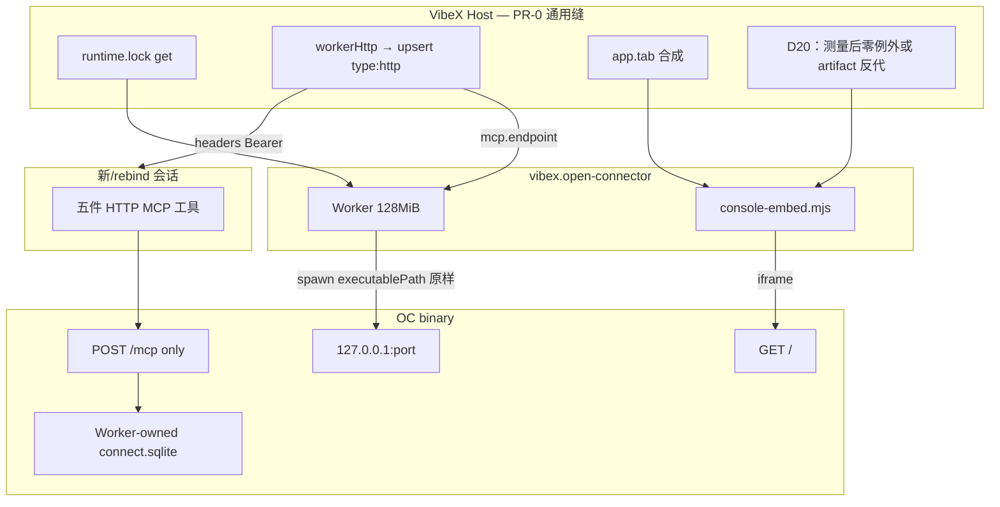
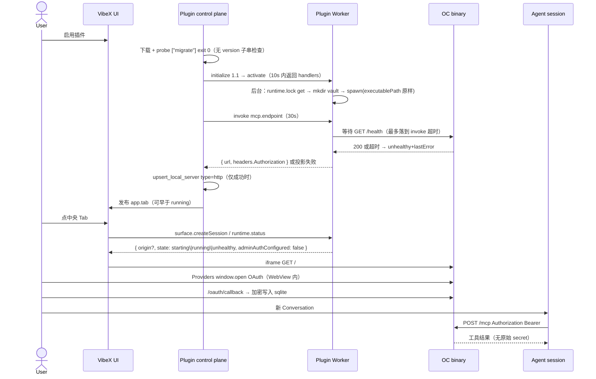

# VibeX Open Connector 官方插件设计

| 字段 | 值 |
| --- | --- |
| 文档标题 | VibeX Open Connector Plugin（`vibex.open-connector`） |
| 作者 | VibeX maintainers（草稿） |
| 日期 | 2026-09-21 |
| 状态 | Draft（修订 4：D24 tag 策略、D25 不内嵌 Host family 快照；Open Questions 已拍板） |
| 范围 | 一份 VibeX Plugin Package + **一组无插件 ID 的通用 Host 缝（PR-0）**。不改 Open Connector 产品，Host 源码不出现 `vibex.open-connector` 字符串（`scripts/check-plugin-no-privilege.mjs` Rule B；数据面 allowlist 除外） |

---

## Overview

VibeX 目前没有 Open Connector 产品插件。仓库里唯一的 `open-connector` 字符串是前端测试夹具。Open Connector 已经是完整的本机连接器网关：1000+ Provider、OAuth / API Key 凭据边界、SQLite vault、Web Console、HTTP `/v1/*`、以及 **仅** `POST /mcp` 的 Streamable HTTP MCP（`GET /mcp` 被拒绝，`legacy: "stateless"`，`responseMode: "json"`，见 `src/mcp.ts` 与 `src/server/connect-server.ts`）。

本设计把 Open Connector 作为 **默认禁用的官方市场插件** 接入。插件身份 `vibex.open-connector` / publisher `vibex`。主入口是已实现的 `app.tab`。Tab 内容是不透明 iframe，指向 Worker 在回环口拉起的 OC Console。

**v1 必须先做 Host PR-0（通用，无插件 ID）**，否则 Worker 拿不到锁定二进制路径、MCP 投影没有动态 origin、打包 WebView 的 `https://tauri.localhost` 无法嵌 `http://127.0.0.1:{port}`。Agent 侧锁定 **HTTP MCP 投影**：Worker 就绪后 Host 调用声明的 `mcp.endpoint`，再 `upsert_local_server` 写入 `type: http`、`url: {origin}/mcp`、Host 持有的 `Authorization` 头。不使用 STDIO 桥。凭据留在 OC vault；`config.json` 不含 token。

---

## Background & Motivation

### 当前状态

- 官方目录 `assets/plugins/index/official.v1.json` 与 `docs/plugins/official-plugins.md` 无 Open Connector。展示文案还依赖 `frontend/src/pages/plugins/officialPlugins.ts` 的 `OFFICIAL_PLUGIN_I18N_KEY` 与 `crates/plugins/src/catalog.rs` 的 `BUNDLED_TOPIC_CATEGORIES`（`plugin:no-privilege` 数据面 allowlist）。
- `app.tab` **槽位**已就绪：`contribution-kinds.v1.json` `ready`；`Toolbar.tsx` / `IDELayout.tsx` / `PluginRemoteView`；样例 `assets/plugins/host-surface`。这只覆盖 Tab 合成，不覆盖 sidecar 生命周期。
- Worker 不能定位锁定 Runtime：`host.call("runtime.execute", …)`（`crates/plugins/src/host_capability_broker.rs`）是一次性 `{executable} {operation} --json`，120s 超时，不返回 `executable_path`，也不能托管长驻 HTTP 进程。Worker 环境只有 `VIBEX_HOST_DATA_DIR` 与 Node 语言运行时（`worker_host.rs`），不是 sidecar 路径。锁定字节在内容寻址目录（`crates/plugins/src/runtime.rs` `artifact_directory`），**不是** `{VIBEX_HOST_DATA_DIR}/plugins/runtimes`。
- Host Runtime 安装 **必须** 声明并执行 probe：空 probe → `plugin_runtime_not_ready`；probe 须 exit 0（15s）；若 `version` 有值，stdout/stderr 必须包含该串（`GlobalRuntimeInstaller::install`）。
- `managedRuntime` 非 `hostFamilyBinary` 时，`materialize_plugin_mcp_spec` **整份替换** 为 STDIO，env 只有 `VIBEX_PLUGIN_MCP_TOKEN` 与 `VIBEX_MCP_PROTOCOL_REVISION`。MCP 进程不是 Worker，不继承 Worker 环境。
- Plugin Worker Node 带 `--max-old-space-size=128`，不能内嵌 OC 引擎。

### 痛点

1. Agent 没有「连一次、凭证不出 Agent 进程」的外部应用面。
2. 重写 1000+ Provider Console 为 Tahoe 页不可维护。
3. 按现状写插件：enable 会在 probe 失败、spawn 无路径、MCP 桥找不到 origin/token 三处断开。必须先补通用 Host 缝。

---

## Goals & Non-Goals

### Goals

1. 用户从官网市场官方分类安装 `vibex.open-connector`，**默认禁用**；启用后出现顶级 Tab「Open Connector」，内嵌既有 Web Console。
2. 启用后，Worker 用 **Host 锁定的绝对路径** 在回环口拉起钉死 digest 的 OC 单文件二进制；SQLite 与密钥在 **Worker 自管目录**（不是 Host snapshot）。
3. 启用之后 **新建或 rebind** 的 Agent 会话注入 OC HTTP MCP（五件工具）。已有会话不热挂。
4. 连接 / OAuth / Marketplace / Runs 全部走 OC 既有 API 与 Console。
5. 官方插件无特权：Host 行为缝不出现 `vibex.open-connector`。数据面 ID 只进 allowlist 文件。

### Non-Goals

- **不重写 Open Connector**（catalog / runner / OAuth / Marketplace / `web/`）。
- **不合并聊天通道**（ADR-0056 / 0062）。
- **不自动启用**；不写入 ADR-0069 能力等价白名单。
- **不在 Host 侧复制凭据库**；不写入 `config.json` 或 ADR-0004 `.env`。
- **不把本插件做成 Kanban / 工作区面板 / 设置主入口。**
- **不把 OC MCP 并入 `vibex-mcp` / `hostFamilyBinary`。**
- **不在 Worker 内嵌 headless `createConnectorRuntime`。**
- **v1 不做 Tab 聚焦导航缝**（`app.command` / `app.status` 不能 `setActiveTab`）。
- **v1 不把 Worker 自管 vault 挂到 `vibex plugin remove --delete-data`**（该开关只删 Host snapshot，见 `docs/plugins/user-guide.md`）。
- **v1 不设置 `OOMOL_CONNECT_ADMIN_TOKEN`**，不为 Console 做 query-hash 解锁（那要改 OC）。

---

## Key Decisions

| # | 决定 | 依据 |
| --- | --- | --- |
| D1 | 插件 ID `vibex.open-connector`，publisher `vibex` | 与 `vibex.remote-ssh` 等同命名空间。 |
| D2 | **主入口 `app.tab`**，id `console`，`hidesBottomDock: true`，icon `plug` | 槽位已就绪。连接器是 Host 级运营面。 |
| D3 | **必须有 Host PR-0**（通用，零插件 ID 字符串）。`app.tab` 槽位本身不需要再开孔 | 槽位 ready ≠ sidecar/MCP/混内容已具备。无特权：`plugin:no-privilege` Rule B。 |
| D4 | Sidecar = OC GitHub Release **单文件二进制**，按 target 钉 sha256 | `docs/single-binary.md`。Worker 128 MiB 堆放不下引擎。 |
| D5 | Worker **`activate` 必须在 Host 10s RPC 内返回**（`worker_host.rs` `exchange(..., "activate", ..., Duration::from_secs(10))`）：只注册 handler 并 **后台** kick-off spawn。**禁止**在 `activate` 里等待 `GET /health`。`mcp.endpoint` / `runtime.status` 在 **30s invoke** 路径上等待 `/health`（`limits.requestTimeoutMs: 30000`）；超时 → `state: "unhealthy"` + 脱敏 `lastError`，不挂死。缓存命中 enable→health **目标** < 5s，不是 Host 截止时间 | 首次拉起 150–175 MiB Bun 二进制在 Windows 上经常超过 10s；probe `migrate` 已在 Worker 起来之前由 `ensure_package_runtimes` 完成。 |
| D6 | **一份** `entrypoints.app` HTML。按 `environment.slot` 路由：`app.tab` → `ConsoleEmbed`（OC iframe）；`plugin.detail.panel` → 配置/健康/wipe UI。Federation `./console` **只**给 Tab 用。禁止声称 `dist/app` 只嵌 Console | v4 只有一个 app document；Tab 无 remote 回退与详情配置都走它（`PluginRemoteView` → `AppSurfaceHost`）。 |
| D7 | **Agent MCP = HTTP 投影，不是 STDIO 桥。** `managedRuntime.kind = "workerHttp"`，handler `mcp.endpoint`。Host 在 Worker 就绪后 upsert `type: http` `url: {origin}/mcp` 与 Host 持有的 `Authorization: Bearer` | OC 是 Streamable HTTP JSON，`GET /mcp` 拒绝。`upsert_local_server` / `canonicalize_spec` 已支持 HTTP。STDIO 物化不注入 origin/token，桥仍需要与 HTTP 相同的动态侧信道，再加每会话 Node 与协议翻译（R2）。PR-0 反正要做，HTTP 更小。 |
| D8 | 默认禁用、可卸载；磁盘 Runtime ≠ 已注入 | ADR-0066 / 0069。 |
| D9 | 凭据只在 OC vault；`config.json` 无 token | `secrets.*` 只回 `{present:false}`。 |
| D10 | Vault 是 **Worker 自管目录** `path.join(process.env.VIBEX_HOST_DATA_DIR, "plugin-state", context.pluginId)`。卸载默认不删；`--delete-data` **不** 清该目录。详情页提供 `runtime.wipeData` | Host 没有 `plugins/data/{id}` 根；`files.*` 为 `files_root_denied`；`storage.kv` 是进程内 RAM。 |
| D11 | **`command` 全平台单一基名 `open-connector.exe`**（`ContentAddressedRuntimeHost::publish` 写到 `{artifact_directory}/{command}`）。Worker **原样** `spawn(executablePath)`，不按 target 改名、不加 PATHEXT。Unix 仍对该文件名 `chmod 0755`。Node `windowsHide: true`、`shell: false`；spawn env 显式白名单并 **unset 继承的 `OOMOL_CONNECT_*`**。禁用 = `child.kill()` | 不用 `open-connector`（无扩展）：Host probe 走 Rust `Command` 或许能跑 PE，但 sidecar 由 **Node** spawn，Windows 上无扩展文件常 EINVAL。不用 per-target `command`（`validate_global_command` 只允许一个文件名）。GitHub 资产名仍带平台后缀，只出现在 `url`。 |
| D12 | `HOST=127.0.0.1`；Worker 先占用再交给 OC 的固定回环端口（写入 `runtime.json`，重启复用）；`OOMOL_CONNECT_ORIGIN=http://127.0.0.1:<port>` | 端口稳定则 HTTP MCP URL 稳定，避免中途改投影。 |
| D13 | **`host.call("runtime.lock", "get", { runtimeId }) → { executablePath, version, target, contentDigest }`** | 任何 sidecar 插件共用。写入 `developer-guide.md`。 |
| D14 | Runtime descriptor **`probe: ["migrate"]`，省略 `version`**。身份是 `id + target + content_digest`。`distributions` 键必须是 `current_runtime_target()` 的 Node 风格：`darwin-arm64` / `darwin-x64` / `linux-arm64` / `linux-x64` / `win32-arm64` / `win32-x64`（`package.rs`）。`GET /health` 是启用后就绪检查，**代替不了** Host probe | rustc triple 键会被 parse 成 `None` → `runtime_unsupported`，根本锁不上二进制。 |
| D15 | **不设置 `OOMOL_CONNECT_ADMIN_TOKEN`。** 设置 `OOMOL_CONNECT_RUNTIME_TOKEN` 保护 `/v1` 与 `/mcp`。`adminAuthConfigured: boolean`（v1 为 `false`） | 设了 admin token 后 Console `/api/*` 要 Bearer，且无 query/hash 解锁（`web/src/ui.tsx` `unlock`）。Host chrome 不能给 iframe 种 `sameSite=Strict` cookie。残留风险：本机其它进程可打管理 API。 |
| D16 | OAuth **主路径** = OC 已有 `window.open(authorizationUrl, "oomol_connect_oauth", …)`（`web/src/providers-page.tsx`），留在 WebView 配置内，BroadcastChannel 才通。系统浏览器是降级：复制 URL + 回 Console 刷新。不声称跨 Chrome/WebView2 的 BroadcastChannel | `BroadcastChannel("oomol-connect-oauth")` 只在同一浏览器配置。本地 OC Console **不**发 `X-Frame-Options`（`_headers` 只是 Cloudflare 静态文件）。 |
| D17 | **v1 不做「聚焦 Open Connector Tab」。** `app.command` / `app.status` 只报告健康；点击不导航 | `SearchPalette.tsx` / `PluginStatusItems.tsx` 只 `invokeContribution`；无 layout `host.call`。 |
| D18 | **删除 `runtime.origin` handler。** origin 由 `surface.createSession` 与 `runtime.status` 返回。Tab 与详情要 `invoke` 的方法全部列入 `plugin.detail.panel` `allowedMethods`（`app.tab` 合成 surface 的 `allowedMethods` 为空） | `validate_registrations`（`worker_host.rs`）拒绝未声明 handler。 |
| D19 | `catalogLazySchemas` **默认 `true`** | 桌面 sidecar 内嵌 1000+ Provider；降低 RSS。用户可在配置关掉。 |
| D20 | **PR-0 第 0 步：先测量** packaged `host-surface`（或假插件）Federation remote 能否从 `https://tauri.localhost` 加载 `http://127.0.0.1:{artifact}/…`（`artifact_http.rs`）。**若 remotes 已能加载且同构建里假回环 iframe 也能加载 → 零新例外。** 若 remote 通、iframe 不通 → 把 sidecar **反代进现有 artifact origin**（iframe 与 remotes 同站）。若 remotes 也不通 → 同一条 artifact-origin 通道路径修 remote **和** iframe。**禁止** `--disable-web-security`；禁止进程级 `--allow-running-insecure-content`。测试不得出现 `vibex.open-connector`。`windows_webview2.rs` 目前只关 occlusion，没有混内容旋钮 | WebView2 没有「只放行 127.0.0.1 iframe」API。脚本 mixed content 与 iframe mixed content 行为可以不同，必须测量再选窄机制。 |
| D21 | 启用失败走控制面 `runtime_install_failed` / `plugin_runtime_not_ready`。详情页读 `runtime.status.lastError`。**不承诺 Worker Toast**（`app.notify.toast` 返回 `{}`） | |
| D22 | `lastError` 与 Worker 日志脱敏：禁止 `Authorization`、`enc:v1:` 载荷、encryption key、Provider secret | |
| D23 | Host **probe 进程环境必须是清空后的允许名单**（通用，非插件 ID）。至少不继承 `OOMOL_CONNECT_*` / `DATABASE_URL`。Worker spawn 已 unset `OOMOL_CONNECT_*`；`probe_executable`（`runtime.rs`）今日是默认继承 | `migrate` 见 `OOMOL_CONNECT_DATABASE_URL` 会跑 PostgreSQL（`src/server/index.ts` `runMigrateCommand`），开发机用户环境会导致 probe 失败或碰到远程库。 |
| D24 | **Runtime tag 策略：** 实现开工当周钉 GitHub 上当时最新的 Open Connector Release tag，并核对该 tag 的 `SHA256SUMS`。设计文档 **不** 冻结具体 tag | 用户决定（2026-09-21）。descriptor `url` 在 PR-2 写入真实 tag。 |
| D25 | **不把 150–175 MiB 二进制打进 Host family。** `depends/runtimes/open-connector.json` 只带各 target 的 `url` + sha256；**首次启用时** Host Runtime installer 下载。离线启用失败，走可诊断的 `runtime_install_failed`（已有控制面），不得假装已就绪 | 用户决定（2026-09-21）。与 OfficeCLI 同类：descriptor 指向远端，不随 `vibex` / `vibex-mcp` 发行物内嵌。 |

阻塞项已全部进入上表。原 Open Questions（tag、是否随 Host 快照）已于 2026-09-21 由用户拍板，见 D24 / D25。

---

## 主入口决策（锁定）

### 比较表

| 候选 | 现状（代码，不是 ADR 愿望） | 适合本产品？ | 结论 |
| --- | --- | --- | --- |
| **`app.tab`** | **已实现、`ready`。** `AppTabContribution`、`Toolbar.tsx` 并列、`IDELayout.tsx` overlay、`host-surface` `sample-tab`。默认 `hidesBottomDock=true`。 | Host 级运营控制台，不跟 Project 走。 | **主入口。** 槽位不需要再开孔；需要的是 sidecar/MCP/iframe Host 缝。 |
| `app.kanban.view` | `ready`，看板箭头轮换 | 不是会话总览 | 否决 |
| `app.panel` | `ready`，工作区 Dockview | 会被 Git/终端挤掉；无工作区会话没有它 | 否决 |
| `app.settings.page` | **preview**（Batch 3） | 运营面不是设置 | 否决为主入口 |
| `plugin.detail.panel` | 稳定面；remote-ssh 用它做供给表单 | 适合本包配置/健康，不适合整份 Console | **辅助面** |
| `app.command` / `app.status` | 已挂孔；**不能切 Tab** | 健康文案 | **辅助面，v1 不导航** |
| `artifact.editor` | 稳定面 | 连接不是文件 | 否决 |

### 信息架构

```
VibeX 中央 Tab 栏（Host chrome = Liquid Glass）
├─ 看板（若有已启用 app.kanban.view）
├─ 工作区（L0）
└─ Open Connector          ← app.tab，启用即出现
     └─ 不透明内容层
          ├─ Federation `./console`（Tab 专用 → ConsoleEmbed）
          └─ 无 remote 时 AppSurfaceHost → dist/app/index.html
               └─ slot=app.tab → ConsoleEmbed → iframe（D20 直连或 artifact 反代）
                    └─ OC Console（自有 nav，不套 Glass）

设置 → 插件 → 详情
├─ 内容：README + Skill/MCP 说明
└─ 配置 plugin.detail.panel → **同一份** dist/app，slot=plugin.detail.panel → ConfigPanel
     运行状态、origin（只读）、Worker 自管数据目录（只读）
     allowPrivateNetwork / trustedHosts / catalogLazySchemas
     重启 sidecar；wipeData（二次确认）
     不含 token；**不是** OC Console iframe

状态栏 app.status（只添加，点击不导航）
└─ 「Open Connector · 运行中|已停止|不健康」

命令面板 app.command（点击不导航）
└─ 「Open Connector 状态」→ 同 runtime.status 文案（可复制 origin）
```

用户打开 Console 的方式：点中央 Tab「Open Connector」。命令/状态栏不切 Tab。

### 关键屏幕与交互

1. **未启用**：未上架前只有 `--dev` 链接；上架后市场可见、开关关。无 Tab、无 MCP、无 sidecar。
2. **启用中**：Host 下载/校验/probe `migrate`（白名单 env）→ activate Worker（**10s 内返回**，spawn 在后台）→ Host 在 30s invoke 上调 `mcp.endpoint`（内部等 `/health`）→ upsert HTTP MCP。Tab 在 sidecar 仍 `starting` 时显示占位，不假装已连接。失败走控制面错误码 + 详情 `lastError`，不发 Worker Toast。
3. **Console Tab**：薄壳 `invoke("runtime.status")` 得 origin，iframe 加载 Overview。`adminAuthConfigured: false`，无解锁表单。
4. **OAuth**：Console 内 `window.open` 授权 URL。主路径留在 WebView。弹窗被拦：OC 已有文案 + 轮询刷新（`startOAuthRefreshPolling`）。系统浏览器降级：复制 URL，回来后在 Providers 刷新。不依赖跨浏览器 BroadcastChannel。
5. **Agent**：新会话 `tools/list` 五件工具。Skill：先 `list_connections`，再 `get_action_guide`，再 `execute_action`。
6. **禁用**：停 `host.service`、`child.kill()` sidecar、撤 Tab、`uninstall_server` HTTP MCP。Vault 保留。已有会话可能仍看见旧工具直到结束/rebind。
7. **卸载**：Host snapshot/config 按现有规则；`--delete-data` **不清** Worker 自管 vault。用户可先在详情 wipe，或手工删 `plugin-state/{pluginId}`。

---

## Plugin capabilities

### 用户场景

| ID | 场景 | 成功标准 |
| --- | --- | --- |
| S1 | 启用后打开 Tab，Hacker News 无凭据试跑 | Console Runs 可见；`POST /v1/actions/hackernews.get_top_stories` 成功 |
| S2 | GitHub API Key 或 OAuth 后，新会话 `execute_action` | 凭证不在会话事件 / `config.json`；MCP 只返回安全账户字段 |
| S3 | named connection `default` / `work` | 显式 `connectionName`；省略 default；拒绝 `connection_not_allowed` |
| S4 | 关掉插件 | Tab 消失，sidecar 退出，新会话无 MCP |
| S5 | Windows 启用 | 绝对路径 Host-lock `.exe`；`windowsHide: true` |
| S6 | **packaged** 桌面打开 Tab | iframe 能加载 OC Overview（先有 host-surface packaged 测量；按 D20 零例外或 artifact 反代） |
| S7 | sidecar 关掉时 `execute_action` | Agent 得到错误，**不挂死** |

### `config.json` schema

禁止 secret 字段；`additionalProperties: false`。

```json
{
  "allowPrivateNetwork": false,
  "trustedHosts": "",
  "catalogLazySchemas": true
}
```

`catalogLazySchemas` 默认 **true**，映射 `OOMOL_CONNECT_CATALOG_LAZY_SCHEMAS`。改 egress / lazy 后 Worker 重启 sidecar（`storage.settings.put` 之后）。Marketplace URL / API key 留在 OC Console / DB。

### Manifest 贡献草图

```json
{
  "id": "vibex.open-connector",
  "publisher": "vibex",
  "version": "1.0.0",
  "name": "Open Connector",
  "engines": { "vibex": ">=0.1.3 <1.0.0", "pluginSdk": "^1.0.0" },
  "dependencies": [
    { "kind": "runtime", "descriptor": "depends/runtimes/open-connector.json" }
  ],
  "entrypoints": {
    "worker": { "path": "dist/worker.mjs", "runtime": "node", "protocol": "1.1" },
    "app": { "root": "dist/app", "document": "index.html", "protocol": "1.0" }
  },
  "integrations": [
    {
      "id": "console",
      "kind": "app.tab",
      "title": "Open Connector",
      "icon": "plug",
      "handler": "surface.createSession",
      "hidesBottomDock": true,
      "remote": {
        "name": "open_connector",
        "entry": "dist/remoteEntry.js",
        "module": "./console"
      }
    },
    {
      "id": "config-panel",
      "kind": "app.surface",
      "label": "Open Connector",
      "slot": "plugin.detail.panel",
      "appEntrypoint": "app",
      "handler": "surface.createSession",
      "allowedMethods": [
        "runtime.status",
        "runtime.restart",
        "runtime.wipeData",
        "mcp.endpoint"
      ],
      "minHeight": 320
    },
    {
      "id": "runtime-status-cmd",
      "kind": "app.command",
      "title": "Open Connector 状态",
      "icon": "plug",
      "handler": "runtime.statusText"
    },
    {
      "id": "runtime-status",
      "kind": "app.status",
      "slot": "status.main",
      "text": "Open Connector",
      "icon": "plug",
      "handler": "runtime.statusText",
      "refreshSeconds": 15
    },
    {
      "id": "health",
      "kind": "host.service",
      "handler": "runtime.health",
      "intervalSeconds": 15
    },
    {
      "id": "open-connector-mcp",
      "kind": "content.mcp",
      "resource": "contents/mcps/open-connector.json"
    },
    {
      "id": "open-connector-skill",
      "kind": "content.skill",
      "resource": "contents/skills/open-connector/SKILL.md"
    }
  ],
  "interface": { "icon": "assets/icon.svg" }
}
```

**没有** `runtime.origin`、**没有** `runtime.focusTab`。`mcp.endpoint` 必须出现在某条 surface `allowedMethods`，否则 Worker 无法注册。

`contents/mcps/open-connector.json`：

```json
{
  "managedRuntime": {
    "kind": "workerHttp",
    "handler": "mcp.endpoint",
    "protocolRevision": "2026-07-28",
    "defaultBinding": "all-compatible-agents"
  }
}
```

无 `entrypoint`。CLI validate / Host inspect 在 PR-0 接受 `kind: "workerHttp"` + `handler`（与 `hostFamilyBinary` / STDIO `entrypoint` 并列，三选一）。

### Runtime 描述（`depends/runtimes/open-connector.json`）

`RuntimeContribution`（`package.rs`）：`probe` 不可为空；`version` 可省略，省略时安装记录的 version 字符串取 probe stdout trim。

```json
{
  "id": "open-connector",
  "command": "open-connector.exe",
  "probe": ["migrate"],
  "distributions": {
    "darwin-arm64": {
      "url": "https://github.com/oomol-lab/open-connector/releases/download/<tag>/open-connector-darwin-arm64",
      "sha256": "<from SHA256SUMS>"
    },
    "darwin-x64": {
      "url": "https://github.com/oomol-lab/open-connector/releases/download/<tag>/open-connector-darwin-x64",
      "sha256": "<from SHA256SUMS>"
    },
    "linux-x64": {
      "url": "https://github.com/oomol-lab/open-connector/releases/download/<tag>/open-connector-linux-x64",
      "sha256": "<from SHA256SUMS>"
    },
    "linux-arm64": {
      "url": "https://github.com/oomol-lab/open-connector/releases/download/<tag>/open-connector-linux-arm64",
      "sha256": "<from SHA256SUMS>"
    },
    "win32-x64": {
      "url": "https://github.com/oomol-lab/open-connector/releases/download/<tag>/open-connector-windows-x64.exe",
      "sha256": "<from SHA256SUMS>"
    },
    "win32-arm64": {
      "url": "https://github.com/oomol-lab/open-connector/releases/download/<tag>/open-connector-windows-arm64.exe",
      "sha256": "<from SHA256SUMS>"
    }
  }
}
```

键必须等于 `current_runtime_target()`（`package.rs`）：`darwin-arm64` / `darwin-x64` / `linux-arm64` / `linux-x64` / `win32-arm64` / `win32-x64`。**禁止** rustc triple（`aarch64-apple-darwin` 等）——parse 取不到键会丢 Runtime（`runtime_unsupported`）。GitHub **资产文件名**仍用 OC `docs/single-binary.md` 的名字，只写在 `url`。

**省略 `version`。** `probe` 精确 argv 就是 `["migrate"]`。不要 `--version`，不要空 argv。`<tag>` 按 D24 在实现开工当周写入当时最新 Release，sha256 取该 tag 的 `SHA256SUMS`。`content_digest` 由 Host 从发行 sha256 生成 `sha256:{sha256}`。`command` 是全平台单一存储基名 `open-connector.exe`（D11）。二进制 **不** 打进 Host family（D25）：首次启用走 `url` 下载。

PR-0 / CLI 验收：**假 descriptor 只含 `win32-x64` 与 `darwin-arm64` 时，在对应 host 上 validate/inspect 能解析该 Runtime；只含 rustc triple 的 descriptor 必须给出 `runtime_unsupported`（或等价警告），不得静默当成已锁定。**

Windows 0 字节 stub / WindowsApps：内容寻址安装 + probe exit 0 已排除；Worker 不再复刻 `process.rs`。

---

## Proposed Design

### Host PR-0（通用缝，无 `vibex.open-connector`）

PR-0 与本插件同批验收，但 Host 测试只用假 sidecar / 假 HTTP MCP，**不得**出现官方插件 ID。

#### 1. `host.call("runtime.lock", "get", { runtimeId })`

- Broker `supports` 增加 `runtime.lock`（现有只有 `runtime.execute`，`host_capability_broker.rs`）。
- 入参：`{ runtimeId: string }`，必须是该插件当前代已锁定的 Runtime id。
- 成功：`{ executablePath, version, target, contentDigest }`。`executablePath` 即 `RuntimeInstallation.executable_path`。
- 失败：`runtime_not_locked` / `runtime_identity_missing`（与 execute 相同身份检查）。
- **不是** `runtime.execute`：不 spawn、不加 `--json`、不等待。
- `developer-guide.md` 的「已经能当功能用的」表增加一行。
- 任意第三方 sidecar 插件可复用。

#### 2. `managedRuntime.kind = "workerHttp"`

扩展 `materialize_plugin_mcp_spec`（`plugin_projections.rs`）与 CLI `packages/plugin-cli/src/validation.ts`：

| kind | 行为 |
| --- | --- |
| `hostFamilyBinary` | 现状 |
| （默认 / `entrypoint`） | 现状 STDIO |
| **`workerHttp`** | **新**：要求 `handler` 字符串；禁止 `entrypoint` |

启用 / 投影顺序：

1. Runtime install + probe（已有；probe 用 D23 白名单 env）。
2. Worker initialize → **activate 在 10s 内返回 handlers**；sidecar spawn **后台**开始，不在 activate RPC 里等 `/health`。
3. Host `invoke` 该 MCP 的 `managedRuntime.handler`（如 `mcp.endpoint`），走 **30s invoke** 超时。handler 内部等到 `/health` 200 或超时。
4. 期望 JSON：`{ "url": "http://127.0.0.1:<port>/mcp", "headers": { "Authorization": "Bearer <token>" } }`。`url` 必须是回环 `http://127.0.0.1` 或 `http://[::1]`，路径 `/mcp`，禁止非回环。
5. `upsert_local_server(projected_id, { type: "http", url, headers }, …)`。`canonicalize_spec` 已把 `streamable-http` 收成 `http`。
6. 失败（含 health 超时）→ 现有 `mcp_projection_failed` 绑定错误，不写入半份 URL。Tab 仍可出现，薄壳显示 `starting` / `unhealthy`。

Token 进入 Agent 原生 MCP 配置的 `headers`，与用户手动加的 HTTP MCP 相同。这是 Host 持有的执行令牌，不是 OC vault 里的 Provider 凭证，也不进 `config.json`。

端口策略：Worker 把上次成功端口写入自管 `runtime.json`，重启复用，因此 URL 在一次启用代内稳定。若 bind 失败改端口，必须再次 `mcp.endpoint`；v1 规定 Worker 在 `runtime.health` 发现 `originChanged` 时返回该标志，Host `host.service` tick **不**自动重投影——用户需关开插件或点详情「重启」（重启 handler 成功后 Host 再调 `mcp.endpoint` 一次）。实现：`runtime.restart` 由 Worker 跑完后，详情薄壳或 Host 在 restart invoke 返回后调用投影刷新。更干净的做法：Host 对 `workerHttp` 在每次成功的 `runtime.restart` / activate 之后重拉 `mcp.endpoint`。写入 PR-0：`workerHttp` 投影在 activate 与声明 handler 的成功 invoke 之后刷新。

契约测试（Host，假服务器）：enable → upsert 的 spec `type==http` 且含 Authorization → 假 `/mcp` `tools/list` → 停假服务器 → 工具调用失败且不超时挂死。

#### 3. 打包 WebView 混内容（先测量，再选窄机制）

仓库现状：`tauri.conf.json` `csp: null`；`windows_webview2.rs` 只设置 `--disable-features=CalculateNativeWinOcclusion,ApplyNativeOcclusionToCompositor`。**没有**混内容 API。WebView2 也没有「只允许 127.0.0.1 iframe」开关。钝器是 `--allow-running-insecure-content` / `--disable-web-security`——后者禁止。

**第 0 步（阻塞后续 Host 混内容改动）：** packaged Windows/macOS 上加载 `vibex.host-surface`（或假插件）Federation remote（`artifact_http.rs` 把 `dist/remoteEntry.js` 写成 `http://127.0.0.1:{artifact}/…`）。`pnpm tauri dev` 的页面本身常是 `http://127.0.0.1:3000`，**不能**当证据。

然后按测量选 **一条** 窄机制（写入 PR-0 说明，测试仍无 `vibex.open-connector`）：

| 测量 | 机制 |
| --- | --- |
| packaged remotes **和** 假回环 iframe 都通 | **零新例外。** OC iframe 直连 `http://127.0.0.1:{ocPort}/` |
| remotes 通、iframe 不通 | 经现有 artifact HTTP **反代** sidecar：iframe `src` 与 remotes 同 origin（`http://127.0.0.1:{artifact}/{pluginId}/loopback/…` → Worker 报告的回环）。通用前缀，不是插件 ID 分支 |
| remotes 也不通 | 同一条 artifact-origin 路径先让 remote 可加载；iframe 走同一 origin。仍禁止 `--disable-web-security` |

#### 4. Probe 环境白名单（通用）

`probe_executable`（`runtime.rs`）今日 `Command::new(exe).args(probe)` 继承进程 env。PR-0 改为：probe 子进程 env **清空后只注入允许名单**（`PATH` / `SYSTEMROOT` / `WINDIR` / `HOME` / `TMP` / `TEMP` / `LANG` 一类运行必需项）。**不**传递 `OOMOL_CONNECT_*`、`DATABASE_URL`。这是所有 Runtime probe 的行为，不是 OC 特判。

不在 PR-0 做：Tab 聚焦、`secrets.*` 真保险库、Host 管理的 plugin-data 根、`--delete-data` 扫 Worker 目录、`--disable-web-security`。

### 包布局

```text
assets/plugins/open-connector/
├─ .vibex-plugin/plugin.json
├─ README.md
├─ config.json
├─ NOTICE
├─ contents/skills/open-connector/SKILL.md
├─ contents/mcps/open-connector.json
├─ depends/runtimes/open-connector.json
├─ runtime/
│  ├─ worker.mjs
│  ├─ console-embed.mjs          # 仅 OC iframe 壳（Tab）
│  ├─ config-panel.mjs           # 详情：status / origin / wipe / config.json 字段
│  ├─ views/console.tsx          # Federation ./console → 只 mount ConsoleEmbed
│  └─ app.html                   # 唯一 entrypoints.app：按 slot 路由
└─ dist/
   ├─ worker.mjs
   ├─ remoteEntry.js             # expose ./console（tab-only）
   └─ app/index.html             # slot=app.tab → ConsoleEmbed；slot=plugin.detail.panel → ConfigPanel
```

**没有** `dist/mcp/bridge.mjs`。`dist/app/index.html` **不是**「只嵌 Console」。

### 模块划分

| 模块 | 职责 | 非职责 |
| --- | --- | --- |
| Host PR-0 | lock 查询、workerHttp 投影、回环 iframe 例外 | 认识 OC 或本插件 ID |
| `worker.mjs` | lock get、分配/复用端口、spawn、health、kill、wipeData、mcp.endpoint | 不执行 Action |
| `console-embed.mjs` | Tab：`invoke(runtime.status)` → 不透明 iframe；loading/failed | 不复刻 Providers 页；不渲染配置表单 |
| `config-panel.mjs` | 详情 slot：status、origin 只读、restart、wipeData、config 字段 | 不 iframe OC Console |
| `app.html` | 按 `environment.slot` 选择上面两个模块 | 不是第二份 Console |
| OC 二进制 | catalog、vault、Console、`/v1`、`POST /mcp` | 不知道 VibeX |

### 进程与数据流



### 主序列



### 对接 OC 既有面

| OC 面 | 用法 |
| --- | --- |
| `GET /` Console | iframe |
| `POST /mcp` | Agent HTTP MCP；`GET /mcp` 不用 |
| `/v1/*` | Console / 手工；Agent 不直打 |
| `/api/*` | Console；v1 无 admin token 故回环开放 |
| `/oauth/callback` | 公开路径，不改 |
| Marketplace `/api/marketplace` | Console 自用 |
| `OOMOL_CONNECT_ENCRYPTION_KEY` | Worker 生成，只进 sidecar env 与 secrets 文件 |
| `OOMOL_CONNECT_RUNTIME_TOKEN` | 同上；同时经 `mcp.endpoint` 交给 Host 投影 |

### Worker 契约（声明过的 handler 全集）

```ts
type RuntimeStatus = {
  state: "stopped" | "starting" | "running" | "unhealthy";
  origin?: string;
  pid?: number;
  dataDir: string;                 // Worker 自管绝对路径
  adminAuthConfigured: boolean;    // v1 false
  lastError?: string;              // 已脱敏
};

// surface.createSession 与 runtime.status 都返回 RuntimeStatus（前者至少含 origin+state）
// runtime.statusText → { text, tooltip } 供 app.status / app.command，tooltip 可含 origin
// runtime.restart → RuntimeStatus；成功后 Host 刷新 workerHttp 投影
// runtime.health → { ok: boolean, originChanged?: boolean }
// runtime.wipeData → 二次确认后删除 vault 文件（sidecar 须先停）
// mcp.endpoint → { url: string, headers: { Authorization: string } }
```

`windowsHide: true`；`shell: false`；`kill()` dispose。Windows 上在途请求可能不 flush（OC 文档）。

环境变量显式白名单：

```
HOST=127.0.0.1
PORT=<n>
OOMOL_CONNECT_ORIGIN=http://127.0.0.1:<n>
OOMOL_CONNECT_DATA_DIR=<dataDir>
OOMOL_CONNECT_ENCRYPTION_KEY=<file>
OOMOL_CONNECT_RUNTIME_TOKEN=<file>
OOMOL_CONNECT_CATALOG_LAZY_SCHEMAS=true|false
OOMOL_CONNECT_ALLOW_PRIVATE_NETWORK=true|false
OOMOL_CONNECT_EGRESS_TRUSTED_HOSTS=<optional>
```

Spawn 前从 `env` 删除任何已有 `OOMOL_CONNECT_*`，避免用户 shell 污染。**不**设 `OOMOL_CONNECT_ADMIN_TOKEN`。

### Console 嵌入与详情页（一份 HTML，按 slot 路由）

Federation `environment.slot` 已由 `PluginRemoteView` 传入（`slot: 'app.tab' | …`）。`AppSurfaceHost` 的 `AppSurfaceDescriptor.slot` 已有 `plugin.detail.panel` / `app.tab`。若 `definePluginApp` 的 `PluginAppEnvironment` 尚无 `slot`，PR-0 把 **通用** `slot` 放进 app bootstrap（与 descriptor 同源），测试不出现本插件 ID。

| 挂载 | slot | 模块 |
| --- | --- | --- |
| Federation `./console` | （Tab 专用，恒为控制台） | `ConsoleEmbed` |
| `dist/app/index.html` | `app.tab`（无 remote 回退） | `ConsoleEmbed` |
| `dist/app/index.html` | `plugin.detail.panel` | `ConfigPanel`：`runtime.status`、origin 只读、restart、wipeData、config 表单 |

`ConsoleEmbed`（`runtime/console-embed.mjs`）：

1. `invoke("runtime.status")`。
2. `state !== "running"` → 不透明占位（`starting` / `lastError`）。
3. `running` → `<iframe src={consoleSrc}>`。`consoleSrc` 在 D20「零例外」时为 `origin + "/"`；在 artifact 反代时为 Host 提供的同站 URL。禁止 backdrop-filter。
4. iframe `error` → 占位，提示去详情页看 origin；不把整站丢到系统浏览器。

`ConfigPanel` 不 iframe OC。禁止把详情配置做成第二份 Console。

### Windows spawn

1. `executablePath` 来自 `runtime.lock` get，即 `{artifact_directory}/open-connector.exe`（全平台该基名）。
2. Node：`spawn(executablePath, [], { windowsHide: true, shell: false, env, stdio: ["ignore", "pipe", "pipe"] })` —— **原样路径，不拼扩展名**。
3. 禁用/dispose：`child.kill()`；不假设 SIGTERM 钩子。
4. 不把 `CREATE_NO_WINDOW` / `is_windows_spawnable_command` 抄进 JS。

### UI chrome（Tahoe）

Glass 只在 Host Tab 条。插件内容不透明。不改 OC CSS。icon `plug` 在 `CONTRIBUTION_ICONS`。

### 身份与市场

- 上架时机：enable→health **已经**在 Host+包上可演示之后，才改 `official.v1.json`。
- 同一用户可见 PR 还必须改（allowlist 数据面，不是行为特判）：
  - `frontend/src/pages/plugins/officialPlugins.ts` → `'vibex.open-connector': 'openConnector'`
  - `frontend/src/i18n/locales/zh-CN/settings.json`（及 en）`plugins.official.openConnector.{name,summary,readme}`
  - `crates/plugins/src/catalog.rs` `BUNDLED_TOPIC_CATEGORIES` → `("vibex.open-connector", "other")`（或 `productivity`；与 remote-ssh 一样走 `other` 除非产品指定）
  - `docs/plugins/official-plugins.md` 一节
- 不是 authoring sample；不要放进 `AUTHORING_SAMPLE_PLUGIN_IDS`。
- 启动不静默 import、不默认启用。

---

## API / Interface Changes

### Host（PR-0，通用）

1. `runtime.lock` / `get`
2. `content.mcp` `managedRuntime.kind=workerHttp`
3. 打包混内容：**先测量** host-surface Federation；再零例外或 artifact 反代（禁止 `--disable-web-security`）
4. Probe 子进程 env 允许名单（不继承 `OOMOL_CONNECT_*`）
5. 若 app bootstrap 还没有 `slot`，把 descriptor.slot 通入 `PluginAppEnvironment`（通用）
6. 文档：`docs/plugins/developer-guide.md`
7. validate/inspect：Node-style `distributions` 键能解析；rustc triple-only 为 `runtime_unsupported`

**没有**按插件 ID 的分支。**没有** v1 Tab 导航 API。

### 不改的 OC HTTP 面

不新增 OC 路由。不为 iframe 做 query unlock（与 D15 一致）。

---

## Data Model Changes

### VibeX DB

无新表。MCP 绑定仍用 `plugin_mcp_bindings_v4`。投影 spec 为 HTTP 而非 STDIO。

### Worker 自管目录（不是 Host 管理根）

```
{VIBEX_HOST_DATA_DIR}/plugin-state/{context.pluginId}/
├─ connect.sqlite              # OC
├─ files/                      # OC transit
├─ secrets/
│  ├─ encryption.key           # 0600
│  └─ runtime.token            # 0600
└─ runtime.json                # { origin, port, pid, startedAt } 无 secret
```

路径构造 **唯一** 实现于 Worker：

```js
import { join } from "node:path";
const dataDir = join(process.env.VIBEX_HOST_DATA_DIR, "plugin-state", context.pluginId);
```

`context.pluginId` 来自 Worker 环境，派生插件自动隔离。禁止在 Host 硬编码这段路径。`storage.kv` 不用于 vault（RAM，随 Worker 死）。

| 操作 | vault |
| --- | --- |
| 禁用 | 保留 |
| `vibex plugin remove` | 保留 |
| `remove --delete-data` | **仍保留**（只删 Host snapshot/config） |
| 详情 `runtime.wipeData` | 停 sidecar 后删除该目录 |
| 手工删文件夹 | 可以 |

### `config.json` vs secret

| 数据 | 位置 |
| --- | --- |
| allowPrivateNetwork / trustedHosts / catalogLazySchemas | `config.json` |
| encryption key / runtime token | `secrets/` + sidecar env |
| MCP Bearer | Host 投影到 Agent 原生 MCP `headers`（与用户 HTTP MCP 相同） |
| Provider / OAuth / marketplace key | `connect.sqlite` |
| port / origin | `runtime.json` |

---

## Alternatives Considered

### A–D、F

详情页主入口、settings.page、重写 Console、Worker 内嵌 headless、`hostFamilyBinary`：维持否决（理由同修订 1，仍成立）。

### E. HTTP MCP vs STDIO 桥（重跑）

| | (1) workerHttp 投影 | (2) STDIO 桥 + 文件/env 侧信道 |
| --- | --- | --- |
| Host 变更 | PR-0 必须：activate 后 invoke handler + upsert http | PR-0 仍必须：至少注入 `VIBEX_HOST_DATA_DIR` 或 allowlisted env；token 文件约定 |
| 对 OC 传输 | 原生 `POST /mcp` JSON | 翻译 JSON-RPC STDIO ↔ HTTP，踩 R2 |
| 每会话成本 | 0 额外 Node | 每会话一个 Node 桥 |
| 动态 origin | handler 返回 URL | 桥读 runtime.json；物化 env 现状 **没有** 该路径 |
| 与 session-enhance 的相似度 | 都是 Host 投影 MCP，但 **不是** `hostFamilyBinary` | `entrypoint` 形状像 workflow 脚手架，但 workflow 真正跑的是 host-family 二进制 |

**锁定 (1)。** 一旦存在 PR-0，(2) 并不更小，还引入协议翻译与幽灵侧信道。STDIO 留作 Host `workerHttp` 无法按时落地时的应急，不作为 v1 主路径。

### Admin token 三选一

| 选项 | 结果 |
| --- | --- |
| **不设 `OOMOL_CONNECT_ADMIN_TOKEN`** | Console `/api` 回环开放；MCP 仍要 RUNTIME_TOKEN。**锁定。** |
| 设 token 并在详情展示一次让用户粘贴到 OC 解锁表单 | 能用但丑，且首次 iframe 是锁住的 |
| 上游 OC 一次性 query unlock | 违反「不改 OC」；可作未来 OC PR，不是 VibeX v1 |

---

## Security & Privacy Considerations

| 威胁 | 严重度 | 缓解 |
| --- | --- | --- |
| Full Trust 插件 | 高（模型） | 安装预览诚实；无特权 |
| Provider token 进会话/日志 | 高 | 只在 OC；MCP 安全账户字段；`lastError` 脱敏 |
| 回环管理 API 无 admin token | 中 | `HOST=127.0.0.1`；文档写明本机进程可打 `/api`；`/mcp` 与 `/v1` 仍要 RUNTIME_TOKEN |
| Agent 原生 MCP 配置含 Bearer | 中 | 与用户 HTTP MCP 相同；rotate = 重启插件重生 token 并重投影 |
| Agent 滥用 execute_action | 中 | Skill + OC policy/Access；v1 不另做 VibeX allowlist UI |
| https chrome → http iframe | 中 | PR-0 通用例外 + packaged 取证 |
| OAuth 弹窗被拦 / 系统浏览器 | 中 | 主路径 WebView `window.open`；降级复制+刷新 |
| 丢失 encryption key | 中 | 文档：不可恢复；wipe = 重建 |
| 供应链 | 中 | sha256；digest 变更新确认 Full Trust |

ADR-0004 不适用。

---

## Observability

- Worker 日志：exe 路径、pid、port、health 失败次数。无 token / Authorization / `enc:v1:`。
- `host.service`：连续 3 次失败则 `runtime.restart`；Windows 上即 kill+spawn。
- 启用/probe/下载失败：控制面 `runtime_install_failed` / `plugin_runtime_not_ready`，插件设置页已有错误呈现。
- `plugin_mcp_status`：`product: null`，不要为五件工具名特判 `advertised_mcp_tools`。
- 延迟：二进制已在缓存时，enable→`/health` **目标** < 5s（不是 activate 截止）。activate 必须 < 10s 返回。`mcp.endpoint` 可等到 30s invoke 上限。含首次 150–175 MiB 下载则取决于网络。

---

## Rollout Plan

1. Host PR-0 合入（假插件验收）。
2. 包 `--dev`：descriptor `url`+sha256（D24 当周 tag）→ 联网下载 → probe migrate → spawn → health。
3. Tab + packaged iframe 取证后再上架官方分类。
4. HTTP MCP + Skill；文案「新建会话后生效」。
5. 回滚 = 禁用/卸载。无 VibeX DB migration。不回滚 Host family 体积（从未内嵌该二进制）。
6. 无独立 Host feature flag；插件开关即产品开关。
7. 发行说明写明：首次启用需访问 GitHub Releases，下载约 150–175 MiB；离线失败码 `runtime_install_failed`。Host 发行物 **不含** 该 sidecar。

---

## Development Plan

| 里程碑 | 内容 | 依赖 | 验收 |
| --- | --- | --- | --- |
| M0 Host PR-0 | lock get；workerHttp；probe env 白名单；distributions 键测试；混内容测量+窄机制；slot bootstrap | 无 | 假 sidecar 绿；`plugin:no-privilege`；packaged host-surface remote 记录；无 `--disable-web-security` |
| M1 包骨架 | 子仓库、manifest、空 Worker、**不上架** | M0 | `validate` 接受 `workerHttp` |
| M2 Runtime | descriptor 当周 tag 的 url+sha256；启用时下载；probe migrate；后台 spawn；vault | M1 | 联网 enable 下载并 `/health`；断网 enable → `runtime_install_failed`；activate < 10s |
| M3 Tab | Federation 控制台 + `dist/app` 按 slot 路由详情 | M2 | Tab 嵌 Console；设置→配置是 ConfigPanel 不是 OC iframe；packaged 打开 Overview |
| M4 上架文案 | official.v1.json + i18n + BUNDLED_TOPIC_CATEGORIES + official-plugins.md | M2 至少 health 真 | 官方分类中文名；默认禁用 |
| M5 MCP | workerHttp 投影 + Skill | M0+M2 | 新会话 tools/list；Hacker News；sidecar down 不挂死 |
| M6 chrome | status/command 文案；host.service；wipeData | M2 | 不切 Tab |
| M7 OAuth dogfood | WebView popup + 系统浏览器降级 + 弹窗拦截 | M3 | 清单记录，不改 OC |
| M8 NOTICE/pack | Apache NOTICE；发行说明写下载体积；**不**把二进制打进 Host family | M5 | `.vxp` 不含 175 MiB sidecar；`plugin:no-privilege` 绿 |

---

## 风险登记

| ID | 风险 | 严重度 | 缓解 |
| --- | --- | --- | --- |
| R1 | 150–175 MiB 首次启用下载；离线无法 enable | 高 | D25：不打进 Host family。Runtime 内容寻址缓存命中后免再下。失败走 `runtime_install_failed`。发行说明写体积与需联网 |
| R2 | MCP 协议翻译 | ~~高~~ **通过 D7 消除** | 原生 HTTP POST /mcp |
| R3 | packaged 混内容 iframe | 高 | D20 先测量 host-surface；零例外或 artifact 反代；禁止 disable-web-security |
| R4 | OAuth `http://127.0.0.1` redirect 不被 Provider 接受 | 中 | 文档；Marketplace/OOMOL hosted 自愿 |
| R5 | 每会话 STDIO 桥 | ~~低~~ **D7 删除** | |
| R6 | Worker 误解析 catalog | 中 | 禁止 import OC catalog |
| R7 | Windows `\\?\` 路径 | 中 | lock 返回路径须已是 Worker 可 spawn 的形式；必要时 `normalize_windows_extended_path_prefix` 在 Host 侧做完 |
| R8 | 与用户本机 `:3000` OC 冲突 | 低 | 独立 data dir + 自管端口，不读继承 env |
| R9 | 回环 `/api` 无 admin token | 中 | D15 文档 |
| R10 | 改端口后 HTTP MCP 陈旧 | 中 | 复用端口；restart 后 Host 重拉 mcp.endpoint |
| R11 | Windows kill 不 flush | 低 | 文档 |
| R12 | Host probe 继承 `OOMOL_CONNECT_DATABASE_URL` | 中 | D23：probe 白名单 env |

---

## Resolved Open Questions

用户于 **2026-09-21** 拍板，不再开放：

| 原问题 | 决定 | Key Decision |
| --- | --- | --- |
| 钉哪一个 OC GitHub Release tag？ | 实现开工当周的 **最新** Release + 该 tag 的 `SHA256SUMS`。设计里不写死具体 tag。 | D24 |
| 是否把 150–175 MiB 二进制打进 Host family？ | **否。** descriptor 只有 `url` + sha256；首次启用下载。离线 enable → 可诊断的 `runtime_install_failed`。 | D25 |

其余原开放项（probe argv、distributions 键、command 基名、activate 截止、lock API、MCP 传输、admin token、vault、Tab 聚焦、混内容路径）已在 Key Decisions D3–D23 锁定。

---

## References

- VibeX：`CONTEXT.md`；`DESIGN.md`；ADR-0046/0047/0048/0051/0055/0057/0066/0069；`docs/plugins/package-v4.md`、`developer-guide.md`、`user-guide.md`（`--delete-data`）、`official-plugins.md`
- Host 缺口：`crates/plugins/src/host_capability_broker.rs` `runtime.execute`；`crates/plugins/src/runtime.rs` `GlobalRuntimeInstaller::install` / `probe_executable` / `publish` `{artifact}/{command}`；`crates/plugins/src/package.rs` `current_runtime_target()`；`crates/server/src/host/plugin_projections.rs` `materialize_plugin_mcp_spec`；`crates/plugins/src/worker_host.rs` activate 10s、`requestTimeoutMs` 30000、`validate_registrations`；`src-tauri/src/windows_webview2.rs`；`scripts/check-plugin-no-privilege.mjs` `HOST_ID_ALLOWLIST`
- 前端：`Toolbar.tsx`；`IDELayout.tsx`；`PluginRemoteView.tsx`；`SearchPalette.tsx`；`PluginStatusItems.tsx`；`officialPlugins.ts`；`useDevserverUrl.ts`；`tauri.conf.json` `csp: null`
- OC：`src/mcp.ts`；`src/server/connect-server.ts` `app.post/get("/mcp")`；`src/server/index.ts` argv；`docs/single-binary.md`；`web/src/providers-page.tsx` `window.open`；`web/src/ui.tsx` BroadcastChannel

---

## PR Plan

每个 PR 独立可审。Host PR 源码 **零** `vibex.open-connector` 字符串。官方 ID 只出现在 allowlist 数据面与插件包。

### PR-0 — Host：sidecar lock、workerHttp MCP、probe env、混内容测量

- **标题：** `feat(plugins): generic runtime.lock, workerHttp MCP, probe env, loopback embedding`
- **影响：** `crates/plugins/src/host_capability_broker.rs`；`crates/plugins/src/runtime.rs`（probe env 白名单）；`crates/plugins/src/package.rs` 测试（Node-style `distributions` vs rustc triple）；`crates/server/src/host/plugin_projections.rs`；`packages/plugin-cli/src/validation.ts`；`packages/plugin-sdk`（`workerHttp` + 如需则 `PluginAppEnvironment.slot`）；`crates/plugins/src/artifact_http.rs`（仅当测量要求反代）；`docs/plugins/developer-guide.md`；packaged host-surface 记录
- **依赖：** 无
- **说明：** `runtime.lock` get；`workerHttp` 在 activate **返回之后** 的 30s invoke 上拉 `mcp.endpoint`；probe 不继承 `OOMOL_CONNECT_*`。混内容：先记录 packaged Federation；再零例外或 artifact 反代。**禁止** `--disable-web-security`。无插件 ID。

### PR-1 — 插件包骨架（不上架）

- **标题：** `feat(plugins): scaffold vibex.open-connector (unpublished)`
- **影响：** 新子仓库 `assets/plugins/open-connector`（README、manifest、`workerHttp` MCP json、probe `migrate` 的 runtime 描述草稿、空 Worker）
- **依赖：** PR-0（validate 认识 `workerHttp`）
- **说明：** **不**改 `official.v1.json`。`add --dev` 可装，默认禁用。

### PR-2 — Runtime lock spawn + probe migrate + vault 约定

- **标题：** `feat(open-connector): spawn Host-locked sidecar on activate`
- **影响：** `depends/runtimes/open-connector.json`（开工当周最新 OC Release tag + `SHA256SUMS` 的 url/sha256，**不含**二进制字节）；`runtime/worker.mjs` spawn/health/kill/wipe；`plugin-state/{pluginId}` 约定
- **依赖：** PR-0、PR-1
- **说明：** 验收：联网首次 enable 下载 sidecar；断网 enable → `runtime_install_failed`。activate 在 10s 内返回；随后 `runtime.status`/`mcp.endpoint` 等到 health 或 unhealthy。`command` 为 `open-connector.exe`。Windows `windowsHide` + 原样 spawn。仍不上架。**不**把 sidecar 打进 Host family 发行物。

### PR-3 — Tab + 共用 iframe 壳 + 上架数据面

- **标题：** `feat(open-connector): app.tab console embed and official listing`
- **影响：** `console-embed.mjs`、`config-panel.mjs`、Federation `./console`、`dist/app` slot 路由；`official.v1.json`；`officialPlugins.ts`；zh-CN/en `settings.json`；`catalog.rs` `BUNDLED_TOPIC_CATEGORIES`；`docs/plugins/official-plugins.md`
- **依赖：** PR-2（health 真）；PR-0 D20 测量结论（零例外或 artifact 反代）
- **说明：** **第一份用户可见上架。** 验收：Tab 是 Console；插件详情配置是 ConfigPanel 不是 OC iframe。packaged iframe 按 D20。默认禁用。

### PR-4 — HTTP MCP 投影 + Skill

- **标题：** `feat(open-connector): project Streamable HTTP MCP via workerHttp`
- **影响：** `mcp.endpoint`；Skill；契约测试 tools/list + sidecar down
- **依赖：** PR-0、PR-2
- **说明：** 无 STDIO 桥。README「新建会话后生效」。

### PR-5 — 状态栏 / 命令 / host.service / 详情重启与 wipe

- **标题：** `feat(open-connector): health chrome without tab focus`
- **影响：** `app.status`、`app.command`（只文案）、`host.service`、详情 restart/wipeData
- **依赖：** PR-2
- **说明：** 明确不 `setActiveTab`。

### PR-6 — OAuth / Marketplace dogfood

- **标题：** `docs(open-connector): OAuth WebView popup and degraded system-browser path`
- **影响：** README 排障；dogfood 清单（popup 通、popup 拦、系统浏览器需手动刷新）
- **依赖：** PR-3
- **说明：** 不改 OC。不把 BroadcastChannel 写成跨浏览器。

### PR-7 — NOTICE、pack、下载体积说明

- **标题：** `chore(open-connector): NOTICE, pack, download-size notes`
- **影响：** NOTICE；pack `.vxp`（仍不含 sidecar 二进制）；发行说明 / README：首次启用需联网下载约 150–175 MiB，离线失败码 `runtime_install_failed`
- **依赖：** PR-4
- **说明：** `plugin:no-privilege` 绿。确认 Host family 打包脚本 **没有** 把 `open-connector-*.exe` 打进 `vibex` / sidecar 目录。
