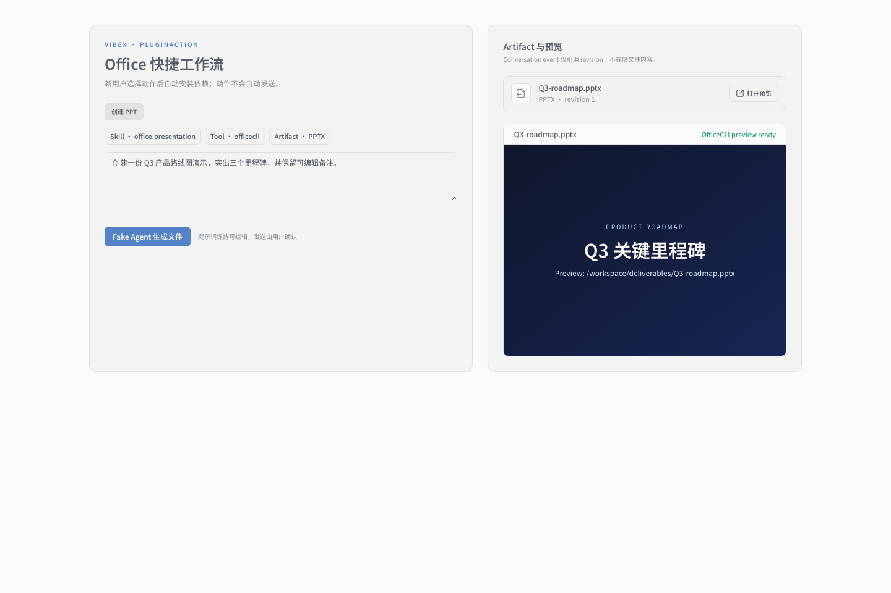

# Agent C PluginAction and Office UI verification

## Scope and base

- Worktree: `.worktrees/plugin-v2-tool-runtime`
- Branch: `codex/plugin-v2-tool-runtime`
- Agent C base SHA: `e7055a036bd312ce2654c095477b2e53ceab306d`
- The base already contained the merged Agent A/B Plugin v2, Tool Runtime,
  Artifact Service, and OfficeCLI Provider public interfaces.
- No merged Composer-wide `PromptBlock` or full subscription/capability
  `BackendTransport` contract existed at this base. This change therefore uses
  the Plugin v2 `PromptBlock` shape at the feature boundary and adds only a
  call-only transport slice. It does not define a competing streaming,
  subscription, or capability protocol.

## Stable public seams

- `PluginActionEditor` owns the public `PluginActionDefinition` /
  `PluginActionDraft` shape used by both Composer and Automation editor.
- `BackendTransport.call` is injected into UI seams and tests; production uses
  `tauriBackendTransport`.
- `createPluginApi(transport)` exposes the catalog, managed Office install
  cancellation, and enabled-state operations without importing Tauri in feature
  components.
- `plugin_action_catalog` exposes Plugin membership, enabled state, dependency
  readiness, skill readiness, provider readiness, overall readiness, structured
  prompt blocks, required skills/tools, and Artifact intent.
- `ConversationTimelineRow::ArtifactRevision` carries Artifact revision
  evidence into the timeline without embedding file bytes.
- `AutomationInput.plugin_action_json` persists the selected action identity
  and edited prompt blocks. Automation launch revalidates the managed Office
  dependency before starting the existing turn.
- `artifact_open_preview(artifact_id)` and
  `artifact_close_preview(lease_id)` keep filesystem resolution and Office
  provider capability tokens behind the Artifact Service boundary.

## RED / GREEN log

| Order | Public behavior seam          | RED observation                                                                                      | GREEN implementation                                                                                                                              |
| ----- | ----------------------------- | ---------------------------------------------------------------------------------------------------- | ------------------------------------------------------------------------------------------------------------------------------------------------- |
| 1     | PluginAction action insertion | Test could not import or click an action editor                                                      | Added catalog-backed action buttons and editable prompt blocks; selection appends to existing user text and does not send                         |
| 2     | Managed install recovery      | Missing tool had no visible/resumable workflow                                                       | Selecting an unresolved action starts `officecli_install`, preserves the draft, and marks it ready after success                                  |
| 3     | Install failure               | Failure discarded context and exposed no recovery                                                    | Kept prompt/chips, rendered actionable diagnostics, and added retry                                                                               |
| 4     | Structured capability chips   | No observable Skill/Tool/Artifact intent                                                             | Rendered public chips from the selected action                                                                                                    |
| 5     | Cancellation                  | Install had no keyboard-accessible cancellation seam                                                 | Added cancel control using the same install task ID                                                                                               |
| 6     | Plugin readiness settings     | Legacy form conflated enabled/install/provider state                                                 | Rebuilt the page with separate membership, enabled, dependency, skill, provider, and overall rows                                                 |
| 7     | Automation editor reuse       | Automation could not select the shared action                                                        | Mounted the same `PluginActionEditor`; action prompt remains editable and save is blocked while unresolved                                        |
| 8     | Composer reuse                | Composer had no PluginAction entry point                                                             | Added the shared adapter above `SessionComposerInput`; send remains user-controlled and readiness-gated                                           |
| 9     | Loading/failure/empty/locales | Catalog states and English copy were missing                                                         | Added retryable loading/error/empty states and zh-CN/en coverage                                                                                  |
| 10    | Artifact event and preview    | Timeline ignored Artifact revisions                                                                  | Projected every revision reference and opened a provider preview lease by Artifact ID from a public Artifact card                                 |
| 11    | Legacy migration notice       | The test was already GREEN after the readiness-page rewrite                                          | Kept the regression as a characterization: legacy entries are read-only, show `migration_required`, and expose neither command text nor an editor |
| 12    | Complete readiness gate       | Provider-unavailable actions were incorrectly treated as ready                                       | Required enabled, dependency, every Skill, every Provider, and overall readiness before send/save                                                 |
| 13    | Install attempt identity      | A second action click could replace the active install task ID                                       | Disabled action selection during install and bound install/cancel/result handling to one stable attempt                                           |
| 14    | Projection upgrade            | A version-2 snapshot could permanently omit previously skipped Artifact events                       | Bumped the projection schema to v3 and rebuilt older snapshots                                                                                    |
| 15    | Restart persistence           | Office enabled state existed only in memory                                                          | Persisted bundled activation in the v2 registry and restored it through the managed runtime                                                       |
| 16    | Structured Automation save    | Automation saved only flattened prompt text                                                          | Added the nullable `plugin_action_json` migration, round-trip DB coverage, edit restoration, and launch-time readiness validation                 |
| 17    | Post-install readiness        | A completed install only patched dependency/enabled locally, leaving real Skill/Provider state stale | Refetched the public catalog after install and resumed the action only when every readiness component was actually ready                          |
| 18    | Restored action readiness     | A stored action was briefly saveable before its catalog loaded                                       | Made non-empty actions fail closed during catalog loading/failure                                                                                 |
| 19    | Preview lease lifecycle       | Reopening or unmounting during `open_preview` could leak a lease                                     | Disabled duplicate opens and explicitly closed leases that arrive after unmount                                                                   |
| 20    | Startup and uninstall state   | Synchronous restore could block app startup; uninstall retained enabled state                        | Deferred restore as a fail-soft background task and persisted disabled before tool removal                                                        |
| 21    | Automation recovery           | Launch checked ready before managed ensure, so a disabled/missing tool could never self-heal         | Validated action identity against the manifest, then ensured readiness, then resolved the action                                                  |
| 22    | Corrupt Automation action     | Malformed JSON could be hidden in the editor and resaved                                             | Added frontend shape validation, safe draft clearing, and backend create/update/enable validation                                                 |

Every frontend test drives user-visible controls with `userEvent` and observes
rendered output or mock `BackendTransport` calls. Tests do not inspect Zustand,
Lexical, private Maps, or implementation-only fields.

## Migration and security notes

- The Plugin settings page no longer exposes create/edit/install-command fields.
- Legacy v1 rows remain visible as evidence with a `migration_required` badge.
  The new migration-summary DTO does not serialize stored command text or raw
  manifests, and explicitly mapped built-ins are omitted from the migration
  warning list.
- Built-in Office enable/install operations call the Agent A safe managed
  runtime. The UI never searches `PATH` or constructs an installer command.
- Enabled, dependency, skill, provider, and overall readiness are not collapsed
  into one legacy installation status.
- No Delegation or `@Mention` parser behavior was changed.
- Automation persists the structured action as data owned by the Automation
  model. Composer continues through the existing text turn contract because no
  merged Composer-wide `TurnLaunchSpec` existed at the base; this change does
  not invent a competing transport protocol.
- Migration `20260730100000_automation_plugin_action.sql` adds one nullable
  column, so existing Automations retain their previous behavior.
- The desktop Artifact card consumes the existing loopback Office provider.
  `capabilityToken` remains an opaque lease field reserved for the explicitly
  separate T5.5 Web preview proxy; this change does not implement or claim that
  future HTTP authorization route.

## Verification

- Target PluginAction, Composer, Automation, settings, and Artifact Vitest:
  5 files / 17 tests passed.
- `cd frontend && pnpm test`: 188 files / 973 tests passed.
- `pnpm run frontend:check`: passed.
- `pnpm run frontend:lint`: passed.
- `pnpm run generate-types:check`: passed.
- `pnpm run prepare-db:check`: passed.
- `cargo test -p conversations artifact_`: 2 tests passed.
- `cargo test -p db structured_plugin_action_round_trips_with_the_automation`: passed.
- `cargo test -p vibex --lib office_`: 6 tests passed.
- `cargo test --workspace`: passed.
- `pnpm run check`: passed.
- `pnpm run lint`: passed, including Clippy with warnings denied.
- `cargo fmt --all --check` and `git diff --check`: passed.

Desktop journey: a clean-user mock catalog reported OfficeCLI missing; clicking
“创建 PPT” started and completed the managed install, retained an editable
prompt, then a fake Agent produced a PPTX Artifact. Clicking the Artifact opened
an Artifact Service preview lease without exposing or reconstructing an absolute
filesystem path in the frontend.

